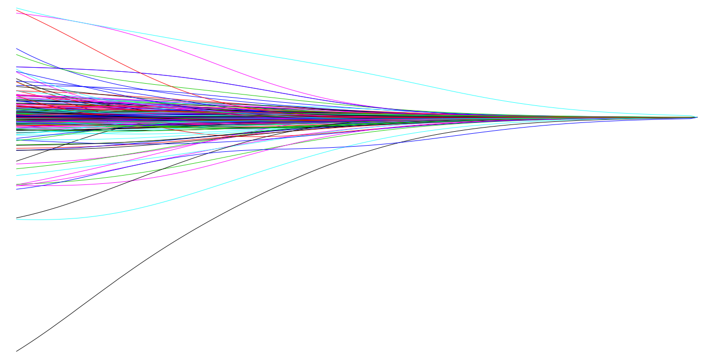
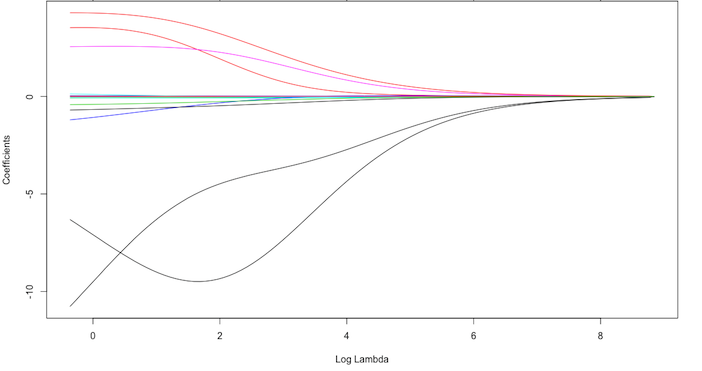
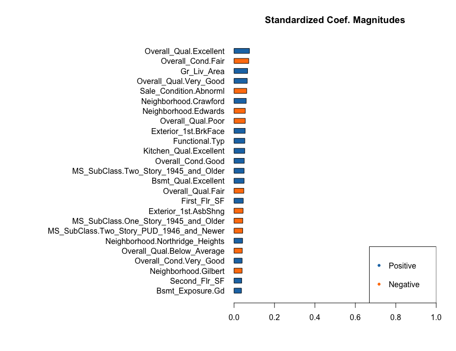
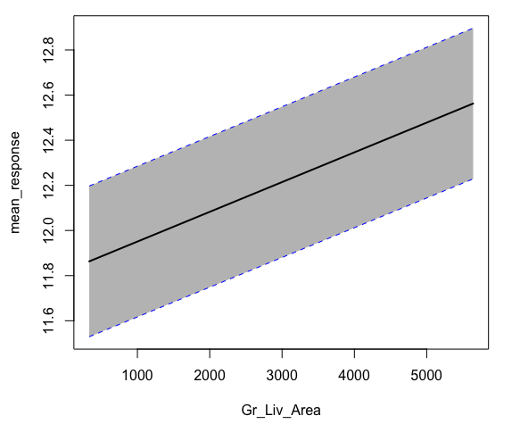
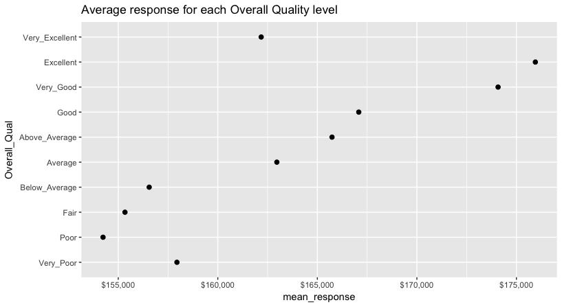
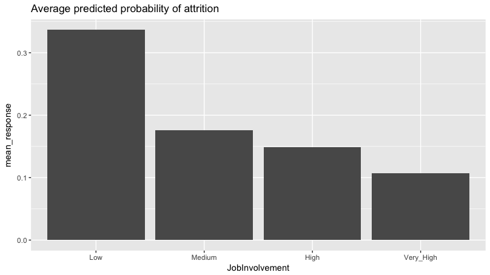
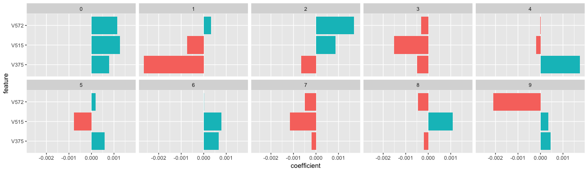

# Regularized Regression {#regularized-regression}

```{r setup, include=FALSE}
# Set global knitr chunk options
knitr::opts_chunk$set(
  fig.align = "center",
  fig.height = 4.5,
  error = FALSE,
  message = FALSE, 
  warning = FALSE, 
  collapse = TRUE,
  cache = TRUE
)
```



Generalized linear models (GLMs) such as ordinary least squares regression and logistic regression are simple and fundamental approaches for supervised learning.  Moreover, when the assumptions required by GLMs are met, the coefficients produced are unbiased and, of all unbiased linear techniques, have the lowest variance.  However, in today's world, data sets being analyzed typically have a large amount of features.  As the number of features grow, our GLM assumptions typically break down and our models often overfit (aka have high variance) to the training sample, causing our out of sample error to increase.  ***Regularization*** methods provide a means to control our coefficients, which can reduce the variance and decrease out of sample error. 


## Prerequisites {#glm-req}

```{block, type = "rmdwarning"}
This chapter assumes you are familiary with basic idea behind linear and logistic regression. If not, two tutorials to get you up to speed include this [linear regression tutorial](http://uc-r.github.io/linear_regression) and this [logistic regression tutorial](http://uc-r.github.io/logistic_regression).
```

This chapter leverages the following packages.  Some of these packages are playing a supporting role while the main emphasis will be on the [__glmnet__](https://web.stanford.edu/~hastie/glmnet/glmnet_alpha.html) [@R-glmnet] and [__h2o__](http://docs.h2o.ai/?_ga=2.52641192.1255510165.1524074778-1013458140.1519825157) [@R-h2o] packages.

```{r glm-pkg-requirements, cache=FALSE}
library(glmnet)   # implementing regularized regression approaches
library(h2o)      # implementing regularized regression approaches
library(rsample)  # training vs testing data split
library(dplyr)    # basic data manipulation procedures
library(ggplot2)  # plotting
```


## Advantages & Disadvantages {#glm-pros-cons}

__Advantages:__

* Normal GLM models require that you have more observations than variables ($n>p$); regularized regression allows you to model wide data where $n<p$.
* Minimizes the impact of multicollinearity.
* Provides automatic feature selection (at least when you apply a Lasso or elastic net penalty).
* Minimal hyperparameters making it easy to tune.
* Computationally efficient - relatively fast compared to other algorithms in this guide and does not require large memory.


__Disdvantages:__

* Requires data pre-processing - requires all variables to be numeric (i.e. one-hot encode).  However, __h2o__ helps to automate this process.
* Does not handle missing data - must impute or remove observations with missing values.
* Not robust to outliers as they can still bias the coefficients.
* Assumes relationships between predictors and response variable to be monotonic linear (always increasing or decreasing in a linear fashion).
* Typically does not perform as well as more advanced methods that allow non-monotonic and non-linear relationships (i.e. random forests, gradient boosting machines, neural networks).


## The Idea {#glm-why}

The easiest way to understand regularized regression is to explain how it is applied to ordinary least squares regression (OLS). The objective of OLS regression is to find the plane that minimizes the sum of squared errors (SSE) between the observed and predicted response.  Illustrated below, this means identifying the plane that minimizes the grey lines, which measure the distance between the observed (red dots) and predicted response (blue plane).

```{r, echo=FALSE, fig.cap="Fitted regression line using Ordinary Least Squares."}
knitr::include_graphics("images/sq.errors-1.png")
```

More formally, this objective function is written as:

$$\text{minimize} \bigg \{ SSE = \sum^n_{i=1} (y_i - \hat{y}_i)^2 \bigg \} \tag{1}$$

The OLS objective function performs quite well when our data align to the key assumptions of OLS regression:

* Linear relationship
* Multivariate normality
* No autocorrelation
* Homoscedastic (constant variance in residuals) 
* There are more observations (*n*) than features (*p*) ($n > p$)
* No or little multicollinearity

However, for many real-life data sets we have very *wide* data, meaning we have a large number of features (*p*) that we believe are informative in predicting some outcome.  As *p* increases, we can quickly violate some of the OLS assumptions and we require alternative approaches to provide predictive analytic solutions.  Specifically, as *p* increases there are three main issues we most commonly run into:

### 1. Multicollinearity

```{r silent-import, echo=FALSE}
# import data
ames <- AmesHousing::make_ames()
```

As *p* increases we are more likely to capture multiple features that have some multicollinearity. When multicollinearity exists, we often see high variability in our coefficient terms. For example, in our Ames data, `Gr_Liv_Area` and `TotRms_AbvGrd` are two variables that have a correlation of `r round(cor(ames$Gr_Liv_Area, ames$TotRms_AbvGrd), 3)` and both variables are strongly correlated to our response variable (`Sale_Price`).  When we fit a model with both these variables we get a positive coefficient for `Gr_Liv_Area` but a negative coefficient for `TotRms_AbvGrd`, suggesting one has a positive impact to `Sale_Price` and the other a negative impact.

```{r}
# fit with two strongly correlated variables
lm(Sale_Price ~ Gr_Liv_Area + TotRms_AbvGrd, data = ames)
```

However, if we refit the model with each variable independently, they both show a positive impact.  However, the `Gr_Liv_Area` effect is now smaller and the `TotRms_AbvGrd` is positive with a much larger magnitude.  

```{r}
# fit with just Gr_Liv_Area
lm(Sale_Price ~ Gr_Liv_Area, data = ames)

# fit with just TotRms_Area
lm(Sale_Price ~ TotRms_AbvGrd, data = ames)
```


This is a common result when collinearity exists.  Coefficients for correlated features become over-inflated and can fluctuate significantly.  One consequence of these large fluctuations in the coefficient terms is overfitting, which means we have high variance in the bias-variance tradeoff space.  Although an analyst can use tools such as variance inflaction factors [@myers1990classical] to identify and remove those strongly correlated variables, it is not always clear which variable(s) to remove.  Nor do we always wish to remove variables as this may be removing signal in our data.

### 2. Insufficient solution

When the number of features exceed the number of observations ($p > n$), the OLS solution matrix is *not* invertible.  This causes significant issues because it means: (1) The least-squares estimates are not unique. In fact, there are an infinite set of solutions available and most of these solutions overfit the data. (2) In many instances the result will be computationally infeasible. 

Consequently, to resolve this issue an analyst can remove variables until $p < n$ and then fit an OLS regression model.  Although an analyst can use pre-processing tools to guide this manual approach ([Kuhn & Johnson, 2013, pp. 43-47](http://appliedpredictivemodeling.com/)), it can be cumbersome and prone to errors. 

### 3. Interpretability

With a large number of features, we often would like to identify a smaller subset of these features that exhibit the strongest effects.  In essence, we sometimes prefer techniques that provide feature selection.  One approach to this is called *hard threshholding* feature selection, which can be performed with [linear model selection](http://uc-r.github.io/model_selection) approaches.  However, model selection approaches can be computationally inefficient, do not scale well, and they simply assume a feature as in or out.  We may wish to use a *soft threshholding* approach that slowly pushes a feature's effect towards zero. As will be demonstrated, this can provide additional understanding regarding predictive signals. 

### Regularized Models {#regularized_regress}

When we experience these concerns, one alternative to OLS regression is to use regularized regression (also commonly referred to as *penalized* models or *shrinkage* methods) to control the parameter estimates.  Regularized regression puts contraints on the magnitude of the coefficients and will progressively shrink them towards zero.  This constraint helps to reduce the magnitude and fluctuations of the coefficients and will reduce the variance of our model.

The objective function of regularized regression methods is very similar to OLS regression; however, we add a penalty parameter (*P*). 

$$\text{minimize} \big \{ SSE + P \big \} \tag{2}$$

This penalty parameter constrains the size of the coefficients such that the only way the coefficients can increase is if we experience a comparable decrease in the sum of squared errors (SSE).  

```{block, type = "rmdcomment"}
This concept generalizes to all GLM models.  So far, we have be discussing OLS and the sum of squared errors.  However, different models within the [GLM family](https://en.wikipedia.org/wiki/Generalized_linear_model) (i.e. logistic regression, Poisson regression) have different loss functions.  Yet we can think of the penalty parameter all the same - it constrains the size of the coefficients such that the only way the coefficients can increase is if we experience a comparable decrease in the model's loss function.
```

There are three types of penalty parameters we can implement:

1. Ridge
2. Lasso
3. Elastic net, which is a combination of Ridge and Lasso

#### Ridge penalty {#ridge}


Ridge regression [@hoerl1970ridge] controls the coefficients by adding <font color="red">$\lambda \sum^p_{j=1} \beta_j^2$</font> to the objective function. This penalty parameter is also referred to as "$L_2$" as it signifies a second-order penalty being used on the coefficients.[^note1]

$$\text{minimize } \bigg \{ SSE + \lambda \sum^p_{j=1} \beta_j^2 \bigg \} \tag{3}$$

This penalty parameter can take on a wide range of values, which is controlled by the *tuning parameter* $\lambda$.  When $\lambda = 0$ there is no effect and our objective function equals the normal OLS regression objective function of simply minimizing SSE.  However, as $\lambda \rightarrow \infty$, the penalty becomes large and forces our coefficients to *near zero*. This is illustrated in Figure \@ref(fig:ridge-coef-example) where exemplar coefficients have been regularized with $\lambda$ ranging from 0 to over 8,000 ($log(8103) = 9$).    

```{r ridge-coef-example, echo=FALSE, fig.cap="Ridge regression coefficients as $\\lambda$ grows from  $0 \\rightarrow \\infty$.", out.height="75%", out.width="75%"}

```

Although these coefficients were scaled and centered prior to the analysis, you will notice that some are extremely large when $\lambda \rightarrow 0$.  Furthermore, you'll notice the large negative parameter that fluctuates until $log(\lambda) \approx 2$ where it then continuously skrinks to zero.  This is indicitive of multicollinearity and likely illustrates that constraining our coefficients with $log(\lambda) > 2$ may reduce the variance, and therefore the error, in our model. 

In essence, the ridge regression model pushes many of the correlated features towards each other rather than allowing for one to be wildly positive and the other wildly negative.  Furthermore, many of the non-important features get pushed to near zero.  This allows us to reduce the noise in our data, which provides us more clarity in identifying the true signals in our model.
 
However, a ridge model will retain <bold><font color="red">all</font></bold> variables.  Therefore, a ridge model is good if you believe there is a need to retain all features in your model yet reduce the noise that less influential variables may create and minimize multicollinearity.  However, a ridge model does not perform feature selection. If greater interpretation is necessary where you need to reduce the signal in your data to a smaller subset then a lasso or elastic net penalty may be preferable.

#### Lasso penalty {#lasso}

The *least absolute shrinkage and selection operator* (lasso) model [@tibshirani1996regression] is an alternative to the ridge penalty that has a small modification to the penalty in the objective function. Rather than the $L_2$ penalty we use the following $L_1$ penalty <font color="red">$\lambda \sum^p_{j=1} | \beta_j|$</font> in the objective function. 

$$\text{minimize } \bigg \{ SSE + \lambda \sum^p_{j=1} | \beta_j | \bigg \} \tag{4}$$

Whereas the ridge penalty approach pushes variables to *approximately but not equal to zero*, the lasso penalty will actually push coefficients to zero as illustrated in Figure \@ref(fig:lasso-coef-example).  Thus the lasso model not only improves the model with regularization but it also conducts automated feature selection.  

```{r lasso-coef-example, echo=FALSE, fig.cap="Lasso regression coefficients as $\\lambda$ grows from  $0 \\rightarrow \\infty$. Numbers on top axis illustrate how many non-zero coefficients remain.", fig.height=4.5, fig.width=7}
boston_train_x <- model.matrix(cmedv ~ ., pdp::boston)[, -1]
boston_train_y <- pdp::boston$cmedv

# model
boston_lasso <- glmnet::glmnet(
  x = boston_train_x,
  y = boston_train_y,
  alpha = 1
)

plot(boston_lasso, xvar = "lambda")
```

In the figure above we see that when $log(\lambda) = -5$ all 15 variables are in the model, when $log(\lambda) = -1$ 12 variables are retained, and when $log(\lambda) = 1$ only 3 variables are retained. Consequently, when a data set has many features, lasso can be used to identify and extract those features with the largest (and most consistent) signal.


#### Elastic nets {#elastic}

A generalization of the ridge and lasso penalties is the *elastic net* penalty [@zou2005regularization], which combines the two penalties.

$$\text{minimize } \bigg \{ SSE + \lambda_1 \sum^p_{j=1} \beta_j^2 + \lambda_2 \sum^p_{j=1} | \beta_j | \bigg \} \tag{5}$$

Although lasso models perform feature selection, a result of their penalty parameter is that typically when two strongly correlated features are pushed towards zero, one may be pushed fully to zero while the other remains in the model.  Furthermore, the process of one being in and one being out is not very systematic.  In contrast, the ridge regression penalty is a little more effective in systematically reducing correlated features together.  Consequently, the advantage of the elastic net penalty is that it enables effective regularization via the ridge penalty with the feature selection characteristics of the lasso penalty. 

### Tuning {#glm-tuning}

Regularized models are simple to tune as there are only two tuning parameters:

* __Size of penalty ($\lambda$)__: Controls how much we want to constrain our coefficients. Small penalties where $\lambda$ is close to zero allow our coefficients to be larger; however, larger values of $\lambda$ penalize our coefficients and forces them to take on smaller values.  Hence, this parameter is often called the _shrinkage_ parameter. 
* __Alpha__: The `alpha` parameter tells our model to perform a ridge (`alpha = 0`), lasso (`alpha = 1`), or elastic net ($0 < alpha < 1$). 


### Package implementation {#glm-pkg-implementation}

There are a few packages that implement variants of regularized regression. You can find a comprehensive list on the [CRAN Machine Learning Task View](https://cran.r-project.org/web/views/MachineLearning.html). However, the most popular implementations which we will cover in this chapter include:

* [glmnet](https://cran.r-project.org/web/packages/glmnet/index.html): The original implementation of regularized regression in R. The __glmnet__ R package provides an extremely efficient procedures for fitting the entire lasso or elastic-net regularization path for linear regression, logistic and multinomial regression models, Poisson regression and the Cox model. Two recent additions are the multiple-response Gaussian, and the grouped multinomial regression. A nice vignette is available [here](https://cran.r-project.org/web/packages/glmnet/vignettes/glmnet_beta.pdf). Features include[^ledell]:
    - The code can handle sparse input-matrix formats, as well as range constraints on coefficients.
    - Automatically standardizes your feature set.
    - Built-in cross validation.
    - The core of glmnet is a set of fortran subroutines, which make for very fast execution.
    - The algorithms use coordinate descent with warm starts and active set iterations.
    - Supports the following distributions: "gaussian","binomial","poisson","multinomial","cox","mgaussian"
* [h2o](https://cran.r-project.org/web/packages/gamboostLSS/index.html): The __h2o__ R package is a powerful and efficient java-based interface that allows for local and cluster-based deployment. It comes with a fairly comprehensive [online resource](http://docs.h2o.ai/h2o/latest-stable/h2o-docs/index.html) that includes methodology and code documentation along with tutorials. Features include:
    - Fits both regularized and non-regularized GLMs.
    - Automated feature pre-processing (one-hot encode & standardization).
    - Built-in cross validation.
    - Built-in grid search capabilities.
    - Supports the following distributions: "guassian", "binomial", "multinomial", "ordinal", "poisson", "gamma", "tweedie".
    - Distributed and parallelized computation on either a single node or a multi-node cluster.
    - Automatic early stopping based on convergence of user-specified metrics to user-specified relative tolerance.
 


## Implementation: Regression {#glm-regression}

To illustrate various regularization concepts for a regression problem we will use the Ames, IA housing data, where our intent is to predict `Sale_Price`. 

```{r regularized-regression-data-import}
# Create training (70%) and test (30%) sets for the AmesHousing::make_ames() data.
# Use set.seed for reproducibility

set.seed(123)
ames_split <- initial_split(AmesHousing::make_ames(), prop = .7, strata = "Sale_Price")
ames_train <- training(ames_split)
ames_test  <- testing(ames_split)
```

### `glmnet` {#regression-glm-glmnet}

The glmnet package is a fast implementation, but it requires some extra processing up-front to your data if it’s not already represented as a numeric matrix.  __glmnet__ does not use the formula method (`y ~ x`) so prior to modeling we need to create our feature and target set.  Furthermore, we use the `model.matrix` function on our feature set (see `Matrix::sparse.model.matrix` for increased efficiency on large dimension data).  We also Box Cox transform our response variable due to its skeweness.

```{block, type = "rmdtip"}
The Box Cox transformation of the response variable is not required; however, parametric models such as regularized regression are sensitive to skewed values so it is always recommended to normalize your response variable.
```

```{r regularized-regression-data-prep}
# Create training and testing feature matrices
# we use model.matrix(...)[, -1] to discard the intercept
train_x <- model.matrix(Sale_Price ~ ., ames_train)[, -1]
test_x  <- model.matrix(Sale_Price ~ ., ames_test)[, -1]

# Create training and testing response vectors
# transform y based on skewness of training data
train_y <- log(ames_train$Sale_Price)
test_y  <- log(ames_test$Sale_Price)
```


#### Basic implementation {#regression-glmnet-basic}

To apply a regularized model we can use the `glmnet::glmnet` function.  The `alpha` parameter tells __glmnet__ to perform a ridge (`alpha = 0`), lasso (`alpha = 1`), or elastic net ($0 < alpha < 1$) model. Behind the scenes, __glmnet__ is doing two things that you should be aware of:

1. It is essential that predictor variables are standardized when performing regularized regression.  __glmnet__ performs this for you. If you standardize your predictors prior to __glmnet__ you can turn this argument off with `standardize = FALSE`.
2. __glmnet__ will perform ridge models across a wide range of $\lambda$ parameters, which are illustrated in the figure below. 

```{r ridge1, fig.cap="Coefficients for our ridge regression model as $\\lambda$ grows from  $0 \\rightarrow \\infty$."}
# Apply Ridge regression to attrition data
ridge <- glmnet(
  x = train_x,
  y = train_y,
  alpha = 0
)

plot(ridge, xvar = "lambda")
```

In fact, we can see the exact $\lambda$ values applied with `ridge$lambda`.  Although you can specify your own $\lambda$ values, by default __glmnet__ applies 100 $\lambda$ values that are data derived.  

```{block, type = "rmdtip"}
glmnet has built-in functions to auto-generate the appropriate $\lambda$ values based on the data so the vast majority of the time you will have little need to adjust the default $\lambda$ values. 
```

We can also directly access the coefficients for a model using `coef`. __glmnet__ stores all the coefficients for each model in order of largest to smallest $\lambda$. Due to the number of features, here I just peak at the two largest coefficients (`Latitude` & `Overall_QualVery_Excellent`) features for the largest $\lambda$ (279.1035) and smallest $\lambda$ (0.02791035).  You can see how the largest $\lambda$ value has pushed these coefficients to nearly 0.

```{r ridge1-results}
# lambdas applied to penalty parameter
ridge$lambda %>% head()

# small lambda results in large coefficients
coef(ridge)[c("Latitude", "Overall_QualVery_Excellent"), 100]

# large lambda results in small coefficients
coef(ridge)[c("Latitude", "Overall_QualVery_Excellent"), 1] 
```

However, at this point, we do not understand how much improvement we are experiencing in our loss function across various $\lambda$ values. 

#### Tuning {#regression-glmnet-tune}

Recall that $\lambda$ is a tuning parameter that helps to control our model from over-fitting to the training data.  However, to identify the optimal $\lambda$ value we need to perform [cross-validation](#cv) (CV).  `cv.glmnet` provides a built-in option to perform k-fold CV, and by default, performs 10-fold CV. Here we perform a CV glmnet model for both a ridge and lasso penalty.

```{block, type="rmdtip"}
By default, `cv.glmnet` uses MSE as the loss function but you can also use mean absolute error by changing the `type.measure` argument.
```


```{r ridge-lasso-cv-models, fig.height=4, fig.width=9, fig.cap="10-fold cross validation MSE for a ridge and lasso model. First dotted vertical line in each plot represents the $\\lambda$ with the smallest MSE and the second represents the $\\lambda$ with an MSE within one standard error of the minimum MSE."}
# Apply CV Ridge regression to attrition data
ridge <- cv.glmnet(
  x = train_x,
  y = train_y,
  alpha = 0
)

# Apply CV Ridge regression to attrition data
lasso <- cv.glmnet(
  x = train_x,
  y = train_y,
  alpha = 1
)

# plot results
par(mfrow = c(1, 2))
plot(ridge, main = "Ridge penalty\n\n")
plot(lasso, main = "Lasso penalty\n\n")
```

Our plots above illustrate the 10-fold CV mean squared error (MSE) across the $\lambda$ values.  In both models we see a slight improvement in the MSE as our penalty $log(\lambda)$ gets larger , suggesting that a regular OLS model likely overfits our data. But as we constrain it further (continue to increase the penalty), our MSE starts to increase. The numbers at the top of the plot refer to the number of variables in the model.  Ridge regression does not force any variables to exactly zero so all features will remain in the model but we see the number of variables retained in the lasso model go down as our penalty increases. 

The first and second vertical dashed lines represent the $\lambda$ value with the minimum MSE and the largest $\lambda$ value within one standard error of the minimum MSE. 

```{r ridge-lasso-cv-results}
# Ridge model
min(ridge$cvm)       # minimum MSE
ridge$lambda.min     # lambda for this min MSE

ridge$cvm[ridge$lambda == ridge$lambda.1se]  # 1 st.error of min MSE
ridge$lambda.1se  # lambda for this MSE

# Lasso model
min(lasso$cvm)       # minimum MSE
lasso$lambda.min     # lambda for this min MSE

lasso$cvm[lasso$lambda == lasso$lambda.1se]  # 1 st.error of min MSE
lasso$lambda.1se  # lambda for this MSE
```

We can assess this visually.  Here we plot the coefficients across the $\lambda$ values and the dashed red line represents the $\lambda$ with the smallest MSE and the dashed blue line represents largest $\lambda$ that falls within one standard error of the minimum MSE.  This shows you how much we can constrain the coefficients while still maximizing predictive accuracy.  

```{block, type = "rmdtip"}
Above, we saw that both ridge and lasso penalties provide similiar MSEs; however, these plots illustrate that ridge is still using all 299 variables whereas the lasso model can get a similar MSE by reducing our feature set from 299 down to 131. However, there will be some variability with this MSE and we can reasonably assume that we can achieve a similar MSE with a slightly more constrained model that uses only 63 features. Although this lasso model does not offer significant improvement over the ridge model, we get approximately the same accuracy by using only 63 features! If describing and interpreting the predictors is an important outcome of your analysis, this may significantly aid your endeavor.
```


```{r ridge-lasso-cv-viz-results, fig.height=4, fig.width=9, fig.cap="Coefficients for our ridge and lasso models. First dotted vertical line in each plot represents the $\\lambda$ with the smallest MSE and the second represents the $\\lambda$ with an MSE within one standard error of the minimum MSE."}
# Ridge model
ridge_min <- glmnet(
  x = train_x,
  y = train_y,
  alpha = 0
)

# Lasso model
lasso_min <- glmnet(
  x = train_x,
  y = train_y,
  alpha = 1
)

par(mfrow = c(1, 2))
# plot ridge model
plot(ridge_min, xvar = "lambda", main = "Ridge penalty\n\n")
abline(v = log(ridge$lambda.min), col = "red", lty = "dashed")
abline(v = log(ridge$lambda.1se), col = "blue", lty = "dashed")

# plot lasso model
plot(lasso_min, xvar = "lambda", main = "Lasso penalty\n\n")
abline(v = log(lasso$lambda.min), col = "red", lty = "dashed")
abline(v = log(lasso$lambda.1se), col = "blue", lty = "dashed")
```


So far we've implemented a pure ridge and pure lasso model. However, we can implement an elastic net the same way as the ridge and lasso models, by adjusting the `alpha` parameter.  Any `alpha` value between 0-1 will perform an elastic net.  When `alpha = 0.5` we perform an equal combination of penalties whereas `alpha` $\rightarrow 0$ will have a heavier ridge penalty applied and `alpha` $\rightarrow 1$ will have a heavier lasso penalty.

```{r glmnet-elastic-comparison, fig.height=7, fig.width=9, fig.cap="Coefficients for various penalty parameters."}
lasso    <- glmnet(train_x, train_y, alpha = 1.0) 
elastic1 <- glmnet(train_x, train_y, alpha = 0.25) 
elastic2 <- glmnet(train_x, train_y, alpha = 0.75) 
ridge    <- glmnet(train_x, train_y, alpha = 0.0)

par(mfrow = c(2, 2), mar = c(6, 4, 6, 2) + 0.1)
plot(lasso, xvar = "lambda", main = "Lasso (Alpha = 1)\n\n\n")
plot(elastic1, xvar = "lambda", main = "Elastic Net (Alpha = .25)\n\n\n")
plot(elastic2, xvar = "lambda", main = "Elastic Net (Alpha = .75)\n\n\n")
plot(ridge, xvar = "lambda", main = "Ridge (Alpha = 0)\n\n\n")
```


Often, the optimal model contains an `alpha` somewhere between 0-1, thus we want to tune both the $\lambda$ and the `alpha` parameters.  To set up our tuning, we create a common `fold_id`, which just allows us to apply the same CV folds to each model.  We then create a tuning grid that searches across a range of `alpha`s from 0-1, and empty columns where we'll dump our model results into.

```{block, type = "rmdwarning"}
Use caution when including $\alpha = 0$ or $\alpha = 1$ in the grid search. $\alpha = 0$ will produce a dense solution and it can be very slow (or even impossible) to compute in large *N* situations. $\alpha = 1$ has no $\ell_2$ penalty, so it is therefore less numerically stable and can be very slow as well due to slower convergence. If you experience slow computation, I recommend searching across $\alpha$ values of 0.1, .25, .5, .75, .9.  
```

```{r glmnet-tuning-grid}
# maintain the same folds across all models
fold_id <- sample(1:10, size = length(train_y), replace = TRUE)

# search across a range of alphas
tuning_grid <- tibble::tibble(
  alpha      = seq(0, 1, by = .1),
  mse_min    = NA,
  mse_1se    = NA,
  lambda_min = NA,
  lambda_1se = NA
)
```

Now we can iterate over each `alpha` value, apply a CV elastic net, and extract the minimum and one standard error MSE values and their respective $\lambda$ values.

```{block, type="rmdnote"}
This grid search took 41 seconds to compute.
```

```{r glmnet-grid-search}
# perform grid search
for(i in seq_along(tuning_grid$alpha)) {
  
  # fit CV model for each alpha value
  fit <- cv.glmnet(train_x, train_y, alpha = tuning_grid$alpha[i], foldid = fold_id)
  
  # extract MSE and lambda values
  tuning_grid$mse_min[i]    <- fit$cvm[fit$lambda == fit$lambda.min]
  tuning_grid$mse_1se[i]    <- fit$cvm[fit$lambda == fit$lambda.1se]
  tuning_grid$lambda_min[i] <- fit$lambda.min
  tuning_grid$lambda_1se[i] <- fit$lambda.1se
}

tuning_grid
```

If we plot the MSE ± one standard error for the optimal $\lambda$ value for each `alpha` setting, we see that they all fall within the same level of accuracy.  Consequently, we could select a full lasso model (`alpha = 1`) with $\lambda = 0.003521887$, gain the benefits of its feature selection capability and reasonably assume no loss in accuracy.

```{r glmnet-grid-search-results, fig.height=3, fig.width=4, fig.cap="MSE ± one standard error for different alpha penalty parameters."}
tuning_grid %>%
  mutate(se = mse_1se - mse_min) %>%
  ggplot(aes(alpha, mse_min)) +
  geom_line(size = 2) +
  geom_ribbon(aes(ymax = mse_min + se, ymin = mse_min - se), alpha = .25)
```


#### Visual interpretation {#regression-glmnet-visualizing}

Regularized regression ___assumes a monotonic linear relationship___ between the predictor variables and the response.  The _linear_ relationship part of that statement just means, for a given predictor variable, it assumes for every one unit change in a given predictor variable there is a constant change in the response.  This constant change is given by the given coefficient for a predictor.  The _monotonic_ relationship means that a given predictor variable will always have a positive or negative relationship.

Consequently, this makes understanding variable relationships simple with regularized models.  And since the predictors have all been standardized, comparing the coefficients against one another allows us to identify the most influential predictors. Those predictors with the largest positive coefficients have the largest positive impact on our response variable and those variables with really small negative coefficients have a very small negative impact on our response.  Furthermore, there is no difference between the global and local model interpretation (see model interpretation chapter for details).

We'll illustrate with the following models.

```{r glmnet-viz-make-models}
lasso <- cv.glmnet(train_x, train_y, alpha = 1) 
ridge <- cv.glmnet(train_x, train_y, alpha = 0)
```

Our ridge model will retain <bold><font color="red">all</font></bold> variables.  Therefore, a ridge model is good if you believe there is a need to retain all features in your model yet reduce the noise that less influential variables may create and minimize multicollinearity.  However, a ridge model does not perform feature selection but it will typically push most variables to near zero and allow the most influential variables to be more prominent.  The following extracts the coefficients of our ridge model and plots the top 100 most influential variables.  You can see that many of the variables have coefficients closer to zero but there a handful of predictor variables that have noticable influence. 

For example, properties with above average latitude (northern end of Ames), are in the Green Hills neighborhood (which is actually in the south part of Ames), or have 2 extra miscellaneous garage features will have a positive influence on the sales price.  Alternatively, properties that are zoned agricultural, have a home functional code of "Sal" (salvage only) or "Sev" (severely damaged), or have a pool quality assessment of "Good" tend have a negative influence on the sales price.

```{block, type = "rmdwarning"}
Keep in mind these coefficients are for the standardized variable values.  Consequently, the interpretation of these coefficient values are not as clear.  Basically, for every unit the `Latitude` variable is above the mean value, the reponse variable (which has been log transformed) has a 0.474 unit increase.  ___The important insight is to identify those variables with the largest positive and negative impacts on the response variable.___
```
 
```{r glmnet-viz-ridge, fig.height=14, fig.width=7, fig.cap="A ridge penalty will retain all variables but push most coefficients to near zero.  Consequently, we retain any minor signals that all features provide but we can visualize those coefficients with the largest absolute values to identify the most influential predictors."}
coef(ridge, s = "lambda.min") %>%
  broom::tidy() %>%
  filter(row != "(Intercept)") %>%
  top_n(100, wt = abs(value)) %>%
  ggplot(aes(value, reorder(row, value), color = value > 0)) +
  geom_point(show.legend = FALSE) +
  ggtitle("Top 100 influential variables (ridge penalty)") +
  xlab("Coefficient") +
  ylab(NULL)
```


Similar to ridge, the lasso pushes many of the collinear features towards each other rather than allowing for one to be wildly positive and the other wildly negative.  However, unlike ridge, the lasso will actually push coefficients to zero and perform feature selection.  This simplifies and automates the process of identifying those features most influential to predictive accuracy. If we select the model with the minimum MSE and plot all variables in that model we see similar results to the ridge regarding the most influential variables.  

```{block, type="rmdnote"}
Although the ordering typically differs, we often see some commonality between lasso and ridge models regarding the most influential variables. 
```


```{r glmnet-viz-lasso, fig.height=15.5, fig.width=7, fig.cap="A lasso penalty will perform feature selection by pushing most coefficients to zero.  Consequently, we can view all coefficients to see which features were selected; however, our objective usually is still to identify those features with the strongest signal (largest absolute coefficient values)."}
coef(lasso, s = "lambda.min") %>%
  broom::tidy() %>%
  filter(row != "(Intercept)") %>%
  ggplot(aes(value, reorder(row, value), color = value > 0)) +
  geom_point(show.legend = FALSE) +
  ggtitle("Influential variables (lasso penalty)") +
  xlab("Coefficient") +
  ylab(NULL)
```


#### Predicting {#regression-glmnet-predict}

Once you have identified your preferred model, you can simply use `predict` to predict the same model on a new data set.  The only caveat is you need to supply `predict` an `s` parameter with the preferred models $\lambda$ value.  For example, here we create a lasso model, which provides me a minimum MSE of 0.02398 (RMSE = 0.123). However, our response variable is log transformed so we must re-transform it to get an interpretable RMSE (our average generalized error is \$25,156.77).

```{r glmnet-predict}
# optimal model
cv_lasso   <- cv.glmnet(train_x, train_y, alpha = 1.0)
min(cv_lasso$cvm)

# predict and get RMSE
pred <- predict(cv_lasso, s = cv_lasso$lambda.min, test_x)
caret::RMSE(pred, test_y)

# re-transform predicted values and get interpretable RMSE
caret::RMSE(exp(pred), exp(test_y))
```


### `h2o` {#regression-regularize-h2o}

To perform regularized regression with __h2o__, we first need to initiate our __h2o__ session. 

```{r regress-h2o-init-silenteval, echo=FALSE, cache=FALSE}
h2o::h2o.no_progress()
h2o.init(max_mem_size = "5g")
```

```{r, include=FALSE}
h2o.removeAll()
```


Next, we do not need to one-hot encode or standardize our variables as __h2o__ will do this for us.  However, we do want to normalize our response variable due to its skewness and then convert our training and test data to __h2o__ objects.

```{r regress-h2o-data-prep}
# convert training data to h2o object
train_h2o <- ames_train %>%
  mutate(Sale_Price = log(Sale_Price)) %>%
  as.h2o()

# convert test data to h2o object
test_h2o <- ames_test %>%
  mutate(Sale_Price = log(Sale_Price)) %>%
  as.h2o()

# set the response column to Sale_Price
response <- "Sale_Price"

# set the predictor names
predictors <- setdiff(colnames(ames_train), response)
```


#### Basic implementation {#regression-h2o-basic}

`h2o.glm` allows us to perform a generalized linear model.  If the response variable is continuous, `h2o.glm` will use a gaussian distribution (see `family` parameter `?h2o.glm`). By default, `h2o.glm` performs an elastic net model with `alpha = .5`. Similar to __glmnet__, `h2o.glm` will perform an automated search across internally generated lambda values.  

```{block, type = "rmdtip"}
You can override the automated lambda search by supplying different values to the `lambda` parameters in `h2o.glm` but this is not recommended as the default parameters typically perform best.
```

The following performs a default `h2o.glm` model with `alpha = .5` and it performs a 10 fold cross validation (`nfolds = 10`).

```{r regress-h2o-fit1, eval=FALSE}
# train your model, where you specify alpha (performs 10-fold CV)
h2o_fit1 <- h2o.glm(
  x = predictors, 
  y = response, 
  training_frame = train_h2o,
  nfolds = 10,
  keep_cross_validation_predictions = TRUE,
  alpha = .5, 
  family = "gaussian"
)

# print the MSE and RMSE for the validation data
h2o.mse(h2o_fit1, xval = TRUE)
## [1] 0.0405933

h2o.rmse(h2o_fit1, xval = TRUE)
## [1] 0.2014778
```

If we check out the summary results of our model we get a bunch of information. Below is truncated printout which provides important model information such as the alpha applied and the optimal lambda value identified ($\lambda = 0.056$), the number of predictors retained with these penalty parameters (11), and performance results for the training and validation sets.  


```{r regress-h2o-fit1-results, eval=FALSE}
summary(h2o_fit1)
## Model Details:
## ==============
## 
## H2ORegressionModel: glm
## Model Key:  GLM_model_R_1531935157122_1 
## GLM Model: summary
##     family     link                               regularization number_of_predictors_total number_of_active_predictors number_of_iterations                #training_frame
## 1 gaussian identity Elastic Net (alpha = 0.5, lambda = 0.05581 )                        345                          11                    2 file13d1f4ffcacf3_sid_be66_16
## 
## H2ORegressionMetrics: glm
## ** Reported on training data. **
## 
## MSE:  0.03800294
## RMSE:  0.1949434
## MAE:  0.1277845
## RMSLE:  0.01521899
## Mean Residual Deviance :  0.03800294
## R^2 :  0.7737851
## Null Deviance :345.0615
## Null D.o.F. :2053
## Residual Deviance :78.05805
## Residual D.o.F. :2042
## AIC :-861.7687
## 
## 
## 
## H2ORegressionMetrics: glm
## ** Reported on cross-validation data. **
## ** 10-fold cross-validation on training data (Metrics computed for combined holdout predictions) **
## 
## MSE:  0.0405933
## RMSE:  0.2014778
## MAE:  0.1310502
## RMSLE:  0.01567771
## Mean Residual Deviance :  0.0405933
## R^2 :  0.7583658
## Null Deviance :345.4348
## Null D.o.F. :2053
## Residual Deviance :83.37864
## Residual D.o.F. :2042
## AIC :-726.3293
## 
## truncated.....
##
```


#### Tuning {#regression-h2o-tune}

As previously stated, a full grid search to identify the optimal alpha is not always necessary; changing its value to 0.5 (or 0 or 1 if we only want Ridge or Lasso, respectively) works in most cases. However, if a full grid search is desired then we need to supply our grid of alpha values in a list.   We can then use `h2o.grid` to perform our grid search. The results show that $\alpha = 0$ (a full ridge penalty) performed best.

```{block, type="rmdnote"}
This grid search took 5 seconds to compute.
```

```{r regress-h2o-grid-search, eval=FALSE}
# create hyperparameter grid
hyper_params <- list(alpha = seq(0, 1, by = .1))

# perform grid search
grid <- h2o.grid(
  x = predictors, 
  y = response, 
  training_frame = train_h2o, 
  nfolds = 10,
  keep_cross_validation_predictions = TRUE,
  algorithm = "glm",
  grid_id = "grid_search", 
  hyper_params = hyper_params
)

# Sort the grid models by MSE
sorted_grid <- h2o.getGrid("grid_search", sort_by = "mse", decreasing = FALSE)
sorted_grid
## H2O Grid Details
## ================
## 
## Grid ID: grid_search 
## Used hyper parameters: 
##   -  alpha 
## Number of models: 11 
## Number of failed models: 0 
## 
## Hyper-Parameter Search Summary: ordered by increasing mse
##    alpha            model_ids                  mse
## 1  [0.0]  grid_search_model_0 0.022711429277773212
## 2  [0.6]  grid_search_model_6   0.0395992947950626
## 3  [0.7]  grid_search_model_7  0.03968294882574923
## 4  [1.0] grid_search_model_10  0.03983076501706063
## 5  [0.4]  grid_search_model_4    0.039850863900647
## 6  [0.8]  grid_search_model_8  0.03990607242146858
## 7  [0.3]  grid_search_model_3  0.04019054535587161
## 8  [0.5]  grid_search_model_5  0.04042328742741519
## 9  [0.9]  grid_search_model_9  0.04044324344598643
## 10 [0.2]  grid_search_model_2 0.041434990130949347
## 11 [0.1]  grid_search_model_1  0.04233746428242222
```

We can check out more details of the best performing model. Our RMSE (0.1279) is an improvement on our default model (RMSE = 0.2015).  Also, we can access the optimal model parameters, which show the optimal $\lambda$ value for our model was 0.0279.

```{r regress-h2o-optimal-model-results, eval=FALSE}
# grab top model id
best_h2o_model <- sorted_grid@model_ids[[1]]
best_model <- h2o.getModel(best_h2o_model)

# assess performance
h2o.mse(best_model)
## [1] 0.0163625

h2o.rmse(best_model)
## [1] 0.127916

# get optimal parameters
best_model@parameters$lambda
## [1] 0.02790355

best_model@parameters$alpha
## [1] 0
```


#### Visual interpretation {#regression-h2o-viz}

__h2o__ provides a built-in function that plots variable importance. To compute variable importance for regularized models, __h2o__ uses the standardized coefficient values (which is the same that we plotted in the __glmnet__ example). You will notice that the the largest influential variables produced by this H2O model differ from the glmnet model.  This is because we are assessing the ridge model here, where in the glmnet interpretation section we assessed the lasso and H2O and glmnet use differing approaches to generate the $\lambda$ search path. However, you will notice that both `Overall_Qual.Excellent` and `Overall_Cond.Fair` were also top influencers in the glmnet model suggesting they may have a strong signal regardless of the regularization penalty we use.

```{r regress-h2o-vip, fig.height=7, eval=FALSE}
# get top 25 influential variables
h2o.varimp_plot(best_model, num_of_features = 25)
```

```{r regress-h2o-vip-plot, echo=FALSE, out.height="100%", out.width="100%", fig.cap="H2O's variable importance plot.  Provides the same output as plotting the standardized coefficients (`h2o.std_coef_plot`)."}


```

Although H2O's variable importance uses standardized coefficients, a convenient function of H2O is that you can extract the "normal" coefficients which are obtained from the standardized coefficients by reversing the data standardization process (de-scaled, with the intercept adjusted by an added offset) so that they can be applied to data in its original form (i.e. no standardization prior to scoring).  For example, every one unit increase in pool size has a \$1 decrease in sales price (since our response is log transformed we need to take the exponent $e^{-0.000183} = 0.999817$).

```{block, type = "rmdwarning"}
These are not the same as coefficients of a model built on non-standardized data.
```


```{r regress-h2o-coef-imp, eval=FALSE}
best_model@model$coefficients_table
## Coefficients: glm coefficients
##                              names coefficients standardized_coefficients
## 1                        Intercept   -47.473537                 11.713031
## 2 Neighborhood.Bloomington_Heights    -0.019249                 -0.019249
## 3             Neighborhood.Blueste     0.004638                  0.004638
## 4           Neighborhood.Briardale    -0.009169                 -0.009169
## 5           Neighborhood.Brookside     0.008538                  0.008538
## 
## ---
##         names coefficients standardized_coefficients
## 341 Pool_Area    -0.000183                 -0.005963
## 342  Misc_Val    -0.000038                 -0.022608
## 343   Mo_Sold     0.000444                  0.001224
## 344 Year_Sold    -0.007414                 -0.009728
## 345 Longitude    -0.303402                 -0.007786
## 346  Latitude     0.948544                  0.017592
```

In the __glmnet__ section we discussed how regularized regression assumes a monotonic linear relationship between the predictor variables and the response.  The _linear_ relationship part of that statement just means, for a given predictor variable, it assumes for every one unit change in a given predictor variable there is a constant change in the response.  This constant change is given by the given coefficient for a predictor.  The _monotonic_ relationship means that a given predictor variable will always have a positive or negative relationship.

We can illustrate this with a partial dependence plot of the ground living area (square footage) variable.  The PDP plot shows that the relationship is monotonic linear (assumes a constant increasing relationships).  This PDP plot helps to show the typical values (and one standard error) of our response variable as the square footage of the ground floor living space increases.  


```{r regress-h2o-pdp,  fig.height=3.5, fig.width=9, eval=FALSE}
# partial dependence plots for top 2 influential variables
h2o.partialPlot(best_model, data = train_h2o, cols = "Gr_Liv_Area")
```

```{r regress-h2o-pdp-plot, echo=FALSE, out.height="80%", out.width="80%", fig.cap="As the ground living area (square footage) of a home increases, we experience a constant increase in the mean predicted sale price."}


```

But what about the two most influential variables (`Overall_Qual.Excellent` and `Overall_Cond.Fair`)?  These variables are a result of one-hot encoding the original overall quality (`Overall_Qual`) variable.  We can assess a similar plot but must supply the original non-one-hot encoded variable name.  


```{r regress-h2o-pdp-plot-2, eval=FALSE}
h2o.partialPlot(best_model, data = train_h2o, cols = "Overall_Qual")
```

```{r regress-h2o-pdp-plot-2-output, echo=FALSE, out.height="90%", out.width="90%", fig.cap="The mean predicted sale price for each level of the overall quality variable. Note how the plot does not align with the natural ordering of the predictor variable."}

knitr::include_graphics("images/regress-h2o-pdp-plot-2.png")
```

Unfortunately, H2O’s function plots the categorical levels in alphabetical order.  Alternatively, we can extract the results and plot them in their proper level order to make inference more intuitive.  The following shows the marginal effect of the overall quality variable on sales price.  It illustrates an interesting finding - the highest and lowest categories do not have the largest marginal sales price effects. It also shows that a house with a _very good_ overall quality has, on average, a \$6K higher sale price than a house with only a _good_ overall quality. Alternatively, homes with _below average_ quality receive a substantially lower sale price than homes with _average_ quality.


```{r regress-h2o-pdp-plot-3, eval=FALSE}
h2o.partialPlot(best_model, data = train_h2o, cols = "Overall_Qual", plot = FALSE) %>%
  as.data.frame() %>%
  mutate(
    Overall_Qual = factor(Overall_Qual, levels = levels(ames$Overall_Qual)),
    mean_response = exp(mean_response)) %>%
  ggplot(aes(mean_response, Overall_Qual)) +
  geom_point() +
  scale_x_continuous(labels = scales::dollar) +
  ggtitle("Average response for each Overall Quality level")
```

```{r regress-h2o-pdp-plot-3-output, echo=FALSE, out.height="100%", out.width="100%", fig.cap="The mean predicted sale price for each level of the overall quality variable. This plot now helps to illustrate how the mean predicted sale price changes based on the natural ordering of the overall quality predictor variable."}


```


```{block, type = "rmdnote"}
See the model interpretation chapter for more details on variable importance and partial dependence plots.
```


#### Predicting {#regression-h2o-predict}

Lastly, we can use `h2o.predict` and `h2o.performance` to predict and evaluate our models performance on our hold out test data.  Similar to __glmnet__, we need to re-transform our predicted values to get a interpretable generalizable error. Our generalizable error is \$24,147.60 which is about \$1,000 lower than the __glmnet__ model produced.

```{r regress-h2o-predict, eval=FALSE}
# make predictions
pred <- h2o.predict(object = best_model, newdata = test_h2o)
head(pred)
##    predict
## 1 11.65765
## 2 11.48417
## 3 12.50938
## 4 12.32368
## 5 13.20056
## 6 12.69091

# assess performance
h2o.performance(best_model, newdata = test_h2o)
## H2ORegressionMetrics: glm
## 
## MSE:  0.01364287
## RMSE:  0.1168027
## MAE:  0.0826363
## RMSLE:  0.009030871
## Mean Residual Deviance :  0.01364287
## R^2 :  0.915491
## Null Deviance :141.57
## Null D.o.F. :875
## Residual Deviance :11.95116
## Residual D.o.F. :530
## AIC :-582.0349

# convert predicted values to non-transformed
caret::RMSE(as.vector(exp(pred)), ames_test$Sale_Price)
## [1] 24147.6
```

```{r regress-h2o-shutdown, cache=FALSE}
# shutdown h2o
h2o.removeAll()
h2o.shutdown(prompt = FALSE)
```


## Implementation: Binary Classification {#glm-binary-classification}

To illustrate various regularization concepts for a binary classification problem we will use the employee attrition data, where the goal is to predict whether or not an employee attrits ("Yes" vs. "No"). 

```{block, type="rmdtip"}
The easiest way to have consistent interpretable results is to recode the response as 1 for the positive class ("Yes") and 0 for the other class ("No").
```

```{r import-glm-binary-classification}
attrition <- rsample::attrition %>% 
  mutate(Attrition = recode(Attrition, "Yes" = 1, "No" = 0)) %>%
  mutate_if(is.ordered, factor, ordered = FALSE)
```

### `glmnet` {#classification-binary-glm-glmnet}

Similar to the regression application, for the classification data set we need to perfom some extra processing up-front to prepare for modeling with __glmnet__. First, many of the features are categorical; consequently, we need to either ordinal encode or one-hot encode these variables so that all features are numeric.  Also, __glmnet__ does not use the formula method (`y ~ x`) so prior to modeling we need to create our feature and target set and convert our features to a matrix.  

```{block, type = "rmdtip"}
Since our response variable is imbalanced, we use `rsample` and `strat` to perform stratified sampling so that both our training and testing data sets have similar proportion of response levels.
```

```{r glmnet-binary-classification-data-prep}
# one-hot encode our data with model.matrix
one_hot <- model.matrix( ~ ., attrition)[, -1] %>% as.data.frame()

# Create training and testing sets
set.seed(123)
split <- initial_split(one_hot, prop = .8, strata = "Attrition")
train <- training(split)
test  <- testing(split)

# separate features from response variable for glmnet
train_x <- train %>% select(-Attrition) %>% as.matrix()
train_y <- train$Attrition
test_x  <- test %>% select(-Attrition) %>% as.matrix()
test_y  <- test$Attrition

# check that train & test sets have common response ratio
table(train_y) %>% prop.table()
table(test_y) %>% prop.table()
```


#### Basic implementation {#classification-binary-glmnet-basic}

Similar to the regression problem, we apply a regularized classification model with `glmnet::glmnet()`.  The primary difference is that for binary classification models we need to include `family = binomial`. Remember, the `alpha` parameter tells __glmnet__ to perform a ridge (`alpha = 0`), lasso (`alpha = 1`), or elastic net ($0 < alpha < 1$) model.  

```{r glmnet-binary-class-ridge1, fig.cap="Coefficients for our ridge regression model as $\\lambda$ grows from  $0 \\rightarrow \\infty$."}
# Apply Ridge regression to attrition data
ridge <- glmnet(
  x = train_x,
  y = train_y,
  family = "binomial",
  alpha = 0
)

plot(ridge, xvar = "lambda")
```

We can also directly access the coefficients for a model using `coef` and tidy the output with `tidy`. Here, we check out the top 10 largest absolute coefficient terms when using the smallest and largest lambda values. We see that regardless of a large or small penalty parameter, working overtime and being a Sales Rep has the largest positive influence on the probability of attrition.  Whereas being a Research Director and having high job involvement (among others) are the strongest influencers for reducing the probability of attrition.

```{r glmnet-binary-class-ridge1-results}
# lambdas applied to penalty parameter
ridge$lambda %>% head()

# small lambda results in large coefficients
coef(ridge)[, 100] %>% 
  tidy() %>% 
  arrange(desc(abs(x)))

# large lambda results in small coefficients
coef(ridge)[, 1] %>% 
  tidy() %>% 
  arrange(desc(abs(x))) 
```

However, at this point, we do not understand how much improvement we are experiencing in our loss function across various $\lambda$ values.  

#### Tuning {#classification-binaryglmnet-tune}

Recall that $\lambda$ is a tuning parameter that helps to control our model from over-fitting to the training data.  However, to identify the optimal $\lambda$ value we need to perform cross-validation with `cv.glmnet`.  Here we perform a 10-fold CV glmnet model for both a ridge and lasso penalty.

```{block, type="rmdnote"}
By default, `cv.glmnet` uses deviance as the loss function for binomial classification but you could adjust `type.measure` to "auc", "mse", "mae", or "class" (missclassification).
```

```{r glmnet-binary-class-ridge-lasso-cv-models, fig.height=4, fig.width=9, fig.cap="10-fold cross validation deviance for a ridge and lasso model. First dotted vertical line in each plot represents the $\\lambda$ with the smallest deviance and the second represents the $\\lambda$ with a deviance within one standard error of the minimum deviance."}
# Apply CV Ridge regression to attrition data
ridge <- cv.glmnet(
  x = train_x,
  y = train_y,
  family = "binomial",
  alpha = 0
)

# Apply CV Ridge regression to attrition data
lasso <- cv.glmnet(
  x = train_x,
  y = train_y,
  family = "binomial",
  alpha = 1
)

# plot results
par(mfrow = c(1, 2))
plot(ridge, main = "Ridge penalty\n\n")
plot(lasso, main = "Lasso penalty\n\n")
```

Our plots above illustrate the 10-fold CV deviance across the $\lambda$ values.  With the ridge model, we don't see any improvement in the loss function as $\lambda$ increases but, with the lasso model, we see a slight improvement in the deviance as our penalty $\lambda$ gets larger, suggesting that a regular logistic regression model likely overfits our data. But as we constrain it further (continue to increase the penalty), our deviance starts to increase. The numbers at the top of the plot refer to the number of variables in the model.  Ridge regression does not force any variables to exactly zero so all features will remain in the model but we see the number of variables retained in the lasso model go down as our penalty increases, with the optimal model containing between 38-48 predictor variables. 

The first and second vertical dashed lines represent the $\lambda$ value with the minimum deviance and the largest $\lambda$ value within one standard error of the minimum deviance. 

```{r glmnet-binary-class-ridge-lasso-cv-results}
# Ridge model
min(ridge$cvm)       # minimum deviance
ridge$lambda.min     # lambda for this min deviance

ridge$cvm[ridge$lambda == ridge$lambda.1se]  # 1 st.error of min deviance
ridge$lambda.1se  # lambda for this deviance

# Lasso model
min(lasso$cvm)       # minimum deviance
lasso$lambda.min     # lambda for this min deviance

lasso$cvm[lasso$lambda == lasso$lambda.1se]  # 1 st.error of min deviance
lasso$lambda.1se  # lambda for this deviance
```

We can assess this visually.  Here we plot the coefficients across the $\lambda$ values and the dashed red line represents the $\lambda$ with the smallest deviance and the dashed blue line represents largest $\lambda$ that falls within one standard error of the minimum deviance.  This shows you how much we can constrain the coefficients while still maximizing predictive accuracy.  

```{block, type = "rmdtip"}
Above, we saw that both ridge and lasso penalties provide similiar minimum deviance scores; however, these plots illustrate that ridge is still using all 57 variables whereas the lasso model can get a similar deviance by reducing our feature set from 57 down to 48. However, there will be some variability with this MSE and we can reasonably assume that we can achieve a similar MSE with a slightly more constrained model that uses only 38 features. Although this lasso model does not offer significant improvement over the ridge model, we get approximately the same accuracy by using only 38 features! If describing and interpreting the predictors is an important outcome of your analysis, this may significantly aid your endeavor.
```


```{r glmnet-binary-class-ridge-lasso-cv-viz-results, fig.height=4, fig.width=9, fig.cap="Coefficients for our ridge and lasso models. First dotted vertical line in each plot represents the $\\lambda$ with the smallest MSE and the second represents the $\\lambda$ with an MSE within one standard error of the minimum MSE."}
# Ridge model
ridge_min <- glmnet(
  x = train_x,
  y = train_y,
  family = "binomial",
  alpha = 0
)

# Lasso model
lasso_min <- glmnet(
  x = train_x,
  y = train_y,
  family = "binomial",
  alpha = 1
)

par(mfrow = c(1, 2))
# plot ridge model
plot(ridge_min, xvar = "lambda", main = "Ridge penalty\n\n")
abline(v = log(ridge$lambda.min), col = "red", lty = "dashed")
abline(v = log(ridge$lambda.1se), col = "blue", lty = "dashed")

# plot lasso model
plot(lasso_min, xvar = "lambda", main = "Lasso penalty\n\n")
abline(v = log(lasso$lambda.min), col = "red", lty = "dashed")
abline(v = log(lasso$lambda.1se), col = "blue", lty = "dashed")
```

So far we've implemented a pure ridge and pure lasso model. However, we can implement an elastic net the same way as the ridge and lasso models, by adjusting the `alpha` parameter.  Any `alpha` value between 0-1 will perform an elastic net.  When `alpha = 0.5` we perform an equal combination of penalties whereas `alpha` $\rightarrow 0$ will have a heavier ridge penalty applied and `alpha` $\rightarrow 1$ will have a heavier lasso penalty.

```{r glmnet-binary-class-elastic-comparison, fig.height=7, fig.width=9, fig.cap="Coefficients for various penalty parameters."}
lasso    <- glmnet(train_x, train_y, family = "binomial", alpha = 1.0) 
elastic1 <- glmnet(train_x, train_y, family = "binomial", alpha = 0.25) 
elastic2 <- glmnet(train_x, train_y, family = "binomial", alpha = 0.75) 
ridge    <- glmnet(train_x, train_y, family = "binomial", alpha = 0.0)

par(mfrow = c(2, 2), mar = c(6, 4, 6, 2) + 0.1)
plot(lasso, xvar = "lambda", main = "Lasso (Alpha = 1)\n\n\n")
plot(elastic1, xvar = "lambda", main = "Elastic Net (Alpha = .25)\n\n\n")
plot(elastic2, xvar = "lambda", main = "Elastic Net (Alpha = .75)\n\n\n")
plot(ridge, xvar = "lambda", main = "Ridge (Alpha = 0)\n\n\n")
```


Often, the optimal model contains an `alpha` somewhere between 0-1, thus we want to tune both the $\lambda$ and the `alpha` parameters.  As we did in the regression section, we create a common `fold_id`, which just allows us to apply the same CV folds to each model.  We then create a tuning grid that searches across a range of `alpha`s from 0-1, and empty columns where we'll dump our model results into.

```{block, type = "rmdwarning"}
Use caution when including $\alpha = 0$ or $\alpha = 1$ in the grid search. $\alpha = 0$ will produce a dense solution and it can be very slow (or even impossible) to compute in large *N* situations. $\alpha = 1$ has no $\ell_2$ penalty, so it is therefore less numerically stable and can be very slow as well due to slower convergence. If you experience slow computation, we recommend searching across $\alpha$ values of 0.1, .25, .5, .75, .9.  
```

```{r glmnet-binary-class-tuning-grid}
# maintain the same folds across all models
fold_id <- sample(1:10, size = length(train_y), replace=TRUE)

# search across a range of alphas
tuning_grid <- tibble::tibble(
  alpha      = seq(0, 1, by = .1),
  dev_min    = NA,
  dev_1se    = NA,
  lambda_min = NA,
  lambda_1se = NA
)
```

Now we can iterate over each `alpha` value, apply a CV elastic net, and extract the minimum and one standard error deviance values and their respective $\lambda$ values.

```{block, type = "rmdnote"}
This grid search took 36 seconds.
```

```{r glmnet-binary-class-grid-search}
# Warning - this is not fast! See H2O section for faster approach
for(i in seq_along(tuning_grid$alpha)) {
  
  # fit CV model for each alpha value
  fit <- cv.glmnet(
    train_x, 
    train_y, 
    family = "binomial",
    alpha = tuning_grid$alpha[i], 
    foldid = fold_id
    )
  
  # extract MSE and lambda values
  tuning_grid$dev_min[i]    <- fit$cvm[fit$lambda == fit$lambda.min]
  tuning_grid$dev_1se[i]    <- fit$cvm[fit$lambda == fit$lambda.1se]
  tuning_grid$lambda_min[i] <- fit$lambda.min
  tuning_grid$lambda_1se[i] <- fit$lambda.1se
}

tuning_grid
```

If we plot the deviance ± one standard error for the optimal $\lambda$ value for each `alpha` setting, we see that they all fall within the same level of accuracy.  Consequently, we could select a full lasso model (`alpha = 1`) with $\lambda = 0.0023$, gain the benefits of its feature selection capability and reasonably assume no loss in accuracy.

```{r glmnet-binary-class-grid-search-results, fig.height=3, fig.width=4, fig.cap="MSE ± one standard error for different alpha penalty parameters."}
tuning_grid %>%
  mutate(se = dev_1se - dev_min) %>%
  ggplot(aes(alpha, dev_min)) +
  geom_line(size = 2) +
  geom_ribbon(aes(ymax = dev_min + se, ymin = dev_min - se), alpha = .25) +
  ggtitle("Deviance ± one standard error")
```


#### Visual interpretation {#classification-binary-glmnet-visualizing}

##### Variable importance

Similar to the regularized regression models, regularized classification models ___assume a monotonic linear relationship___ between the predictor variables and the response.  The primary difference is in what the linear relationship means. For binary classification models, the linear relationship part of that statement just means, for a given predictor variable, it assumes for every one unit change in a given predictor variable there is a constant change in the _log-odds probability_ of the response variable.  This constant change is represented by the given coefficient for a predictor.  

```{block, type="rmdnote"}
Log odds are an alternate way of expressing probabilities. The _odds_ of a positive outcome are simply represented as $\frac{prob(positive\_outcome)}{prob(negative\_outcome)}$. So if there is a .2 probability of an employee attriting, the odds ratio is $.2 \div .8 = .25$.  Consequently, the log odds for this employee is $log(.25) = -1.386294$. An employee with 50% change of attriting has a log odds of $log(.5 \div .5) = 0$ so negative log odds means greater probability of not attriting and positive log odds means greater probability of attriting. 
```

Consequently, this makes understanding variable relationships simple with regularized models.  Those variables with largest positive coefficients have the strongest influence on increasing the probability of attrition whereas those variables with the largest negative coefficients have the stongest influence on decreasing the probability of attrition.

I'll illustrate with the following models.

```{r glmnet-binary-class-viz-make-models}
lasso <- cv.glmnet(train_x, train_y, family = "binomial", alpha = 1) 
ridge <- cv.glmnet(train_x, train_y, family = "binomial", alpha = 0)
```

Our ridge model will retain <bold><font color="red">all</font></bold> variables.  Therefore, a ridge model is good if you believe there is a need to retain all features in your model yet reduce the noise that less influential variables may create and minimize multicollinearity.  However, a ridge model does not perform feature selection but it will typically push most variables to near zero and allow the most influential variables to be more prominent.  The following extracts the coefficients of our ridge model and plots predictor coefficients.  You can see that some of the variables have coefficients closer to zero but there are also many variables that have a strong positive influence on the probability of attrition (i.e. `OverTimeYes`, `JobRoleSales_Representative`, `BusinessTravelTravel_Frequently`)  and there are others that have a strong negative influence on the probability of attrition (i.e. `JobInvolvementVery_High`, `JobRoleResearch_Director`, `JobInvolvementHigh`). 


```{r glmnet-binary-class-viz-ridge, fig.height=10, fig.width=7, fig.cap="A ridge penalty will retain all variables but push many coefficients to near zero. Consequently, we retain any minor signals that all features provide but those coefficients with the largest absolute values represent the most influential predictors in our model."}
coef(ridge, s = "lambda.min") %>%
  broom::tidy() %>%
  filter(row != "(Intercept)") %>%
  ggplot(aes(value, reorder(row, value), color = value > 0)) +
  geom_point(show.legend = FALSE) +
  ggtitle("Influential variables (ridge penalty)") +
  xlab("Coefficient") +
  ylab(NULL)
```


Similar to ridge, the lasso pushes many of the collinear features towards each other rather than allowing for one to be wildly positive and the other wildly negative.  However, unlike ridge, the lasso will actually push coefficients to zero and perform feature selection.  This simplifies and automates the process of identifying those features most influential to predictive accuracy. If we select the model with the minimum deviance and plot all variables in that model we see similar results to the ridge model regarding the most influential variables.  However, the lasso model has pushed 9 variables to have zero coefficients and has retained the remaining 48, effectively performing automated feature selection.


```{r glmnet-binary-classification-viz-lasso, fig.height=7.5, fig.width=7, fig.cap="A lasso penalty will perform feature selection by pushing coefficients to zero. Consequently, we can view all coefficients to see which features were selected; however, our objective usually is still to identify those features with the strongest signal (largest absolute coefficient values)."}
coef(lasso, s = "lambda.min") %>%
  broom::tidy() %>%
  filter(row != "(Intercept)") %>%
  ggplot(aes(value, reorder(row, value), color = value > 0)) +
  geom_point(show.legend = FALSE) +
  ggtitle("Influential variables (lasso penalty)") +
  xlab("Coefficient") +
  ylab(NULL)
```

##### ROC curve

We can visualize the ROC curve with the `ROCR` and `pROC` packages.  Both packages compare the predicted log-odds output (`pred`) to the actual observed class.  ROC curves become more interesting and useful when we compare multiple models, which we will see in later chapters.

```{block, type = "rmdwarning"}
If you do not include `legacy.axes = TRUE` in the `plot()` call for the pROC curve, your x-axis will be reversed.
```


```{r glmnet-binary-classification-roc, fig.height=4, fig.width=9}
library(ROCR)
library(pROC)

# predict
pred <- predict(ridge, s = ridge$lambda.min, train_x)

# plot structure
par(mfrow = c(1, 2))

# ROCR plot
prediction(pred, train_y) %>%
  performance("tpr", "fpr") %>%
  plot(main = "ROCR ROC curve")

#pROC plot
roc(train_y, as.vector(pred)) %>% 
  plot(main = "pROC ROC curve", legacy.axes = TRUE)
```


#### Predicting {#classification-binary-glmnet-predict}

Once you have identified your preferred model, you can simply use `predict` to predict the same model on a new data set.  Two caveats:

1. You need to supply `predict` an `s` parameter with the preferred model's $\lambda$ value.  For example, here we create a lasso model, which provides me a minimum deviance of 0.648. We use the $\lambda$ for this model by specifying `s = cv_lasso$lambda.min`.
2. The default predicted values are the log odds. If you want the probability, include `type = "response"`.
3. If you want to predict the categorical response, include `type = "class"`.

```{r glmnet-binary-classification-predict}
# optimal model
cv_lasso   <- cv.glmnet(train_x, train_y, family = "binomial", alpha = 1.0)
min(cv_lasso$cvm)

# predict and get log-odds
pred_log_odds <- predict(cv_lasso, s = cv_lasso$lambda.min, test_x)
head(pred_log_odds)

# predict probability
pred_probs <- predict(cv_lasso, s = cv_lasso$lambda.min, test_x, type = "response")
head(pred_probs)

# predict and get predicted class
pred_class <- predict(cv_lasso, s = cv_lasso$lambda.min, test_x, type = "class")
head(pred_class)
```


Lastly, to assess various performance metrics on our test data we can use `caret::confusionMatrix`, which provides the majority of the performance measures we are typically concerned with in classification models.  We can see that the no information rate is 0.8396.  This represents the ratio of non-attrition to attrition rates.  The goal is to increase prediction accuracy over and above this rate.  We see that our overall accuracy is 0.887.  The primary weakness in our model is that for many employees that attrit, we tend to predict non-attrit.  This is illustrated by our low sensitivity.

```{block, type = "rmdtip"}
The `positive` argument allows you to specify which value corresponds to the "positive" result. This will impact how you interpret certain metrics that are based on true positive and false negative results (i.e. sensitivity, specificity).
```

```{r glmnet-binary-class-confusion-matrix}
caret::confusionMatrix(factor(pred_class), factor(test_y), positive = "1")
```


### `h2o` {#classification-binaryglm-h2o}

To perform regularized logistic regression with __h2o__, we first need to initiate our __h2o__ session. 

```{r h2o-glm-binary-class-init, cache=FALSE}
h2o::h2o.no_progress()
h2o.init(max_mem_size = "5g")
```

```{r h2o-glm-binary-remove, include=FALSE, eval=FALSE}
h2o.removeAll()
```


Next, we do not need to one-hot encode or standardize our variables as __h2o__ will do this for us.  However, we do need to convert our training and test data to __h2o__ objects.

```{r h2o.glm-class-data-prep, eval=FALSE}
# Create training and testing sets
set.seed(123)
split <- initial_split(attrition, prop = .8, strata = "Attrition")
train <- training(split)
test  <- testing(split)

# convert training data to h2o object
train_h2o <- as.h2o(train)

# convert test data to h2o object
test_h2o <- as.h2o(test)

# set the response column to Attrition
response <- "Attrition"

# set the predictor names
predictors <- setdiff(colnames(train), "Attrition")
```


#### Basic implementation {#h2o-glm-classification-binary-basic}

Similar to our regression problem, we use `h2o.glm` to perform a regularized logistic regression model.  The primary difference is that we need to set `family = "binomial"` to signal a binary classification problem. As before, by default, `h2o.glm` performs an elastic net model with `alpha = .5` and will perform an automated search across internally generated lambda values.  

The following performs a default `h2o.glm` model with `alpha = .5` and it performs a 10 fold cross validation (`nfolds = 10`).

```{r glm-h2o-classification-binary-fit1, eval=FALSE}
# train your model, where you specify alpha (performs 10-fold CV)
h2o_fit1 <- h2o.glm(
  x = predictors, 
  y = response, 
  training_frame = train_h2o,
  nfolds = 10,
  keep_cross_validation_predictions = TRUE,
  alpha = .5, 
  family = "binomial"
)

# print the MSE and AUC for the validation data
h2o.mse(h2o_fit1, xval = TRUE)
## [1] 0.09739988

h2o.auc(h2o_fit1, xval = TRUE)
## [1] 0.8345038
```

We can check out the cross-validated performance results of our model with `h2o.performance`. You can also get more results information using `summary(h2o_fit1)`. 

```{r glm-h2o-classification-binary-fit1-results, eval=FALSE}
h2o.performance(h2o_fit1, xval = TRUE)
## H2OBinomialMetrics: glm
## ** Reported on cross-validation data. **
## ** 10-fold cross-validation on training data (Metrics computed for combined holdout predictions) **
## 
## MSE:  0.09739988
## RMSE:  0.3120895
## LogLoss:  0.3347975
## Mean Per-Class Error:  0.258244
## AUC:  0.8345038
## Gini:  0.6690076
## R^2:  0.2804837
## Residual Deviance:  788.1133
## AIC:  914.1133
## 
## Confusion Matrix (vertical: actual; across: predicted) for F1-optimal threshold:
##          0   1    Error       Rate
## 0      898  89 0.090172    =89/987
## 1       81 109 0.426316    =81/190
## Totals 979 198 0.144435  =170/1177
## 
## Maximum Metrics: Maximum metrics at their respective thresholds
##                         metric threshold    value idx
## 1                       max f1  0.351656 0.561856 156
## 2                       max f2  0.127301 0.631939 267
## 3                 max f0point5  0.497019 0.608696 105
## 4                 max accuracy  0.728176 0.875106  54
## 5                max precision  0.989718 1.000000   0
## 6                   max recall  0.001056 1.000000 396
## 7              max specificity  0.989718 1.000000   0
## 8             max absolute_mcc  0.497019 0.478350 105
## 9   max min_per_class_accuracy  0.140575 0.757852 257
## 10 max mean_per_class_accuracy  0.234064 0.762571 209
```

#### Tuning {#glm-h2o-classification-binary-tune}

Next, we'll use `h2o.grid` to perform our grid search. The results show that $\alpha = .1$ performed best; however, the improvement is marginal.

```{block, type="rmdnote"}
This grid search took 7 seconds.
```

```{r glm-h2o-classification-binary-grid-search, eval=FALSE}
# create hyperparameter grid
hyper_params <- list(alpha = seq(0, 1, by = .1))

# perform grid search
grid <- h2o.grid(
  x = predictors, 
  y = response, 
  training_frame = train_h2o, 
  nfolds = 10,
  keep_cross_validation_predictions = TRUE,
  algorithm = "glm",
  family = "binomial",
  grid_id = "grid_search_glm_classification", 
  hyper_params = hyper_params
)

# Sort the grid models by MSE
sorted_grid <- h2o.getGrid("grid_search_glm_classification", sort_by = "logloss", decreasing = FALSE)
sorted_grid
## H2O Grid Details
## ================
## 
## Grid ID: grid_search_glm_classification 
## Used hyper parameters: 
##   -  alpha 
## Number of models: 11 
## Number of failed models: 0 
## 
## Hyper-Parameter Search Summary: ordered by increasing logloss
##    alpha                               model_ids            logloss
## 1  [0.1]  grid_search_glm_classification_model_1 0.32729191697214505
## 2  [0.4]  grid_search_glm_classification_model_4  0.3308752559420129
## 3  [0.2]  grid_search_glm_classification_model_2 0.33248215525410824
## 4  [0.8]  grid_search_glm_classification_model_8 0.33249327956862135
## 5  [0.7]  grid_search_glm_classification_model_7  0.3348307314321876
## 6  [0.5]  grid_search_glm_classification_model_5  0.3354479575686281
## 7  [1.0] grid_search_glm_classification_model_10 0.33563334658821187
## 8  [0.3]  grid_search_glm_classification_model_3 0.33779138839826356
## 9  [0.0]  grid_search_glm_classification_model_0   0.338497245432312
## 10 [0.6]  grid_search_glm_classification_model_6 0.33925009415446955
## 11 [0.9]  grid_search_glm_classification_model_9 0.33927152577597053
```

We can check out more details of the best performing model. Our AUC (.84) is no better than our default cross-validated model.  We can also extract other model parameters, which show the optimal $\lambda$ value for our model was 0.0006.

```{r glm-h2o-classification-binary-optimal-model-results, eval=FALSE}
# grab top model id
best_h2o_model <- sorted_grid@model_ids[[1]]
best_model <- h2o.getModel(best_h2o_model)

# assess performance
h2o.mse(best_model, xval = TRUE)
## [1] 0.09538328

h2o.auc(best_model, xval = TRUE)
## [1] 0.8384072

# get optimal parameters
best_model@parameters$lambda
## [1] 0.0006111815

best_model@parameters$alpha
## [1] 0.1
```


#### Visual Interpretation {#glm-h2o-classification-binary-viz}

##### Variable importance

To identify the most influential variables we can use __h2o__'s variable importance plot.  Recall that for a GLM model, variable importance is simply represented by the standardized coefficients.  We see that `JobInvolvement.Low` and `JobRole.Sales_Representative` have the largest influence in increasing the probability of attrition whereas `JobRole.Research_Director` and `OverTime.No` have the largest influence in decreasing the probability of attrition.

```{r glm-h2o-classification-binary-vip, fig.height=7, eval=FALSE}
# get top 25 influential variables
h2o.varimp_plot(best_model, num_of_features = 25)
```

```{r glm-h2o-classification-binary-vip-plot, echo=FALSE, out.height="100%", out.width="100%", fig.cap="H2O's variable importance plot.  Provides the same output as plotting the standardized coefficients (`h2o.std_coef_plot`)."}

knitr::include_graphics("images/binary-class-h2o-vip.png")
```


To illustrate how the predicted response changes based on these influential variables, we can leverage the partial dependence inforamtion. For example, we can assess the partial dependence plots of the `JobInvolvement` predictor which shows up at the top of our variable importance plot.  We see that mean predicted probability of attrition increases as job involvement decreases; but we can also see the significant increase in probability when an employee has a low job involvement.


```{r glm-h2o-classification-binary-pdp,  fig.height=3.5, fig.width=6, eval=FALSE}
# partial dependence plots for top 2 influential variables
h2o.partialPlot(best_model, data = train_h2o, cols = "JobInvolvement", plot = FALSE) %>%
  as.data.frame() %>%
  mutate(JobInvolvement = factor(JobInvolvement, levels = levels(attrition$JobInvolvement))) %>%
  ggplot(aes(JobInvolvement, mean_response)) +
  geom_col() +
  ggtitle("Average predicted probability of attrition")
```

```{r glm-h2o-classification-binary-pdp-plot, echo=FALSE, out.height="80%", out.width="80%", fig.cap="There is a significant increase in the predicted probability of attrition as an employee's level of job involvement decreases to a low level."}


```

Similarly, for a continuous variable, we can assess the PDP. For example, age is one of the few continuous predictor variables in this data set and we see that our regularized logistic regression model predicts a continuously decreasing probability of attrition as employees get older.

```{r, eval=FALSE}
h2o.partialPlot(best_model, data = train_h2o, cols = "Age")
```


```{r glm-h2o-classification-binary-pdp-plot2, echo=FALSE, out.height="100%", out.width="100%", fig.cap="As an employee gets older, the predicted probability of attrition decreases."}

knitr::include_graphics("images/binary-class-h2o-pdp2.png")
```


##### ROC curve

Earlier, we saw that this model produced a 10-fold CV AUC of .84. We can visualize this by plotting the ROC curve using the following:

```{r glm-h2o-classification-binary-roc, fig.height=4.5, fig.width=5.5, eval=FALSE}
h2o.performance(best_model, xval = TRUE) %>%
  plot()
```

```{r glm-h2o-classification-binary-roc-plot, echo=FALSE, out.height="80%", out.width="80%", fig.cap="ROC curve for our best performing regularized H2O GLM model."}

knitr::include_graphics("images/glm-binary-class-h2o-roc.png")
```


#### Predicting {#glm-h2o-classification-binary-predict}

Lastly, we can use `h2o.predict` and `h2o.performance` to predict and evaluate our models performance on our hold out test data.  Note how the `h2o.predict` function provides 3 columns - the predicted class and the probability of each class.  We also produce our test set performance results with `h2o.performance`.  If you compare the confusion matrix with the one produced by __glmnet__ you will notice they produce very similar results.  The __h2o__ model does a slightly better job predicting true attrition but also does slightly worse in false positives.  

```{r glm-h2o-classification-binary-predict, eval=FALSE}
# make predictions
pred <- h2o.predict(object = best_model, newdata = test_h2o)
head(pred)
##   predict        p0          p1
## 1       0 0.9921441 0.007855913
## 2       1 0.4230720 0.576927982
## 3       0 0.9724310 0.027569028
## 4       0 0.9093784 0.090621612
## 5       1 0.4451610 0.554838982
## 6       0 0.9863366 0.013663436

# assess performance
h2o.performance(best_model, newdata = test_h2o)
## H2OBinomialMetrics: glm
## 
## MSE:  0.0936628
## RMSE:  0.3060438
## LogLoss:  0.328802
## Mean Per-Class Error:  0.2543678
## AUC:  0.8418959
## Gini:  0.6837917
## R^2:  0.3045444
## Residual Deviance:  192.678
## AIC:  324.678
## 
## Confusion Matrix (vertical: actual; across: predicted) for F1-optimal threshold:
##          0  1    Error     Rate
## 0      236 10 0.040650  =10/246
## 1       22 25 0.468085   =22/47
## Totals 258 35 0.109215  =32/293
## 
## Maximum Metrics: Maximum metrics at their respective thresholds
##                         metric threshold    value idx
## 1                       max f1  0.499766 0.609756  34
## 2                       max f2  0.215378 0.690299  79
## 3                 max f0point5  0.600664 0.677419  26
## 4                 max accuracy  0.600664 0.890785  26
## 5                max precision  0.991619 1.000000   0
## 6                   max recall  0.003581 1.000000 274
## 7              max specificity  0.991619 1.000000   0
## 8             max absolute_mcc  0.499766 0.555889  34
## 9   max min_per_class_accuracy  0.215378 0.787234  79
## 10 max mean_per_class_accuracy  0.215378 0.806219  79
```


```{r glm-h2o-classification-binary-shutdown, cache=FALSE}
# shutdown h2o
h2o.removeAll()
h2o.shutdown(prompt = FALSE)
```


## Implementation: Multinomial Classification {#glm-multinomial-classification}

To illustrate various regularization concepts for a multinomial classification problem we will use the mnist data, where the goal is to predict handwritten numbers ranging from 0-9. 


```{r import-glm-multi-classification}
# import mnist training and testing data
train <- data.table::fread("../data/mnist_train.csv", data.table = FALSE)
test <- data.table::fread("../data/mnist_test.csv", data.table = FALSE)
```

### `glmnet` {#classification-multi-glm-glmnet}

Since the mnist data contains all numeric predictors (darkness density ranging from 0-255), we do not need to one-hot encode our feature set.  Consequently, we only need to convert our features into a matrix and seperate the response variable (`V785`).  For a multinomial problem our response needs to be either discrete integer values or set as a factor.  Since our response values are discrete integer values from 0-9 we can leave them as is.

```{r glmnet-multi-classification-data-prep}
# separate features from response variable for glmnet
train_x <- train %>% select(-V785) %>% as.matrix()
train_y <- train$V785
test_x  <- test %>% select(-V785) %>% as.matrix()
test_y  <- test$V785

# check the response ratios across the train & test sets
table(train_y) %>% prop.table() %>% round(2)
table(test_y) %>% prop.table() %>% round(2)
```


#### Basic implementation {#classification-multi-glmnet-basic}

To perform a regularized multinomial GLM, we simply change the `family` parameter to "multinomial".  In this example we perform a full ridge penalty (`alpha = 0`) model.  One difference with a multinomial model is that when you plot the model results, rather than seeing only one plot with the coefficient values across the spectrum of $\lambda$ values, you will get an individual plot for the coefficients for each response category.

```{r glmnet-multi-class-ridge1, eval=FALSE}
# Apply Ridge regression to mnist data
ridge <- glmnet(
  x = train_x,
  y = train_y,
  family = "multinomial",
  alpha = 0
)

par(mfrow = c(2, 5))
plot(ridge, xvar = "lambda")
```


```{r glmnet-class-multi-ridge-coef, echo=FALSE, out.height="100%", out.width="100%", fig.cap="Coefficients for each multinomial response as $\\lambda$ grows from  $0 \\rightarrow \\infty$."}

knitr::include_graphics("images/glmnet-class-multi-ridge-coef.png")
```

Also, the coefficients are stored in a list separated by the response category.  We can access these coefficients in a similar manner as we did the regression and binary classification coefficients; however, we need to index for the response category of interest.  For example, the following gets the coefficients for response category "9" (note the indexing: <code>coef(ridge)$`9`</code>).

```{r glmnet-multi-class-ridge1-results, eval=FALSE}
# coefficients for response "9" with small lambda penalty
coef(ridge)$`9`[, 100] %>% 
  tidy() %>% 
  arrange(desc(abs(x)))
## # A tibble: 785 x 2
##    names       x
##    <chr>   <dbl>
##  1 ""    -0.428 
##  2 V170  -0.0762
##  3 V753   0.0505
##  4 V703   0.0345
##  5 V780  -0.0317
##  6 V732   0.0264
##  7 V726   0.0246
##  8 V505   0.0220
##  9 V421  -0.0147
## 10 V225  -0.0139
## # ... with 775 more rows

# coefficients for response "9" with small lambda penalty
coef(ridge)$`9`[, 1] %>% 
  tidy() %>% 
  arrange(desc(abs(x)))
## # A tibble: 785 x 2
##    names         x
##    <chr>     <dbl>
##  1 ""    -7.12e- 3
##  2 V753   3.18e-38
##  3 V732   2.39e-38
##  4 V170  -1.69e-38
##  5 V16   -1.11e-38
##  6 V703   8.13e-39
##  7 V533  -6.68e-39
##  8 V505   6.46e-39
##  9 V33   -6.26e-39
## 10 V752   4.64e-39
## # ... with 775 more rows
```


#### Tuning {#classification-multi-glmnet-tune}

Recall that $\lambda$ is a tuning parameter that helps to control our model from over-fitting to the training data.  However, to identify the optimal $\lambda$ value we need to perform cross-validation with `cv.glmnet` as we did with the regression and binary classification examples.  However, due to the magnitude of the data slowing __glmnet__ down, rather than perform a full grid search across many alpha settings we only perform a 5-fold CV glmnet model for three alpha values: 1 (ridge), 0.5 (elastic net), and 2 (lasso).

```{block, type="rmdwarning"}
As your data set increases, __glmnet__ begins to slow down considerably compared to __h2o__.  Consequently, I reduced *k* to a 5-fold CV; however, to run a single 5-fold CV on this training set still took 109 minutes!  If you parallelize the process with `parallel = TRUE` (which requires you to use __doMC__ or some other parallelizer) you can achieve some speed improvements.
```

```{r glmnet-multi-class-ridge-lasso-cv-models, fig.height=4, fig.width=9, fig.cap="5-fold cross validation deviance for a ridge and lasso model. First dotted vertical line in each plot represents the $\\lambda$ with the smallest deviance and the second represents the $\\lambda$ with a deviance within one standard error of the minimum deviance.", eval=FALSE}

# parallelize the process
library(doMC)
registerDoMC(cores = 4)

# Apply CV Ridge regression to mnist data
ridge <- cv.glmnet(
  x = train_x,
  y = train_y,
  family = "multinomial",
  alpha = 0,
  nfolds = 5,
  parallel = TRUE
)

# Apply CV elastic net regression to mnist data
elastic <- cv.glmnet(
  x = train_x,
  y = train_y,
  family = "multinomial",
  alpha = .5,
  nfolds = 5,
  parallel = TRUE
)

# Apply CV lasso regression to mnist data
lasso <- cv.glmnet(
  x = train_x,
  y = train_y,
  family = "multinomial",
  alpha = 1,
  nfolds = 5,
  parallel = TRUE
)

# plot results
par(mfrow = c(1, 3))
plot(ridge, main = "Ridge penalty\n\n")
plot(elastic, main = "Elastic net penalty\n\n")
plot(lasso, main = "Lasso penalty\n\n")
```


```{r glmnet-multi-class-ridge-lasso-cv-models-plot, echo=FALSE, out.height="100%", out.width="100%", fig.cap="5-fold cross validation deviance for a ridge, lasso, and elastic net model. First dotted vertical line in each plot represents the $\\lambda$ with the smallest deviance and the second represents the $\\lambda$ with a deviance within one standard error of the minimum deviance."}

knitr::include_graphics("images/multinomial-3way-deviance-plot.png")
```

```{block, type="rmdnote"}
Note how the top of the ridge penalty deviance plot indicates only 717 of the 784 predictors are in the model.  The reason for this is __not__ because the ridge model pushed 67 coefficients to zero because a ridge model does not do that.  Rather, there are 67 predictors that have zero variance so they are not included in the model (see this with `preProcess(train_x, "zv")`).
```

In the performance plots in Figure \@ref(fig:glmnet-multi-class-ridge-lasso-cv-models-plot) it is difficult to see if the models differ in their minimum error rate (multinomial deviance). But if we look at the minimum deviance (and the largest deviance within one standard error) in the below code chunk, we see that the elastic net provides the optimal performance.  Consequently, it appears we could use between 250-300 of the 784 predictors and still achieve optimal performance.

```{r glmnet-multi-class-ridge-lasso-cv-results, eval=FALSE}
# Ridge model
min(ridge$cvm)       # minimum deviance
## [1] 0.6194693
ridge$cvm[ridge$lambda == ridge$lambda.1se]  # 1 st.error of min deviance
## [1] 0.6194693

# Elastic net model
min(elastic$cvm)       # minimum deviance
## [1] 0.5627915
elastic$cvm[elastic$lambda == elastic$lambda.1se]  # 1 st.error of min deviance
## [1] 0.5682305

# Lasso model
min(lasso$cvm)       # minimum deviance
## [1] 0.6557272
lasso$cvm[lasso$lambda == lasso$lambda.1se]  # 1 st.error of min deviance
## [1] 0.6557272
```

So the elastic net model is minimizing the multinomial deviance loss function, but how does this translate to the accuracy of this model?  We can assess the confusion matrix for this data on the training data. At first glance, the confusion matrix is difficult to discern differences. However, looking at the class statistics and specifically the sensitivity and specificity we can extract some useful insights.  First, the specificity is 0.99 across all numbers indicating that the model does well in classifying non-events (basically, no number has a significantly higher false positive rate than the other numbers). 

Second, looking at the sensitivity, we can see that our model does the best at accurately predicting the numbers 0, 1, and 6.  However, it does worst at accurately predicting the numbers 2, 3, 5, 8, and 9.  The number 8 has the lowest sensitivity rate and when we look at the confusion matrix we can see that our model often classifies the number 8 as the numbers 5, 3, and 1.


```{r glmnet-multi-class-cf-matrix, eval=FALSE}
pred_class <- predict(elastic, s = elastic$lambda.min, train_x, type = "class")
caret::confusionMatrix(factor(pred_class), factor(test_y))
## Confusion Matrix and Statistics
## 
##           Reference
## Prediction    0    1    2    3    4    5    6    7    8    9
##          0 5780    1   26   16   11   43   27   10   28   19
##          1    1 6580   48   28   27   20   15   25  115   25
##          2   16   33 5452  126   24   38   33   59   56   14
##          3    8   15   84 5547    9  145    0   19  125   78
##          4   10    6   65    8 5506   50   30   47   26  135
##          5   27   23   19  181    9 4882   69   10  129   36
##          6   34    3   57   17   45   80 5714    3   36    2
##          7    5   13   67   47   13   16    2 5911   15  157
##          8   36   58  120  114   31  109   26   15 5251   41
##          9    6   10   20   47  167   38    2  166   70 5442
## 
## Overall Statistics
##                                           
##                Accuracy : 0.9344          
##                  95% CI : (0.9324, 0.9364)
##     No Information Rate : 0.1124          
##     P-Value [Acc > NIR] : < 2.2e-16       
##                                           
##                   Kappa : 0.9271          
##  Mcnemar's Test P-Value : < 2.2e-16       
## 
## Statistics by Class:
## 
##                      Class: 0 Class: 1 Class: 2 Class: 3 Class: 4 Class: 5 Class: 6 Class: 7 Class: 8 Class: 9
## Sensitivity           0.97586   0.9760  0.91507  0.90475  0.94249  0.90057  0.96553  0.94350  0.89745  0.91478
## Specificity           0.99665   0.9943  0.99262  0.99103  0.99304  0.99078  0.99488  0.99377  0.98984  0.99027
## Pos Pred Value        0.96964   0.9558  0.93181  0.91990  0.93592  0.90659  0.95376  0.94637  0.90519  0.91186
## Neg Pred Value        0.99735   0.9970  0.99066  0.98918  0.99379  0.99013  0.99622  0.99341  0.98893  0.99062
## Prevalence            0.09872   0.1124  0.09930  0.10218  0.09737  0.09035  0.09863  0.10442  0.09752  0.09915
## Detection Rate        0.09633   0.1097  0.09087  0.09245  0.09177  0.08137  0.09523  0.09852  0.08752  0.09070
## Detection Prevalence  0.09935   0.1147  0.09752  0.10050  0.09805  0.08975  0.09985  0.10410  0.09668  0.09947
## Balanced Accuracy     0.98625   0.9851  0.95384  0.94789  0.96776  0.94568  0.98020  0.96863  0.94365  0.95252
```


#### Visual interpretation {#classification-multi-glmnet-visualizing}

Interpreting the underlying predictor mechanisms with a multinomial problem is much like the regression and binary classification problems but with a few extra nuances.  The first thing to remember is that although we started with 784 predictors, our full ridge model only used 717 because 67 predictors had zero variance.  This is not unique to multinomial problems but its important to understand which variables these are because, in an organizational situation, we can assess whether or not we should continue collecting this information.  In this example, they primarily represent pixels along the very edge of the images.

```{r glmnet-multi-zv-predictors, eval=FALSE}
# zero variance predictor variables that offer no potential signal
names(which(sapply(train, var) == 0))
##  [1] "V1"   "V2"   "V3"   "V4"   "V5"   "V6"   "V7"   "V8"   "V9"   "V10"  "V11" 
## [12] "V12"  "V17"  "V18"  "V19"  "V20"  "V21"  "V22"  "V23"  "V24"  "V25"  "V26" 
## [23] "V27"  "V28"  "V29"  "V30"  "V31"  "V32"  "V53"  "V54"  "V55"  "V56"  "V57" 
## [34] "V58"  "V83"  "V84"  "V85"  "V86"  "V112" "V113" "V141" "V142" "V169" "V477"
## [45] "V561" "V645" "V646" "V672" "V673" "V674" "V700" "V701" "V702" "V728" "V729"
## [56] "V730" "V731" "V755" "V756" "V757" "V758" "V759" "V760" "V781" "V782" "V783"
## [67] "V784"
```

However, in a multinomial problem, each response category will not always use __all__ the predictors that have variance.  In fact, the below code shows that the number zero only uses 189 predictors whereas the number 3 uses 296.

```{block, type="rmdtip"}
You can set `type.multinomial = "grouped"` within `cv.glmnet()` to force all predictors to be in or out together.
```

```{r glmnet-multi-n-predictors, eval=FALSE}
coef(elastic) %>%
  purrr::map(tidy) %>%
  bind_rows(.id = "response") %>% 
  count(response)
## # A tibble: 10 x 2
##    Response     n
##    <chr>    <int>
##  1 0          189
##  2 1          206
##  3 2          281
##  4 3          296
##  5 4          272
##  6 5          264
##  7 6          267
##  8 7          278
##  9 8          228
## 10 9          283
```

Moreover, each response category will use the predictors in different ways.  Similar to the binary classification problem, the coefficients represent the change in log-odds probability of the response variable for a one unit change in the predictor.  For example, below we see that for the response category "0", a one unit increase in the darkness of the pixel represented by feature V41 causes a 0.0089 log odds increase that the response will be the number "0". A 0.0089 log odds increase translates to $\frac{e^{0.008912499}}{1+e^{0.008912499}} = 0.5022281$ probability increase.

```{block, type="rmdnote"}
The below code chunk extracts the coefficients for each response category, combines them all into a single data frame, and removes the intercept (since we just care about the predictor coefficients).
```

```{r glmnet-multi-vi, eval=FALSE}
# tidy up the coefficients for downstream assessment
vi <- coef(elastic) %>%
  purrr::map(tidy) %>%
  bind_rows(.id = "response") %>%
  filter(row != "(Intercept)") %>%
  select(response, feature = row, coefficient = value)

head(vi)
##   response feature   coefficient
## 1        0     V41  8.912499e-03
## 2        0     V45  8.816906e-03
## 3        0     V60  8.381852e-02
## 4        0     V72 -2.083206e-04
## 5        0    V106 -1.630429e-03
## 6        0    V124  1.720361e-05
```

Similar to the binary classification problem, one of our main concerns is to understand which predictors have the largest influence on each response category.  The following identifies the top 10 predictors with the largest absolute coefficients.  These predictors represent those that have the largest impact to the probability of that response.  For example, as features `V60`, `V225`, and `V504` increase (those pixels become darker), they have the largest increase in the probability that the response will be "0".  Alternatively, as features `V719` and `V363` increase, they have the largest decrease in the probability that the response will be "0".

```{block, type="rmdnote"}
Since a given predictor can have a different coefficient for each response category, each response category can have their own unique variable importance list.
```

```{r glmnet-multi-vip, eval=FALSE}
vi %>%
  group_by(response) %>%
  top_n(10, wt = abs(coefficient)) %>%
  mutate(predictor = paste(response, feature, sep = ": ")) %>%
  ggplot(aes(coefficient, reorder(predictor, coefficient), color = coefficient > 0)) +
  geom_point(show.legend = FALSE) +
  facet_wrap(~ response, scales = "free_y", ncol = 5) +
  ylab(NULL)
```

```{r glmnet-multi-vip-plot, echo=FALSE, out.height="100%", out.width="100%", fig.cap="Top 10 most influential predictors for each multinomial response. Predictors with coefficients to the right of zero (blue) increase the probability of that response whereas predictors with coefficients to the left of zero (red) decrease the probability of that response."}

knitr::include_graphics("images/glmnet-multi-vip.png")
```

The above plot identifies thse variables most influential for each given response category.  However, we also want to understand which variables are influential across all, or most, of the responses.  The below identifies three predictors (`V375`, `V515`, `V572`) that have non-zero coefficients for all the response categories.  Plotting these variables allows us to see how the strength and direction of the signal varies across the response categories.  These features represent pixels in the images that are used by each handwritten number.

```{r glmnet-multi-vip-all, eval=FALSE}
# predictors that are influential across all or many of the responses
vi %>%
  count(feature) %>%
  arrange(desc(n))
## # A tibble: 653 x 2
##    feature     n
##    <chr>   <int>
##  1 V375       10
##  2 V515       10
##  3 V572       10
##  4 V402        9
##  5 V239        8
##  6 V268        8
##  7 V301        8
##  8 V324        8
##  9 V326        8
## 10 V353        8
## # ... with 643 more rows

vi %>% 
  filter(feature %in% c("V375", "V515", "V572")) %>%
  ggplot(aes(coefficient, feature, fill = coefficient > 0)) +
  geom_col() +
  coord_flip() +
  facet_wrap(~ response, ncol = 5)
```

```{r glmnet-multi-vip-all-plot, echo=FALSE, out.height="100%", out.width="100%", fig.cap="Three variables provide signals for all the response categories; however, the strength and direction of the signal can vary across the responses."}


```

Similarly, certain predictors may only provide a signal for only one response category. We also want to assess these as they provide a unique signal for a particular response.  For example, feature `V170` is only influential for response "3" and increases the probability by 0.525.

```{r glmnet-multi-vip-single, eval=FALSE}
# only 82 predictors that play a role in just one response
singles <- vi %>%
  count(feature) %>%
  filter(n == 1) %>%
  .$feature

vi %>% 
  filter(feature %in% singles) %>%
  arrange(desc(abs(coefficient))) %>%
  slice(1:10) %>%
  mutate(prob = exp(coefficient) / (1 + exp(coefficient)))
##    response feature coefficient      prob
## 1         3    V170  0.10146013 0.5253433
## 2         0     V60  0.08381852 0.5209424
## 3         0    V225  0.07995005 0.5199769
## 4         7    V780  0.05972853 0.5149277
## 5         7    V534  0.03223708 0.5080586
## 6         7    V778  0.02278233 0.5056953
## 7         2    V392  0.02252209 0.5056303
## 8         2     V82  0.02225574 0.5055637
## 9         8    V335  0.01925485 0.5048136
## 10        6     V88  0.01859690 0.5046491
```

```{block, type="rmdnote"}
Remember that these linear models assume a monotonic linear relationship between the predictors and the response; meaning that for a given response category, the relationship represented by the coefficient is constant.  Therefore, global and local model interpreation will be the same.  See more in the machine learning interpretability chapter.
```

#### Predicting {#classification-multi-glmnet-predict}

Once you have identified your preferred model, you can simply use `predict` to predict the same model on a new data set.  Similar to the binary classification problem:

1. You need to supply `predict` an `s` parameter with the preferred model's $\lambda$ value.
2. The default predicted values are the log odds. If you want the probability, include `type = "response"`.
3. If you want to predict the categorical response, include `type = "class"`.

Additionally, the predicted output is in the form of an array.  Consequently, to assess the predicted values for the first five observations across all response categories, index with the following:

```{r glmnet-multi-classification-predict, eval=FALSE}
# predict and get log-odds
pred_log_odds <- predict(elastic, s = elastic$lambda.min, test_x)
pred_log_odds[1:5, , 1]
##              0          1         2          3         4          5         6           7         8          9
## [1,] -5.432659  -1.339061 -2.333135  0.7305298 -3.606102  0.5498658 -6.628586  -6.8034856 6.3175820   0.353073
## [2,] -8.302420  -5.464651 -3.410668  7.5492386 -4.806773  3.3335312 -4.941261  -0.1618101 0.7612956   2.373736
## [3,]  7.266914  -8.224763  1.052633  1.6484586 -8.055438 -9.2497608  2.820177 -12.5006341 8.8967193 -10.473515
## [4,]  8.415969 -10.700918  1.233072 -5.6888200 -2.364087 -0.6202491  5.928128  -7.3944607 0.2065292  -5.634506
## [5,] -6.395731   7.228976  2.144250 -0.1299773 -4.381965 -2.0272380 -2.086397  -1.8958485 1.1838882  -2.138867

# predict probability
pred_probs <- predict(elastic, s = elastic$lambda.min, test_x, type = "response")
pred_probs[1:5, , 1]
##                 0            1            2            3            4            5            6            7            8            9
## [1,] 7.808164e-06 4.681405e-04 0.0001732428 3.708412e-03 4.850791e-05 3.095470e-03 2.361373e-06 1.982470e-06 0.9899515761 2.542498e-03
## [2,] 1.277183e-07 2.181128e-06 0.0000170104 9.784562e-01 4.211081e-06 1.444385e-02 3.681174e-06 4.382031e-04 0.0011029991 5.531581e-03
## [3,] 1.633925e-01 3.056908e-08 0.0003268920 5.931549e-04 3.620925e-08 1.096811e-08 1.914428e-03 4.249083e-10 0.8337729101 3.225981e-09
## [4,] 9.222861e-01 4.597347e-09 0.0007004437 6.906115e-07 1.919319e-05 1.097706e-04 7.663202e-02 1.254537e-07 0.0002509293 7.291585e-07
## [5,] 1.198730e-06 9.905039e-01 0.0061317946 6.308170e-04 8.980257e-06 9.460923e-05 8.917459e-05 1.078935e-04 0.0023469721 8.461622e-05

# predict and get predicted class
pred_class <- predict(elastic, s = elastic$lambda.min, test_x, type = "class")
head(pred_class)
##      1  
## [1,] "8"
## [2,] "3"
## [3,] "8"
## [4,] "0"
## [5,] "1"
## [6,] "5"
```


Lastly, to assess various performance metrics on our test data we can use `caret::confusionMatrix`, which provides the majority of the performance measures we are typically concerned with in classification models.  We can see that the overall accuracy rate is 0.9281 and our model does well predicting "0", "1", and "6" but poorly predicting "2", "3", "5", "8", and "9".

```{r glmnet-multi-class-confusion-matrix, eval=FALSE}
caret::confusionMatrix(factor(pred_class), factor(test_y))
## Confusion Matrix and Statistics
## 
##           Reference
## Prediction    0    1    2    3    4    5    6    7    8    9
##          0  959    0    7    3    1    8   10    2    6   10
##          1    0 1114    8    1    1    2    3    9    7    8
##          2    1    2  929   16    4    2    4   22    6    1
##          3    1    2   15  921    1   33    2    5   21   10
##          4    0    0    7    0  919   11    7    5   10   25
##          5    7    1    3   29    0  779   14    0   24    5
##          6    6    4   12    2   12   14  913    0    9    0
##          7    5    2   11   10    6    8    3  954   10   22
##          8    1   10   36   20    8   31    2    1  871    6
##          9    0    0    4    8   30    4    0   30   10  922
## 
## Overall Statistics
##                                           
##                Accuracy : 0.9281          
##                  95% CI : (0.9229, 0.9331)
##     No Information Rate : 0.1135          
##     P-Value [Acc > NIR] : < 2.2e-16       
##                                           
##                   Kappa : 0.9201          
##  Mcnemar's Test P-Value : NA              
## 
## Statistics by Class:
## 
##                      Class: 0 Class: 1 Class: 2 Class: 3 Class: 4 Class: 5 Class: 6 Class: 7 Class: 8 Class: 9
## Sensitivity            0.9786   0.9815   0.9002   0.9119   0.9358   0.8733   0.9530   0.9280   0.8943   0.9138
## Specificity            0.9948   0.9956   0.9935   0.9900   0.9928   0.9909   0.9935   0.9914   0.9873   0.9904
## Pos Pred Value         0.9533   0.9662   0.9412   0.9110   0.9339   0.9037   0.9393   0.9253   0.8834   0.9147
## Neg Pred Value         0.9977   0.9976   0.9886   0.9901   0.9930   0.9876   0.9950   0.9917   0.9886   0.9903
## Prevalence             0.0980   0.1135   0.1032   0.1010   0.0982   0.0892   0.0958   0.1028   0.0974   0.1009
## Detection Rate         0.0959   0.1114   0.0929   0.0921   0.0919   0.0779   0.0913   0.0954   0.0871   0.0922
## Detection Prevalence   0.1006   0.1153   0.0987   0.1011   0.0984   0.0862   0.0972   0.1031   0.0986   0.1008
## Balanced Accuracy      0.9867   0.9885   0.9469   0.9509   0.9643   0.9321   0.9733   0.9597   0.9408   0.9521
```


### `h2o` {#classification-multinomial-glm-h2o}

To perform regularized multinomial logistic regression with __h2o__, we first need to initiate our __h2o__ session. 

```{r h2o-glm-multinomial-class-init, cache=FALSE}
h2o::h2o.no_progress()
h2o.init(max_mem_size = "5g")
```

```{r h2o-glm-multinomial-remove, include=FALSE, eval=FALSE}
h2o.removeAll()
```


Since our data is already split into a training test set, to prepare for modeling, we just need to convert our training and test data to __h2o__ objects and identify the response and predictor variables.

```{block, type="rmdwarning"}
One key difference compared to prior classification procedures, to perform a multinomial modeling with __h2o__ we need to convert the response variable to a factor.
```

```{r h2o.glm-class-multinomial-data-prep, eval=FALSE}
# convert training data to h2o object
train_h2o <- train %>%
  mutate(V785 = factor(V785)) %>%
  as.h2o()

# convert test data to h2o object
test_h2o <- test %>%
  mutate(V785 = factor(V785)) %>%
  as.h2o()

# set the response column to V785
response <- "V785"

# set the predictor names
predictors <- setdiff(colnames(train), response)
```


#### Basic implementation {#h2o-glm-classification-multinomial-basic}

Similar to our regression and binary classification problem, we use `h2o.glm` to perform a regularized multinomial logistic regression model.  The primary difference is that we need to set `family = "multinomial"` to signal a multinomial classification problem. As before, by default, `h2o.glm` performs an elastic net model with `alpha = .5` and will perform an automated search across internally generated lambda values.  

The following performs a default multinomial `h2o.glm` model with `alpha = .5` and it performs a 5 fold cross validation (`nfolds = 10`).

```{block, type="rmdtip"}
When you are working with large data sets, __h2o__ provides a far more efficient approach for regularized models.  Whereas __glmnet__ took over an hour to perform a 5-fold cross validated regularized model on the __mnist__ data, __h2o__ took less than 2.5 minutes!
```

```{r glm-h2o-classification-multinomial-fit1, eval=FALSE}
# train your model, where you specify alpha (performs 5-fold CV)
h2o_fit1 <- h2o.glm(
  x = predictors, 
  y = response, 
  training_frame = train_h2o,
  nfolds = 5,
  keep_cross_validation_predictions = TRUE,
  alpha = .5, 
  family = "multinomial"
)
```

We can check out the cross-validated performance results of our model with `h2o.performance`. You can also get more results information using `summary(h2o_fit1)`. One unique output worth discussing is the "Top-10 Hit Ratios" table.  The first line of this table (k = 1, hit_ratio = 0.9213) represents the mean accuracy of our model across the 5-fold validated set.  However, the second line tells us that when we take those missed predictions and use the second highest predicted probability we get a mean accuracy of 96.85% (we get an additional $(0.9685 - 0.9213) \times 60000 = 2832$ observations correct.) After only 4 reapplications we are able to achieve 99% accuracy.

```{r glm-h2o-classification-multinomial-fit1-results, eval=FALSE}
h2o.performance(h2o_fit1, xval = TRUE)
## H2OMultinomialMetrics: glm
## ** Reported on cross-validation data. **
## ** 5-fold cross-validation on training data (Metrics computed for combined holdout predictions) **
## 
## Cross-Validation Set Metrics: 
## =====================
## 
## Extract cross-validation frame with `h2o.getFrame("filea18f736ccac9_sid_8725_4")`
## MSE: (Extract with `h2o.mse`) 0.07378137
## RMSE: (Extract with `h2o.rmse`) 0.2716273
## Logloss: (Extract with `h2o.logloss`) 0.2843358
## Mean Per-Class Error: 0.07972688
## Null Deviance: (Extract with `h2o.nulldeviance`) 276156.9
## Residual Deviance: (Extract with `h2o.residual_deviance`) 34193.91
## R^2: (Extract with `h2o.r2`) 0.9911615
## AIC: (Extract with `h2o.aic`) NaN
## Hit Ratio Table: Extract with `h2o.hit_ratio_table(<model>,xval = TRUE)`
## =======================================================================
## Top-10 Hit Ratios: 
##     k hit_ratio
## 1   1  0.921300
## 2   2  0.968500
## 3   3  0.984300
## 4   4  0.991517
## 5   5  0.995133
## 6   6  0.997200
## 7   7  0.998400
## 8   8  0.999183
## 9   9  0.999800
## 10 10  1.000000
```

#### Tuning {#glm-h2o-classification-multinomial-tune}

Since __h2o__ is much faster than __glmnet__, we can perform a grid search across a wider range of alpha parameters.  Here, I assess  alphas equal to 0, 0.25, 0.5, 0.75, and 1 using `h2o.grid` to perform our grid search. The results show that $\alpha = .25$ performed best. The results also show that 4 out of 5 models have minor differences in the Log Loss loss function; however, $\alpha = .0$ (full ridge penalty) definitely performs the worst.

```{block, type="rmdnote"}
This grid search took 20 minutes.
```

```{r glm-h2o-classification-multinomial-grid-search, eval=FALSE}
# create hyperparameter grid
hyper_params <- list(alpha = seq(0, 1, by = .25))

# perform grid search
grid <- h2o.grid(
  x = predictors, 
  y = response, 
  training_frame = train_h2o, 
  nfolds = 10,
  keep_cross_validation_predictions = TRUE,
  algorithm = "glm",
  family = "multinomial",
  grid_id = "grid_search_glm_multinomial", 
  hyper_params = hyper_params
)

# Sort the grid models by MSE
sorted_grid <- h2o.getGrid("grid_search_glm_multinomial", sort_by = "logloss", decreasing = FALSE)
sorted_grid
## H2O Grid Details
## ================
## 
## Grid ID: grid_search_glm_multinomial 
## Used hyper parameters: 
##   -  alpha 
## Number of models: 5 
## Number of failed models: 0 
## 
## Hyper-Parameter Search Summary: ordered by increasing logloss
##    alpha                           model_ids             logloss
## 1 [0.25] grid_search_glm_multinomial_model_1  0.2826176758945207
## 2  [1.0] grid_search_glm_multinomial_model_4  0.2833413952701668
## 3 [0.75] grid_search_glm_multinomial_model_3  0.2834683548256082
## 4  [0.5] grid_search_glm_multinomial_model_2  0.2855257887768779
## 5  [0.0] grid_search_glm_multinomial_model_0 0.31518212134903734
```

We can check out more details of the best performing model. Our AUC (.84) is no better than our default cross-validated model.  We can also extract other model parameters, which show the optimal $\lambda$ value for our model was 0.0006.

```{r glm-h2o-classification-multinomial-optimal-model-results, eval=FALSE}
# grab top model id
best_h2o_model <- sorted_grid@model_ids[[1]]
best_model <- h2o.getModel(best_h2o_model)

# assess performance
h2o.mse(best_model, xval = TRUE)
## [1] 0.0733229

h2o.rmse(best_model, xval = TRUE)
## [1] 0.270782

# get optimal parameters
best_model@parameters$lambda
## [1] 0.000673668

best_model@parameters$alpha
## [1] 0.25
```


We can also assess the confusion matrix for our optimal model. Our overall accuracy is 0.9146 ($1-0.0854$), which is slightly less than the mean 5-fold CV accuracy produced by the __glmnet__ model (0.9344). Similar to our __glmnet__ results, our optimal model is doing a good job predicting "0", "1", and "6", but is poorly predicting "2", "3", "5", and "8". 

```{r glm-h2o-classification-multinomial-optimal-model-cm, eval=FALSE}
h2o.confusionMatrix(best_model)
## Confusion Matrix: Row labels: Actual class; Column labels: Predicted class
##           0    1    2    3    4    5    6    7    8    9  Error             Rate
## 0      5776    1   14    9   10   28   36    6   38    5 0.0248 =    147 / 5,923
## 1         1 6581   32   15    6   26    3   14   55    9 0.0239 =    161 / 6,742
## 2        28   53 5449   85   64   16   57   67  121   18 0.0854 =    509 / 5,958
## 3        18   31  119 5553    7  180   16   49  109   49 0.0943 =    578 / 6,131
## 4        11   34   24    8 5504    7   44   12   30  168 0.0579 =    338 / 5,842
## 5        50   32   31  146   52 4855   78   17  121   39 0.1044 =    566 / 5,421
## 6        31   18   31    0   35   62 5710    4   25    2 0.0351 =    208 / 5,918
## 7        11   35   58   16   46    8    4 5905   12  170 0.0575 =    360 / 6,265
## 8        33  151   51  128   26  134   34   15 5211   68 0.1094 =    640 / 5,851
## 9        25   27   11   76  142   30    3  156   38 5441 0.0854 =    508 / 5,949
## Totals 5984 6963 5820 6036 5892 5346 5985 6245 5760 5969 0.0669 = 4,015 / 60,000
```


#### Visual Interpretation {#glm-h2o-classification-multinomial-viz}

Similar to __glmnet__, we can extract useful information from our coefficients to interpret influential variables in our predictors.  First, we need to do a little clean up of our coefficient table.

```{block, type="rmdnote"}
The coefficient table provides both the coefficient estimate and the standard error; however, what follows only focuses on the coefficient estimate.
```

```{r glm-h2o-multi-vi, eval=FALSE}
# clean up coefficient information
vi <- best_model@model$coefficients_table %>% 
  as.data.frame() %>%
  tidyr::gather(response, coefficient, -names) %>%
  filter(
    names != "Intercept", 
    !(stringr::str_detect(response, "std"))) %>%
  mutate(response = stringr::str_remove(response, "coefs_class_"))

head(vi)
##   names response  coefficient
## 1   V13        0 1.637796e-04
## 2   V14        0 2.447977e-05
## 3   V15        0 1.202897e-04
## 4   V16        0 2.886954e-03
## 5   V33        0 1.270802e-03
## 6   V34        0 3.842376e-04
```

Unlike __glmnet__, __h2o__ forces all predictors to be either in or out across all response categories (there are options to remove some of the collinear columns; however, this will still produce a consistent number of predictors across all response categories).  Consequently, we see that all 717 features are present for each response.

```{r glm-h2o-multi-n-predictors, eval=FALSE}
count(vi, response)
## # A tibble: 10 x 2
##    response     n
##    <chr>    <int>
##  1 0          717
##  2 1          717
##  3 2          717
##  4 3          717
##  5 4          717
##  6 5          717
##  7 6          717
##  8 7          717
##  9 8          717
## 10 9          717
```


Similar to __glment__, we can use this information to identify the top 10 predictors with the largest absolute coefficients for each response category.  These predictors represent those that have the largest impact to the probability of that response.  Comparing to the __glmnet__ variable importance plots earlier, features `V60`, `V225`, and `V504` are the top 3 features that have the largest increase in the probability that the response will be "0" (although their ordering differs slightly).  However, the features that have the largest decrease in the probability of response "0" differ from before.  This may be a result of the different penalty parameter that this optimal model has compared to what we used with __glmnet__ ($\alpha=0.25$ versus $\alpha=0.5$).

```{r glm-h2o-multi-vip, eval=FALSE}
vi %>%
  group_by(response) %>%
  top_n(10, wt = abs(coefficient)) %>%
  mutate(predictor = paste(response, names, sep = ": ")) %>%
  ggplot(aes(coefficient, reorder(predictor, coefficient), color = coefficient > 0)) +
  geom_point(show.legend = FALSE) +
  facet_wrap(~ response, scales = "free_y", ncol = 5) +
  ylab(NULL)
```

```{r glm-h2o-multi-vip-plot, echo=FALSE, out.height="100%", out.width="100%", fig.cap="Top 10 most influential predictors for each multinomial response. Predictors with coefficients to the right of zero (blue) increase the probability of that response whereas predictors with coefficients to the left of zero (red) decrease the probability of that response."}

knitr::include_graphics("images/glm-h2o-multi-vip.png")
```


```{block, type="rmdnote"}
Remember that these linear models assume a monotonic linear relationship between the predictors and the response; meaning that for a given response category, the relationship represented by the coefficient is constant.  Therefore, global and local model interpreation will be the same.  See more in the machine learning interpretability chapter.
```


#### Predicting {#glm-h2o-classification-multinomial-predict}

Lastly, we can use `h2o.predict` and `h2o.performance` to predict and evaluate our models performance on our hold out test data.  Note how the `h2o.predict` function provides 11 columns - the predicted class and the probability of each class.  We also produce our test set performance results with `h2o.performance`.  If you compare the confusion matrix with the one produced by __glmnet__ you will notice they produce very similar results.  The __h2o__ model has an overall accuracy of 0.9254 ($1-0.0746$) whereas the __glmnet__ model achieved an accuracy of 0.9281 on the test set. And both models have about the same level of accuracy across individual response categories.    

```{r glm-h2o-classification-multinomial-predict, eval=FALSE}
# make predictions
pred <- h2o.predict(object = best_model, newdata = test_h2o)
head(pred)
##   predict           p0           p1           p2           p3           p4           p5           p6           p7           p8           p9
## 1       8 1.202141e-05 5.972906e-04 1.974938e-04 3.407596e-03 7.913304e-05 2.536697e-03 1.125671e-05 5.718130e-06 0.9905660926 2.586700e-03
## 2       3 3.049209e-07 2.484003e-05 5.767582e-06 9.805161e-01 6.366074e-06 1.372732e-02 8.326104e-06 4.850814e-04 0.0009518292 4.274033e-03
## 3       8 4.521685e-01 1.335448e-07 6.741594e-04 7.897412e-05 1.444127e-07 8.704872e-07 3.896986e-03 5.145982e-09 0.5431802637 3.238420e-09
## 4       0 8.901589e-01 4.027749e-07 9.102679e-04 5.754058e-07 3.002048e-05 1.979771e-04 1.081991e-01 1.176814e-06 0.0005003709 1.131257e-06
## 5       1 7.789492e-06 9.859295e-01 9.676005e-03 8.276910e-04 1.749899e-05 1.464323e-04 2.368448e-04 1.720208e-04 0.0029125347 7.370373e-05
## 6       5 1.597256e-06 2.661786e-08 1.713028e-08 8.928673e-11 4.543192e-05 9.399342e-01 1.337817e-06 3.112696e-07 0.0600170128 2.307191e-08

# assess performance
h2o.performance(best_model, newdata = test_h2o)
## H2OMultinomialMetrics: glm
## 
## Test Set Metrics: 
## =====================
## 
## MSE: (Extract with `h2o.mse`) 0.06887707
## RMSE: (Extract with `h2o.rmse`) 0.2624444
## Logloss: (Extract with `h2o.logloss`) 0.2682622
## Mean Per-Class Error: 0.07570879
## Null Deviance: (Extract with `h2o.nulldeviance`) 46020.38
## Residual Deviance: (Extract with `h2o.residual_deviance`) 5365.243
## R^2: (Extract with `h2o.r2`) 0.9917859
## AIC: (Extract with `h2o.aic`) NaN
## Confusion Matrix: Extract with `h2o.confusionMatrix(<model>, <data>)`)
## =========================================================================
## Confusion Matrix: Row labels: Actual class; Column labels: Predicted class
##           0    1   2    3   4   5   6    7   8    9  Error           Rate
## 0       963    0   0    1   0   5   5    4   2    0 0.0173 =     17 / 980
## 1         0 1112   2    2   0   1   4    2  12    0 0.0203 =   23 / 1,135
## 2         7    9 926   17   9   3  13    9  36    3 0.1027 =  106 / 1,032
## 3         4    1  17  921   1  24   2   11  23    6 0.0881 =   89 / 1,010
## 4         1    3   3    2 919   0  14    3   7   30 0.0642 =     63 / 982
## 5         8    2   1   33  10 774  17   12  31    4 0.1323 =    118 / 892
## 6        11    3   6    1   7  15 910    3   2    0 0.0501 =     48 / 958
## 7         2    9  22    6   6   0   0  951   1   31 0.0749 =   77 / 1,028
## 8         7   12   6   19  11  24  11   12 861   11 0.1160 =    113 / 974
## 9        10    8   1   10  28   5   0   24   6  917 0.0912 =   92 / 1,009
## Totals 1013 1159 984 1012 991 851 976 1031 981 1002 0.0746 = 746 / 10,000
## 
## Hit Ratio Table: Extract with `h2o.hit_ratio_table(<model>, <data>)`
## =======================================================================
## Top-10 Hit Ratios: 
##     k hit_ratio
## 1   1  0.925400
## 2   2  0.970200
## 3   3  0.983900
## 4   4  0.991300
## 5   5  0.995600
## 6   6  0.997400
## 7   7  0.998600
## 8   8  0.999300
## 9   9  0.999700
## 10 10  1.000000
```


```{r glm-h2o-classification-multinomial-shutdown, cache=FALSE}
# shutdown h2o
h2o.removeAll()
h2o.shutdown(prompt = FALSE)
```


## Learning More {#glm-learning}

This serves as an introduction to regularized regression; however, it just scrapes the surface.  Regularized regression approaches have been extended to other parametric (i.e. Cox proportional hazard, poisson, support vector machines) and non-parametric (i.e. Least Angle Regression, the Bayesian Lasso, neural networks) models.  The following are great resources to learn more (listed in order of complexity):

* [Applied Predictive Modeling](https://www.amazon.com/Applied-Predictive-Modeling-Max-Kuhn/dp/1461468485/ref=sr_1_1?ie=UTF8&qid=1522246635&sr=8-1&keywords=applied+predictive+modelling)
* [Practical Machine Learning with H2o](https://www.amazon.com/Practical-Machine-Learning-H2O-Techniques/dp/149196460X)
* [Introduction to Statistical Learning](https://www.amazon.com/Introduction-Statistical-Learning-Applications-Statistics/dp/1461471370/ref=sr_1_2?ie=UTF8&qid=1522246635&sr=8-2&keywords=applied+predictive+modelling)
* [The Elements of Statistical Learning](https://www.amazon.com/Elements-Statistical-Learning-Prediction-Statistics/dp/0387848576/ref=sr_1_3?ie=UTF8&qid=1522246635&sr=8-3&keywords=applied+predictive+modelling)
* [Statistical Learning with Sparsity](https://www.amazon.com/Statistical-Learning-Sparsity-Generalizations-Probability/dp/1498712169/ref=sr_1_1?ie=UTF8&qid=1522246685&sr=8-1&keywords=statistical+learning+with+sparsity)


[^note1]: Note that our pentalty is only applied to our feature coefficients ($\beta_1, \beta_2, \dots, \beta_p$) and not the intercept ($\beta_0$).
[^ledell]: The features highlighted for each package were originally identified by Erin LeDell in her [useR! 2016 tutorial](https://github.com/ledell/useR-machine-learning-tutorial).

