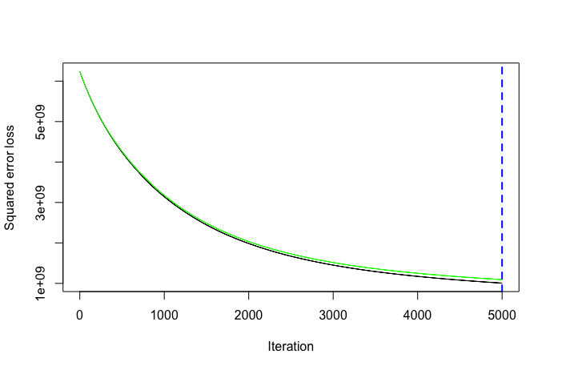
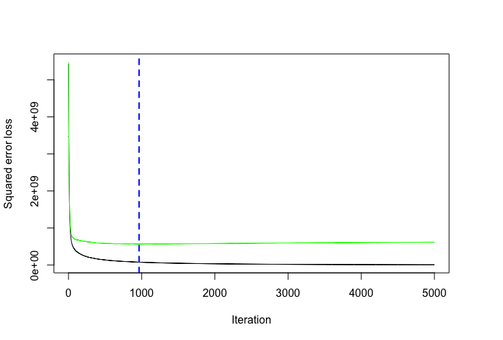

# Gradient Boosting Machines {#gradient-boosting-machines}

```{r setup, include=FALSE}
knitr::opts_chunk$set(
  echo = TRUE,
  fig.align = "center",
  error = FALSE,
  message = FALSE, 
  warning = FALSE, 
  collapse = TRUE,
  cache = TRUE
)
```


Gradient boosted machines (GBMs) are an extremely popular machine learning algorithm that have proven successful across many domains and is one of the leading methods for winning Kaggle competitions.  Whereas [random forests](random_forests) build an ensemble of deep independent trees, GBMs build an ensemble of shallow and weak successive trees with each tree learning and improving on the previous.  When combined, these many weak successive trees produce a powerful "committee" that are often hard to beat with other algorithms.  This tutorial will cover the fundamentals to understanding and implementing GBMs.


## Package Requirements {#gbm-prereq}

This tutorial leverages the following packages. Some of these packages play a supporting role; however, we demonstrate how to implement GBMs with several different packages and discuss the pros and cons to each.

```{r pkg-req, cache=FALSE}
library(rsample)      # data splitting 
library(gbm)          # basic implementation
library(xgboost)      # a faster implementation of gbm
library(caret)        # an aggregator package for performing many machine learning tasks
library(h2o)          # a java-based platform
library(pdp)          # model visualization
library(ggplot2)      # model visualization
library(lime)         # model visualization
```


## Advantages & Disadvantages {#gbm-proscons}

__Advantages:__

* Often provides predictive accuracy that cannot be beat.
* Lots of flexibility - can optimize on different loss functions and provides several hyperparameter tuning options that make the function fit very flexible.
* No data pre-processing required - often works great with categorical and numerical values as is.
* Handles missing data - imputation not required.


__Disdvantages:__

* GBMs will continue improving to minimize all errors.  This can overemphasize outliers and cause overfitting. Must use cross-validation to neutralize.
* Computationally expensive - GBMs often require many trees (>1000) which can be time and memory exhaustive.
* The high flexibility results in many parameters that interact and influence heavily the behavior of the approach (number of iterations, tree depth, regularization parameters, etc.). This requires a large grid search during tuning.
* Less interpretable although this is easily addressed with various tools (variable importance, partial dependence plots, LIME, etc.).


## The Idea {#gbm-idea}

Several supervised machine learning models are founded on a single predictive model (i.e. [linear regression](http://uc-r.github.io/linear_regression), [penalized models](http://uc-r.github.io/regularized_regression), [naive Bayes](http://uc-r.github.io/naive_bayes), [support vector machines](http://uc-r.github.io/svm)). Alternatively, other approaches such as [bagging](http://uc-r.github.io/regression_trees) and [random forests](http://uc-r.github.io/random_forests) are built on the idea of building an ensemble of models where each individual model predicts the outcome and then the ensemble simply averages the predicted values.  The family of boosting methods is based on a different, constructive strategy of ensemble formation. 

The main idea of boosting is to add new models to the ensemble ___sequentially___. At each particular iteration, a new weak, base-learner model is trained with respect to the error of the whole ensemble learnt so far.  

```{r sequential-fig, echo=FALSE, fig.align='center', fig.cap="Sequential ensemble approach.", out.height="75%", out.width="75%"}

knitr::include_graphics("images/boosted-trees-process.png")
```


Let's discuss each component of the previous sentence in closer detail because they are important.

__Base-learning models__:  Boosting is a framework that iteratively improves _any_ weak learning model.  Many gradient boosting applications allow you to "plug in" various classes of weak learners at your disposal. In practice however, boosted algorithms almost always use decision trees as the base-learner. Consequently, this tutorial will discuss boosting in the context of regression trees.

__Training weak models__: A weak model is one whose error rate is only slightly better than random guessing.  The idea behind boosting is that each sequential model builds a simple weak model to slightly improve the remaining errors.  With regards to decision trees, shallow trees represent a weak learner.  Commonly, trees with only 1-6 splits are used. Combining many weak models (versus strong ones) has a few benefits:

- Speed: Constructing weak models is computationally cheap. 
- Accuracy improvement: Weak models allow the algorithm to _learn slowly_; making minor adjustments in new areas where it does not perform well. In general,  statistical approaches that learn slowly tend to perform well.
- Avoids overfitting: Due to making only small incremental improvements with each model in the ensemble, this allows us to stop the learning process as soon as overfitting has been detected (typically by using cross-validation).

__Sequential training with respect to errors__: Boosted trees are grown sequentially; each tree is grown using information from previously grown trees. The basic algorithm for boosted regression trees can be generalized to the following where _x_ represents our features and _y_ represents our response:

1. Fit a decision tree to the data: $F_1(x) = y$,
2. We then fit the next decision tree to the residuals of the previous: $h_1(x) = y - F_1(x)$,
3. Add this new tree to our algorithm: $F_2(x) = F_1(x) + h_1(x)$,
4. Fit the next decision tree to the residuals of $F_2$: $h_2(x) = y - F_2(x)$,
5. Add this new tree to our algorithm: $F_3(x) = F_2(x) + h_1(x)$,
6. Continue this process until some mechanism (i.e. cross validation) tells us to stop.

The basic algorithm for boosted regression trees can be generalized to the following where the final model is simply a stagewise additive model of *b* individual regression trees:

$$ f(x) =  \sum^B_{b=1}f^b(x) \tag{1} $$

To illustrate the behavior, assume the following *x* and *y* observations.  The blue sine wave represents the true underlying function and the points represent observations that include some irriducible error (noise).  The boosted prediction illustrates the adjusted predictions after each additional sequential tree is added to the algorithm.  Initially, there are large errors which the boosted algorithm improves upon immediately but as the predictions get closer to the true underlying function you see each additional tree make small improvements in different areas across the feature space where errors remain. Towards the end of the gif, the predicted values nearly converge to the true underlying function.

```{r boosted-gif, echo=FALSE, fig.align='center', fig.cap="Boosted regression tree predictions (courtesy of [Brandon Greenwell](https://github.com/bgreenwell))", out.height="50%", out.width="50%"}

knitr::include_graphics("images/boosted_stumps.gif")
```


### Gradient descent {#gbm-gradient}

Many algorithms, including decision trees, focus on minimizing the residuals and, therefore, emphasize the MSE loss function.  The algorithm discussed in the previous section outlines the approach of sequentially fitting regression trees to minimize the errors.  This specific approach is how gradient boosting minimizes the mean squared error (MSE) loss function.  However, often we wish to focus on other loss functions such as mean absolute error (MAE) or to be able to apply the method to a classification problem with a loss function such as deviance. The name ___gradient___ boosting machines come from the fact that this procedure can be generalized to loss functions other than MSE.

Gradient boosting is considered a ___gradient descent___ algorithm. Gradient descent is a very generic optimization algorithm capable of finding optimal solutions to a wide range of problems. The general idea of gradient descent is to tweak parameters iteratively in order to minimize a cost function. Suppose you are a downhill skier racing your friend.  A good strategy to beat your friend to the bottom is to take the path with the steepest slope. This is exactly what gradient descent does - it measures the local gradient of the loss (cost) function for a given set of parameters ($\Theta$) and takes steps in the direction of the descending gradient. Once the gradient is zero, we have reached the minimum.

```{r gradient-descent-fig, echo=FALSE, fig.align='center', fig.cap="Gradient descent (Geron, 2017).", out.height="50%", out.width="50%"}

knitr::include_graphics("images/gradient_descent.png")
```

Gradient descent can be performed on any loss function that is differentiable.  Consequently, this allows GBMs to optimize different loss functions as desired (see [ESL, p. 360](http://web.stanford.edu/~hastie/ElemStatLearn/) for common loss functions). An important parameter in gradient descent is the size of the steps which is determined by the _learning rate_. If the learning rate is too small, then the algorithm will take many iterations to find the minimum. On the other hand, if the learning rate is too high, you might jump cross the minimum and end up further away than when you started. 

```{r learning-rate-fig, echo=FALSE, fig.align='center', fig.cap="Learning rate comparisons (Geron, 2017).", out.height="70%", out.width="70%"}

knitr::include_graphics("images/learning_rate_comparison.png")
```

Moreover, not all cost functions are convex (bowl shaped). There may be local minimas, plateaus, and other irregular terrain of the loss function that makes finding the global minimum difficult.  ___Stochastic gradient descent___ can help us address this problem by sampling a fraction of the training observations (typically without replacement) and growing the next tree using that subsample.  This makes the algorithm faster but the stochastic nature of random sampling also adds some random nature in descending the loss function gradient.  Although this randomness does not allow the algorithm to find the absolute global minimum,  it can actually help the algorithm jump out of local minima and off plateaus and get near the global minimum. 

```{r stochastic-gradient-descent-fig, echo=FALSE, fig.align='center', fig.cap="Stochastic gradient descent (Geron, 2017).", out.height="40%", out.width="40%"}

knitr::include_graphics("images/stochastic_gradient_descent.png")
```

As we'll see in the next section, there are several hyperparameter tuning options that allow us to address how we approach the gradient descent of our loss function.


### Tuning {#gbm-tuning}

Part of the beauty and challenges of GBM is that they offer several tuning parameters.  The beauty in this is GBMs are highly flexible.  The challenge is that they can be time consuming to tune and find the optimal combination of hyperparamters.  The most common hyperparameters that you will find in most GBM implementations include:

* __Number of trees:__ The total number of trees to fit. GBMs often require many trees; however, unlike random forests GBMs can overfit so the goal is to find the optimal number of trees that minimize the loss function of interest with cross validation.
* __Depth of trees:__ The number *d* of splits in each tree, which controls the complexity of the boosted ensemble. Often $d = 1$ works well, in which case each tree is a _stump_ consisting of a single split. More commonly, d is greater than 1 but it is unlikely $d > 10$ will be required.
* __Learning rate:__ Controls how quickly the algorithm proceeds down the gradient descent. Smaller values reduce the chance of overfitting but also increases the time to find the optimal fit. This is also called _shrinkage_.
* __Subsampling:__ Controls whether or not you use a fraction of the available training observations. Using less than 100% of the training observations means you are implementing stochastic gradient descent.  This can help to minimize overfitting and keep from getting stuck in a local minimum or plateau of the loss function gradient.

Throughout this tutorial you'll be exposed to additional hyperparameters that are specific to certain packages and can improve performance and/or the efficiency of training and tuning models.

### Package implementation {#gbm-pkg-options}

There are many packages that implement GBMs and GBM variants. You can find a fairly comprehensive list [here](https://koalaverse.github.io/machine-learning-in-R/gradient-boosting-machines.html#gbm-software-in-r) and at the [CRAN Machine Learning Task View](https://cran.r-project.org/web/views/MachineLearning.html). However, the most popular implementations which we will cover in this post include:

- [gbm](https://cran.r-project.org/web/packages/gbm/index.html): The original R implementation of GBMs
- [xgboost](https://cran.r-project.org/web/packages/xgboost/index.html): A fast and efficient gradient boosting framework (C++ backend).
- [h2o](https://cran.r-project.org/web/packages/gamboostLSS/index.html): A powerful java-based interface that provides parallel distributed algorithms and efficient productionalization.


## Implementation: Regression {#gbm-regression}

To illustrate the GBM algorithm for a regression problem we will use the following space optimization data, where our intent is to predict `RESPONSE_VAR`.  This data set has over 40,000 observations and 92 features.  You can access this data [here](https://github.8451.com/effoverse/machine-learning-with-R/blob/master/data/space_optimization.csv). 

```{r data-import}
# import data
df <- data.table::fread("data/space_optimization.csv", data.table = FALSE, stringsAsFactors = TRUE)

# check for zero variance variables and remove
pre <- preProcess(df, method = "zv")
df <- predict(pre, df)

# Create training (70%) and test (30%) sets.  Use set.seed for reproducibility
set.seed(123)
split <- initial_split(df, prop = .7)
train <- training(split)
test  <- testing(split)
```


```{block, type = "rmdcomment"}
Tree-based methods tend to perform well on unprocessed data (i.e. without normalizing, centering, scaling features).  In this tutorial I focus on how to implement GBMs with various packages. Although I do not pre-process the data, realize that you ___can___ improve model performance by spending time processing variable attributes.
```

### gbm {#gbm-regression-gbm}

The [`gbm`](https://github.com/gbm-developers/gbm) R package is an implementation of extensions to Freund and Schapire’s [AdaBoost algorithm](http://www.site.uottawa.ca/~stan/csi5387/boost-tut-ppr.pdf) and Friedman’s [gradient boosting machine](https://statweb.stanford.edu/~jhf/ftp/trebst.pdf). This is the original R implementation of GBM. A presentation is available [here](https://www.slideshare.net/mark_landry/gbm-package-in-r) by Mark Landry. 

```{block, type = "rmdwarning"}
`gbm` is one of the original implementations of GBMs in R.  However, although I demonstrate how to implement it in this tutorial, `xgboost` and `h2o` are the two preferred packages for implementing GBMs for regression at 84.51°.
```

Features include[^ledell]:

* Stochastic GBM.
* Supports up to 1024 factor levels.
* Supports Classification and regression trees.
* Can incorporate many loss functions.
* Out-of-bag estimator for the optimal number of iterations is provided.
* Easy to overfit since early stopping functionality is not automated in this package.
* If internal cross-validation is used, this can be parallelized to all cores on the machine.
* Currently undergoing a major refactoring & rewrite (and has been for some time).
* GPL-2/3 License.

#### Basic implementation {#gbm-regression-gbm-basic}

`gbm` has two primary training functions - `gbm::gbm` and `gbm::gbm.fit`. The primary difference is that `gbm::gbm` uses the formula interface to specify your model whereas `gbm::gbm.fit` requires the separated `x` and `y` matrices.  When working with _many_ variables it is more efficient to use the matrix rather than formula interface.

The default settings in `gbm` includes a learning rate (`shrinkage`) of 0.001. This is a very small learning rate and typically requires a large number of trees to find the minimum MSE.  However, `gbm` uses a default number of trees of 100, which is rarely sufficient.  Consequently, I crank it up to 5,000 trees.  The default depth of each tree (`interaction.depth`) is 1, which means we are ensembling a bunch of stumps. Lastly, I also include `cv.folds` to perform a 5 fold cross validation.  The model took about 4 minutes to run and the results show that our MSE loss function is minimized with 5,000 trees.

```{r gbm-pkg-basic, eval=FALSE}
# for reproducibility
set.seed(123)

# train GBM model
gbm.fit <- gbm(
  formula = RESPONSE_VAR ~ .,
  distribution = "gaussian",
  data = train,
  n.trees = 5000,
  interaction.depth = 1,
  shrinkage = 0.001,
  cv.folds = 5,
  n.cores = NULL, # will use all cores by default
  verbose = FALSE
  )  

# print results
print(gbm.fit)
## gbm(formula = RESPONSE_VAR ~ ., distribution = "gaussian", data = train, 
##     n.trees = 5000, interaction.depth = 1, shrinkage = 0.001, 
##     cv.folds = 5, verbose = FALSE, n.cores = NULL)
## A gradient boosted model with gaussian loss function.
## 5000 iterations were performed.
## The best cross-validation iteration was 5000.
## There were 89 predictors of which 11 had non-zero influence.
```


The output object is a list containing several modelling and results information.  We can access this information with regular indexing; I recommend you take some time to dig around in the object to get comfortable with its components.  Here, we see that the minimum CV RMSE is 0.407 but the plot also illustrates that the CV error is still decreasing at 5,000 trees.  


```{r gbm-basic-results, eval=FALSE}
# get MSE and compute RMSE
sqrt(min(gbm.fit$cv.error))
## [1] 0.407026

# plot loss function as a result of n trees added to the ensemble
gbm.perf(gbm.fit, method = "cv")
```

```{r gbm1-gradient-descent, echo=FALSE, out.height="100%", out.width="100%"}


```

In this case, the small learning rate is resulting in very small incremental improvements which means ___many___ trees are required.  In fact, with the default learning rate and tree depth settings, the CV error is still reducing after 10,000 trees which takes ~ 20 minutes of run time!

#### Tuning {#gbm-regression-gbm-tune}

However, rarely do the default settings suffice.  We could tune parameters one at a time to see how the results change.  For example, here, I increase the learning rate to take larger steps down the gradient descent, reduce the number of trees (since we are reducing the learning rate), and increase the depth of each tree from using a single split to 3 splits. Our RMSE (0.24) is lower than our initial model and the optimal number of trees required was 4874.

```{r gbm-tune1, eval=FALSE}
# for reproducibility
set.seed(123)

# train GBM model
gbm.fit2 <- gbm(
  formula = RESPONSE_VAR ~ .,
  distribution = "gaussian",
  data = train,
  n.trees = 5000,
  interaction.depth = 3,
  shrinkage = 0.1,
  cv.folds = 5,
  n.cores = NULL, # will use all cores by default
  verbose = FALSE
  )  

# find index for n trees with minimum CV error
min_MSE <- which.min(gbm.fit2$cv.error)

# get MSE and compute RMSE
sqrt(gbm.fit2$cv.error[min_MSE])
## [1] 0.2415405

# plot loss function as a result of n trees added to the ensemble
gbm.perf(gbm.fit2, method = "cv")
```

```{r gbm2-gradient-descent, echo=FALSE, out.height="100%", out.width="100%"}


```

However, a better option than manually tweaking hyperparameters one at a time is to perform a grid search which iterates over every combination of hyperparameter values and allows us to assess which combination tends to perform well.  To perform a manual grid search, first we want to construct our grid of hyperparameter combinations.  We're going to search across 81 models with varying learning rates and tree depth.  I also vary the minimum number of observations allowed in the trees terminal nodes (`n.minobsinnode`) and introduce stochastic gradient descent by allowing `bag.fraction` < 1.

```{r gbm-grid-1}
# create hyperparameter grid
hyper_grid <- expand.grid(
  shrinkage = c(.01, .1, .3),
  interaction.depth = c(1, 3, 5),
  n.minobsinnode = c(5, 10, 15),
  bag.fraction = c(.65, .8, 1), 
  optimal_trees = 0,               # a place to dump results
  min_RMSE = 0                     # a place to dump results
)

# total number of combinations
nrow(hyper_grid)
```

We loop through each hyperparameter combination and apply 5,000 trees.  However, to speed up the tuning process, instead of performing 5-fold CV I train on 75% of the training observations and evaluate performance on the remaining 25%. 

```{block, type = "rmdwarning"}
When using `train.fraction` it will take the first XX% of the data so its important to randomize your rows in case their is any logic behind the ordering of the data (i.e. ordered by store, department, product). 
```

Our grid search revealed a few important attributes.  First, our top model has better performance than our previously fitted model above, with an RMSE of 0.23. Second, looking at the top 10 models we see that:

- all of the top models used a learning rate of 0.1; small incremental steps down the gradient descent appears to work best,
- none of the top models used stumps (`interaction.depth = 1`); there are likely stome important interactions that the deeper trees are able to capture,
- adding a stochastic component with `bag.fraction` < 1 seems to help; there may be some local minimas in our loss function gradient,
- only one of the top models used `n.minobsinnode` = 5; smaller nodes allow us to capture pockets of unique feature-response variable instances but it seems we do not need to worry about that,
- in most instances we appear to use nearly all 5,000 trees. In fact, most of the models with a learning rate of 0.01 used all the trees meaning they may not have had enough trees to converge to their global minimum. Maybe we should increase this parameter in our next search?

```{r gbm-grid-search-1, eval=FALSE}
# randomize data
random_index <- sample(1:nrow(train), nrow(train))
random_train <- train[random_index, ]

# grid search 
for(i in 1:nrow(hyper_grid)) {
  
  # reproducibility
  set.seed(123)
  
  # train model
  gbm.tune <- gbm(
    formula = RESPONSE_VAR ~ .,
    distribution = "gaussian",
    data = random_train,
    n.trees = 5000,
    interaction.depth = hyper_grid$interaction.depth[i],
    shrinkage = hyper_grid$shrinkage[i],
    n.minobsinnode = hyper_grid$n.minobsinnode[i],
    bag.fraction = hyper_grid$bag.fraction[i],
    train.fraction = .75,
    n.cores = NULL, # will use all cores by default
    verbose = FALSE
  )
  
  # add min training error and trees to grid
  hyper_grid$optimal_trees[i] <- which.min(gbm.tune$valid.error)
  hyper_grid$min_RMSE[i] <- sqrt(min(gbm.tune$valid.error))
}

hyper_grid %>% 
  dplyr::arrange(min_RMSE) %>%
  head(10)
##    shrinkage interaction.depth n.minobsinnode bag.fraction optimal_trees  min_RMSE
## 1        0.1                 5             15         0.80          4342 0.2346278
## 2        0.1                 3             15         0.80          4867 0.2362116
## 3        0.1                 5             15         0.65          2340 0.2362708
## 4        0.1                 5             15         1.00          3802 0.2376581
## 5        0.1                 3             15         0.65          3928 0.2395356
## 6        0.1                 5             10         0.65          4214 0.2401138
## 7        0.1                 3             15         1.00          4983 0.2402113
## 8        0.1                 3             10         0.65          4986 0.2405867
## 9        0.1                 5             10         0.80          4048 0.2420684
## 10       0.1                 5              5         0.65          2306 0.2426004
```

These results help us to zoom into areas where we can refine our search.  In practice, tuning is an iterative process so you would likely refine this search grid to analyze a search space around the top models.  For example, I would like search the following values in my next grid search:

* learning rate: 0.05, 0.1, 0.15
* interaction depth: 3, 5, 7
* min obs in a node: 10, 15, 20

Once we have found our top model we train a model with those specific parameters. I'll use the top model in our grid search and since the model converged at 4342 trees I train a model with that many trees.  

```{r gbm-final}
# for reproducibility
set.seed(123)

# train GBM model
gbm.fit.final <- gbm(
  formula = RESPONSE_VAR ~ .,
  distribution = "gaussian",
  data = train,
  n.trees = 4342,
  interaction.depth = 5,
  shrinkage = 0.1,
  n.minobsinnode = 15,
  bag.fraction = .80, 
  train.fraction = 1,
  n.cores = NULL, # will use all cores by default
  verbose = FALSE
  )  
```

#### Visualizing results {#gbm-regression-gbm-viz}

##### Variable importance {#gbm-regression-gbm-vip}

After re-running our final model we likely want to understand the variables that have the largest influence on our response variable.  The `summary` method for `gbm` will output a data frame and a plot that shows the most influential variables.  `cBars` allows you to adjust the number of variables to show (in order of influence). The default method for computing variable importance is with relative influence 

1. `method = relative.influence`: At each split in each tree, `gbm` computes the improvement in the split-criterion (MSE for regression). `gbm` then averages the improvement made by each variable across all the trees that the variable is used. The variables with the largest average decrease in MSE are considered most important.
2. `method = permutation.test.gbm`: For each tree, the OOB sample is passed down the tree and the prediction accuracy is recorded. Then the values for each variable (one at a time) are randomly permuted and the accuracy is again computed. The decrease in accuracy as a result of this randomly “shaking up” of variable values is averaged over all the trees for each variable. The variables with the largest average decrease in accuracy are considered most important.

```{r vip1}
par(mar = c(5, 15, 1, 1))
summary(
  gbm.fit.final, 
  cBars = 10,
  method = relative.influence, # also can use permutation.test.gbm
  las = 2
  )
```

An alternative approach is to use the underdevelopment [`vip`](https://github.com/koalaverse/vip) package, which provides `ggplot2` plots.  `vip` also provides an additional measure of variable importance based on partial dependence measures and is a common variable importance plotting framework for many machine learning models.

```{r vip2}
# install.packages("vip")
vip::vip(gbm.fit.final)
```

##### Partial dependence plots {#gbm-regression-gbm-pdp}


After the most relevant variables have been identified, the next step is to attempt to understand how the response variable changes based on these variables. For this we can use partial dependence plots (PDPs) and individual conditional expectation (ICE) curves.

PDPs plot the change in the average predicted value as specified feature(s) vary over their marginal distribution. For example, consider the `PROD_DIV_PURCHASE_CYCLE` variable. The PDP plot below displays the average change in the predicted response variable (`RESPONSE_VAR`) as we vary `PROD_DIV_PURCHASE_CYCLE` while holding all other variables constant. This is done by holding all variables constant for each observation in our training data set but then apply the unique values of `PROD_DIV_PURCHASE_CYCLE` for each observation. We then average the predicted `RESPONSE_VAR` values across all the observations. This PDP illustrates how the predicted `RESPONSE_VAR` decreases as `PROD_DIV_PURCHASE_CYCLE` increases.

```{r pdp1, fig.height=3.5, fig.width=6}
gbm.fit.final %>%
  partial(
    pred.var = "PROD_DIV_PURCHASE_CYCLE", 
    n.trees = gbm.fit.final$n.trees, 
    grid.resolution = 100
    ) %>%
  autoplot(rug = TRUE, train = train) 
```

ICE curves are an extension of PDP plots but, rather than plot the average marginal effect on the response variable, we plot the change in the predicted response variable for each observation as we vary each predictor variable. Below shows the regular ICE curve plot (left) and the centered ICE curves (right). When the curves have a wide range of intercepts and are consequently “stacked” on each other, heterogeneity in the response variable values due to marginal changes in the predictor variable of interest can be difficult to discern. The centered ICE can help draw these inferences out and can highlight any strong heterogeneity in our results. The resuts show that most observations follow a common trend as `PROD_DIV_PURCHASE_CYCLE` increases; however, there are a few observations that have significantly larger values.

```{r ice-plots, fig.height=3.5, fig.width=9}
ice1 <- gbm.fit.final %>%
  partial(
    pred.var = "PROD_DIV_PURCHASE_CYCLE", 
    n.trees = gbm.fit.final$n.trees, 
    grid.resolution = 100,
    ice = TRUE
    ) %>%
  autoplot(rug = TRUE, train = train, alpha = .1) +
  ggtitle("Non-centered") 

ice2 <- gbm.fit.final %>%
  partial(
    pred.var = "PROD_DIV_PURCHASE_CYCLE", 
    n.trees = gbm.fit.final$n.trees, 
    grid.resolution = 100,
    ice = TRUE
    ) %>%
  autoplot(rug = TRUE, train = train, alpha = .1, center = TRUE) +
  ggtitle("Centered")

gridExtra::grid.arrange(ice1, ice2, nrow = 1)
```

##### LIME {#gbm-regression-gbm-lime}

LIME is a newer procedure for understanding why a prediction resulted in a given value for a single observation.  You can read more about LIME [here](https://github.8451.com/pages/effoverse/effoverse.github.io/articles/2018/06/01/lime/). To use the `lime` package on a `gbm` model we need to define model type and prediction methods.

```{r create-lime-methods-gbm}
model_type.gbm <- function(x, ...) {
  return("regression")
}

predict_model.gbm <- function(x, newdata, ...) {
  pred <- predict(x, newdata, n.trees = x$n.trees)
  return(as.data.frame(pred))
}
```

We can now apply to our two observations.  The results show the predicted value (Case 1: \$118K, Case 2: \$161K), local model fit (both are relatively poor), and the most influential variables driving the predicted value for each observation.

```{r lime-plot-gbm, fig.width=10, fig.height=3.5}
# get a few observations to perform local interpretation on
local_obs <- test[1:2, ]

# apply LIME
explainer <- lime(train, gbm.fit.final)
explanation <- explain(local_obs, explainer, n_features = 5)
plot_features(explanation)
```


#### Predicting {#gbm-regression-gbm-predict}

Once you have decided on a final model you will likely want to use the model to predict on new observations.  Like most models, we simply use the `predict` function; however, we also need to supply the number of trees to use (see `?predict.gbm` for details).  We see that our RMSE for our test set is actually slightly lower than the RMSE we obtained on our best `gbm` model.

```{r gbm-predict}
# predict values for test data
pred <- predict(gbm.fit.final, n.trees = gbm.fit.final$n.trees, test)

# results
caret::RMSE(pred, test$RESPONSE_VAR)
```


### xgboost {#regression-xgboost}

The [`xgboost`](https://cran.r-project.org/web/packages/xgboost/index.html) R package provides an R API to “Extreme Gradient Boosting”, which is an efficient implementation of gradient boosting framework (apprx 10x faster than `gbm`). The [xgboost/demo](https://github.com/dmlc/xgboost/tree/master/demo) repository provides a wealth of information. You can also find a fairly comprehensive parameter tuning guide [here](https://www.analyticsvidhya.com/blog/2016/03/complete-guide-parameter-tuning-xgboost-with-codes-python/). The `xgboost` package has been quite popular and successful on [Kaggle](http://blog.kaggle.com/tag/xgboost/) for data mining competitions.

Features include:

* Provides built-in k-fold cross-validation
* Stochastic GBM with column and row sampling (per split and per tree) for better generalization.
* Includes efficient linear model solver and tree learning algorithms.
* Parallel computation on a single machine.
* Supports various objective functions, including regression, classification and ranking.
* The package is made to be extensible, so that users are also allowed to define their own objectives easily.
* Apache 2.0 License.


#### Basic implementation {#gbm-regression-xgb-basic}

XGBoost only works with matrices that contain all numeric variables; consequently, we need to one hot encode our data.  There are different ways to do this in R (i.e. `Matrix::sparse.model.matrix`, `caret::dummyVars`) but here we will use the `vtreat` package.  `vtreat` is a robust package for data prep and helps to eliminate problems caused by missing values, novel categorical levels that appear in future data sets that were not in the training data, etc.  However, `vtreat` is not very intuitive.  I will not explain the functionalities but you can find more information [here](https://arxiv.org/abs/1611.09477), [here](https://www.r-bloggers.com/a-demonstration-of-vtreat-data-preparation/), and [here](https://github.com/WinVector/vtreat).  

The following applies `vtreat` to one-hot encode the training and testing data sets.

```{r xgboost-create-matrices}
# variable names
features <- setdiff(names(train), "RESPONSE_VAR")

# Create the treatment plan from the training data
treatplan <- vtreat::designTreatmentsZ(train, features, verbose = FALSE)

# Get the "clean" variable names from the scoreFrame
new_vars <- treatplan %>%
  magrittr::use_series(scoreFrame) %>%        
  dplyr::filter(code %in% c("clean", "lev")) %>% 
  magrittr::use_series(varName)     

# Prepare the training data
features_train <- vtreat::prepare(treatplan, train, varRestriction = new_vars) %>% as.matrix()
response_train <- train$RESPONSE_VAR

# Prepare the test data
features_test <- vtreat::prepare(treatplan, test, varRestriction = new_vars) %>% as.matrix()
response_test <- test$RESPONSE_VAR

# dimensions of one-hot encoded data
dim(features_train)
dim(features_test)
```

`xgboost` provides different training functions (i.e. `xgb.train` which is just a wrapper for `xgboost`). However, to train an XGBoost we typically want to use `xgb.cv`, which incorporates cross-validation.  The following trains a basic 5-fold cross validated XGBoost model with 1,000 trees.  There are many parameters available in `xgb.cv` but the ones you have become more familiar with in this tutorial include the following default values:

* learning rate (`eta`): 0.3
* tree depth (`max_depth`): 6
* minimum node size (`min_child_weight`): 1
* percent of training data to sample for each tree (`subsample` --> equivalent to `gbm`'s `bag.fraction`): 100%

```{r xgb-basic-implementation, eval=FALSE}
# reproducibility
set.seed(123)

xgb.fit1 <- xgb.cv(
  data = features_train,
  label = response_train,
  nrounds = 1000,
  nfold = 5,
  objective = "reg:linear",  # for regression models
  verbose = 0               # silent,
)
```

The `xgb.fit1` object contains lots of good information. In particular we can assess the `xgb.fit1$evaluation_log` to identify the minimum RMSE and the optimal number of trees for both the training data and the cross-validated error. We can see that the training error continues to decreasing through all 1000 trees where the RMSE nearly reaches 0.0198; however, the cross validated error reaches a minimum RMSE of 0.257 with only 183 trees. 

```{r xgb-find-min-error, fig.width=6, fig.height=3.5, eval=FALSE}
# get number of trees that minimize error
xgb.fit1$evaluation_log %>%
  dplyr::summarise(
    ntrees.train = which(train_rmse_mean == min(train_rmse_mean))[1],
    rmse.train   = min(train_rmse_mean),
    ntrees.test  = which(test_rmse_mean == min(test_rmse_mean))[1],
    rmse.test   = min(test_rmse_mean),
  )
##   ntrees.train rmse.train ntrees.test rmse.test
## 1         1000  0.0197884         183 0.2569686

# plot error vs number trees
ggplot(xgb.fit1$evaluation_log) +
  geom_line(aes(iter, train_rmse_mean), color = "red") +
  geom_line(aes(iter, test_rmse_mean), color = "blue")
```

```{r xgb-gradient-descent-plot, echo=FALSE, out.height="70%", out.width="70%"}

knitr::include_graphics("images/xgb1_gradient_descent.png")
```

A nice feature provided by `xgb.cv` is early stopping.  This allows us to tell the function to stop running if the cross validated error does not improve for *n* continuous trees.  For example, the above model could be re-run with the following where we tell it stop if we see no improvement for 10 consecutive trees.  This feature will help us speed up the tuning process in the next section.

```{r fig.width=6, fig.height=3.5, eval=FALSE}
# reproducibility
set.seed(123)

xgb.fit2 <- xgb.cv(
  data = features_train,
  label = response_train,
  nrounds = 1000,
  nfold = 5,
  objective = "reg:linear",  # for regression models
  verbose = 0,               # silent,
  early_stopping_rounds = 10 # stop if no improvement for 10 consecutive trees
)

# plot error vs number trees
ggplot(xgb.fit2$evaluation_log) +
  geom_line(aes(iter, train_rmse_mean), color = "red") +
  geom_line(aes(iter, test_rmse_mean), color = "blue")
```

```{r xgb2-gradient-descent2-plot, echo=FALSE, out.height="70%", out.width="70%"}

knitr::include_graphics("images/xgb2_gradient_descent.png")
```


#### Tuning {#gbm-regression-xgb-tune}

To tune the XGBoost model we pass parameters as a list object to the `params` argument.  The most common parameters include:

* `eta`:controls the learning rate
* `max_depth`: tree depth
* `min_child_weight`: minimum number of observations required in each terminal node
* `subsample`: percent of training data to sample for each tree
* `colsample_bytrees`: percent of columns to sample from for each tree

For example, if we wanted to specify specific values for these parameters we would extend the above model with the following parameters.

```{r xgb-tune1, eval=FALSE}
# create parameter list
params <- list(
  eta = .1,
  max_depth = 5,
  min_child_weight = 2,
  subsample = .8,
  colsample_bytree = .9
  )

# reproducibility
set.seed(123)

# train model
xgb.fit3 <- xgb.cv(
  params = params,
  data = features_train,
  label = response_train,
  nrounds = 1000,
  nfold = 5,
  objective = "reg:linear",  # for regression models
  verbose = 0,               # silent,
  early_stopping_rounds = 10 # stop if no improvement for 10 consecutive trees
)

# assess results
xgb.fit3$evaluation_log %>%
  dplyr::summarise(
    ntrees.train = which(train_rmse_mean == min(train_rmse_mean))[1],
    rmse.train   = min(train_rmse_mean),
    ntrees.test  = which(test_rmse_mean == min(test_rmse_mean))[1],
    rmse.test   = min(test_rmse_mean),
  )
##   ntrees.train rmse.train ntrees.test rmse.test
## 1          735   0.121736         725  0.241092
```

To perform a large search grid, we can follow the same procedure we did with `gbm`.  We create our hyperparameter search grid along with columns to dump our results in.  Here, I create a pretty large search grid consisting of 108 different hyperparameter combinations to model.

```{r xgb-grid}
# create hyperparameter grid
hyper_grid <- expand.grid(
  eta = c(.05, .1, .15),
  max_depth = c(3, 5, 7),
  min_child_weight = c(5, 10, 15),
  subsample = c(.65, .8), 
  colsample_bytree = c(.9, 1),
  optimal_trees = 0,               # a place to dump results
  min_RMSE = 0                     # a place to dump results
)

nrow(hyper_grid)
```

Now I apply the same for loop procedure to loop through and apply a XGBoost model for each hyperparameter combination and dump the results in the `hyper_grid` data frame.  

```{block, type = "rmdwarning"}
If you plan to run this code be prepared to run it before going out to eat or going to bed as it the full search grid took 6 hours to run!
```

```{r xgb-grid-search, eval=FALSE}
# grid search 
for(i in 1:nrow(hyper_grid)) {
  
  # create parameter list
  params <- list(
    eta = hyper_grid$eta[i],
    max_depth = hyper_grid$max_depth[i],
    min_child_weight = hyper_grid$min_child_weight[i],
    subsample = hyper_grid$subsample[i],
    colsample_bytree = hyper_grid$colsample_bytree[i]
  )
  
  # reproducibility
  set.seed(123)
  
  # train model
  xgb.tune <- xgb.cv(
    params = params,
    data = features_train,
    label = response_train,
    nrounds = 5000,
    nfold = 5,
    objective = "reg:linear",  # for regression models
    verbose = 0,               # silent,
    early_stopping_rounds = 10 # stop if no improvement for 10 consecutive trees
  )
  
  # add min training error and trees to grid
  hyper_grid$optimal_trees[i] <- which.min(xgb.tune$evaluation_log$test_rmse_mean)
  hyper_grid$min_RMSE[i] <- min(xgb.tune$evaluation_log$test_rmse_mean)
}

hyper_grid %>%
  dplyr::arrange(min_RMSE) %>%
  head(10)
##     eta max_depth min_child_weight subsample colsample_bytree optimal_trees  min_RMSE
## 1  0.05         5               15      0.80              0.9          1892 0.2383528
## 2  0.05         5               10      0.80              1.0          1361 0.2394012
## 3  0.05         5               15      0.80              1.0          1270 0.2394488
## 4  0.05         7               10      0.80              1.0           770 0.2395246
## 5  0.05         5                5      0.80              0.9          1291 0.2396664
## 6  0.05         5                5      0.65              0.9          1200 0.2397968
## 7  0.05         5               15      0.65              1.0          1396 0.2398580
## 8  0.05         7               15      0.80              1.0           948 0.2399040
## 9  0.05         5                5      0.80              1.0          1224 0.2399266
## 10 0.05         5               15      0.65              0.9          1362 0.2401734
```

After assessing the results you would likely perform a few more grid searches to hone in on the parameters that appear to influence the model the most.  In fact, [here is a link](https://www.analyticsvidhya.com/blog/2016/03/complete-guide-parameter-tuning-xgboost-with-codes-python/) to a great blog post that discusses a strategic approach to tuning with `xgboost`. However, for brevity, we'll just assume the top model in the above search is the globally optimal model.  Once you've found the optimal model, we can fit our final model with `xgb.train`.

```{r xgb-best}
# parameter list
params <- list(
  eta = 0.05,
  max_depth = 5,
  min_child_weight = 15,
  subsample = 0.80,
  colsample_bytree = 0.9
)

# train final model
xgb.fit.final <- xgboost(
  params = params,
  data = features_train,
  label = response_train,
  nrounds = 1892,
  objective = "reg:linear",
  verbose = 0
)
```


#### Visualizing {#gbm-regression-xgb-viz}

##### Variable importance {#gbm-regression-xgb-vip}

`xgboost` provides built-in variable importance plotting.  First, you need to create the importance matrix with `xgb.importance` and then feed this matrix into `xgb.plot.importance`.  There are 3 variable importance measure:

* Gain: the relative contribution of the corresponding feature to the model calculated by taking each feature's contribution for each tree in the model. This is synonymous with `gbm`'s `relative.influence`.
* Cover: the relative number of observations related to this feature. For example, if you have 100 observations, 4 features and 3 trees, and suppose feature1 is used to decide the leaf node for 10, 5, and 2 observations in tree1, tree2 and tree3 respectively; then the metric will count cover for this feature as 10+5+2 = 17 observations. This will be calculated for all the 4 features and the cover will be 17 expressed as a percentage for all features' cover metrics.
* Frequency: the percentage representing the relative number of times a particular feature occurs in the trees of the model. In the above example, if feature1 occurred in 2 splits, 1 split and 3 splits in each of tree1, tree2 and tree3; then the weightage for feature1 will be 2+1+3 = 6. The frequency for feature1 is calculated as its percentage weight over weights of all features.

```{r xgb-vip}
# create importance matrix
importance_matrix <- xgb.importance(model = xgb.fit.final)

# variable importance plot
xgb.plot.importance(importance_matrix, top_n = 10, measure = "Gain")
```

As with `gbm`, an alternate simplified approach is to use the underdevelopment [`vip`](https://github.com/koalaverse/vip) package, which provides `ggplot2` plots.  `vip` also provides an additional measure of variable importance based on partial dependence measures and is a common variable importance plotting framework for many machine learning models.

```{r xgb-vip2}
vip::vip(xgb.fit.final)
```

##### Partial dependence plots {#gbm-regression-xgb-pdp}

PDP and ICE plots work similarly to how we implemented them with `gbm`. The only difference is you need to incorporate the training data within the `partial` function.

```{r xgb-pdp-ice, fig.height=3.5, fig.width=9}
pdp <- xgb.fit.final %>%
  partial(
    pred.var = "PROD_DIV_PURCHASE_CYCLE_clean", 
    n.trees = 1892, 
    grid.resolution = 100, 
    train = features_train
    ) %>%
  autoplot(rug = TRUE, train = features_train) +
  ggtitle("PDP")

ice <- xgb.fit.final %>%
  partial(
    pred.var = "PROD_DIV_PURCHASE_CYCLE_clean", 
    n.trees = 1892, 
    grid.resolution = 100, 
    train = features_train, 
    ice = TRUE
    ) %>%
  autoplot(rug = TRUE, train = features_train, alpha = .1, center = TRUE) +
  ggtitle("ICE")

gridExtra::grid.arrange(pdp, ice, nrow = 1)
```


##### LIME {#gbm-regression-xgb-lime}

LIME provides built-in functionality for `xgboost` objects (see `?model_type`).  However, just keep in mind that the local observations being analyzed need to be one-hot encoded in the same manner as we prepared the training and test data.  Also, when you feed the training data into the `lime::lime` function be sure that you coerce it from a matrix to a data frame.

```{r xgb-lime, fig.width=11}
# one-hot encode the local observations to be assessed.
local_obs_onehot <- vtreat::prepare(treatplan, local_obs, varRestriction = new_vars)

# apply LIME
explainer <- lime(data.frame(features_train), xgb.fit.final)
explanation <- explain(local_obs_onehot, explainer, n_features = 5)
plot_features(explanation)
```


#### Predicting {#gbm-regression-xgb-predict}

Lastly, we use `predict` to predict on new observations; however, unlike `gbm` we do not need to provide the number of trees. Our test set RMSE is only about 0.001 different than that produced by our `gbm` model.  

```{r xgb-predict}
# predict values for test data
pred <- predict(xgb.fit.final, features_test)

# results
caret::RMSE(pred, response_test)
```

### h2o {#gbm-regression-h2o}

The [`h2o`](https://cran.r-project.org/web/packages/h2o/index.html) R package is a powerful and efficient java-based interface that allows for local and cluster-based deployment. It comes with a fairly comprehensive [online resource](http://docs.h2o.ai/h2o/latest-stable/h2o-docs/index.html) that includes methodology and code documentation along with tutorials.

Features include:

* Distributed and parallelized computation on either a single node or a multi-node cluster.
* Automatic early stopping based on convergence of user-specified metrics to user-specified relative tolerance.
* Stochastic GBM with column and row sampling (per split and per tree) for better generalization.
* Support for exponential families (Poisson, Gamma, Tweedie) and loss functions in addition to binomial (Bernoulli), Gaussian and multinomial distributions, such as Quantile regression (including Laplace)ˆ.
* Grid search for hyperparameter optimization and model selection.
* Data-distributed, which means the entire dataset does not need to fit into memory on a single node, hence scales to any size training set.
* Uses histogram approximations of continuous variables for speedup.
* Uses dynamic binning - bin limits are reset at each tree level based on the split bins’ min and max values discovered during the last pass.
* Uses squared error to determine optimal splits.
* Distributed implementation details outlined in a [blog post](http://blog.h2o.ai/2013/10/building-distributed-gbm-h2o/) by Cliff Click.
* Unlimited factor levels.
* Multiclass trees (one for each class) built in parallel with each other.
* Apache 2.0 Licensed.
* Model export in plain Java code for deployment in production environments.

#### Basic implementation {#gbm-regression-h2o-basic}

Lets go ahead and start up h2o:

```{r h2o-init, cache=FALSE}
h2o.no_progress()
h2o.init(max_mem_size = "5g")
```

`h2o.gbm` allows us to perform a GBM with H2O. However, prior to running our initial model we need to convert our training data to an h2o object. By default, `h2o.gbm` applies a GBM model with the following parameters:

* number of trees (`ntrees`): 50
* learning rate (`learn_rate`): 0.1
* tree depth (`max_depth`): 5
* minimum observations in a terminal node (`min_rows`): 10
* no sampling of observations or columns

Since we are performing a 5-fold cross-validation, the output reports results for both our training set ($RMSE = 0.235$) and validation set ($RMSE = 0.273$).

```{r h2o-fit1, eval=FALSE}
# create feature names
y <- "RESPONSE_VAR"
x <- setdiff(names(train), y)

# turn training set into h2o object
train.h2o <- as.h2o(train)

# training basic GBM model with defaults
h2o.fit1 <- h2o.gbm(
  x = x,
  y = y,
  training_frame = train.h2o,
  nfolds = 5   # performs 5 fold cross validation
)

# assess model results
h2o.fit1
## Model Details:
## ==============
## 
## H2ORegressionModel: gbm
## Model ID:  GBM_model_R_1529500732603_1 
## Model Summary: 
##   number_of_trees number_of_internal_trees model_size_in_bytes min_depth max_depth mean_depth min_leaves max_leaves mean_leaves
## 1              50                       50               21192         5         5    5.00000         20         32    28.70000
## 
## 
## H2ORegressionMetrics: gbm
## ** Reported on training data. **
## 
## MSE:  0.05514764
## RMSE:  0.2348353
## MAE:  0.1590732
## RMSLE:  0.151168
## Mean Residual Deviance :  0.05514764
## 
## 
## 
## H2ORegressionMetrics: gbm
## ** Reported on cross-validation data. **
## ** 5-fold cross-validation on training data (Metrics computed for combined holdout predictions) **
## 
## MSE:  0.0744412
## RMSE:  0.2728391
## MAE:  0.1695441
## RMSLE:  0.1576812
## Mean Residual Deviance :  0.0744412
## 
## 
## Cross-Validation Metrics Summary: 
##                               mean           sd  cv_1_valid cv_2_valid cv_3_valid cv_4_valid  cv_5_valid
## mae                      0.1695384 0.0016719307   0.1705474 0.17250285  0.1691635 0.17014036  0.16533786
## mean_residual_deviance 0.074436866  0.008977603 0.075791925 0.09748287 0.06861903 0.07091171 0.059378795
## mse                    0.074436866  0.008977603 0.075791925 0.09748287 0.06861903 0.07091171 0.059378795
## r2                       0.8468726  0.010645257   0.8520754  0.8198849 0.85473984  0.8433657   0.8642973
## residual_deviance      0.074436866  0.008977603 0.075791925 0.09748287 0.06861903 0.07091171 0.059378795
## rmse                    0.27188966  0.016013693  0.27530333 0.31222245 0.26195234 0.26629254  0.24367765
## rmsle                   0.15766184 0.0012269478  0.16038696  0.1579677 0.15727077 0.15773772  0.15494606
```

Similar to XGBoost, we can incorporate automated stopping so that we can crank up the number of trees but terminate training once model improvement decreases or stops.  There is also an option to terminate training after so much time has passed (see `max_runtime_secs`). In this example, I train a default model with 5,000 trees but stop training after 10 consecutive trees have no improvement on the cross-validated error. In this case, training stops after 2594 trees and has a cross-validated RMSE of 0.235.

```{r h2o-fit2, eval=FALSE}
# training basic GBM model with defaults
h2o.fit2 <- h2o.gbm(
  x = x,
  y = y,
  training_frame = train.h2o,
  nfolds = 5,
  ntrees = 5000,
  stopping_rounds = 10,
  stopping_tolerance = 0,
  seed = 123
)

# model stopped after xx trees
h2o.fit2@parameters$ntrees
## [1] 2594

# cross validated RMSE
h2o.rmse(h2o.fit2, xval = TRUE)
## [1] 0.2352998
```


#### Tuning {#gbm-regression-h2o-tune}

H2O provides ___many___ parameters that can be adjusted.  It is well worth your time to check out the available documentation at [H2O.ai](http://docs.h2o.ai/h2o/latest-stable/h2o-docs/data-science/gbm.html#gbm-tuning-guide).  For this tutorial, we'll focus on the more common hyperparameters that are adjusted.  This includes:

* Tree complexity:
    * `ntrees`: number of trees to train
    * `max_depth`: depth of each tree
    * `min_rows`: Fewest observations allowed in a terminal node
* Learning rate:
    * `learn_rate`: rate to descend the loss function gradient
    * `learn_rate_annealing`: allows you to have a high initial `learn_rate`, then gradually reduce as trees are added (speeds up training).
* Adding stochastic nature:
    * `sample_rate`: row sample rate per tree
    * `col_sample_rate`: column sample rate per tree (synonymous with `xgboost`'s `colsample_bytree`)
    
Note that there are parameters that control how categorical and continuous variables are encoded, binned, and split.  The defaults tend to perform quite well but we have been able to gain small improvements in certain circumstances by adjusting these.  We will not cover them but they are worth reviewing. 

To perform grid search tuning with H2O we have two options: perform a full or random discrete grid search.

##### Full grid search {#gbm-regression-h2o-tune-full}

A ___full cartesian grid search___ examines every combination of hyperparameter settings that we specify in a tuning grid.  This has been the type of tuning we have been performing with our manual `for` loops with `gbm` and `xgboost`.  However, to speed up training with H2O I'll use a validation set rather than perform k-fold cross validation.  The following creates a hyperparameter grid consisting of 216 hyperparameter combinations. We apply `h2o.grid` to perform a grid search while also incorporating stopping parameters to reduce training time. 

We see that the worst model had an RMSE of 0.37 ($\sqrt{0.14}$) and the best had an RMSE of 0.22 ($\sqrt{0.0486}$). A few characteristics pop out when we assess the results - models with deeper trees, no annealing, and stochastic observation sampling tend to perform best. 

```{r h2o-full-grid, eval=FALSE}
# create training & validation sets
split <- h2o.splitFrame(train.h2o, ratios = 0.75)
train <- split[[1]]
valid <- split[[2]]

# create hyperparameter grid
hyper_grid <- list(
  max_depth = c(1, 3, 5),
  min_rows = c(1, 5, 10),
  learn_rate = c(0.05, 0.1, 0.15),
  learn_rate_annealing = c(.99, 1),
  sample_rate = c(.75, 1),
  col_sample_rate = c(.9, 1)
)

# perform grid search 
grid <- h2o.grid(
  algorithm = "gbm",
  grid_id = "gbm_grid1",
  x = x, 
  y = y, 
  training_frame = train,
  validation_frame = valid,
  hyper_params = hyper_grid,
  ntrees = 5000,
  stopping_rounds = 10,
  stopping_tolerance = 0,
  seed = 123
  )

# collect the results and sort by our model performance metric of choice
grid_perf <- h2o.getGrid(
  grid_id = "gbm_grid1", 
  sort_by = "mse", 
  decreasing = FALSE
  )
grid_perf
## H2O Grid Details
## ================
## 
## Grid ID: gbm_grid1 
## Used hyper parameters: 
##   -  col_sample_rate 
##   -  learn_rate 
##   -  learn_rate_annealing 
##   -  max_depth 
##   -  min_rows 
##   -  sample_rate 
## Number of models: 216 
## Number of failed models: 0 
## 
## Hyper-Parameter Search Summary: ordered by increasing mse
##   col_sample_rate learn_rate learn_rate_annealing max_depth min_rows sample_rate           model_ids                  mse
## 1             0.9       0.05                  1.0         5     10.0        0.75 gbm_grid1_model_102 0.048607431355423336
## 2             1.0       0.05                  1.0         5      5.0         1.0 gbm_grid1_model_175  0.04864224220391745
## 3             1.0       0.05                  1.0         5      5.0        0.75  gbm_grid1_model_67 0.048698672210600556
## 4             0.9       0.05                  1.0         5      5.0        0.75  gbm_grid1_model_66  0.04883724086664055
## 5             0.9       0.05                  1.0         5      1.0        0.75  gbm_grid1_model_30  0.04886859434835919
## 
## ---
##     col_sample_rate learn_rate learn_rate_annealing max_depth min_rows sample_rate           model_ids                 mse
## 211             0.9       0.05                 0.99         1     10.0         1.0 gbm_grid1_model_180 0.14026319166371584
## 212             0.9       0.05                 0.99         1      1.0         1.0 gbm_grid1_model_108 0.14026319166371584
## 213             0.9       0.05                 0.99         1      5.0         1.0 gbm_grid1_model_144 0.14026319166371584
## 214             1.0       0.05                 0.99         1     10.0         1.0 gbm_grid1_model_181 0.14032816819309543
## 215             1.0       0.05                 0.99         1      1.0         1.0 gbm_grid1_model_109 0.14032816819309543
## 216             1.0       0.05                 0.99         1      5.0         1.0 gbm_grid1_model_145 0.14032816819309543
```


We can check out more details of the best performing model. 

```{r h2o-full-grid2, eval=FALSE}
# Grab the model_id for the top model, chosen by validation error
best_model_id <- grid_perf@model_ids[[1]]
best_model <- h2o.getModel(best_model_id)

# Now let’s get performance metrics on the best model
h2o.performance(model = best_model, valid = TRUE)
## H2ORegressionMetrics: gbm
## ** Reported on validation data. **
## 
## MSE:  0.04860743
## RMSE:  0.2204709
## MAE:  0.1511828
## RMSLE:  0.1510375
## Mean Residual Deviance :  0.04860743
```

##### Random discrete grid search {#gbm-regression-h2o-tune-random}

Because of the combinatorial explosion, each additional hyperparameter that gets added to our grid search has a huge effect on the time to complete. Consequently, `h2o` provides an additional grid search path called ___"RandomDiscrete"___, which will jump from one random combination to another and stop once a certain level of improvement has been made, certain amount of time has been exceeded, or a certain amount of models have been ran (or a combination of these have been met). Although using a random discrete search path will likely not find the optimal model, it typically does a good job of finding a very good model.

The following performs a random discrete grid search using the same hyperparameter grid we used above.  However, in this example we add a search criteria (which is preferred when using a random search) that stops the grid search if none of the last 10 models have managed to have a 0.5% improvement in MSE compared to the best model before that. If we continue to find improvements then I cut the grid search off after 5400 seconds (90 minutes). In this example, our search went for the entire 90 minutes and evaluated 57 of the 216 potential models.

```{r h2o-random-grid-search, eval=FALSE}
# random grid search criteria
search_criteria <- list(
  strategy = "RandomDiscrete",
  stopping_metric = "mse",
  stopping_tolerance = 0.005,
  stopping_rounds = 10,
  max_runtime_secs = 90*60
  )

# perform grid search 
grid <- h2o.grid(
  algorithm = "gbm",
  grid_id = "gbm_grid2",
  x = x, 
  y = y, 
  training_frame = train,
  validation_frame = valid,
  hyper_params = hyper_grid,
  search_criteria = search_criteria, # add search criteria
  ntrees = 5000,
  stopping_rounds = 10,
  stopping_tolerance = 0,
  seed = 123
  )

# collect the results and sort by our model performance metric of choice
grid_perf <- h2o.getGrid(
  grid_id = "gbm_grid2", 
  sort_by = "mse", 
  decreasing = FALSE
  )
grid_perf
## H2O Grid Details
## ================
## 
## Grid ID: gbm_grid2 
## Used hyper parameters: 
##   -  col_sample_rate 
##   -  learn_rate 
##   -  learn_rate_annealing 
##   -  max_depth 
##   -  min_rows 
##   -  sample_rate 
## Number of models: 57 
## Number of failed models: 0 
## 
## Hyper-Parameter Search Summary: ordered by increasing mse
##   col_sample_rate learn_rate learn_rate_annealing max_depth min_rows sample_rate          model_ids                 mse
## 1             0.9       0.05                  1.0         5      5.0         1.0 gbm_grid2_model_55 0.04741440049518694
## 2             0.9       0.05                  1.0         3      5.0        0.75 gbm_grid2_model_24 0.04754228441210801
## 3             1.0       0.05                  1.0         5     10.0        0.75  gbm_grid2_model_9 0.04764814562415094
## 4             0.9        0.1                  1.0         5      5.0         1.0 gbm_grid2_model_35 0.04774319395514676
## 5             0.9       0.05                  1.0         5      1.0         1.0 gbm_grid2_model_49 0.04843219263329381
## 
## ---
##    col_sample_rate learn_rate learn_rate_annealing max_depth min_rows sample_rate          model_ids                 mse
## 52             0.9       0.15                 0.99         1      1.0        0.75 gbm_grid2_model_41 0.11016680160774638
## 53             0.9        0.1                 0.99         1      1.0        0.75 gbm_grid2_model_22  0.1165029567676438
## 54             1.0        0.1                 0.99         1      1.0        0.75  gbm_grid2_model_1 0.11651835551464795
## 55             0.9       0.05                 0.99         1      5.0        0.75 gbm_grid2_model_44  0.1346984954915405
## 56             1.0       0.05                 0.99         1      1.0         1.0 gbm_grid2_model_25 0.13477967328304552
## 57             1.0       0.05                  1.0         3      5.0        0.75 gbm_grid2_model_56 0.21234342479564433
```

In this example, the best model obtained a cross-validated RMSE of 0.218.  So although we assessed only a 26% of the total models we were able to find a model approximately just as good as the full grid search.[^diff]

```{r h2o-random-grid-perf, eval=FALSE}
# Grab the model_id for the top model, chosen by validation error
best_model_id <- grid_perf@model_ids[[1]]
best_model <- h2o.getModel(best_model_id)

# Now let’s get performance metrics on the best model
h2o.performance(model = best_model, valid = TRUE)
## H2ORegressionMetrics: gbm
## ** Reported on validation data. **
## 
## MSE:  0.0474144
## RMSE:  0.2177485
## MAE:  0.1492446
## RMSLE:  0.1484267
## Mean Residual Deviance :  0.0474144
```

Once we've found our preferred model, we'll go ahead and retrain a new model with the full training data.  I'll use the best model from the full grid search and perform a 5-fold CV to get a robust estimate of the expected error.  I crank up the number of trees just to make sure we find a global minimum.

```{r re-create-h2o-objects, echo=FALSE}
# create feature names
y <- "RESPONSE_VAR"
x <- setdiff(names(train), y)

# turn training set into h2o object
train.h2o <- as.h2o(train)
```


```{r h2o-final-fit}
# train final model
h2o.final <- h2o.gbm(
  x = x,
  y = y,
  training_frame = train.h2o,
  nfolds = 5,
  ntrees = 10000,
  learn_rate = 0.05,
  learn_rate_annealing = 1,
  max_depth = 5,
  min_rows = 5,
  sample_rate = 1,
  col_sample_rate = 0.9,
  stopping_rounds = 10,
  stopping_tolerance = 0,
  seed = 123
)

# model stopped after xx trees
h2o.final@parameters$ntrees

# cross validated RMSE
h2o.rmse(h2o.final, xval = TRUE)
```


#### Visualizing {#gbm-regression-h2o-viz}

##### Variable importance {#gbm-regression-h2o-vip}

`h2o` provides a built function that plots variable importance.  It only has one measure of variable importance, relative importance, which measures the average impact each variable has across all the trees on the loss function. The variable with the largest is most importance and the impact of all other variables are provided relative to the most important variable.  

```{r h2o-vip}
h2o.varimp_plot(h2o.final, num_of_features = 10)
```

The `vip` package also works with `h2o` objects to plot variable importance but provides nicer `ggplot` outputs and has other nice features worth checking out (see the model interpretation chapter).

```{r h2o-vip2}
vip::vip(h2o.final)
```

##### Partial dependence plots {#gbm-regression-h2o-pdp}

We can also create similar PDP and ICE plots as before.  We only need to incorporate a specialty function that converts the supplied data to an `h2o` object and then formats the predicted output as a data frame.  We feed this into the `partial` function and the rest is standard.


```{r h2o-pdp-ice, fig.height=3.5, fig.width=9}
pfun <- function(object, newdata) {
  as.data.frame(predict(object, newdata = as.h2o(newdata)))[[1L]]
}

pdp <- h2o.final %>%
  partial(
    pred.var = "PROD_DIV_PURCHASE_CYCLE", 
    pred.fun = pfun,
    grid.resolution = 50, 
    train = train
    ) %>%
  autoplot(rug = TRUE, train = train, alpha = .1) +
  ggtitle("PDP")

ice <- h2o.final %>%
  partial(
    pred.var = "PROD_DIV_PURCHASE_CYCLE", 
    pred.fun = pfun,
    grid.resolution = 50, 
    train = train,
    ice = TRUE
    ) %>%
  autoplot(rug = TRUE, train = train, alpha = .1, center = TRUE) +
  ggtitle("ICE")

gridExtra::grid.arrange(pdp, ice, nrow = 1)
```

`h2o` does not provide built-in ICE plots but it does provide a PDP plot that plots not only the mean marginal impact (as in a normal PDP) but also one standard error to show the variability.  

```{r h2o-built-in-partial, fig.height=4, fig.width=7}
h2o.partialPlot(h2o.final, data = train.h2o, cols = "PROD_DIV_PURCHASE_CYCLE")
```


##### LIME {#gbm-regression-h2o-lime}

LIME also provides built-in functionality for `h2o` objects (see `?model_type`). 

```{r h2o-lime, fig.width=11}
# apply LIME
explainer <- lime(train, h2o.final)
explanation <- explain(local_obs, explainer, n_features = 5)
plot_features(explanation)
```

#### Predicting {#gbm-regression-h2o-predict}

Lastly, we use `h2o.predict` or `predict` to predict on new observations and we can also evaluate the performance of our model on our test set easily with `h2o.performance`.  Results are quite similar to both `gmb` and `xgboost`.

```{r h2o-predict}
# convert test set to h2o object
test.h2o <- as.h2o(test)

# evaluate performance on new data
h2o.performance(model = h2o.final, newdata = test.h2o)

# predict with h2o.predict
h2o.predict(h2o.final, newdata = test.h2o)

# predict values with predict
predict(h2o.final, test.h2o)
```

```{r h2o-shutdown, cache=FALSE}
# shut down h2o
h2o.shutdown(prompt = FALSE)
```


## Implementation: Classification {#gbm-classification}


### gbm

Coming soon!


### xgboost

Coming soon!


### h2o

Coming soon!


## Learning More

GBMs are one of the most powerful ensemble algorithms that are often first-in-class with predictive accuracy. Although they are less intuitive and more computationally demanding than many other machine learning algorithms, they are essential to have in your toolbox. To learn more I would start with the following resources:

__Traditional book resources:__

- [An Introduction to Statistical Learning](http://www-bcf.usc.edu/~gareth/ISL/)
- [Applied Predictive Modeling](http://appliedpredictivemodeling.com/)
- [Computer Age Statistical Inference](https://www.amazon.com/Computer-Age-Statistical-Inference-Mathematical/dp/1107149894)
- [The Elements of Statistical Learning](https://web.stanford.edu/~hastie/ElemStatLearn/)

__Alternative online resources:__

* [Trevor Hastie - Gradient Boosting & Random Forests at H2O World 2014](https://koalaverse.github.io/machine-learning-in-R/%20//www.youtube.com/watch?v=wPqtzj5VZus&index=16&list=PLNtMya54qvOFQhSZ4IKKXRbMkyL%20Mn0caa) (YouTube)
* [Trevor Hastie - Data Science of GBM (2013)](http://www.slideshare.net/0xdata/gbm-27891077) (slides)
* [Mark Landry - Gradient Boosting Method and Random Forest at H2O World 2015](https://www.youtube.com/watch?v=9wn1f-30_ZY) (YouTube)
* [Peter Prettenhofer - Gradient Boosted Regression Trees in scikit-learn at PyData London 2014](https://www.youtube.com/watch?v=IXZKgIsZRm0) (YouTube)
* [Alexey Natekin1 and Alois Knoll - Gradient boosting machines, a tutorial](http://journal.frontiersin.org/article/10.3389/fnbot.2013.00021/full) (blog post)

[^ledell]: The features highlighted for each package were originally identified by Erin LeDell in her [useR! 2016 tutorial](https://github.com/ledell/useR-machine-learning-tutorial).
[^diff]: Part of the reason we found a model in the random search that was better than all the full grid search models is because I ran the models on separate days and the validation set I used for the two grid searches contained different observations.
