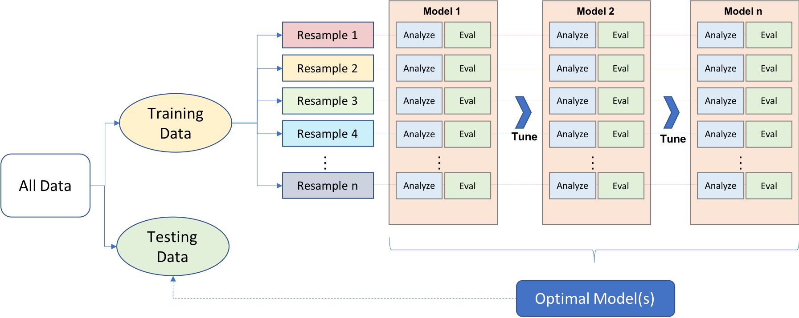
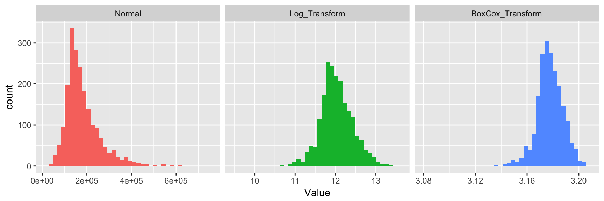
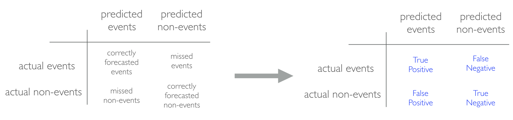

# (PART) Supervised Learning {-} 

# Preparing for Supervised Machine Learning {#regression-performance}




Machine learning is a very iterative process.  If performed and interpreted correctly, we can have great confidence in our outcomes. If not, the results will be useless. Approaching machine learning correctly means approaching it strategically by spending our data wisely on learning and validation procedures, properly pre-processing variables, minimizing data leakage, tuning hyperparameters, and assessing model performance. Before introducing specific algorithms, this chapter introduces concepts that are commonly required in the supervised machine learning process and that you'll see briskly covered in each chapter. 


## Prerequisites {#reg_perf_prereq}

This chapter leverages the following packages.


```r
library(rsample)
library(caret)
library(h2o)
library(dplyr)

# turn off progress bars
h2o.no_progress()

# launch h2o
h2o.init()
##  Connection successful!
## 
## R is connected to the H2O cluster: 
##     H2O cluster uptime:         6 minutes 25 seconds 
##     H2O cluster timezone:       America/New_York 
##     H2O data parsing timezone:  UTC 
##     H2O cluster version:        3.18.0.11 
##     H2O cluster version age:    2 months and 14 days  
##     H2O cluster name:           H2O_started_from_R_bradboehmke_qnx795 
##     H2O cluster total nodes:    1 
##     H2O cluster total memory:   1.58 GB 
##     H2O cluster total cores:    4 
##     H2O cluster allowed cores:  4 
##     H2O cluster healthy:        TRUE 
##     H2O Connection ip:          localhost 
##     H2O Connection port:        54321 
##     H2O Connection proxy:       NA 
##     H2O Internal Security:      FALSE 
##     H2O API Extensions:         XGBoost, Algos, AutoML, Core V3, Core V4 
##     R Version:                  R version 3.5.1 (2018-07-02)
```

To illustrate some of the concepts, we will use the Ames Housing data and employee attrition data introduced in Chapter \@ref(intro).  Throughout this book, I'll demonstrate approaches with regular data frames.  However, since many of the supervised machine learning chapters leverage the __h2o__ package, we'll also show how to do some of the tasks with H2O objects.  This requires your data to be in an H2O object, which you can convert any data frame easily with `as.h2o`.  

<div class="rmdwarning">
<p>If you try to convert the original <code>rsample::attrition</code> data set to an H2O object an error will occur. This is because several variables are <em>ordered factors</em> and H2O has no way of handling this data type. Consequently, you must convert any ordered factors to unordered.</p>
</div>


```r
# ames data
ames <- AmesHousing::make_ames()
ames.h2o <- as.h2o(ames)

# attrition data
churn <- rsample::attrition %>% 
  mutate_if(is.ordered, factor, ordered = FALSE)
churn.h2o <- as.h2o(churn)
```


## Data splitting {#reg_perf_split}

### Spending our data wisely

A major goal of the machine learning process is to find an algorithm $f(x)$ that most accurately predicts future values ($y$) based on a set of inputs ($x$).  In other words, we want an algorithm that not only fits well to our past data, but more importantly, one that predicts a future outcome accurately.  This is called the ___generalizability___ of our algorithm.  How we _"spend"_ our data will help us understand how well our algorithm generalizes to unseen data.  

To provide an accurate understanding of the generalizability of our final optimal model, we split our data into training and test data sets:

*  __Training Set__: these data are used to train our algorithms and tune hyper-parameters.
*  __Test Set__: having chosen a final model, these data are used to estimate its prediction error (generalization error). These data should _not be used during model training!_

<div class="figure" style="text-align: center">

<p class="caption">(\#fig:unnamed-chunk-2)Splitting data into training and test sets.</p>
</div>

Given a fixed amount of data, typical recommendations for splitting your data into training-testing splits include 60% (training) - 40% (testing), 70%-30%, or 80%-20%. Generally speaking, these are appropriate guidelines to follow; however, it is good to keep in mind that as your overall data set gets smaller,

* spending too much in training ($>80\%$) won't allow us to get a good assessment of predictive performance.  We may find a model that fits the training data very well, but is not generalizable (overfitting),
* sometimes too much spent in testing ($>40\%$) won't allow us to get a good assessment of model parameters

In today's data-rich environment, typically, we are not lacking in the quantity of observations, so a 70-30 split is often sufficient.  The two most common ways of splitting data include ___simple random sampling___ and ___stratified sampling___.


### Simple random sampling

The simplest way to split the data into training and test sets is to take a simple random sample. This does not control for any data attributes, such as the percentage of data represented in your response variable ($y$). There are multiple ways to split our data.  Here we show four options to produce a 70-30 split (note that setting the seed value allows you to reproduce your randomized splits):

<div class="rmdnote">
<p>Sampling is a random process so setting the random number generator with a common seed allows for reproducible results. Throughout this book I will use the number <em>123</em> often for reproducibility but the number itself has no special meaning.</p>
</div>


```r
# base R
set.seed(123)
index_1 <- sample(1:nrow(ames), round(nrow(ames) * 0.7))
train_1 <- ames[index_1, ]
test_1  <- ames[-index_1, ]

# caret package
set.seed(123)
index_2 <- createDataPartition(ames$Sale_Price, p = 0.7, list = FALSE)
train_2 <- ames[index_2, ]
test_2  <- ames[-index_2, ]

# rsample package
set.seed(123)
split_1  <- initial_split(ames, prop = 0.7)
train_3  <- training(split_1)
test_3   <- testing(split_1)

# h2o package
split_2 <- h2o.splitFrame(ames.h2o, ratios = 0.7, seed = 123)
train_4 <- split_2[[1]]
test_4  <- split_2[[2]]
```

Since this sampling approach will randomly sample across the distribution of $y$ (`Sale_Price` in our example), you will typically result in a similar distribution between your training and test sets as illustrated below.

<div class="figure" style="text-align: center">

<p class="caption">(\#fig:distributions)Training (black) vs. test (red) distribution.</p>
</div>


### Stratified sampling

However, if we want to explicitly control our sampling so that our training and test sets have similar $y$ distributions, we can use stratified sampling.  This is more common with classification problems where the reponse variable may be imbalanced (90% of observations with response "Yes" and 10% with response "No"). However, we can also apply to regression problems for data sets that have a small sample size and where the response variable deviates strongly from normality.  With a continuous response variable, stratified sampling will break $y$ down into quantiles and randomly sample from each quantile.  Consequently, this will help ensure a balanced representation of the response distribution in both the training and test sets.

The easiest way to perform stratified sampling on a response variable is to use the __rsample__ package, where you specify the response variable to `strata`fy. The following illustrates that in our original employee attrition data we have an imbalanced response (No: 84%, Yes: 16%). By enforcing stratified sampling both our training and testing sets have approximately equal response distributions. 


```r
# orginal response distribution
table(churn$Attrition) %>% prop.table()
## 
##        No       Yes 
## 0.8387755 0.1612245

# stratified sampling with the rsample package
set.seed(123)
split_strat  <- initial_split(churn, prop = 0.7, strata = "Attrition")
train_strat  <- training(split_strat)
test_strat   <- testing(split_strat)

# consistent response ratio between train & test
table(train_strat$Attrition) %>% prop.table()
## 
##       No      Yes 
## 0.838835 0.161165
table(test_strat$Attrition) %>% prop.table()
## 
##        No       Yes 
## 0.8386364 0.1613636
```


## Feature engineering {#reg_perf_feat}

___Feature engineering___ generally refers to the process of adding, deleting, and transforming the variables to be applied to your machine learning algorithms.  Feature engineering is a significant process and requires you to spend substantial time understanding your data...or as Leo Breiman said _"live with your data before you plunge into modeling."_  

Although this book primarily focuses on applying machine learning algorithms, feature engineering can make or break an algorithm's predictive ability. We will not cover all the potential ways of implementing feature engineering; however, we will cover a few fundamental pre-processing tasks that can significantly improve modeling performance. To learn more about feature engineering check out [Feature Engineering for Machine Learning](http://shop.oreilly.com/product/0636920049081.do) by @zheng2018feature and Max Kuhn's upcoming book [Feature Engineering and Selection: A Practical Approach for Predictive Models](http://www.feat.engineering/).

### Response Transformation

Although not a requirement, normalizing the distribution of the response variable by using a _transformation_ can lead to a big improvement, especially for parametric models. As we saw in the data splitting section, our response variable `Sale_Price` is right skewed.  


```r
ggplot(train_1, aes(x = Sale_Price)) + 
  geom_density(trim = TRUE) + 
  geom_density(data = test_1, trim = TRUE, col = "red")
```

<div class="figure" style="text-align: center">

<p class="caption">(\#fig:skewedresponse)Right skewed response variable.</p>
</div>


To normalize, we have a few options:

__Option 1__: normalize with a log transformation.  This will transform most right skewed distributions to be approximately normal.


```r
# log transformation
train_log_y <- log(train_1$Sale_Price)
test_log_y  <- log(test_1$Sale_Price)
```

If your reponse has negative values then a log transformation will produce `NaN`s.  If these negative values are small (between -0.99 and 0) then you can apply `log1p`, which adds 1 to the value prior to applying a log transformation. If your data consists of negative equal to or less than -1, use the Yeo Johnson transformation mentioned next.


```r
log(-.5)
## [1] NaN
log1p(-.5)
## [1] -0.6931472
```


__Option 2__: use a Box Cox transformation. A Box Cox transformation is more flexible and will find the transformation from a family of [power transforms](https://en.wikipedia.org/wiki/Power_transform#Box%E2%80%93Cox_transformation) that will transform the variable as close as possible to a normal distribution.  

<div class="rmdwarning">
<p>Be sure to compute the <code>lambda</code> on the training set and apply that same <code>lambda</code> to both the training and test set to minimize data leakage.</p>
</div>


```r
# Box Cox transformation
lambda  <- forecast::BoxCox.lambda(train_1$Sale_Price)
train_bc_y <- forecast::BoxCox(train_1$Sale_Price, lambda)
test_bc_y  <- forecast::BoxCox(test_1$Sale_Price, lambda)
```

We can see that in this example, the log transformation and Box Cox transformation both do about equally well in transforming our reponse variable to be normally distributed.

<div class="figure" style="text-align: center">

<p class="caption">(\#fig:unnamed-chunk-5)Response variable transformations.</p>
</div>

Note that when you model with a transformed response variable, your predictions will also be in the transformed value.  You will likely want to re-transform your predicted values back to their normal state so that decision-makers can interpret the results.  The following code can do this for you:


```r
# log transform a value
y <- log(10)

# re-transforming the log-transformed value
exp(y)
## [1] 10

# Box Cox transform a value
y <- forecast::BoxCox(10, lambda)

# Inverse Box Cox function
inv_box_cox <- function(x, lambda) {
  if (lambda == 0) exp(x) else (lambda*x + 1)^(1/lambda) 
}

# re-transforming the Box Cox-transformed value
inv_box_cox(y, lambda)
## [1] 10
## attr(,"lambda")
## [1] -0.3067918
```

<div class="rmdtip">
<p>If your response has negative values, you can use the Yeo-Johnson transformation. To apply, use <code>car::powerTransform</code> to identify the lambda, <code>car::yjPower</code> to apply the transformation, and <code>VGAM::yeo.johnson</code> to apply the transformation and/or the inverse transformation.</p>
</div>

### Predictor Transformation

### One-hot encoding

Many models require all predictor variables to be numeric.  Consequently, we need to transform any categorical variables into numeric representations so that these algorithms can compute.  Some packages automate this process (i.e. `h2o`, `glm`, `caret`) while others do not (i.e. `glmnet`, `keras`).  Furthermore, there are many ways to encode categorical variables as numeric representations (i.e. one-hot, ordinal, binary, sum, Helmert).

The most common is referred to as one-hot encoding, where we transpose our categorical variables so that each level of the feature is represented as a boolean value.  For example, one-hot encoding variable `x` in the following:


 id  x  
---  ---
  1  a  
  2  c  
  3  b  
  4  c  
  5  c  
  6  a  
  7  b  
  8  c  

results in the following representation:


 id   x.a   x.b   x.c
---  ----  ----  ----
  1     1     0     0
  2     0     0     1
  3     0     1     0
  4     0     0     1
  5     0     0     1
  6     1     0     0
  7     0     1     0
  8     0     0     1

This is called less than _full rank_ encoding where we retain all variables for each level of `x`.  However, this creates perfect collinearity which causes problems with some machine learning algorithms (i.e. generalized regression models, neural networks).  Alternatively, we can create full-rank one-hot encoding by dropping one of the levels (level `a` has been dropped):


 id   x.b   x.c
---  ----  ----
  1     0     0
  2     0     1
  3     1     0
  4     0     1
  5     0     1
  6     0     0
  7     1     0
  8     0     1

If you needed to manually implement one-hot encoding yourself you can with `caret::dummyVars`.  Sometimes you may have a feature level with very few observations and all these observations show up in the test set but not the training set.  The benefit of using `dummyVars` on the full data set and then applying the result to both the train and test data sets is that it will guarantee that the same features are represented in both the train and test data.


```r
# full rank one-hot encode - recommended for generalized linear models and
# neural networks
full_rank  <- dummyVars( ~ ., data = ames, fullRank = TRUE)
train_oh   <- predict(full_rank, train_1)
test_oh    <- predict(full_rank, test_1)

# less than full rank --> dummy encoding
dummy    <- dummyVars( ~ ., data = ames, fullRank = FALSE)
train_oh <- predict(dummy, train_1)
test_oh  <- predict(dummy, test_1)
```


Two things to note:

* since one-hot encoding adds new features it can significantly increase the dimensionality of our data.  If you have a data set with many categorical variables and those categorical variables in turn have many unique levels, the number of features can explode.  In these cases you may want to explore ordinal encoding of your data.

* if using `h2o` you do not need to explicity encode your categorical predictor variables but you can override the default encoding.  This can be considered a tuning parameter as some encoding approaches will improve modeling accuracy over other encodings.  See the encoding options for `h2o` [here](http://docs.h2o.ai/h2o/latest-stable/h2o-docs/data-science/algo-params/categorical_encoding.html).  

### Standardizing

Some models (_K_-NN, SVMs, PLS, neural networks) require that the predictor variables have the same units. **Centering** and **scaling** can be used for this purpose and is often referred to as ___standardizing___ the features.  Standardizing numeric variables results in zero mean and unit variance, which provides a common comparable unit of measure across all the variables.

Some packages have built-in arguments (i.e. `h2o`, `caret`) to standardize and some do not (i.e. `glm`, `keras`). If you need to manually standardize your variables you can use the `preProcess` function provided by the `caret` package.  For example, here we center and scale our Ames predictor variables.

<div class="rmdwarning">
<p>It is important that you standardize the test data based on the training mean and variance values of each feature. This minimizes data leakage.</p>
</div>


```r
# identify only the predictor variables
features <- setdiff(names(train_1), "Sale_Price")

# pre-process estimation based on training features
pre_process <- preProcess(
  x      = train_1[, features],
  method = c("center", "scale")    
  )

# apply to both training & test
train_x <- predict(pre_process, train_1[, features])
test_x  <- predict(pre_process, test_1[, features])
```


### Alternative Feature Transformation

There are some alternative transformations that you can perform:

* Normalizing the predictor variables with a Box Cox transformation can improve parametric model performance.

* Collapsing highly correlated variables with PCA can reduce the number of features and increase the stability of generalize linear models.  However, this reduces the amount of information at your disposal and we show you how to use regularization as a better alternative to PCA.  

* Removing near-zero or zero variance variables.  Variables with vary little variance tend to not improve model performance and can be removed.

<div class="rmdtip">
<p><code>preProcess</code> provides many other transformation options which you can read more about <a href="https://topepo.github.io/caret/pre-processing.html">here</a>.</p>
</div>


For example, the following normalizes predictors with a Box Cox transformation, center and scales continuous variables, performs principal component analysis to reduce the predictor dimensions, and removes predictors with near zero variance.


```r
# identify only the predictor variables
features <- setdiff(names(train_1), "Sale_Price")

# pre-process estimation based on training features
pre_process <- preProcess(
  x      = train_1[, features],
  method = c("BoxCox", "center", "scale", "pca", "nzv")    
  )

# apply to both training & test
train_x <- predict(pre_process, train_1[, features])
test_x  <- predict(pre_process, test_1[, features])
```


## Basic model formulation {#reg_perf_model}

There are ___many___ packages to perform machine learning and there are almost always more than one to perform each algorithm (i.e. there are over 20 packages to perform random forests).  There are pros and cons to each package; some may be more computationally efficient while others may have more hyperparameter tuning options.  Future chapters will expose you to many of the packages and algorithms that perform and scale best to most organization's problems and data sets.  Just realize there are *more ways than one to skin a* 🙀.

For example, these three functions will all produce the same linear regression model output.


```r
lm.lm    <- lm(Sale_Price ~ ., data = train_1)
lm.glm   <- glm(Sale_Price ~ ., data = train_1, family = gaussian)
lm.caret <- train(Sale_Price ~ ., data = train_1, method = "lm")
```


One thing you will notice throughout this guide is that we can specify our model formulation in different ways.  In the above examples we use the _model formulation_ (`Sale_Price ~ .` which says explain `Sale_Price` based on all features) approach.  Alternative approaches, which you will see more often throughout this guide, are the matrix formulation and variable name specification approaches.

_Matrix formulation_ requires that we separate our response variable from our features.  For example, in the regularization section we'll use `glmnet` which requires our features (`x`) and response (`y`) variable to be specified separately:


```r
# get feature names
features <- setdiff(names(train_1), "Sale_Price")

# create feature and response set
train_x <- train_1[, features]
train_y <- train_1$Sale_Price

# example of matrix formulation
glmnet.m1 <- glmnet(x = train_x, y = train_y)
```

Alternatively, `h2o` uses _variable name specification_ where we provide all the data combined in one `training_frame` but we specify the features and response with character strings:


```r
# create variable names and h2o training frame
y <- "Sale_Price"
x <- setdiff(names(train_1), y)
train.h2o <- as.h2o(train_1)

# example of variable name specification
h2o.m1 <- h2o.glm(x = x, y = y, training_frame = train.h2o)
```


## Model tuning {#reg_perf_tune}

Hyperparameters control the level of model complexity.  Some algorithms have many tuning parameters while others have only one or two.  Tuning can be a good thing as it allows us to transform our model to better align with patterns within our data. For example, the simple illustration below shows how the more flexible model aligns more closely to the data than the fixed linear model.

<div class="figure" style="text-align: center">

<p class="caption">(\#fig:unnamed-chunk-14)Tuning allows for more flexible patterns to be fit.</p>
</div>

However, highly tunable models can also be dangerous because they allow us to overfit our model to the training data, which will not generalize well to future unseen data.

<div class="figure" style="text-align: center">

<p class="caption">(\#fig:unnamed-chunk-15)Highly tunable models can overfit if we are not careful.</p>
</div>


Throughout this guide we will demonstrate how to tune the different parameters for each model.  One way to performing hyperparameter tuning is to fiddle with hyperparameters manually until you find a great combination of hyperparameter values that result in high predictive accuracy. However, this would be very tedious work. An alternative approach is to perform a ___grid search___. A grid search is an automated approach to searching across many combinations of hyperparameter values. Throughout this guide you will be exposed to different approaches to performing grid searches.


## Cross Validation for Generalization {#cv}

Our goal is to not only find a model that performs well on training data but to find one that performs well on _future unseen data_.  So although we can tune our model to reduce some error metric to near zero on our training data, this may not generalize well to future unseen data.  Consequently, our goal is to find a model and its hyperparameters that will minimize error on held-out data.

Let's go back to this image...

<div class="figure" style="text-align: center">

<p class="caption">(\#fig:unnamed-chunk-16)Bias versus variance.</p>
</div>

The model on the left is considered rigid and consistent.  If we provided it a new training sample with slightly different values, the model would not change much, if at all.  Although it is consistent, the model does not accurately capture the underlying relationship.  This is considered a model with high ___bias___.

The model on the right is far more inconsistent.  Even with small changes to our training sample, this model would likely change significantly.  This is considered a model with high ___variance___.

The model in the middle balances the two and, likely, will minimize the error on future unseen data compared to the high bias and high variance models.  This is our goal.

<div class="figure" style="text-align: center">

<p class="caption">(\#fig:unnamed-chunk-17)Bias-variance tradeoff.</p>
</div>

To find the model that balances the ___bias-variance tradeoff___, we search for a model that minimizes a *k*-fold cross-validation error metric.  *k*-fold cross-validation is a resampling method that randomly divides the training data into *k* groups (aka folds) of approximately equal size. The model is fit on $k-1$ folds and then the held-out validation fold is used to compute the error.  This procedure is repeated *k* times; each time, a different group of observations is treated as the validation set. This process results in *k* estimates of the test error ($\epsilon_1, \epsilon_2, \dots, \epsilon_k$). Thus, the _k_-fold CV estimate is computed by averaging these values, which provides us with an approximation of the error to expect on unseen data.

<div class="figure" style="text-align: center">

<p class="caption">(\#fig:unnamed-chunk-18)Illustration of the k-fold cross validation process.</p>
</div>

The algorithms we cover in this guide all have built-in cross validation capabilities.  One typically uses a 5 or 10 fold CV ($k = 5$ or $k = 10$).  For example, `h2o` implements CV with the `nfolds` argument:


```r
# example of 10 fold CV in h2o
h2o.cv <- h2o.glm(
  x = x, 
  y = y, 
  training_frame = train.h2o,
  nfolds = 10
  )
```


## Model evaluation {#reg_perf_eval}

This leads us to our final topic, error metrics to evaluate performance.  There are several metrics we can choose from to assess the error of a supervised machine learning model.  The most common include:

### Regression models

* __MSE__: Mean squared error is the average of the squared error ($MSE = \frac{1}{n} \sum^n_{i=1}(y_i - \hat y_i)^2$). The squared component results in larger errors having larger penalties.  This (along with RMSE) is the most common error metric to use. __Objective: minimize__

* __RMSE__: Root mean squared error.  This simply takes the square root of the MSE metric ($RMSE = \sqrt{\frac{1}{n} \sum^n_{i=1}(y_i - \hat y_i)^2}$) so that your error is in the same units as your response variable. If your response variable units are dollars, the units of MSE are dollars-squared, but the RMSE will be in dollars. __Objective: minimize__

* __Deviance__: Short for mean residual deviance. In essence, it provides a measure of _goodness-of-fit_ of the model being evaluated when compared to the null model (intercept only).  If the response variable distribution is gaussian, then it is equal to MSE.  When not, it usually gives a more useful estimate of error. __Objective: minimize__

* __MAE__: Mean absolute error. Similar to MSE but rather than squaring, it just takes the mean absolute difference between the actual and predicted values ($MAE = \frac{1}{n} \sum^n_{i=1}(\vert y_i - \hat y_i \vert)$). __Objective: minimize__

* __RMSLE__: Root mean squared logarithmic error. Similiar to RMSE but it performs a log() on the actual and predicted values prior to computing the difference ($RMSLE = \sqrt{\frac{1}{n} \sum^n_{i=1}(log(y_i + 1) - log(\hat y_i + 1))^2}$). When your response variable has a wide range of values, large repsonse values with large errors can dominate the MSE/RMSE metric. RMSLE minimizes this impact so that small response values with large errors can have just as meaningful of an impact as large response values with large errors. __Objective: minimize__

* __$R^2$__: This is a popular metric that represents the proportion of the variance in the dependent variable that is predictable from the independent variable. Unfortunately, it has several limitations. For example, two models built from two different data sets could have the exact same RMSE but if one has less variability in the response variable then it would have a lower $R^2$ than the other. You should not place too much emphasis on this metric. __Objective: maximize__


Most models we assess in this guide will report most, if not all, of these metrics.  We will emphasize MSE and RMSE but its good to realize that certain situations warrant emphasis on some more than others.


### Classification models

* __Misclassification__: This is the overall error.  For example, say you are predicting 3 classes ( _high_, _medium_, _low_ ) and each class has 25, 30, 35 observations respectively (90 observations total). If you misclassify 3 observations of class _high_, 6 of class _medium_, and 4 of class _low_, then you misclassified 13 out of 90 observations resulting in a 14% misclassification rate. __Objective: minimize__

* __Mean per class error__: This is the average error rate for each class. For the above example, this would be the mean of $\frac{3}{25}, \frac{6}{30}, \frac{4}{35}$, which is 12%. If your classes are balanced this will be identical to misclassification. __Objective: minimize__

* __MSE__: Mean squared error. Computes the distance from 1.0 to the probability suggested. So, say we have three classes, A, B, and C, and your model predicts a probabilty of 0.91 for A, 0.07 for B, and 0.02 for C. If the correct answer was A the $MSE = 0.09^2 = 0.0081$, if it is B $MSE = 0.93^2 = 0.8649$, if it is C $MSE = 0.98^2 = 0.9604$. The squared component results in large differences in probabilities for the true class having larger penalties. __Objective: minimize__

* __Cross-entropy (aka Log Loss or Deviance)__: Similar to MSE but it incorporates a log of the predicted probability multiplied by the true class.  Consequently, this metric disproportionately punishes predictions where we predict a small probability for the true class, which is another way of saying having high confidence in the wrong answer is really bad. __Objective: minimize__

* __Gini index__: Mainly used with tree-based methods and commonly referred to as a measure of _purity_ where a small value indicates that a node contains predominantly observations from a single class. __Objective: minimize__


When applying classification models, we often use a _confusion matrix_ to evaluate certain performance measures. A confusion matrix is simply a matrix that compares actual categorical levels (or events) to the predicted categorical levels. When we predict the right level, we refer to this as a _true positive_.  However, if we predict a level or event that did not happen this is called a _false positive_ (i.e. we predicted a customer would redeem a coupon and they did not). Alternatively, when we do not predict a level or event and it does happen that this is called a _false negative_ (i.e. a customer that we did not predict to redeem a coupon does). 

<div class="figure" style="text-align: center">

<p class="caption">(\#fig:confusion-matrix)Confusion matrix.</p>
</div>

We can extract different levels of performance from these measures.  For example, given the classification matrix below we can assess the following:

* __Accuracy__: Overall, how often is the classifier correct? Opposite of misclassification above. Example: $\frac{TP + TN}{total} = \frac{100+50}{165} = 0.91$.  __Objective: maximize__ 

* __Precision__: How accurately does the classifier predict events? This metric is concerned with maximizing the true positives to false positive ratio. In other words, for the number of predictions that we made, how many were correct?  Example: $\frac{TP}{TP + FP} = \frac{100}{100+10} = 0.91$.  __Objective: maximize__

* __Sensitivity (aka recall)__: How accurately does the classifier classify actual events? This metric is concerned with maximizing the true positives to false negatives ratio. In other words, for the events that occurred, how many did we predict?  Example: $\frac{TP}{TP + FN} = \frac{100}{100+5} = 0.95$.  __Objective: maximize__

* __Specificity__: How accurately does the classifier classify actual non-events? Example: $\frac{TN}{TN + FP} = \frac{50}{50+10} = 0.83$.  __Objective: maximize__

<div class="figure" style="text-align: center">

<p class="caption">(\#fig:confusion-matrix2)Example confusion matrix.</p>
</div>

* __AUC__: Area under the curve. A good classifier will have high precision and sensitivity.  This means the classifier does well when it predicts an event will and will not occur, which minimizes false positives and false negatives.  To capture this balance, we often use a ROC curve that plots the false positive rate along the x-axis and the true positive rate along the y-axis.  A line that is diagonal from the lower left corner to the upper right corner represents a random guess. The higher the line is in the upper left-hand corner, the better.  AUC computes the area under this curve. __Objective: maximize__

<div class="figure" style="text-align: center">

<p class="caption">(\#fig:roc)ROC curve.</p>
</div>

