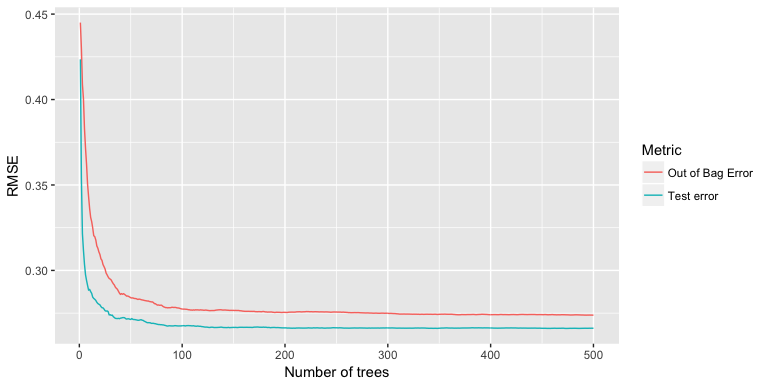
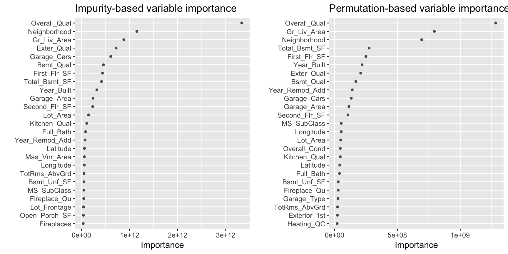
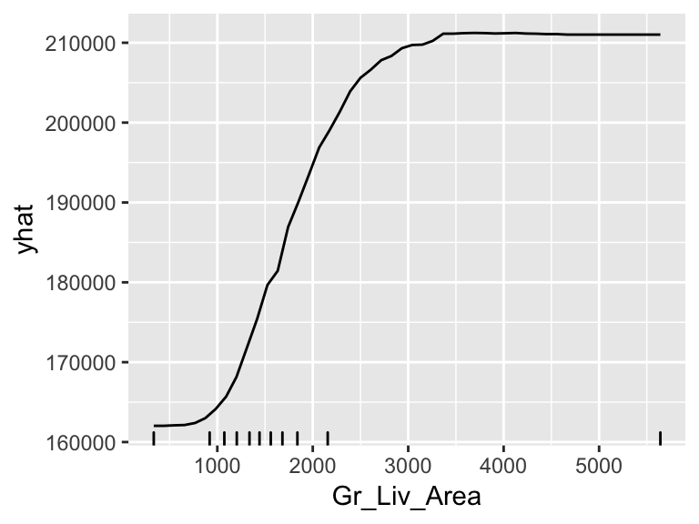
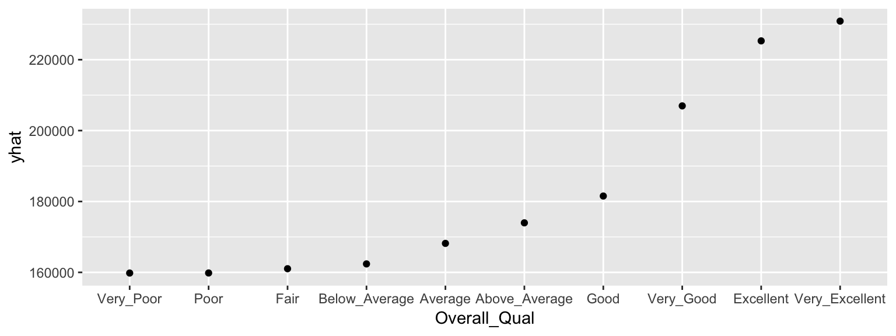
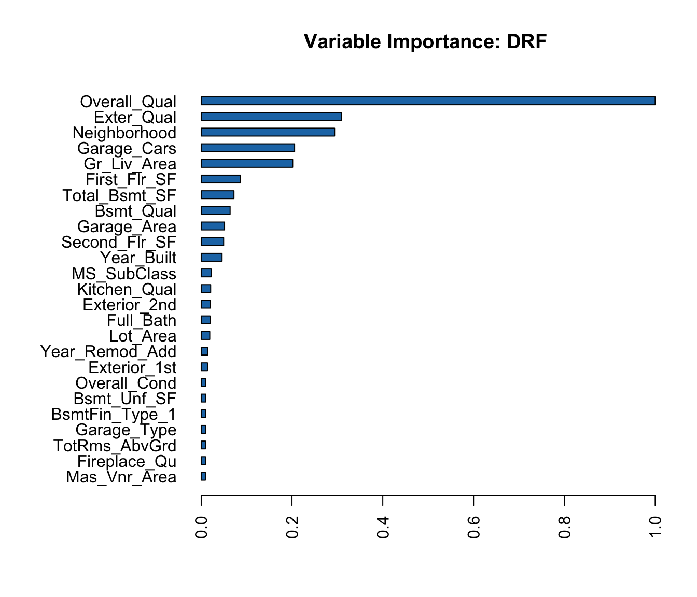
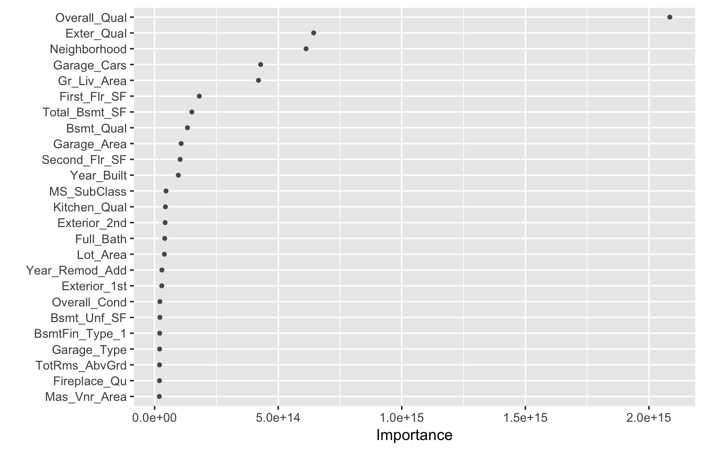
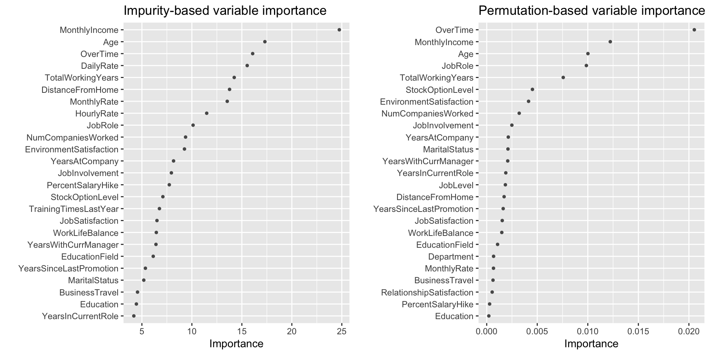
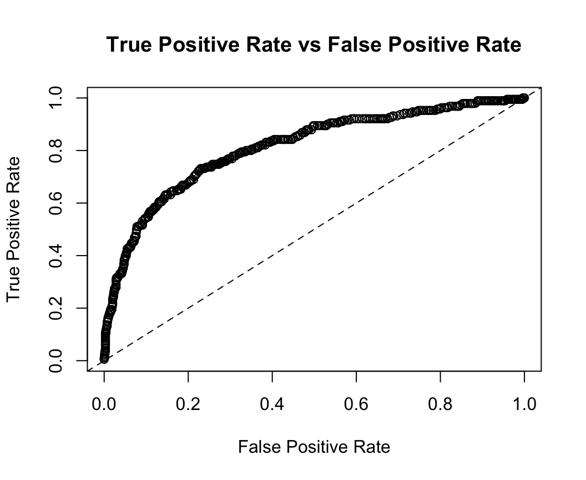
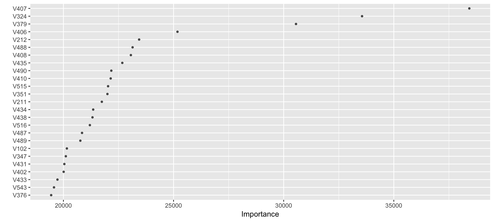

# Random Forest {#random-forest}


___Random forests___ are a modification of decision trees and bagging that builds a large collection of *de-correlated* trees to reduce overfitting (aka variance). They have become a very popular "out-of-the-box" learning algorithm that enjoys good predictive performance and easy hyperparameter tuning. Many modern implementations of random forests algorithms exist; however, Leo Breiman's algorithm [@breiman2001random] has largely become the authoritative procedure. This chapter will cover the fundamentals of random forests.

## Prerequisites {#rf-requirements}

<div class="rmdwarning">
<p>Any tutorial on random forests (RF) should also include a review of decision trees, as these are models that are ensembled together to create the random forest model – or put another way, the “trees that comprise the forest.” Much of the complexity and detail of the random forest algorithm occurs within the individual decision trees and therefore it’s important to understand decision trees to understand the RF algorithm as a whole. Therefore, before proceeding, it is recommended that you read through <a href="http://uc-r.github.io/regression_trees" class="uri">http://uc-r.github.io/regression_trees</a> prior to continuing.</p>
</div>

This chapter leverages the following packages. Some of these packages play a supporting role; however, the emphasis is on how to implement random forests with the `ranger` [@R-ranger] and `h2o` packages.


```r
library(rsample)  # data splitting 
library(ranger)   # a fast c++ implementation of the random forest algorithm
library(h2o)      # a java-based platform
library(vip)      # visualize feature importance 
library(pdp)      # visualize feature effects
library(ggplot2)  # supports visualization
library(dplyr)    # basic data transformation
```


## Advantages & Disadvantages {#rf-proscons}

__Advantages:__

- Typically have very good performance.
- Remarkably good "out-of-the box" - very little tuning required.
- Built-in validation set - don't need to sacrifice data for extra validation.
- Does not overfit.
- No data pre-processing required - often works great with categorical and numerical values as is.
- Robust to outliers.
- Handles missing data - imputation not required.
- Provide automatic feature selection.

__Disadvantages:__

- Can become slow on large data sets.
- Although accurate, often cannot compete with the accuracy of advanced boosting algorithms.
- Less interpretable although this is easily addressed with various tools (variable importance, partial dependence plots, LIME, etc.).


## The Idea {#rf-idea}

Random forests are built on the same fundamental principles as decision trees and bagging (check out this [tutorial](http://uc-r.github.io/regression_trees) if you need a refresher on these techniques).  Bagging trees introduces a random component in to the tree building process that reduces the variance of a single tree's prediction and improves predictive performance.  However, the trees in bagging are not completely independent of each other since all the original predictors are considered at every split of every tree.  Rather, trees from different bootstrap samples typically have similar structure to each other (especially at the top of the tree) due to underlying relationships.

For example, if we create six decision trees with different bootstrapped samples of the [Boston housing data]((http://lib.stat.cmu.edu/datasets/boston)) [@harrison1978hedonic], we see that the top of the trees all have a very similar structure.  Although there are 15 predictor variables to split on, all six trees have both `lstat` and `rm` variables driving the first few splits.  


<div class="figure" style="text-align: center">

<p class="caption">(\#fig:boston-trees)Six decision trees based on different bootstrap samples.</p>
</div>

This characteristic is known as *tree correlation* and prevents bagging from optimally reducing variance of the predictive values.  In order to reduce variance further, we need to minimize the amount of correlation between the trees. This can be achieved by injecting more randomness into the tree-growing process.  Random forests achieve this in two ways:

1. __Bootstrap__: similar to bagging, each tree is grown to a bootstrap resampled data set, which makes them different and _somewhat_ decorrelates them.
2. __Split-variable randomization__: each time a split is to be performed, the search for the split variable is limited to a random subset of *m* of the *p* variables.  Typical default values are $m = \frac{p}{3}$ (regression trees) and $m = \sqrt{p}$ (classification trees) but this should be considered a tuning parameter.  When $m = p$, the randomization amounts to using only step 1 and is the same as *bagging*.

The basic algorithm for a regression or classification random forest can be generalized to the following:

```r
1.  Given training data set
2.  Select number of trees to build (ntrees)
3.  for i = 1 to ntrees do
4.  |  Generate a bootstrap sample of the original data
5.  |  Grow a regression or classification tree to the bootstrapped data
6.  |  for each split do
7.  |  | Select m variables at random from all p variables
8.  |  | Pick the best variable/split-point among the m
9.  |  | Split the node into two child nodes
10. |  end
11. | Use typical tree model stopping criteria to determine when a tree is complete (but do not prune)
12. end
```

Since the algorithm randomly selects a bootstrap sample to train on ___and___ predictors to use at each split, tree correlation will be lessened beyond bagged trees.

### OOB error vs. test set error {#rf-oob}

Similar to bagging, a natural benefit of the bootstrap resampling process is that random forests have an out-of-bag (OOB) sample that provides an efficient and reasonable approximation of the test error.  This provides a built-in validation set without any extra work on your part, and you do not need to sacrifice any of your training data to use for validation. This makes identifying the number of trees required to stablize the error rate during tuning more efficient; however, as illustrated below some difference between the OOB error and test error are expected.

<div class="figure" style="text-align: center">

<p class="caption">(\#fig:unnamed-chunk-2)Random forest out-of-bag error versus validation error.</p>
</div>


Furthermore, many packages do not keep track of which observations were part of the OOB sample for a given tree and which were not.  If you are comparing multiple models to one-another, you'd want to score each on the same validation set to compare performance. Also, although technically it is possible to compute certain metrics such as root mean squared logarithmic error (RMSLE) on the OOB sample, it is not built in to all packages.  So if you are looking to compare multiple models or use a slightly less traditional loss function you will likely want to still perform cross validation.


### Tuning {#rf-tune}

Random forests are fairly easy to tune since there are only a handful of tuning parameters.  Typically, the primary concern when starting out is tuning the number of candidate variables to select from at each split.  However, there are a few additional hyperparameters that we should be aware of. Although the argument names may differ across packages, these hyperparameters should be present: 

- __Number of trees___:  We want enough trees to stabalize the error but using too many trees is unncessarily inefficient, especially when using large data sets.
- __Number of variables to randomly sample as candidates at each split__ (often referred to as `mtry`): When `mtry` $=p$ the model equates to bagging.  When `mtry` $=1$ the split variable is completely random, so all variables get a chance but can lead to overly biased results. A common suggestion is to start with 5 values evenly spaced across the range from 2 to *p*.
- __Sample size__: the number of samples to train on. The default value is 63.25% of the training set since this is the expected value of unique observations in the bootstrap sample.  Lower sample sizes can reduce the training time but may introduce more bias than necessary.  Increasing the sample size can increase performance but at the risk of overfitting because it introduces more variance. Typically, when tuning this parameter we stay near the 60-80% range.
- __Node size__: minimum number of samples within the terminal nodes. Controls the complexity of the trees.  Smaller node size allows for deeper, more complex trees and a larger node size results in shallower trees.  This is another bias-variance tradeoff where deeper trees introduce more variance (risk of overfitting) and shallower trees introduce more bias (risk of not fully capturing unique patters and relatonships in the data).
- __Number of terminal nodes__: Another way to control the complexity of the trees. More nodes equates to deeper, more complex trees and less nodes result in shallower trees.


### Package implementation {#rf-pkgs}

There are over 20 random forest packages in R.[^task]  The oldest and most well known implementation of the Random Forest algorithm in R is the `randomForest` package.  

<div class="rmdwarning">
<p><code>randomForest</code> is not a recommended package because as your data sets grow in size <code>randomForest</code> does not scale well (although you can parallelize with <code>foreach</code>). Instead, we recommend you use the <code>ranger</code> and <code>h2o</code> packages.</p>
</div>

Since `randomForest` does not scale well to many of the data set sizes that organizations analyze, we will demonstrate how to implement the random forest algorithm with two fast, efficient, and highly recommended packages:

* [`ranger`](https://github.com/imbs-hl/ranger): a C++ implementation of Brieman's random forest algorithm and particularly well suited for high dimensional data. The original paper describing `ranger` and providing benchmarking to other packages can be found [here](http://arxiv.org/pdf/1508.04409v1.pdf). Features include[^ledell]:
    - Classification, regression, probability estimation and survival forests are supported.
    - Multi-threaded capabilities for optimal speed.
    - Excellent speed and support for high-dimensional or wide data.
    - Not as fast for "tall & skinny" data (many rows, few columns).
    - GPL-3 licensed.
* [`h2o`](https://cran.r-project.org/web/packages/gamboostLSS/index.html): The `h2o` R package is a powerful and efficient java-based interface that allows for local and cluster-based deployment. It comes with a fairly comprehensive [online resource](http://docs.h2o.ai/h2o/latest-stable/h2o-docs/index.html) that includes methodology and code documentation along with tutorials. Features include:
    - Automated feature pre-processing (one-hot encode & standardization).
    - Built-in cross validation.
    - Built-in grid search capabilities.
    - Provides automatic early stopping for faster grid searches.
    - Supports the following distributions: "guassian", "binomial", "multinomial", "poisson", "gamma", "tweedie".
    - Uses histogram approximations of continuous variables for speedup on "long data" (many rows).
    - Distributed and parallelized computation on either a single node or a multi-node cluster.
    - Model export in plain Java code for deployment in production environments.


## Implementation: Regression {#rf-regression}

To illustrate various random forest concepts for a regression problem we will use the Ames, IA housing data, where our intent is to predict `Sale_Price`. 


```r
# Create training (70%) and test (30%) sets for the AmesHousing::make_ames() data.
# Use set.seed for reproducibility

set.seed(123)
ames_split <- initial_split(AmesHousing::make_ames(), prop = .7, strata = "Sale_Price")
ames_train <- training(ames_split)
ames_test  <- testing(ames_split)
```

<div class="rmdtip">
<p>Tree-based algorithms typically perform very well without preprocessing the data (i.e. one-hot encoding, normalizing, standardizing).</p>
</div>

### `ranger` {#ranger-regression}

#### Basic implementation {#ranger-regression-basic}

`ranger::ranger` uses the formula method for specifying our model.  Below we apply the default `ranger` model specifying to model `Sale_Price` as a function of all features in our data set.  The key arguments to the `ranger` call are:

* `formula`: formula specification
* `data`: training data
* `num.trees`: number of trees in the forest
* `mtry`: randomly selected predictor variables at each split. Default is $\texttt{floor}(\sqrt{\texttt{number of features}})$; however, for regression problems the preferred `mtry` to start with is $\texttt{floor}(\frac{\texttt{number of features}}{3}) = \texttt{floor}(\frac{92}{3}) = 30$
* `respect.unordered.factors`: specifies how to treat unordered factor variables. We recommend setting this to "order" for regression. See @esl, chapter 9.2.4 for details.
* `seed`: because this is a random algorithm, you will set the seed to get reproducible results

<div class="rmdnote">
<p>By default, <code>ranger</code> will provide the computation status and estimated remaining time; however, to reduce output in this tutorial this is turned off with <code>verbose = FALSE</code>.</p>
</div>

As the model results show, averaging across all 500 trees provides an OOB $MSE = 615848303$ ($RMSE \approx 24816$).


```r
# number of features
features <- setdiff(names(ames_train), "Sale_Price")

# perform basic random forest model
m1_ranger <- ranger(
  formula    = Sale_Price ~ ., 
  data       = ames_train, 
  num.trees  = 500,
  mtry       = floor(length(features) / 3),
  respect.unordered.factors = 'order',
  verbose    = FALSE,
  seed       = 123
  )

# look at results
m1_ranger
## Ranger result
## 
## Call:
##  ranger(formula = Sale_Price ~ ., data = ames_train, num.trees = 500,      mtry = floor(length(features)/3), respect.unordered.factors = "order",      verbose = FALSE, seed = 123) 
## 
## Type:                             Regression 
## Number of trees:                  500 
## Sample size:                      2054 
## Number of independent variables:  80 
## Mtry:                             26 
## Target node size:                 5 
## Variable importance mode:         none 
## Splitrule:                        variance 
## OOB prediction error (MSE):       615848303 
## R squared (OOB):                  0.9013317

# compute RMSE (RMSE = square root of MSE)
sqrt(m1_ranger$prediction.error)
## [1] 24816.29
```


One of the benefits of tree-based methods is they do not require preprocessing steps such as normalization and standardization of the response and/or predictor variables.  However, because these methods do not require these steps does not mean you should not assess their impact.  Sometimes normalizing and standardizing the data can improve performance.  In the following code we compare a basic random forest model on unprocessed data to one on processed data (normalized, standardized, and zero variance features removded).  


```r
# create validation set
set.seed(123)
split2 <- initial_split(ames_train, prop = .8, strata = "Sale_Price")
train_tran <- training(split2)
validation <- testing(split2)


#-------------------------Unprocessed variables-------------------------#

# number of features in unprocessed data
m <- length(setdiff(names(train_tran), "Sale_Price"))

# perform basic random forest model on unprocessed data
m1_ranger_unprocessed <- ranger(
  formula    = Sale_Price ~ ., 
  data       = train_tran, 
  num.trees  = 500,
  mtry       = m,
  respect.unordered.factors = 'order',
  verbose    = FALSE,
  seed       = 123
  )


#--------------------------Processed variables--------------------------#

# preprocess features
feature_process <- caret::preProcess(
  train_tran[, features],
  method = c("YeoJohnson", "center", "scale", "zv")
)

train_tran <- predict(feature_process, train_tran)

# preprocess response
train_tran$Sale_Price <- log(train_tran$Sale_Price) 

# number of features in processed data
m <- length(setdiff(names(train_tran), "Sale_Price"))

# perform basic random forest model on processed data
m1_ranger_processed <- ranger(
  formula    = Sale_Price ~ ., 
  data       = train_tran, 
  num.trees  = 500,
  mtry       = m,
  respect.unordered.factors = 'order',
  verbose    = FALSE,
  seed       = 123
  )
```

We can now apply each model to the validation set.  For the second (preprocessed) model, we re-transform our predicted values back to the normal units and we compute the RMSE for both.  Now we see that our original model on unpreprocessed data is performing just as well as, if not better than, the second model on the processed data.  


```r
# apply unpreprocessed model
m1_pred <- predict(m1_ranger_unprocessed, validation)
caret::RMSE(m1_pred$predictions, validation$Sale_Price)
## [1] 22302.02

# preprocess features
valid_tran <- predict(feature_process, validation)

# apply preprocessed model
m1_tran_pred <- predict(m1_ranger_processed, valid_tran)
m1_processed_pred <- expm1(m1_tran_pred$predictions)
caret::RMSE(m1_processed_pred, validation$Sale_Price)
## [1] 24281.47
```


#### Tuning {#ranger-regression-tune}

With the `ranger` function we can tune various hyperparameters mentioned in the general [tuning](#rf-tune) section.  For example, the following model adjusts:

* `num.trees`: increase number of trees to 750
* `mtry`: reduce number of predictor variables to randomly select at each split to 20
* `min.node.size`: reduce minimum node size to 3 (default is 5 for regression)
* `sample.fraction`: increase training set to 70%


```r
m2_ranger <- ranger(
  formula         = Sale_Price ~ ., 
  data            = ames_train, 
  num.trees       = 750,
  mtry            = 20,
  respect.unordered.factors = 'order',
  verbose         = FALSE,
  seed            = 123,
  min.node.size   = 3,
  sample.fraction = .70
  )

# RMSE
sqrt(m2_ranger$prediction.error)
## [1] 25298.61

# model results
m2_ranger
## Ranger result
## 
## Call:
##  ranger(formula = Sale_Price ~ ., data = ames_train, num.trees = 750,      mtry = 20, respect.unordered.factors = "order", verbose = FALSE,      seed = 123, min.node.size = 3, sample.fraction = 0.7) 
## 
## Type:                             Regression 
## Number of trees:                  750 
## Sample size:                      2054 
## Number of independent variables:  80 
## Mtry:                             20 
## Target node size:                 3 
## Variable importance mode:         none 
## Splitrule:                        variance 
## OOB prediction error (MSE):       640019634 
## R squared (OOB):                  0.8974591
```


We can continue to adjust these settings individually to identify the optimal combination; however, this becomes tedious when you want to explore a larger grid search.  To perform a larger grid search across several hyperparameters we’ll need to create a grid and loop through each hyperparameter combination and evaluate the model.  First we want to construct our grid of hyperparameters. We’re going to search across 80 different models with varying number of trees, `mtry`, minimum node size, and sample size.


```r
# hyperparameter grid search
hyper_grid <- expand.grid(
  num.trees  = seq(250, 500, 750),
  mtry       = seq(20, 40, by = 5),
  node_size  = seq(1, 10, by = 3),
  sample_size = c(.55, .632, .70, .80),
  OOB_RMSE   = 0
)

# total number of combinations
nrow(hyper_grid)
## [1] 80

# hyperparameter grid
head(hyper_grid)
##   num.trees mtry node_size sample_size OOB_RMSE
## 1       250   20         1        0.55        0
## 2       250   25         1        0.55        0
## 3       250   30         1        0.55        0
## 4       250   35         1        0.55        0
## 5       250   40         1        0.55        0
## 6       250   20         4        0.55        0
```

We can now loop through each hyperparameter combination. Note that we set the random number generator seed. This allows us to consistently sample the same observations for each sample size and make it more clear the impact that each change makes. 

<div class="rmdtip">
<p>This full grid search ran for about <strong>2.5</strong> minutes before completing. Larger grid searches like these can become time consuming as your data set increases in dimensions. The <code>h2o</code> package provides alternative approaches to search through larger grid spaces.</p>
</div>

Our OOB RMSE ranges between ~25021-26089. Our top 10 performing models all have RMSE values in the low 25000 range and the results show that we can use a smaller number of trees than the default and models with slighly larger sample size appear to perform best. At first glance, no definitive evidence suggests that altering `mtry` or `node_size` have a sizable impact.  


```r
for(i in 1:nrow(hyper_grid)) {
  
  # train model
  model <- ranger(
    formula         = Sale_Price ~ ., 
    data            = ames_train,
    respect.unordered.factors = 'order',
    seed            = 123,
    verbose         = FALSE,
    mtry            = hyper_grid$mtry[i],
    min.node.size   = hyper_grid$node_size[i],
    sample.fraction = hyper_grid$sample_size[i]
  )
  
  # add OOB error to grid
  hyper_grid$OOB_RMSE[i] <- sqrt(model$prediction.error)
}

hyper_grid %>% 
  dplyr::arrange(OOB_RMSE) %>%
  head(10)
##    num.trees mtry node_size sample_size OOB_RMSE
## 1        250   35         1       0.800 25020.85
## 2        250   35         4       0.800 25044.19
## 3        250   25         4       0.700 25093.52
## 4        250   25         1       0.700 25117.58
## 5        250   20         4       0.800 25122.44
## 6        250   40         4       0.800 25133.63
## 7        250   40         1       0.800 25134.92
## 8        250   40         7       0.800 25140.17
## 9        250   30         1       0.800 25152.47
## 10       250   40         4       0.632 25159.07
```

The above grid search helps to focus where we can further refine our model tuning.  As a next step, we would perform additional grid searches that focus in on a refined grid space for sample size and also try a few additional settings of `mtry` and `min.node.size` to rule out their effects on performance.  However, for brevity we will leave this as an exercise for the reader.

#### Feature interpretation {#ranger-regression-viz}

Whereas regularized regression assumes a monotonic linear relationship between features and the response, random forests make no such assumption.  Moreover, random forests do not have coefficients to base these relationships on.  Consequently, with random forests we can understand the relationship between the features and the response using variable importance plots and partial dependence plots.

<div class="rmdtip">
<p>Additional model interpretability approaches will be discussed in the <strong><em>Model Interpretability</em></strong> chapter.</p>
</div>

##### Feature importance {#ranger-rf-regression-vip}

Whereas regularized models used the standardized coefficients to signal importance, random forests have, historically, applied two different approaches to measure variable importance.   

1. __Impurity__: At each split in each tree, compute the improvement in the split-criterion (MSE for regression). Then average the improvement made by each variable across all the trees that the variable is used.  The variables with the largest average decrease in MSE are considered most important.
2. __Permutation__: For each tree, the OOB sample is passed down the tree and the prediction accuracy is recorded. Then the values for each variable (one at a time) are randomly permuted and the accuracy is again computed. The decrease in accuracy as a result of this randomly "shaking up" of variable values is averaged over all the trees for each variable.  The variables with the largest average decrease in accuracy are considered most important.

To compute these variable importance measures with __ranger__, you must include the `importance` argument.

<div class="rmdtip">
<p>Once you've identified the optimal parameter values from the grid search, you will want to re-run your model with these hyperparameter values.</p>
</div>


```r
# re-run model with impurity-based variable importance
m3_ranger_impurity <- ranger(
  formula         = Sale_Price ~ ., 
  data            = ames_train, 
  num.trees       = 250,
  mtry            = 35,
  respect.unordered.factors = 'order',
  verbose         = FALSE,
  seed            = 123,
  min.node.size   = 1,
  sample.fraction = .80,
  importance = 'impurity'
  )

# re-run model with permutation-based variable importance
m3_ranger_permutation <- ranger(
  formula         = Sale_Price ~ ., 
  data            = ames_train, 
  num.trees       = 250,
  mtry            = 35,
  respect.unordered.factors = 'order',
  verbose         = FALSE,
  seed            = 123,
  min.node.size   = 1,
  sample.fraction = .80,
  importance = 'permutation'
  )
```

For both options, you can directly access the variable importance values with `model_name$variable.importance`.  However, here we will plot the variable importance using the `vip` package.  Typically, you will not see the same variable importance order between the two options; however, you will often see similar variables at the top of the plots.  Consquently, in this example, we can comfortably state that there appears to be enough evidence to suggest that three variables stand out as most influential:

* `Overall_Qual`
* `Gr_Liv_Area`
* `Neighborhood`

Looking at the next ~10 variables in both plots, you will also see some commonality in influential variables (i.e. `Garage_Cars`, `Bsmt_Qual`, `Year_Built`).


```r
p1 <- vip(m3_ranger_impurity, num_features = 25, bar = FALSE) + ggtitle("Impurity-based variable importance")
p2 <- vip(m3_ranger_permutation, num_features = 25, bar = FALSE) + ggtitle("Permutation-based variable importance")

gridExtra::grid.arrange(p1, p2, nrow = 1)
```

<div class="figure" style="text-align: center">

<p class="caption">(\#fig:vip-plots)Top 25 most important variables based on impurity (left) and permutation (right).</p>
</div>


##### Feature effects {#ranger-rf-regression-pdp}

After the most relevant variables have been identified, the next step is to attempt to understand how the response variable changes based on these variables. Unlike linear approaches, random forests do not assume a linear relationship.  Consequently, we can use partial dependence plots (PDPs) and individual conditional expectation (ICE) curves.

PDPs plot the change in the average predicted value as specified feature(s) vary over their marginal distribution. For example, consider the `Gr_Liv_Area` variable.  In the __h20__ regularized regression section (\@ref(regression-h2o-viz)), we saw that the linear model assumed a continously increasing relationship between `Gr_Liv_Area` and `Sale_Price`.  However, the PDP plot below displays a non-linear relationship where `Sale_Price` appears to not be influenced by `Gr_Liv_Area` values below 750 sqft or above 3500 sqft.


```r
# partial dependence of Sale_Price on Gr_Liv_Area
m3_ranger_impurity %>%
  partial(pred.var = "Gr_Liv_Area", grid.resolution = 50) %>%
  autoplot(rug = TRUE, train = ames_train)
```

<div class="figure" style="text-align: center">

<p class="caption">(\#fig:pdp-GrLiv-Area)The mean predicted sale price as the above ground living area increases.</p>
</div>

Additionally, if we assess the relationship between the `Overall_Qual` predictor and `Sale_Price`, we see a continual increase as the overall quality increases.  This is more intutive than the results we saw in the regularized regression section (\@ref(regression-h2o-viz)).  This may be an indication that the coefficients were biased in the regularized regression models.


```r
# partial dependence of Sale_Price on Overall_Qual
m3_ranger_impurity %>%
  partial(pred.var = "Overall_Qual", train = as.data.frame(ames_train)) %>%
  autoplot()
```

<div class="figure" style="text-align: center">

<p class="caption">(\#fig:pdp-Overall-Qual)The mean predicted sale price for each level of the overall quality variable.</p>
</div>


Individual conditional expectation (ICE) curves [@goldstein2015peeking] are an extension of PDP plots but, rather than plot the _average_ marginal effect on the response variable, we plot the change in the predicted response variable ___for each observation___ as we vary each predictor variable.  Below shows the regular ICE curve plot (left) and the centered ICE curves (right).  When the curves have a wide range of intercepts and are consequently “stacked” on each other, heterogeneity in the response variable values due to marginal changes in the predictor variable of interest can be difficult to discern. The centered ICE can help draw these inferences out and can highlight any strong heterogeneity in our results.

The plots below show that marginal changes in `Gr_Liv_Area` have a fairly homogenous effect on our response variable. As `Gr_Liv_Area` increases, the vast majority of observations show a similar increasing effect on the predicted `Sale_Price` value.  The primary differences is in the magnitude of the increasing effect. However, in the centered ICE plot you see evidence of a few observations that display a different pattern. These observations would be worth looking at more closely.


```r
# ice curves of Sale_Price on Gr_Liv_Area
ice1 <- m3_ranger_impurity %>%
  partial(pred.var = "Gr_Liv_Area", grid.resolution = 50, ice = TRUE) %>%
  autoplot(rug = TRUE, train = ames_train, alpha = 0.2) +
  ggtitle("Non-centered ICE plot")

ice2 <- m3_ranger_impurity %>%
  partial(pred.var = "Gr_Liv_Area", grid.resolution = 50, ice = TRUE) %>%
  autoplot(rug = TRUE, train = ames_train, alpha = 0.2, center = TRUE) +
  ggtitle("Centered ICE plot")

gridExtra::grid.arrange(ice1, ice2, nrow = 1)
```

<div class="figure" style="text-align: center">

<p class="caption">(\#fig:ice-Gr-Liv-Area)Non-centered (left) and centered (right) individual conditional expectation curve plots illustrate how changes in above ground square footage influences predicted sale price for all observations.</p>
</div>

Both PDPs and ICE curves should be assessed for the most influential variables as they help to explain the underlying patterns in the data that the random forest model is picking up.

<div class="rmdnote">
<p>Check out the <strong><em>Model Interpretation</em></strong> chapter to learn more about visualizing your machine learning models.</p>
</div>

#### Predicting {#ranger-regression-predic}

Once you've found your optimal model, predicting new observations with the `ranger` model follows the same procedure as most R models.  We can apply the `predict` function and supply it the optimal model and the new data set we'd like to predict on.  The result is a list object that includes several attributes about the model used to predict (i.e. number of trees & predictor variables, sample size, tree type).  The predicted values we are most concerned with are contained in the `predict_object$predictions` list item.  


```r
# predict on test set
predict_ranger <- predict(m3_ranger_impurity, ames_test)

# predict object
str(predict_ranger)
## List of 5
##  $ predictions              : num [1:876] 130020 157044 224076 251814 376064 ...
##  $ num.trees                : num 250
##  $ num.independent.variables: num 80
##  $ num.samples              : int 876
##  $ treetype                 : chr "Regression"
##  - attr(*, "class")= chr "ranger.prediction"

# predicted values
head(predict_ranger$predictions)
## [1] 130020.1 157044.1 224076.1 251813.8 376064.3 365273.1
```

We can use these predicted values to assess the final generalization error, which is slightly lower than our models OOB sample RMSE:


```r
# final model OOB RMSE
sqrt(m3_ranger_impurity$prediction.error)
## [1] 25197.67

# generalization error
caret::RMSE(predict_ranger$predictions, ames_test$Sale_Price)
## [1] 25148.62
```


### `h20` {#h2o-rf-regression}

To perform a random forest model with __h2o__, we first need to initiate our __h2o__ session. 


```r
h2o.no_progress()
h2o.init(max_mem_size = "5g")
## 
## H2O is not running yet, starting it now...
## 
## Note:  In case of errors look at the following log files:
##     /var/folders/ws/qs4y2bnx1xs_4y9t0zbdjsvh0000gn/T//RtmpbIIvCw/h2o_bradboehmke_started_from_r.out
##     /var/folders/ws/qs4y2bnx1xs_4y9t0zbdjsvh0000gn/T//RtmpbIIvCw/h2o_bradboehmke_started_from_r.err
## 
## 
## Starting H2O JVM and connecting: .. Connection successful!
## 
## R is connected to the H2O cluster: 
##     H2O cluster uptime:         2 seconds 403 milliseconds 
##     H2O cluster timezone:       America/New_York 
##     H2O data parsing timezone:  UTC 
##     H2O cluster version:        3.18.0.11 
##     H2O cluster version age:    2 months and 18 days  
##     H2O cluster name:           H2O_started_from_R_bradboehmke_ply740 
##     H2O cluster total nodes:    1 
##     H2O cluster total memory:   4.44 GB 
##     H2O cluster total cores:    4 
##     H2O cluster allowed cores:  4 
##     H2O cluster healthy:        TRUE 
##     H2O Connection ip:          localhost 
##     H2O Connection port:        54321 
##     H2O Connection proxy:       NA 
##     H2O Internal Security:      FALSE 
##     H2O API Extensions:         XGBoost, Algos, AutoML, Core V3, Core V4 
##     R Version:                  R version 3.5.1 (2018-07-02)
```


Next, we need to convert our training and test data to __h2o__ objects.


```r
# convert training data to h2o object
train_h2o <- as.h2o(ames_train)

# convert test data to h2o object
test_h2o <- as.h2o(ames_test)

# set the response column to Sale_Price
response <- "Sale_Price"

# set the predictor names
predictors <- setdiff(colnames(ames_train), response)
```

#### Basic implementation {#rf-h2o-regression-basic}

To perform a random forest model with `h2o` we use `h2o::h2o.randomForest`.  Keep in mind that `h2o` uses the name method for specifying our model.  Below we apply the default `h2o.randomForest` model specifying to model `Sale_Price` as a function of all features in our data set.  `h2o.randomForest` has many arguments that can be adjusted; however, often the default settings perform very well.  To start with, a few key arguments in `h2o.randomForest` to understand include:

* `x`: names of the predictor variables
* `y`: name of the response variable
* `training_frame`: training data
* `ntrees`: number of trees in the forest (default is 50)
* `mtries`: randomly selected predictor variables at each split. Default is $\texttt{floor}(\frac{\texttt{number of features}}{3}) = \texttt{floor}(\frac{92}{3}) = 30$ for regression.
* `categorical_encoding`: Decides the encoding scheme for categorical variables.  Typically choose one of "Enum" or "SortByResponse" (`categorical_encoding = 'SortByResponse'` performs similar procedure as `respect.unordered.factors = 'order'`). For these data we do not see any difference in performance between the two.
* `seed`: because this is a random algorithm, you will set the seed to get reproducible results

<div class="rmdnote">
<p><code>h2o</code> can provide the computation status; however, this feature is turned off by default but can be turned on with <code>verbose = FALSE</code>.</p>
</div>

As the model results show, averaging across all 250 trees provides an OOB $RMSE \approx 24541$).  These are pretty similar to what we found with the default `ranger` model.


```r
# perform basic random forest model
m1_h2o <- h2o.randomForest(
  x = predictors, 
  y = response,
  training_frame = train_h2o, 
  ntrees = 250,
  seed = 123
  )

# look at results
## m1_h2o
## Model Details:
## ==============
## 
## H2ORegressionModel: drf
## Model ID:  DRF_model_R_1532981766487_1 
## Model Summary: 
## 
## 
## H2ORegressionMetrics: drf
## ** Reported on training data. **
## ** Metrics reported on Out-Of-Bag training samples **
## 
## MSE:  602273377
## RMSE:  24541.26
## MAE:  15060.85
## RMSLE:  0.1406867
## Mean Residual Deviance :  602273377
```

One of the benefits of `h2o` is it allows us to include `stopping_` arguments, which will stop the modeling automatically once the RMSE metric on the OOB samples stops improving by a certain value (say 1%) for a specified number of consecutive trees.  This helps us to identify the number of trees required to stabilize our error metric.  Below we see that 49 trees are sufficient.


```r
# perform basic random forest model
m2_h2o <- h2o.randomForest(
  x = predictors, 
  y = response,
  training_frame = train_h2o, 
  ntrees = 500,
  seed = 123,
  stopping_metric = "RMSE",     # stopping mechanism
  stopping_rounds = 10,         # number of rounds
  stopping_tolerance = 0.005    # looking for 0.5% improvement
  )

# look at results
m2_h2o
## Model Details:
## ==============
## 
## H2ORegressionModel: drf
## Model ID:  DRF_model_R_1532981766487_2 
## Model Summary: 
##   number_of_trees number_of_internal_trees model_size_in_bytes min_depth max_depth mean_depth min_leaves max_leaves mean_leaves
## 1              49                       49              758326        20        20   20.00000       1175       1273  1226.34690
## 
## 
## H2ORegressionMetrics: drf
## ** Reported on training data. **
## ** Metrics reported on Out-Of-Bag training samples **
## 
## MSE:  670676969
## RMSE:  25897.43
## MAE:  15741.89
## RMSLE:  0.1434247
## Mean Residual Deviance :  670676969
```


#### Tuning {#rf-h2o-regression-tune}

`h2o.randomForest` provides ___many___ tuning options.  The more common tuning options can be categorized into three purposes:

1. Controlling how big your random forest will be:
    * `ntrees`: how many trees in the forest
    * `max_depth`: maximum depth to which each tree will be built (default is 20)
   
2. Controlling the random components of the model:   
    * `mtries`: number of predictor variables to randomly select at each split
    * `sample_rate`: Row sample rate per tree (default is 63.2%)
   
3. Controlling how the splitting is done   
    * `min_rows`: minimum number of observations for a leaf in order to split (default is 1)

<div class="rmdtip">
<p>There are additional tuning parameters in each of the above categories but their defaults are typically sufficient. You can read about the options <a href="http://docs.h2o.ai/h2o/latest-stable/h2o-docs/data-science/drf.html">here</a>.</p>
</div>

We can tune these hyperparameters individually; however, a major benefit of `h2o` is it provides two different approaches for hyperparameter grid searches:

* __Full cartesian grid search__: examine every combination of hyperparameter settings that we specify,
* __Random grid search__: jump from one random combination to another and stop once a certain level of improvement has been made, certain amount of time has been exceeded, or a certain amount of models have been ran (or a combination of these have been met).

##### Full cartesian grid search {#rf-h2o-regression-tune-full}

First, we can try a comprehensive (full cartesian) grid search, which means we will examine every combination of hyperparameter settings that we specify in `hyper_grid.h2o`. Here, we search across 320 hyperparameter combinations.  You can include `ntrees` as a hyperparameter; however, its more efficient to set `ntrees` to a high value and then use early stopping to stop each model once improvement is no longer obtained.

<div class="rmdtip">
<p>This comprehensive grid search took <strong>56</strong> minutes.</p>
</div>

The results show a minimum RMSE of \$23,792 (slightly less than our optimal __ranger__ model), when `max_depth = 25`, `min_rows = 1`,
`mtries = 25`, and `sample_rate = 80%`.  Looking at the top 5 models it appears that the primary driving parameters for minimizing MSE are `min_rows` (smaller is better), `mtries` (smaller is better), and `sample_rate` (larger is better).


```r
# hyperparameter grid
hyper_grid.h2o <- list(
  mtries      = seq(20, 40, by = 5),
  max_depth   = seq(15, 30, by = 5),
  min_rows    = seq(1, 10, by = 3),
  sample_rate = c(.55, .632, .70, .80)
)

# build grid search 
grid <- h2o.grid(
  algorithm = "randomForest",
  grid_id = "rf_full_grid",
  x = predictors, 
  y = response, 
  training_frame = train_h2o,
  hyper_params = hyper_grid.h2o,
  ntrees = 500,
  seed = 123,
  stopping_metric = "RMSE",   
  stopping_rounds = 10,         
  stopping_tolerance = 0.005, 
  search_criteria = list(strategy = "Cartesian")
  )

# collect the results and sort by our model performance metric of choice
full_grid_perf <- h2o.getGrid(
  grid_id = "rf_full_grid", 
  sort_by = "mse", 
  decreasing = FALSE
  )
print(full_grid_perf)
## H2O Grid Details
## ================
## 
## Grid ID: rf_full_grid 
## Used hyper parameters: 
##   -  max_depth 
##   -  min_rows 
##   -  mtries 
##   -  sample_rate 
## Number of models: 291 
## Number of failed models: 29 
## 
## Hyper-Parameter Search Summary: ordered by increasing mse
##   max_depth min_rows mtries sample_rate              model_ids                 mse
## 1        25      1.0     25         0.8 rf_full_grid_model_258 5.660696269742714E8
## 2        30      1.0     25         0.8 rf_full_grid_model_259  5.66075155855145E8
## 3        20      1.0     25         0.8 rf_full_grid_model_257  5.66146259929908E8
## 4        30      1.0     20         0.8 rf_full_grid_model_243 5.665494562778755E8
## 5        25      1.0     20         0.8 rf_full_grid_model_242 5.665555943619757E8
## 
## ---
##     max_depth min_rows mtries sample_rate              model_ids                 mse
## 286        25     10.0     35        0.55  rf_full_grid_model_62 8.195309220382509E8
## 287        20     10.0     35        0.55  rf_full_grid_model_61 8.195309220382509E8
## 288        30     10.0     30       0.632 rf_full_grid_model_127 8.266536241339123E8
## 289        25     10.0     30       0.632 rf_full_grid_model_126 8.266536241339123E8
## 290        20     10.0     30       0.632 rf_full_grid_model_125 8.266536241339123E8
## 291        15     10.0     30       0.632 rf_full_grid_model_124 8.266536241339123E8
```


##### Random discrete grid search {#rf-h2o-regression-tune-random}

Because of the combinatorial explosion, each additional hyperparameter that gets added to our grid search has a huge effect on the time to complete. Consequently, `h2o` provides an additional grid search path called ___"RandomDiscrete"___, which will jump from one random combination to another and stop once a certain level of improvement has been made, certain amount of time has been exceeded, or a certain amount of models have been ran (or a combination of these have been met). Although using a random discrete search path will likely not find the optimal model, it typically does a good job of finding a very good model.

<div class="rmdtip">
<p>This comprehensive grid search took <strong>30</strong> minutes.</p>
</div>

For example, the following code searches the same grid search performed above. We create a random grid search that will stop if none of the last 10 models have managed to have a 0.1% improvement in MSE compared to the best model before that. If we continue to find improvements then I cut the grid search off after 1800 seconds (30 minutes). Our grid search assessed 191 models before stopping due to time. The best model (`max_depth = 25`, `min_rows = 1`, `mtries = 40`, and `sample_rate = 0.8`) achived an RMSE $\approx \$23,751$. So although our random search on assessed about half the number of models as the full grid search, the more efficient random search found a near-optimal model relatively speaking.


```r
# random grid search criteria
search_criteria <- list(
  strategy = "RandomDiscrete",
  stopping_metric = "mse",
  stopping_tolerance = 0.001,
  stopping_rounds = 10,
  max_runtime_secs = 60*30
  )

# build grid search 
random_grid <- h2o.grid(
  algorithm = "randomForest",
  grid_id = "rf_random_grid",
  x = predictors, 
  y = response, 
  training_frame = train_h2o,
  hyper_params = hyper_grid.h2o,
  ntrees = 500,
  seed = 123,
  stopping_metric = "RMSE",   
  stopping_rounds = 10,         
  stopping_tolerance = 0.005, 
  search_criteria = search_criteria
  )

# collect the results and sort by our model performance metric of choice
random_grid_perf <- h2o.getGrid(
  grid_id = "rf_random_grid", 
  sort_by = "mse", 
  decreasing = FALSE
  )
print(random_grid_perf)
## H2O Grid Details
## ================
## 
## Grid ID: rf_random_grid 
## Used hyper parameters: 
##   -  max_depth 
##   -  min_rows 
##   -  mtries 
##   -  sample_rate 
## Number of models: 191 
## Number of failed models: 0 
## 
## Hyper-Parameter Search Summary: ordered by increasing mse
##   max_depth min_rows mtries sample_rate                model_ids                 mse
## 1        25      1.0     40         0.8 rf_random_grid_model_131 5.624310085353142E8
## 2        15      1.0     40         0.8 rf_random_grid_model_180  5.63276905670922E8
## 3        25      1.0     25         0.8 rf_random_grid_model_174 5.660696269742714E8
## 4        20      1.0     25         0.8  rf_random_grid_model_17  5.66146259929908E8
## 5        20      1.0     20         0.8 rf_random_grid_model_144  5.66631854910229E8
## 
## ---
##     max_depth min_rows mtries sample_rate                model_ids                  mse
## 186        20     10.0     40        0.55  rf_random_grid_model_52  8.163555317753098E8
## 187        30     10.0     30         0.8  rf_random_grid_model_50  8.182002205674793E8
## 188        20     10.0     35        0.55  rf_random_grid_model_23  8.195309220382509E8
## 189        30     10.0     35        0.55  rf_random_grid_model_97  8.195309220382509E8
## 190        20     10.0     30       0.632  rf_random_grid_model_44  8.266536241339123E8
## 191        30      7.0     30         0.8 rf_random_grid_model_190 1.3296523023487797E9
```

Once we’ve identifed the best model we can extract it with:


```r
# Grab the model_id for the top model, chosen by validation error
best_model_id <- random_grid_perf@model_ids[[1]]
best_model <- h2o.getModel(best_model_id)
```


#### Feature interpretation {#rf-h2o-regression-viz}

##### Feature importance {#rf-h2o-regression-vip}

Once you’ve identified and selected the optimally tuned model, you can visualize variable importance with `h2o.varimp_plot`.  `h2o.varimp_plot` computes variable importance ___"by calculating the relative influence of each variable: whether that variable was selected during splitting in the tree building process and how much the squared error (over all trees) improved as a result."___ [^var]  This is equivalent to the impurity approach used by `ranger`.  The most important variables are relatively similar to those found with the ranger model.


```r
h2o.varimp_plot(best_model, num_of_features = 25)
```

<div class="figure" style="text-align: center">

<p class="caption">(\#fig:h2o-varimp-plot)Variable importance plot provided by the __h2o__ package.</p>
</div>

If you prefer the plotting provided by the `vip` package, you can also use `vip::vip` on any `h2o` model as well.


```r
vip(best_model, num_features = 25, bar = FALSE)
```

<div class="figure" style="text-align: center">

<p class="caption">(\#fig:h2o-rf-vip)Variable importance plot provided by the __vip__ package.</p>
</div>


##### Feature effects {#rh-h2o-regression-pdp}

As with __ranger__, we can also assess PDP plots. `h2o` provides the `h2o.partialPlot` function to plot PDPs.  Although it does not allow you to plot individual ICE curves, it does plot the standard error of the mean response across all observations along with automatically showing you the values of the predictor variable (by default it selects 20 values but can be adjusted with `nbins`), mean response, and standard error of the response. The partial dependence plot for `Gr_Liv_Area` follows a similar non-linear trend as we saw with the __ranger__ model.


```r
h2o.partialPlot(best_model, data = train_h2o, cols = "Gr_Liv_Area")
```

<div class="figure" style="text-align: center">

<p class="caption">(\#fig:h2o-pdp-rf)__h2o__'s partial dependence plot of the `Gr_Liv_Area` predictor variable based on the optimal __h2o__ model.</p>
</div>

```
## PartialDependence: Partial Dependence Plot of model rf_random_grid_model_131 on column 'Gr_Liv_Area'
##    Gr_Liv_Area mean_response stddev_response
## 1   334.000000 161930.609931    63443.765820
## 2   613.368421 162062.529779    63315.589233
## 3   892.736842 162452.265339    63060.091227
## 4  1172.105263 167315.601270    61620.417433
## 5  1451.473684 176012.418557    59599.978531
## 6  1730.842105 185785.468561    64362.546404
## 7  2010.210526 195264.075938    71031.464662
## 8  2289.578947 201998.046236    73740.380295
## 9  2568.947368 206241.151641    74596.263303
## 10 2848.315789 209652.185877    75251.557070
## 11 3127.684211 210836.830736    74650.327138
## 12 3407.052632 211658.584116    75789.811261
## 13 3686.421053 211833.145557    76111.081331
## 14 3965.789474 211755.931914    75912.587977
## 15 4245.157895 211461.025415    75172.912270
## 16 4524.526316 211422.033670    75065.495828
## 17 4803.894737 211373.627191    74921.530746
## 18 5083.263158 211373.486977    74921.244177
## 19 5362.631579 211369.474903    74913.694244
## 20 5642.000000 211369.474903    74913.694244
```

If you prefer getting actual ICE curves, we can use the `pdp` package.  However, since `pdp` does not have an explicit method for `h2o` objects we need to create a prediction function and use the `pred.fun` argument:


```r
# build custom prediction function
pfun <- function(object, newdata) {
  as.data.frame(predict(object, newdata = as.h2o(newdata)))[[1L]]
}

# compute ICE curves 
prod.ice <- partial(
  best_model, 
  pred.var = "Gr_Liv_Area", 
  train = ames_train,
  pred.fun = pfun,
  grid.resolution = 20
)

p1 <- autoplot(prod.ice, alpha = 0.2) + ggtitle("Non-centered ICE curves")
p2 <- autoplot(prod.ice, alpha = 0.2, center = TRUE) + ggtitle("Centered ICE curves")
gridExtra::grid.arrange(p1, p2, ncol = 2)
```

<div class="figure" style="text-align: center">

<p class="caption">(\#fig:h2o-ice)__pdp__'s ICE curves of the `Gr_Liv_Area` predictor variable based on the optimal __h2o__ model.</p>
</div>


#### Predicting {#rf-h2o-regression-predict}

Finally, if you are satisfied with your final model we can predict values for an unseen data set a couple different ways.  We can also quickly assess the model's performance on our test set with `h2o.performance`.  We see a similar generalizable error as we saw with the __ranger__ model.


```r
# predict new values with base R predict()
predict(best_model, test_h2o)
##    predict
## 1 129214.6
## 2 155571.0
## 3 224196.0
## 4 250114.6
## 5 359731.0
## 6 362031.2
## 
## [876 rows x 1 column]

# predict new values with h2o.predict()
h2o.predict(best_model, newdata = test_h2o)
##    predict
## 1 129214.6
## 2 155571.0
## 3 224196.0
## 4 250114.6
## 5 359731.0
## 6 362031.2
## 
## [876 rows x 1 column]

# assess performance on test data
h2o.performance(best_model, newdata = test_h2o)
## H2ORegressionMetrics: drf
## 
## MSE:  661358432
## RMSE:  25716.89
## MAE:  15628.89
## RMSLE:  0.1249999
## Mean Residual Deviance :  661358432
```


```r
# shut down h2o
h2o.shutdown(prompt = FALSE)
## [1] TRUE
```


## Implementation: Binary Classification {#rf-binary-classification}

To illustrate random forests concepts for a binary classification problem we will continue with the employee attrition data. 


```r
attrition <- rsample::attrition %>% 
  mutate_if(is.ordered, factor, ordered = FALSE) %>%
  mutate(Attrition = relevel(Attrition, ref = "Yes"))

# Create training and testing sets
set.seed(123)
split <- initial_split(attrition, prop = .8, strata = "Attrition")
attrit_train <- training(split)
attrit_test  <- testing(split)
```

<div class="rmdtip">
<p>Tree-based algorithms typically perform very well without preprocessing the data (i.e. one-hot encoding, normalizing, standardizing).</p>
</div>

### `ranger` {#ranger-rf-binary-classification}


#### Basic implementation {#ranger-binary-classification-basic}

We apply `ranger::ranger` just as we did in the regression setting.  However, note that the default `mtry` is $\texttt{floor}(\sqrt{\texttt{number of features}})$, which is a good starting point for classification problems (we changed it to $mtry = \texttt{floor}(\frac{\texttt{number of features}}{3})$ in the regression setting).

<div class="rmdtip">
<p>As long as your response variable is encoded as a character or factor, <code>ranger</code> will automatically perform a classification random forest model.</p>
</div>

As the model results show, majority voting across all 500 trees provides an OOB error rate of 13.59%.


```r
# perform basic random forest model
m1_ranger <- ranger(
  formula    = Attrition ~ ., 
  data       = attrit_train, 
  num.trees  = 500,
  respect.unordered.factors = 'order',
  verbose    = FALSE,
  seed       = 123
  )

# look at results
m1_ranger
## Ranger result
## 
## Call:
##  ranger(formula = Attrition ~ ., data = attrit_train, num.trees = 500,      respect.unordered.factors = "order", verbose = FALSE, seed = 123) 
## 
## Type:                             Classification 
## Number of trees:                  500 
## Sample size:                      1177 
## Number of independent variables:  30 
## Mtry:                             5 
## Target node size:                 1 
## Variable importance mode:         none 
## Splitrule:                        gini 
## OOB prediction error:             13.59 %

# look at confusion matrix
m1_ranger$confusion.matrix
##      predicted
## true  Yes  No
##   Yes  36 154
##   No    6 981
```

<div class="rmdtip">
<p>The default <code>ranger</code> classification model does not provide probability estimates. If you want to predict the probabilities then use <code>probability = TRUE</code>. When using this option, the OOB prediction error changes from misclassification rate to MSE.</p>
</div>


One of the benefits of tree-based methods is they do not require preprocessing steps such as normalization and standardization of the response and/or predictor variables.  However, because these methods do not require these steps does not mean you should not assess their impact.  Sometimes normalizing and standardizing the data can improve performance.  In the following code we compare a basic random forest probability model with unprocessed features to one with processed features (normalized, standardized, and zero variance features removed).  


```r
# create validation set
set.seed(123)
split2 <- initial_split(attrit_train, prop = .8, strata = "Attrition")
train_tran <- training(split2)
validation <- testing(split2)


#-------------------------Unprocessed variables-------------------------#

# perform basic random forest model on unprocessed data
m1_ranger_unprocessed <- ranger(
  formula    = Attrition ~ ., 
  data       = train_tran, 
  num.trees  = 500,
  respect.unordered.factors = 'order',
  verbose    = FALSE,
  seed       = 123,
  probability = TRUE
  )


#--------------------------Processed variables--------------------------#

features <- setdiff(names(attrit_train), "Attrition")

# preprocess features
feature_process <- caret::preProcess(
  train_tran[, features],
  method = c("BoxCox", "center", "scale", "zv")
)

train_tran <- predict(feature_process, train_tran)

# perform basic random forest model on processed data
m1_ranger_processed <- ranger(
  formula    = Attrition ~ ., 
  data       = train_tran, 
  num.trees  = 500,
  respect.unordered.factors = 'order',
  verbose    = FALSE,
  seed       = 123,
  probability = TRUE
  )
```

We can now apply each model to the validation set and we see that the feature processing has no impact on our area under the curve.  


```r
# apply unpreprocessed model
m1_pred <- predict(m1_ranger_unprocessed, validation)
roc <- pROC::roc(validation$Attrition, m1_pred$predictions[, 1])
pROC::auc(roc)
## Area under the curve: 0.8586

# preprocess features
valid_tran <- predict(feature_process, validation)

# apply preprocessed model
m1_tran_pred <- predict(m1_ranger_processed, valid_tran)
roc <- pROC::roc(validation$Attrition, m1_tran_pred$predictions[, 1])
pROC::auc(roc)
## Area under the curve: 0.8591
```


#### Tuning {#ranger-rf-binary-classification-tune}

With the `ranger` function we can tune various hyperparameters mentioned in the general [tuning](#rf-tune) section.  For example, the following model adjusts:

* `num.trees`: increase number of trees to 750
* `mtry`: increase the number of predictor variables to randomly select at each split to 20
* `min.node.size`: increase minimum node size to 3 (default is 1 for classification)
* `sample.fraction`: increase training set to 70%


```r
m2_ranger <- ranger(
  formula         = Attrition ~ ., 
  data            = attrit_train, 
  num.trees       = 750,
  mtry            = 20,
  respect.unordered.factors = 'order',
  verbose         = FALSE,
  seed            = 123,
  min.node.size   = 3,
  sample.fraction = .70
  )

# misclassification rate
m2_ranger$prediction.error
## [1] 0.1393373

# model results
m2_ranger
## Ranger result
## 
## Call:
##  ranger(formula = Attrition ~ ., data = attrit_train, num.trees = 750,      mtry = 20, respect.unordered.factors = "order", verbose = FALSE,      seed = 123, min.node.size = 3, sample.fraction = 0.7) 
## 
## Type:                             Classification 
## Number of trees:                  750 
## Sample size:                      1177 
## Number of independent variables:  30 
## Mtry:                             20 
## Target node size:                 3 
## Variable importance mode:         none 
## Splitrule:                        gini 
## OOB prediction error:             13.93 %
```


We can continue to adjust these settings individually to identify the optimal combination; however, this become tedious when you want to explore a larger grid search.  Similar to the regression setting, to perform a larger grid search across several hyperparameters we need to create a grid and loop through each hyperparameter combination and evaluate the model.  First we want to construct our grid of hyperparameters. We’re going to search across 200 different models with varying number of trees, `mtry`, minimum node size, and sample size. I also vary the split rule, which determines when and how to split into branches.


```r
# hyperparameter grid search
hyper_grid <- expand.grid(
  num.trees  = seq(250, 500, 750),
  mtry       = seq(5, 25, by = 5),
  node_size  = seq(1, 10, by = 3),
  sample_size = c(.55, .632, .70, .80, 1),
  splitrule  = c("gini", "extratrees"),
  OOB_error  = 0
)

# total number of combinations
nrow(hyper_grid)
## [1] 200

# hyperparameter grid
head(hyper_grid)
##   num.trees mtry node_size sample_size splitrule OOB_error
## 1       250    5         1        0.55      gini         0
## 2       250   10         1        0.55      gini         0
## 3       250   15         1        0.55      gini         0
## 4       250   20         1        0.55      gini         0
## 5       250   25         1        0.55      gini         0
## 6       250    5         4        0.55      gini         0
```

We can now loop through each hyperparameter combination. Note that we set the random number generator seed. This allows us to consistently sample the same observations for each sample size and make it more clear the impact that each change makes. 

<div class="rmdtip">
<p>This full grid search took about <strong>90 seconds</strong> to compute.</p>
</div>

Our OOB classification error ranges between ~0.1308-0.1487. Our top 10 performing models all have classification error rates in the lower 0.13 range. The results show that all the top 10 models use less trees, larger `mtry` than the default ($\text{floor}\big(\sqrt{\text{number of features}}\big) = 5$, and a sample size less than 100.  However, no definitive patterns are observed with the other hyperparameters. 


```r
for(i in 1:nrow(hyper_grid)) {
  
  # train model
  model <- ranger(
    formula         = Attrition ~ ., 
    data            = attrit_train,
    respect.unordered.factors = 'order',
    seed            = 123,
    verbose         = FALSE,
    mtry            = hyper_grid$mtry[i],
    min.node.size   = hyper_grid$node_size[i],
    sample.fraction = hyper_grid$sample_size[i],
    splitrule       = hyper_grid$splitrule[i]
  )
  
  # add OOB error to grid
  hyper_grid$OOB_error[i] <- model$prediction.error
}

hyper_grid %>% 
  dplyr::arrange(OOB_error) %>%
  head(10)
##    num.trees mtry node_size sample_size  splitrule OOB_error
## 1        250   25         1       0.800       gini 0.1308411
## 2        250   20         7       0.632       gini 0.1325404
## 3        250   25        10       0.800 extratrees 0.1325404
## 4        250   25         4       0.700       gini 0.1333900
## 5        250   25         7       0.700       gini 0.1333900
## 6        250   20         7       0.550 extratrees 0.1333900
## 7        250   25        10       0.700 extratrees 0.1333900
## 8        250   25         4       0.800 extratrees 0.1333900
## 9        250   25         1       0.700       gini 0.1342396
## 10       250   10         7       1.000       gini 0.1342396
```

The above grid search helps to focus where we can further refine our model tuning.  As a next step, we would perform additional grid searches; however, for brevity we will leave this as an exercise for the reader.


#### Feature interpretation {#ranger-rf-binary-classification-viz}

##### Feature importance {#ranger-rf-binary-classification-vip}

As in the regression setting, once we've found our optimal hyperparameter settings we can re-run our model and set the `importance` argument to "impurity" and/or "permutation".  The following applies both settings so that we can compare and contrast the influential variables each method identifies.


```r
m3_ranger_impurity <- ranger(
  formula         = Attrition ~ ., 
  data            = attrit_train, 
  num.trees       = 250,
  mtry            = 25,
  respect.unordered.factors = 'order',
  verbose         = FALSE,
  seed            = 123,
  min.node.size   = 1,
  sample.fraction = .80,
  importance = 'impurity'
  )

m3_ranger_permutation <- ranger(
  formula         = Attrition ~ ., 
  data            = attrit_train, 
  num.trees       = 250,
  mtry            = 25,
  respect.unordered.factors = 'order',
  verbose         = FALSE,
  seed            = 123,
  min.node.size   = 1,
  sample.fraction = .80,
  importance = 'permutation'
  )
```

Plotting the top 25 influential variables using both variable importance methods results in a common theme among the top 3 variables - `MonthlyIncome`, `Age`, and `OverTime` appear to have strong influence on our results.  We also saw `OverTime` as an influential variable using [regularized regression](glm-binary-classification). Looking at the next dozen important variables, we see similar results across variable importance approaches but just in different order (i.e. `TotalWorkingYears`, `JobRole`, `NumCompaniesWorked`).  Some of these were influential variables in the regularized regression models and some were not; suggesting our random forest model is picking up different patterns and logic in our data.


```r
p1 <- vip(m3_ranger_impurity, num_features = 25, bar = FALSE) + ggtitle("Impurity-based variable importance")
p2 <- vip(m3_ranger_permutation, num_features = 25, bar = FALSE) + ggtitle("Permutation-based variable importance")

gridExtra::grid.arrange(p1, p2, nrow = 1)
```

<div class="figure" style="text-align: center">

<p class="caption">(\#fig:ranger-binary-classification-vip-plots)Top 25 most important variables based on impurity (left) and permutation (right).</p>
</div>


##### Feature effects {#ranger-rf-binary-classification-pdp}

After the most relevant variables have been identified, the next step is to attempt to understand how the response variable changes based on these variables.  This is important considering random forests allow us to pick up non-linear, non-monotonic relationships. For this we can use partial dependence plots (PDPs) and individual conditional expectation (ICE) curves.  However, to generate PDPs and ICE curves we need to run a probability model (`probability = TRUE`) so that we can extract the class probabilities.  

<div class="rmdnote">
<p>To produce a PDP with binary classification problems, we need to create a custom prediction function that will return a vector of the <strong><em>mean predicted probability</em></strong> for the response class of interest (in this example we want the probabilities for <code>Attrition = &quot;Yes&quot;</code>). We supply this custom prediction function within the <code>pdp::partial</code> function call.</p>
</div>

Our PDPs illustrate a strong increase in the probability of attrition for employees that work overtime.  Also, note that non-linear relationship between the probability of attrition and monthly income and age.  The `MonthlyIncome` plot shows an increase in probability as monthly income reaches \$10,000 but then flatlines until employees make about \$20,000 per month.  Similiarly with age, as employees get older they tend to become more stable; however, this changes after the age of 45 where an increase of age tends to increase the probablity of attrition (recall in Section \@ref(glm-h2o-classification-binary-viz) that we saw how the regularized models assumed a constantly decreasing relationships between `Age` and the probability of attrition).


```r
# probability model
m3_ranger_prob <- ranger(
  formula         = Attrition ~ ., 
  data            = attrit_train, 
  num.trees       = 250,
  mtry            = 25,
  respect.unordered.factors = 'order',
  verbose         = FALSE,
  seed            = 123,
  min.node.size   = 1,
  sample.fraction = .80,
  probability     = TRUE,
  importance      = 'impurity'
  )

# custom prediction function
custom_pred <- function(object, newdata) {
  pred <- predict(object, newdata)
  avg <- mean(pred$predictions[, 1])
  return(avg)
}

# partial dependence of OverTime
p1 <- m3_ranger_prob %>%
  partial(pred.var = "OverTime", pred.fun = custom_pred, train = attrit_train) %>%
  autoplot(rug = TRUE, train = attrit_train)

# partial dependence of MonthlyIncome
p2 <- m3_ranger_prob %>%
  partial(pred.var = "MonthlyIncome", pred.fun = custom_pred, train = attrit_train) %>%
  autoplot(rug = TRUE, train = attrit_train)

# partial dependence of Age
p3 <- m3_ranger_prob %>%
  partial(pred.var = "Age", pred.fun = custom_pred, train = attrit_train) %>%
  autoplot(rug = TRUE, train = attrit_train)

gridExtra::grid.arrange(p1, p2, p3, nrow = 1)
```

<div class="figure" style="text-align: center">

<p class="caption">(\#fig:rf-ranger-binary-classification-pdp)Partial dependence plots of our top 3 influential variables. Note the non-linear, non-monotonic relationship our random forest model is picking up for `MonthlyIncome` and `Age`.</p>
</div>


We can extract more insights with centered ICE curves. Although the PDP illustrates an increase in the average probability of attrition for employees who work overtime, the ICE curves illustrate that this is not the case for all employees.  A fair amount of the observations actually experience a decrease in probability when they work overtime.  This likely suggests an intereaction effect with other variables (we will discuss how to tease out interactions in the ___Model Interpretability___ chapter).

<div class="rmdnote">
<p>To produce ICE curves with binary classification problems, we need to create a custom prediction function that will return a vector of the <strong><em>predicted probabilities</em></strong> for the response class of interest.</p>
</div>


```r
# custom prediction function
custom_pred <- function(object, newdata) {
  pred <- predict(object, newdata)
  avg <- pred$predictions[, 1]
  return(avg)
}

# ICE curves for top 3 influential variables
p1 <- m3_ranger_prob %>%
  partial(pred.var = "OverTime", ice = TRUE, center = TRUE, pred.fun = custom_pred, train = attrit_train) %>%
  autoplot(rug = TRUE, train = attrit_train, alpha = 0.2)

p2 <- m3_ranger_prob %>%
  partial(pred.var = "MonthlyIncome", ice = TRUE, center = TRUE, pred.fun = custom_pred, train = attrit_train) %>%
  autoplot(rug = TRUE, train = attrit_train, alpha = 0.2)

p3 <- m3_ranger_prob %>%
  partial(pred.var = "Age", ice = TRUE, center = TRUE, pred.fun = custom_pred, train = attrit_train) %>%
  autoplot(rug = TRUE, train = attrit_train, alpha = 0.2)

gridExtra::grid.arrange(p1, p2, p3, nrow = 1)
```

<div class="figure" style="text-align: center">

<p class="caption">(\#fig:ranger-binary-classification-ice)Centered ICE curves for our top 3 influential variables.</p>
</div>


##### ROC curve {#ranger-rf-binary-classification-roc}

As in the regularize regression chapter, we can visualize the ROC curve with the `ROCR` and `pROC` packages.  Both packages compare the predicted probability output to the actual observed class so we need to use our probability ranger model `m3_ranger_prob`. The predicted probabilities for our model are accessible at `ranger_model$predictions` and we want to index for the class of interest.  


```r
library(ROCR)
library(pROC)

# plot structure
par(mfrow = c(1, 2))

# ROCR plot
prediction(m3_ranger_prob$predictions[, 1], attrit_train$Attrition) %>%
  performance("tpr", "fpr") %>%
  plot(main = "ROCR ROC curve")

#pROC plot
roc(attrit_train$Attrition, m3_ranger_prob$predictions[, 1]) %>% 
  plot(main = "pROC ROC curve", legacy.axes = TRUE)
```

<div class="figure" style="text-align: center">

<p class="caption">(\#fig:ranger-classification-roc)ROC curve for our __ranger__ random forest model based on the training data.</p>
</div>


#### Predicting {#ranger-rf-binary-classification-predict}

Once you have identified your preferred model, you can simply use `predict` to predict the same model on a new data set.  If you use a probability model, the predicted values will be probabilities for each class.  If you use a non-probability model, the predicted values will be the class.


```r
# predict a probability model
pred_probs <- predict(m3_ranger_prob, attrit_test)
head(pred_probs$predictions)
##        Yes    No
## [1,] 0.124 0.876
## [2,] 0.472 0.528
## [3,] 0.056 0.944
## [4,] 0.064 0.936
## [5,] 0.296 0.704
## [6,] 0.124 0.876

# predict a non-probability model
pred_class <- predict(m3_ranger_impurity, attrit_test)
head(pred_class$predictions)
## [1] No No No No No No
## Levels: Yes No
```

Lastly, to assess various performance metrics on our test data we use `caret::confusionMatrix`, which provides the majority of the performance measures we are typically concerned with in classification models.  If you compare the results to the regularized regression model you will notice that our random forest model does not provide additional predictive performance.

<div class="rmdwarning">
<p>You need to supply <code>caret::confusionMatrix</code> with the predicted class. Consequently, if you use the probability model which predicts probabilities then you will need perform an extract step that creates a predicted class based on the probabilities (i.e. <code>ifelse(probability &gt;= .5, &quot;Yes&quot;, &quot;No&quot;)</code>).</p>
</div>


```r
caret::confusionMatrix(factor(pred_class$predictions), attrit_test$Attrition, positive = "Yes")
## Confusion Matrix and Statistics
## 
##           Reference
## Prediction Yes  No
##        Yes  13   5
##        No   34 241
##                                           
##                Accuracy : 0.8669          
##                  95% CI : (0.8226, 0.9036)
##     No Information Rate : 0.8396          
##     P-Value [Acc > NIR] : 0.1145          
##                                           
##                   Kappa : 0.3415          
##  Mcnemar's Test P-Value : 7.34e-06        
##                                           
##             Sensitivity : 0.27660         
##             Specificity : 0.97967         
##          Pos Pred Value : 0.72222         
##          Neg Pred Value : 0.87636         
##              Prevalence : 0.16041         
##          Detection Rate : 0.04437         
##    Detection Prevalence : 0.06143         
##       Balanced Accuracy : 0.62814         
##                                           
##        'Positive' Class : Yes             
## 
```


### `h20` {#h2o-rf-binary-classification}

To perform a binary classification random forest with __h2o__, we first need to initiate our __h2o__ session.


```r
# launch h2o
h2o::h2o.no_progress()
h2o.init(max_mem_size = "5g")
##  Connection successful!
## 
## R is connected to the H2O cluster: 
##     H2O cluster uptime:         3 seconds 729 milliseconds 
##     H2O cluster timezone:       America/New_York 
##     H2O data parsing timezone:  UTC 
##     H2O cluster version:        3.18.0.11 
##     H2O cluster version age:    2 months and 18 days  
##     H2O cluster name:           H2O_started_from_R_bradboehmke_ply740 
##     H2O cluster total nodes:    1 
##     H2O cluster total memory:   4.44 GB 
##     H2O cluster total cores:    4 
##     H2O cluster allowed cores:  4 
##     H2O cluster healthy:        TRUE 
##     H2O Connection ip:          localhost 
##     H2O Connection port:        54321 
##     H2O Connection proxy:       NA 
##     H2O Internal Security:      FALSE 
##     H2O API Extensions:         XGBoost, Algos, AutoML, Core V3, Core V4 
##     R Version:                  R version 3.5.1 (2018-07-02)
```

Next, we need to convert our training and test data to __h2o__ objects.


```r
# convert training data to h2o object
attrit_train_h2o <- as.h2o(attrit_train)

# convert test data to h2o object
attrit_test_h2o <- as.h2o(attrit_test)

# set the response column to Attrition
response <- "Attrition"

# set the predictor names
predictors <- setdiff(colnames(attrit_train), "Attrition")
```

#### Basic implementation {#h2o-rf-binary-classification-basic}

Similar to our regression problem, we use `h2o::h2o.randomForest` to perform a random forest model with __h2o__.  Most of the default parameter settings in `h2o.randomForest` do not change between a regression and classification problem.  However, `mtries` (how many predictor variables are randomly selected at each split) defaults to $\texttt{floor}(\sqrt{p})$.

<div class="rmdtip">
<p>As long as your response variable is encoded as a character or factor, <code>h2o</code> will apply a binomial or multinomial classification model. Alternatively, you can specify the response distribution with the <code>distribution</code> argument.</p>
</div>

The following performs a default `h2o.randomForest` model with 250 trees and a 10 fold cross validation.  As the model results show, averaging across all 250 trees provides an OOB $AUC = 0.8$.


```r
# perform basic random forest model
m1_h2o <- h2o.randomForest(
  x = predictors, 
  y = response,
  training_frame = attrit_train_h2o, 
  ntrees = 250,
  seed = 123, 
  nfolds = 10,
  keep_cross_validation_predictions = TRUE
  )

# look at results
h2o.performance(m1_h2o, xval = TRUE)
## H2OBinomialMetrics: drf
## ** Reported on cross-validation data. **
## ** 10-fold cross-validation on training data (Metrics computed for combined holdout predictions) **
## 
## MSE:  0.1076479
## RMSE:  0.3280973
## LogLoss:  0.3600018
## Mean Per-Class Error:  0.2996321
## AUC:  0.795918
## Gini:  0.591836
## 
## Confusion Matrix (vertical: actual; across: predicted) for F1-optimal threshold:
##          No Yes    Error       Rate
## No      915  72 0.072948    =72/987
## Yes     100  90 0.526316   =100/190
## Totals 1015 162 0.146134  =172/1177
## 
## Maximum Metrics: Maximum metrics at their respective thresholds
##                         metric threshold    value idx
## 1                       max f1  0.304000 0.511364  81
## 2                       max f2  0.164000 0.607055 130
## 3                 max f0point5  0.352000 0.579365  65
## 4                 max accuracy  0.356000 0.869159  64
## 5                max precision  0.754667 1.000000   0
## 6                   max recall  0.016000 1.000000 177
## 7              max specificity  0.754667 1.000000   0
## 8             max absolute_mcc  0.352000 0.438268  65
## 9   max min_per_class_accuracy  0.180000 0.727457 124
## 10 max mean_per_class_accuracy  0.220000 0.741097 108
## 
## Gains/Lift Table: Extract with `h2o.gainsLift(<model>, <data>)` or `h2o.gainsLift(<model>, valid=<T/F>, xval=<T/F>)`
```

The results above used all 250 trees but to make sure we are providing enough trees to stabilize the OOB error we can include automatic stopping. Also, when dealing with classification problems, if your response variable is significantly imbalanced, you can achieve additional predictive accuracy by over/under sampling.  We can over/under sample our classes to achieve balanced class counts by incorporating the `balance_classes` argument.  However, in this example we do not achieve any performance improvement by balancing our attrition classes.

<div class="rmdnote">
<p>You will, typically, achieve performance improvements by over/under sampling when you binary response variable has a 90/10 or worse class imbalance.</p>
</div>


```r
# perform basic random forest model
m2_h2o <- h2o.randomForest(
  x = predictors, 
  y = response,
  training_frame = attrit_train_h2o, 
  ntrees = 500,
  seed = 123,
  nfolds = 10,
  keep_cross_validation_predictions = TRUE,
  balance_classes = TRUE,
  stopping_metric = "AUC",  # stopping mechanism
  stopping_rounds = 10,     # number of rounds
  stopping_tolerance = 0    # stops after trees add no improvement
  )

# look at results
h2o.performance(m2_h2o, xval = TRUE)
## H2OBinomialMetrics: drf
## ** Reported on cross-validation data. **
## ** 10-fold cross-validation on training data (Metrics computed for combined holdout predictions) **
## 
## MSE:  0.129077
## RMSE:  0.3592728
## LogLoss:  0.4325378
## Mean Per-Class Error:  0.2804218
## AUC:  0.7969045
## Gini:  0.593809
## 
## Confusion Matrix (vertical: actual; across: predicted) for F1-optimal threshold:
##         No Yes    Error       Rate
## No     875 112 0.113475   =112/987
## Yes     85 105 0.447368    =85/190
## Totals 960 217 0.167375  =197/1177
## 
## Maximum Metrics: Maximum metrics at their respective thresholds
##                         metric threshold    value idx
## 1                       max f1  0.086292 0.515971 143
## 2                       max f2  0.044498 0.602837 239
## 3                 max f0point5  0.135658 0.574205  78
## 4                 max accuracy  0.135658 0.869159  78
## 5                max precision  0.570324 1.000000   0
## 6                   max recall  0.008554 1.000000 383
## 7              max specificity  0.570324 1.000000   0
## 8             max absolute_mcc  0.135658 0.424441  78
## 9   max min_per_class_accuracy  0.052971 0.721378 216
## 10 max mean_per_class_accuracy  0.056358 0.730742 207
## 
## Gains/Lift Table: Extract with `h2o.gainsLift(<model>, <data>)` or `h2o.gainsLift(<model>, valid=<T/F>, xval=<T/F>)`
```


#### Tuning {#h2o-rf-multi-classification-tune}

As discussed in the regression section of this chapter, `h2o.randomForest` provides several tunable hyperparameters, for which we can perform a full (aka full cartesian) or stochastic (aka random discrete) grid search across.

##### Full cartesian grid search {#rf-h2o-classification-tune-full}

First, we can try a comprehensive (full cartesian) grid search, which means we will examine every combination of hyperparameter settings that we specify in `hyper_grid.h2o`. Here, we search across 360 models. 

<div class="rmdnote">
<p>To speed up the grid search I dropped it down to 5-fold cross validation; however, this grid search still took <strong>30 minutes</strong>. As an alternative, you could create a single validation frame (see <code>validation_frame</code> in <code>?h2o.grid</code>) to score against rather than perform <em>k</em>-fold cross validation.</p>
</div>


The results show a maximum AUC of 1 but don't get too excited about this.  When you over/under sample with `balance_classes = TRUE`, we are essentially bootstrapping extra samples of the observations with `Attrition = Yes`.  This means our up-sampled observations will have many of the same values across the features.  This makes it easier to over exaggerate the predictive performance during our training.  A few characteristics we notice from our results suggest that predictive accuracy is maximized when `balance_classes = TRUE`, `max_depth` is larger, `min_rows` is smaller, and `sample_rate` $< 1$.  


```r
# hyperparameter grid
hyper_grid.h2o <- list(
  mtries      = c(2, 5, 10, 15),
  max_depth   = seq(10, 30, by = 5),
  min_rows    = c(1, 3, 5),
  sample_rate = c(.632, .8, .95),
  balance_classes = c(TRUE, FALSE)
)

# build grid search 
grid <- h2o.grid(
  algorithm = "randomForest",
  grid_id = "rf_full_grid",
  x = predictors, 
  y = response, 
  training_frame = attrit_train_h2o,
  hyper_params = hyper_grid.h2o,
  search_criteria = list(strategy = "Cartesian"),
  ntrees = 500,
  seed = 123,
  nfolds = 5,
  keep_cross_validation_predictions = TRUE,
  stopping_metric = "AUC",     
  stopping_rounds = 10,        
  stopping_tolerance = 0 
  )

# collect the results and sort by our model performance metric of choice
full_grid_perf <- h2o.getGrid(
  grid_id = "rf_full_grid", 
  sort_by = "auc", 
  decreasing = TRUE
  )
print(full_grid_perf)
## H2O Grid Details
## ================
## 
## Grid ID: rf_full_grid 
## Used hyper parameters: 
##   -  balance_classes 
##   -  max_depth 
##   -  min_rows 
##   -  mtries 
##   -  sample_rate 
## Number of models: 720 
## Number of failed models: 0 
## 
## Hyper-Parameter Search Summary: ordered by decreasing auc
##   balance_classes max_depth min_rows mtries sample_rate              model_ids auc
## 1            true        25      1.0      2       0.632   rf_full_grid_model_6 1.0
## 2            true        30      1.0     10        0.95 rf_full_grid_model_308 1.0
## 3            true        30      1.0      2       0.632   rf_full_grid_model_8 1.0
## 4            true        30      1.0      5         0.8 rf_full_grid_model_158 1.0
## 5            true        15      1.0     10         0.8 rf_full_grid_model_182 1.0
## 
## ---
##     balance_classes max_depth min_rows mtries sample_rate              model_ids                auc
## 715           false        10      1.0     10        0.95 rf_full_grid_model_301 0.6200193262072915
## 716           false        25      3.0      5        0.95 rf_full_grid_model_287 0.6037350054525626
## 717           false        10      1.0     15        0.95 rf_full_grid_model_331 0.6013023735068234
## 718           false        10      1.0      2        0.95 rf_full_grid_model_241 0.5981035997865863
## 719           false        25      1.0     10        0.95 rf_full_grid_model_307 0.5896310022558814
## 720           false        15      1.0      2        0.95 rf_full_grid_model_243 0.5875399042298484
```


##### Random discrete grid search {#rf-h2o-binary-class-tune-random}

Rather than perform a full grid search, we could've sped up the search process by using the random discrete grid search.  The following performs a random search across the same __360__ hyperparameter combinations, stopping if none of the last 10 models have managed to have a 0.01% improvement in AUC compared to the best model before that. I cut the grid search off after 1200 seconds (20 minutes) if a final approximately optimal model is not found. Our grid search assessed 171 of the 360 models before stopping and the best model achieved an AUC of 0.812. 


```r
# random grid search criteria
search_criteria <- list(
  strategy = "RandomDiscrete",
  stopping_metric = "AUC",
  stopping_tolerance = 0.0001,
  stopping_rounds = 10,
  max_runtime_secs = 60*20
  )

# build grid search 
random_grid <- h2o.grid(
  algorithm = "randomForest",
  grid_id = "rf_random_grid",
  x = predictors, 
  y = response, 
  training_frame = attrit_train_h2o,
  hyper_params = hyper_grid.h2o,
  search_criteria = search_criteria,
  ntrees = 500,
  seed = 123,
  nfolds = 5,
  keep_cross_validation_predictions = TRUE,
  stopping_metric = "AUC",     
  stopping_rounds = 10,        
  stopping_tolerance = 0
  )

# collect the results and sort by our model performance metric of choice
random_grid_perf <- h2o.getGrid(
  grid_id = "rf_random_grid", 
  sort_by = "auc", 
  decreasing = TRUE
  )
print(random_grid_perf)
## H2O Grid Details
## ================
## 
## Grid ID: rf_random_grid 
## Used hyper parameters: 
##   -  balance_classes 
##   -  max_depth 
##   -  min_rows 
##   -  mtries 
##   -  sample_rate 
## Number of models: 171 
## Number of failed models: 0 
## 
## Hyper-Parameter Search Summary: ordered by decreasing auc
##   balance_classes max_depth min_rows mtries sample_rate                model_ids                auc
## 1           false        30      3.0      2        0.95  rf_random_grid_model_39 0.8121580547112462
## 2           false        10      3.0      2        0.95 rf_random_grid_model_163 0.8115421532554791
## 3           false        20      1.0      5        0.95 rf_random_grid_model_101 0.7974137471337919
## 4           false        30      3.0      2       0.632  rf_random_grid_model_73 0.7966458699941342
## 5           false        15      5.0      2         0.8   rf_random_grid_model_9 0.7965312216711993
## 
## ---
##     balance_classes max_depth min_rows mtries sample_rate                model_ids                auc
## 166            true        20      3.0     15        0.95 rf_random_grid_model_113 0.7474084146536555
## 167            true        30      3.0     15         0.8  rf_random_grid_model_83 0.7469284914413694
## 168            true        10      1.0     15        0.95 rf_random_grid_model_107   0.74409961072895
## 169            true        25      1.0     15        0.95  rf_random_grid_model_63 0.7314962939263051
## 170            true        20      1.0     15        0.95 rf_random_grid_model_142 0.7314962939263051
## 171            true        30      1.0     15        0.95  rf_random_grid_model_61 0.7290326881032368
```


Once we’ve identifed the best set of hyperparameters, we can extract the model. For the remaining examples I will use the optimal model from the random grid search.


```r
# Grab the model_id for the top model, chosen by validation error
best_model_id <- random_grid_perf@model_ids[[1]]
best_model <- h2o.getModel(best_model_id)
```


#### Feature interpretation {#h2o-rf-binary-classification-viz}

##### Feature importance {#h2o-rf-binary-classification-vip}

Assessing the variable importance, we see similar results as with the __ranger__ model with the most influential variables including `OverTime`, `MonthlyIncome`, `Age`, and `JobRole`.


```r
# plot top 25 influential variables
vip(best_model, num_features = 25, bar = FALSE)
```


##### Feature effects {#h2o-rf-multi-classification-pdp}

As with `ranger`, we can also assess PDPs and ICE curves. The following looks at three of the most influential variables in our model (`OverTime`, `MonthlyIncome` and `Age`).  Our centered ICE curves help to illustrate the marginal increasing or decreasing effect on the predicted probability of attrition.  In all three plots we see groups of observations going in opposite directions (i.e. at age 35 many employees experience an increase in the probability of attrition while many others a decrease).  This indicates interaction effects with other features, which we will explore more in the ___Model Interpretability___ chapter.

<div class="rmdnote">
<p>These plots illustrate similar attributes that we saw in the <strong>ranger</strong> PDP/ICE curve plots.</p>
</div>


```r
pfun <- function(object, newdata) {
  as.data.frame(predict(object, newdata = as.h2o(newdata)))[[3L]]
}

# JobRole partial dependencies
ot.ice <- partial(
  best_model, 
  pred.var = "OverTime", 
  train = attrit_train,
  pred.fun = pfun
)

# MonthlyIncome partial dependencies
income.ice <- partial(
  best_model, 
  pred.var = "MonthlyIncome", 
  train = attrit_train,
  pred.fun = pfun,
  grid.resolution = 20
)

# Age partial dependencies
age.ice <- partial(
  best_model, 
  pred.var = "Age", 
  train = attrit_train,
  pred.fun = pfun,
  grid.resolution = 20
)

p1 <- autoplot(ot.ice, alpha = 0.1, center = TRUE) 
p2 <- autoplot(income.ice, alpha = 0.1, center = TRUE) 
p3 <- autoplot(age.ice, alpha = 0.1, center = TRUE)
gridExtra::grid.arrange(p1, p2, p3, nrow = 1)
```

<div class="figure" style="text-align: center">

<p class="caption">(\#fig:rf-h2o-binary-classification-ice)ICE curves for `OverTime`, `MonthlyIncome`, and `Age`.</p>
</div>

##### ROC curve

Visualizing our ROC curve helps to illustrate our cross-validated AUC of 0.812.


```r
h2o.performance(best_model, xval = TRUE) %>%
  plot()
```

<div class="figure" style="text-align: center">

<p class="caption">(\#fig:rf-h2o-binary-classification-roc)ROC curve for our __ranger__ random forest model based on the training data.</p>
</div>


#### Predicting {#h2o-rf-binary-classification-predict}

Finally, if you are satisfied with your final model we can predict values for an unseen data set a couple different ways.  Both `predict` and `h2o.predict` will provide the predicted class and the probability of each class. We can also quickly assess the model's performance on our test set with `h2o.performance`. 


```r
# predict new values with base R predict()
predict(best_model, attrit_test_h2o)
##   predict        No        Yes
## 1      No 0.9205128 0.07948718
## 2     Yes 0.6083333 0.39166666
## 3      No 0.9163170 0.08368298
## 4      No 0.8282505 0.17174950
## 5      No 0.7910256 0.20897436
## 6      No 0.9775641 0.02243590
## 
## [293 rows x 3 columns]

# predict new values with h2o.predict()
h2o.predict(best_model, newdata = attrit_test_h2o)
##   predict        No        Yes
## 1      No 0.9205128 0.07948718
## 2     Yes 0.6083333 0.39166666
## 3      No 0.9163170 0.08368298
## 4      No 0.8282505 0.17174950
## 5      No 0.7910256 0.20897436
## 6      No 0.9775641 0.02243590
## 
## [293 rows x 3 columns]

# assess performance on test data
h2o.performance(best_model, newdata = attrit_test_h2o)
## H2OBinomialMetrics: drf
## 
## MSE:  0.1017999
## RMSE:  0.319061
## LogLoss:  0.3423053
## Mean Per-Class Error:  0.2296316
## AUC:  0.8374849
## Gini:  0.6749697
## 
## Confusion Matrix (vertical: actual; across: predicted) for F1-optimal threshold:
##         No Yes    Error     Rate
## No     222  24 0.097561  =24/246
## Yes     17  30 0.361702   =17/47
## Totals 239  54 0.139932  =41/293
## 
## Maximum Metrics: Maximum metrics at their respective thresholds
##                         metric threshold    value idx
## 1                       max f1  0.254258 0.594059  53
## 2                       max f2  0.160211 0.667752 118
## 3                 max f0point5  0.382280 0.646259  24
## 4                 max accuracy  0.382280 0.883959  24
## 5                max precision  0.739642 1.000000   0
## 6                   max recall  0.022436 1.000000 286
## 7              max specificity  0.739642 1.000000   0
## 8             max absolute_mcc  0.254258 0.511808  53
## 9   max min_per_class_accuracy  0.194833 0.744681  94
## 10 max mean_per_class_accuracy  0.160211 0.777634 118
## 
## Gains/Lift Table: Extract with `h2o.gainsLift(<model>, <data>)` or `h2o.gainsLift(<model>, valid=<T/F>, xval=<T/F>)`
```


```r
h2o.shutdown(prompt = FALSE)
## [1] TRUE
```


## Implementation: Multinomial Classification {#rf-multi}

To illustrate various random forest concepts for a multinomial classification problem we will continue with the mnist data, where the goal is to predict handwritten numbers ranging from 0-9. 


```r
# import mnist training and testing data
train <- data.table::fread("../data/mnist_train.csv", data.table = FALSE)
test <- data.table::fread("../data/mnist_test.csv", data.table = FALSE)
```

### `ranger` {#rf-ranger-multi}

To use __ranger__ on a multiclassification problem we need our response variable to be encoded as a character or factor. Since our response variable for the mnist data (`V785`) contains numeric responses (integers ranging from 0-9), we need to convert these to a factor.


```r
# convert response variable to a factor
train <- mutate(train, V785 = factor(V785))
test <- mutate(test, V785 = factor(V785))
```


#### Basic implementation {#ranger-multi-basic}

Once our response variable is properly encoded as a factor or character, `ranger::ranger` will automatically apply a random forest model with multinomial terminal nodes without you having to specify. Consequently, the following applies a default random forest model with 500 trees.  Since all the predictors in the mnist data set are numeric we do not need to worry about setting the `respect.unordered.factors` parameter.

As your data set grows in size, random forests can become slow.  Parallel processing can speed up the process and, by default, __ranger__ will use the number of CPUs available (you can manually set the number of CPUs to use with `num.threads`).  However, even so, on the mnist data the default __ranger__ model takes three minutes to train.  The results show an OOB error of 2.98%, which is already more accurate than the tuned regularized regression results (see Section \@ref(glm-multinomial-classification)). 

<div class="rmdnote">
<p>This basic default model took a little over 3 minutes to train.</p>
</div>


```r
# perform basic random forest model
m1_ranger <- ranger(
  formula    = V785 ~ ., 
  data       = train, 
  num.trees  = 500,
  verbose    = FALSE,
  seed       = 123
  )

# look at results
m1_ranger
## Ranger result
## 
## Call:
##  ranger(formula = V785 ~ ., data = train, num.trees = 500, seed = 123) 
## 
## Type:                             Classification 
## Number of trees:                  500 
## Sample size:                      60000 
## Number of independent variables:  784 
## Mtry:                             28 
## Target node size:                 1 
## Variable importance mode:         none 
## Splitrule:                        gini 
## OOB prediction error:             2.98 %

# look at confusion matrix
m1_ranger$confusion.matrix
##     predicted
## true    0    1    2    3    4    5    6    7    8    9
##    0 5855    1    7    2    3    6   18    0   28    3
##    1    1 6646   36   11    9    4    5   13    9    8
##    2   24    9 5787   23   22    2   14   37   36    4
##    3    9    6   73 5840    1   62    8   44   62   26
##    4    8   11    9    0 5683    0   23   10   12   86
##    5   21    5    8   61    9 5223   41    5   27   21
##    6   20   11    5    1    9   30 5824    0   18    0
##    7    3   22   55    6   28    0    0 6069   10   72
##    8    8   27   30   32   20   36   26    4 5610   58
##    9   21    9   13   65   55   19    4   45   42 5676
```


#### Tuning {#ranger-multi-tune}

As in the binary classification section, we will tune the various hyperparameters of the `ranger` function.  The following creates a hyperparameter grid of 160 model combinations with varying number of trees (`num_trees`), number of variables to possibly split at (`mtry`), terminal node size (`node_size`), sample size (`sample_size`), and the split rule (`splitrule`).


```r
hyper_grid <- expand.grid(
  num_trees   = c(250, 500),
  mtry        = seq(15, 35, by = 5),
  node_size   = seq(1, 10, by = 3),
  sample_size = c(.632, .80),
  splitrule   = c("gini", "extratrees"),
  OOB_error   = 0
)

nrow(hyper_grid)
```

Our OOB classification error ranges between 0.0302-0.0383.  Our top 10 performing models all have classification error rates in the low 0.03 range. The results show that most of the top 10 models use higher `mtry` values, smaller `min.node.size`, and include a stochastic nature with `sample.fraction` $> 1$. We also see that the two top models use the `extratrees` split rule versus the `gini`; however, the improvement is marginal.

<div class="rmdtip">
<p>This grid search took 5 hours and 38 minutes!</p>
</div>


```r
for(i in 1:nrow(hyper_grid)) {
  
  # train model
  model <- ranger(
    formula         = V785 ~ ., 
    data            = train,
    seed            = 123,
    verbose         = FALSE,
    num.trees       = hyper_grid$num_trees[i],
    mtry            = hyper_grid$mtry[i],
    min.node.size   = hyper_grid$node_size[i],
    sample.fraction = hyper_grid$sample_size[i],
    splitrule       = hyper_grid$splitrule[i]
  )
  
  # add OOB error to grid
  hyper_grid$OOB_error[i] <- model$prediction.error
}

hyper_grid %>% 
  dplyr::arrange(OOB_error) %>%
  head(10)
##    num.trees mtry node_size sample_size  splitrule  OOB_error
## 1        250   35         1         0.8 extratrees 0.03021667
## 2        500   35         1         0.8 extratrees 0.03021667
## 3        250   35         1         0.8       gini 0.03046667
## 4        500   35         1         0.8       gini 0.03046667
## 5        250   35         4         0.8       gini 0.03061667
## 6        500   35         4         0.8       gini 0.03061667
## 7        250   30         1         0.8       gini 0.03065000
## 8        500   30         1         0.8       gini 0.03065000
## 9        250   20         1         0.8       gini 0.03078333
## 10       500   20         1         0.8       gini 0.03078333
```

The above grid search helps to focus where we can further refine our model tuning.  As a next step, we could perform additional grid searches focusing on additional ranges of these parameters.  However, for brevity we leave this as an exercise for the reader.

#### Feature interpretation {#ranger-multi-viz}

##### Feature importance {#ranger-multi-vip}

As in the regression and binary classification setting, once we've found our optimal hyperparameter settings we can re-run our model and set the `importance` argument to "impurity" and/or "permutation". The following applies both settings so that we can compare and contrast the influential variables each method identifies.


```r
# re-run model with impurity-based variable importance
m3_ranger_impurity <- ranger(
  formula         = V785 ~ ., 
  data            = train, 
  num.trees       = 250,
  mtry            = 35,
  min.node.size   = 1,
  sample.fraction = .80,
  splitrule       = "extratrees",
  importance      = 'impurity',
  verbose         = FALSE,
  seed            = 123
  )

# re-run model with permutation-based variable importance
m3_ranger_permutation <- ranger(
  formula         = V785 ~ ., 
  data            = train, 
  num.trees       = 250,
  mtry            = 35,
  min.node.size   = 1,
  sample.fraction = .80,
  splitrule       = "extratrees",
  importance      = 'permutation',
  verbose         = FALSE,
  seed            = 123
  )
```


In the regularized regression chapter, we saw that 67 predictors were not used because they contained zero variance.  For random forests, we can assess how many and which variables were not used for any splits within our random forest model to improve impurtiy.  This signals those variables that do not provide any increase in the accuracy within each terminal node.  For our `m3_ranger_impurity` model there are 102 variables not used for any splits.  We can do the same with the `m3_ranger_permutation` model; however, variables with zero importance represent those variables that when scrambled, still do not hurt the performance of our model.  We see there are 153 variables that have zero importance for the permutation-based approach.


```r
# how many variables not used for a split
which(m3_ranger_impurity$variable.importance == 0) %>% length()
## [1] 95

# how many variables where randomizing their values does not hurt performance
which(m3_ranger_permutation$variable.importance == 0) %>% length()
## [1] 153
```


Alternatively, to find important variables we can extract the top 10 influential variables as we did in the regression and binary classification problems.  Unlike, in the regularized regression chapter, we cannot extract the most influential variables for each class.  This is due to how variable importance is calculated differently between the two.  However, shortly we will see how to understand the relationship an influential variable and the different classes of our response variable.

Figure \@ref(fig:rf-multi-classification-ranger-top10-vip) illustrates the top 25 influential variables in our random forest model. We see many of the same variables towards the top albeit in differing order (i.e. `V379`, `V351`, `V462`, `V407`) signaling that these variables appear influential regardless of the importance measure used.


```r
p1 <- vip(m3_ranger_impurity, num_features = 25, bar = FALSE) + ggtitle("Impurity-based variable importance")
p2 <- vip(m3_ranger_permutation, num_features = 25, bar = FALSE) + ggtitle("Permutation-based variable importance")

gridExtra::grid.arrange(p1, p2, nrow = 1)
```

<div class="figure" style="text-align: center">

<p class="caption">(\#fig:rf-multi-classification-ranger-top10-vip)Top 25 most important variables based on impurity (left) and permutation (right).</p>
</div>

##### Feature effects {#ranger-multi-pdp}

After the most relevant variables have been identified, we can assess the relationship between these influential predictors and the response variable with PDP plots and ICE curves. As with the binary classification model, to generate PDPs and ICE curves we need to use the probability model (`probability = TRUE`) so that can extract the class probabilities.

<div class="rmdnote">
<p>To produce a PDP with multi-nomial classification problems, we need to create a custom prediction function that will return a data frame of the <strong><em>mean predicted probability</em></strong> for each response class. We supply this custom prediction function to the <code>pdp::partial</code> function call.</p>
</div>

In this example, we assess the PDP of each response category with variable `V379`, which ranked first as the most influential variable.  We can see those response categories where this variable has a large impact (stronger changes in the predicted value $\hat y$ as `V379` changes) versus those that are less influnced by this predictor (mostly flat-lined plots).


```r
# probability model
m3_ranger_prob <- ranger(
  formula         = V785 ~ ., 
  data            = train, 
  num.trees       = 250,
  mtry            = 35,
  min.node.size   = 1,
  sample.fraction = .80,
  importance      = 'impurity',
  probability     = TRUE,
  verbose         = FALSE,
  seed            = 123,
  )

# custom prediction function
custom_pred <- function(object, newdata) {
  pred <- predict(object, newdata)$predictions
  avg <- purrr::map_df(as.data.frame(pred), mean)
  return(avg)
}

# partial dependence of V379
pd <- partial(m3_ranger_prob, pred.var = "V379", pred.fun = custom_pred, train = train)
ggplot(pd, aes(V379, yhat, color = factor(yhat.id))) + 
  geom_line(show.legend = FALSE) +
  facet_wrap(~ yhat.id, nrow = 2) +
  expand_limits(y = 0)
```

<div class="figure" style="text-align: center">

<p class="caption">(\#fig:rf-ranger-multi-classification-pdp)Partial dependence plots of our most influential variable (`V379`) across the 10 response levels. This variable appears to be most influential in predicting the number 0, 1, 3, and 7.</p>
</div>


#### Predicting {#ranger-multi-predict}

Finally, if you are satisfied with your final model we can predict values for an unseen data set with `predict`.  If using a non-probability model then your predicted outputs will be a vector containing the predicted class for each observation.  If using a probability model then your predicted outputs will be the probability of each class. In both cases, the result of `predict` is a list with the actual predictions contained in `object$predictions`.


```r
# predict class as the output
pred_class <- predict(m3_ranger_impurity, test)
head(pred_class$predictions)
## [1] 8 3 8 0 1 5
## Levels: 0 1 2 3 4 5 6 7 8 9

# predict probability as the output
pred_prob <- predict(m3_ranger_prob, test)
pred_prob$predictions[1:5, ]
##          0     1     2     3     4     5     6     7     8     9
## [1,] 0.000 0.000 0.004 0.000 0.004 0.004 0.000 0.000 0.988 0.000
## [2,] 0.000 0.012 0.000 0.868 0.020 0.024 0.004 0.024 0.008 0.040
## [3,] 0.140 0.000 0.052 0.120 0.004 0.168 0.088 0.000 0.400 0.028
## [4,] 0.912 0.004 0.004 0.000 0.000 0.024 0.040 0.000 0.008 0.008
## [5,] 0.000 1.000 0.000 0.000 0.000 0.000 0.000 0.000 0.000 0.000
```

Lastly, to assess various performance metrics on our test data we can use `caret::confusionMatrix`, which provides the majority of the performance measures we are typically concerned with in classification models.  We can see that the overall accuracy rate of 0.9702 is significantly higher than our accuracy of $\approx 0.93$ for both regularized regression models.  We also see our model is doing a much better job of predicting "2", "3", "5", "8", and "9" which were all poorly predicted by the regularized regression models.


```r
caret::confusionMatrix(factor(pred_class$predictions), factor(test$V785))
## Confusion Matrix and Statistics
## 
##           Reference
## Prediction    0    1    2    3    4    5    6    7    8    9
##          0  969    0    6    0    1    3    7    1    3    6
##          1    0 1123    0    0    0    0    3    4    0    5
##          2    1    2  996    7    2    0    0   20    4    2
##          3    0    4    8  974    0   10    0    1    9    8
##          4    0    0    3    0  955    0    2    1    5    8
##          5    2    1    0   10    0  863    4    0    5    1
##          6    4    3    3    0    6    6  940    0    1    1
##          7    1    0   10   10    1    1    0  983    3    6
##          8    3    1    6    7    2    6    2    2  935    8
##          9    0    1    0    2   15    3    0   16    9  964
## 
## Overall Statistics
##                                           
##                Accuracy : 0.9702          
##                  95% CI : (0.9667, 0.9734)
##     No Information Rate : 0.1135          
##     P-Value [Acc > NIR] : < 2.2e-16       
##                                           
##                   Kappa : 0.9669          
##  Mcnemar's Test P-Value : NA              
## 
## Statistics by Class:
## 
##                      Class: 0 Class: 1 Class: 2 Class: 3 Class: 4 Class: 5
## Sensitivity            0.9888   0.9894   0.9651   0.9644   0.9725   0.9675
## Specificity            0.9970   0.9986   0.9958   0.9956   0.9979   0.9975
## Pos Pred Value         0.9729   0.9894   0.9632   0.9606   0.9805   0.9740
## Neg Pred Value         0.9988   0.9986   0.9960   0.9960   0.9970   0.9968
## Prevalence             0.0980   0.1135   0.1032   0.1010   0.0982   0.0892
## Detection Rate         0.0969   0.1123   0.0996   0.0974   0.0955   0.0863
## Detection Prevalence   0.0996   0.1135   0.1034   0.1014   0.0974   0.0886
## Balanced Accuracy      0.9929   0.9940   0.9804   0.9800   0.9852   0.9825
##                      Class: 6 Class: 7 Class: 8 Class: 9
## Sensitivity            0.9812   0.9562   0.9600   0.9554
## Specificity            0.9973   0.9964   0.9959   0.9949
## Pos Pred Value         0.9751   0.9685   0.9619   0.9545
## Neg Pred Value         0.9980   0.9950   0.9957   0.9950
## Prevalence             0.0958   0.1028   0.0974   0.1009
## Detection Rate         0.0940   0.0983   0.0935   0.0964
## Detection Prevalence   0.0964   0.1015   0.0972   0.1010
## Balanced Accuracy      0.9893   0.9763   0.9779   0.9751
```


### `h2o` {#rf-h2o-multi}

To perform regularized multinomial logistic regression with __h2o__, we first need to initiate our __h2o__ session. 


```r
h2o::h2o.no_progress()
h2o.init(max_mem_size = "5g")
##  Connection successful!
## 
## R is connected to the H2O cluster: 
##     H2O cluster uptime:         6 seconds 149 milliseconds 
##     H2O cluster timezone:       America/New_York 
##     H2O data parsing timezone:  UTC 
##     H2O cluster version:        3.18.0.11 
##     H2O cluster version age:    2 months and 18 days  
##     H2O cluster name:           H2O_started_from_R_bradboehmke_ply740 
##     H2O cluster total nodes:    1 
##     H2O cluster total memory:   4.39 GB 
##     H2O cluster total cores:    4 
##     H2O cluster allowed cores:  4 
##     H2O cluster healthy:        TRUE 
##     H2O Connection ip:          localhost 
##     H2O Connection port:        54321 
##     H2O Connection proxy:       NA 
##     H2O Internal Security:      FALSE 
##     H2O API Extensions:         XGBoost, Algos, AutoML, Core V3, Core V4 
##     R Version:                  R version 3.5.1 (2018-07-02)
```


Since our data is already split into a training test set, to prepare for modeling, we just need to convert our training and test data to __h2o__ objects and identify the response and predictor variables.

<div class="rmdwarning">
<p>One key difference compared to prior classification procedures, to perform a multinomial modeling with <strong>h2o</strong> we need to convert the response variable to a factor.</p>
</div>


```r
# convert training data to h2o object
train_h2o <- train %>%
  mutate(V785 = factor(V785)) %>%
  as.h2o()

# convert test data to h2o object
test_h2o <- test %>%
  mutate(V785 = factor(V785)) %>%
  as.h2o()

# set the response column to V785
response <- "V785"

# set the predictor names
predictors <- setdiff(colnames(train), response)
```

#### Basic implementation {#rf-h2o-multi-basic}

Following the previous H2O random forest sections, we use `h2o.randomForest`; however, we need to set `distribution = "multinomial"`.  The following trains a 5-fold cross-validated random forest with default settings but we increase the number of trees to 500 and incorporate early stopping (stopping if the logloss objective function does not improve over the past 10 additional trees).


```r
# train your model, where you specify alpha (performs 5-fold CV)
h2o_fit1 <- h2o.randomForest(
  x = predictors, 
  y = response, 
  training_frame = train_h2o,
  distribution = "multinomial",
  ntrees = 500,
  seed = 123,
  nfolds = 5,
  keep_cross_validation_predictions = TRUE,
  stopping_metric = "logloss",     
  stopping_rounds = 10,        
  stopping_tolerance = 0
)
```

Our results show that early stopping kicks in at 397 trees and our cross-validated logloss is 0.241 with an average accuracy of 0.967 (similar to our __ranger__ model performance). Looking at the confusion matrix, we see that our model does the best at predicting the numbers 0, 1, 2, and 6 but performs the worst when predicting the numbers 3, 8, and 9.


```r
h2o_fit1
## Model Details:
## ==============
## 
## H2OMultinomialModel: drf
## Model ID:  DRF_model_R_1533607021291_1 
## Model Summary: 
##   number_of_trees number_of_internal_trees model_size_in_bytes min_depth max_depth mean_depth min_leaves max_leaves mean_leaves
## 1             397                     3970            49473256        15        20   19.79975        395       1599   984.52640
## 
## 
## H2OMultinomialMetrics: drf
## ** Reported on training data. **
## ** Metrics reported on Out-Of-Bag training samples **
## 
## Training Set Metrics: 
## =====================
## 
## Extract training frame with `h2o.getFrame("file12e3866a06dc9_sid_a8e8_2")`
## MSE: (Extract with `h2o.mse`) 0.06306652
## RMSE: (Extract with `h2o.rmse`) 0.2511305
## Logloss: (Extract with `h2o.logloss`) 0.2298843
## Mean Per-Class Error: 0.03121473
## Confusion Matrix: Extract with `h2o.confusionMatrix(<model>,train = TRUE)`)
## =========================================================================
## Confusion Matrix: Row labels: Actual class; Column labels: Predicted class
##           0    1    2    3    4    5    6    7    8    9  Error             Rate
## 0      5851    1    6    1    4    5   16    2   34    3 0.0122 =     72 / 5,923
## 1         2 6636   44   15   11    0    8   10    9    7 0.0157 =    106 / 6,742
## 2        24    9 5782   35   22    0    8   26   45    7 0.0295 =    176 / 5,958
## 3         4    6   79 5839    5   39    6   52   62   39 0.0476 =    292 / 6,131
## 4         5   10   14    1 5674    0   23    9   14   92 0.0288 =    168 / 5,842
## 5        24    6    9   51    7 5216   55    8   26   19 0.0378 =    205 / 5,421
## 6        16    8    3    0    7   50 5809    0   25    0 0.0184 =    109 / 5,918
## 7         7   22   50    6   21    2    0 6068    9   80 0.0314 =    197 / 6,265
## 8        10   28   31   36   23   42   34    8 5590   49 0.0446 =    261 / 5,851
## 9        20    9   10   65   57   14    3   61   35 5675 0.0461 =    274 / 5,949
## Totals 5963 6735 6028 6049 5831 5368 5962 6244 5849 5971 0.0310 = 1,860 / 60,000
## 
## Hit Ratio Table: Extract with `h2o.hit_ratio_table(<model>,train = TRUE)`
## =======================================================================
## Top-10 Hit Ratios: 
##     k hit_ratio
## 1   1  0.969000
## 2   2  0.990133
## 3   3  0.995917
## 4   4  0.998217
## 5   5  0.999067
## 6   6  0.999300
## 7   7  0.999500
## 8   8  0.999600
## 9   9  0.999683
## 10 10  1.000000
## 
## 
## 
## H2OMultinomialMetrics: drf
## ** Reported on cross-validation data. **
## ** 5-fold cross-validation on training data (Metrics computed for combined holdout predictions) **
## 
## Cross-Validation Set Metrics: 
## =====================
## 
## Extract cross-validation frame with `h2o.getFrame("file12e3866a06dc9_sid_a8e8_2")`
## MSE: (Extract with `h2o.mse`) 0.06701525
## RMSE: (Extract with `h2o.rmse`) 0.258873
## Logloss: (Extract with `h2o.logloss`) 0.2413819
## Mean Per-Class Error: 0.03299157
## Hit Ratio Table: Extract with `h2o.hit_ratio_table(<model>,xval = TRUE)`
## =======================================================================
## Top-10 Hit Ratios: 
##     k hit_ratio
## 1   1  0.967250
## 2   2  0.990100
## 3   3  0.995750
## 4   4  0.998100
## 5   5  0.999117
## 6   6  0.999600
## 7   7  0.999850
## 8   8  0.999900
## 9   9  0.999950
## 10 10  1.000000
## 
## 
## Cross-Validation Metrics Summary: 
##                                mean           sd  cv_1_valid  cv_2_valid  cv_3_valid  cv_4_valid  cv_5_valid
## accuracy                  0.9672536 0.0015155711  0.97094333     0.96793   0.9645565  0.96675926  0.96607906
## err                      0.03274637 0.0015155711 0.029056698  0.03206997 0.035443455 0.033240765 0.033920962
## err_count                     393.0    18.820202       349.0       385.0       430.0       395.0       406.0
## logloss                  0.24139565  0.002679856  0.23648557  0.24019359  0.23914783  0.24380569  0.24734557
## max_per_class_error     0.052197315  0.002844122  0.04480135 0.054357205 0.055464927  0.05107084  0.05529226
## mean_per_class_accuracy  0.96702486 0.0015379025  0.97068304  0.96770495  0.96408165  0.96661985   0.9660349
## mean_per_class_error    0.032975126 0.0015379025 0.029316958 0.032295052 0.035918355 0.033380147 0.033965122
## mse                      0.06701857  9.877497E-4 0.065272674 0.066462636  0.06653778  0.06733827  0.06948148
## r2                        0.9919707 1.3911341E-4   0.9921999  0.99204344   0.9920536  0.99194384   0.9916128
## rmse                     0.25886548 0.0019011803  0.25548518  0.25780347  0.25794917  0.25949618   0.2635934
```

#### Tuning {#rf-h2o-multi-tune}

To find the near-optimal model we'll perform a grid search over the common hyperparameters.  Since the mnist data is large, a full cartesian grid search takes significant time. Consequently, the following jumps straight to performing a random discrete grid search across 144 hyperparameter combinations of varying `mtry`, `max_depth`, `min_rows`, and `sample_rate`. Our grid search seeks to optimize the logloss cost function but will stop search if the last 10 models do not improve by 0.01% or if training time reaches 3 hours.  

<div class="rmdtip">
<p>This grid search ran for 3 hours and only evaluated 6 models!</p>
</div>


```r
# create training & validation frame
split <- h2o.splitFrame(train_h2o, ratios = .75)
train_h2o_v2 <- split[[1]]
valid_h2o <- split[[2]]

# create hyperparameter grid
hyper_grid.h2o <- list(
  mtries      = c(20, 28, 35, 45),
  max_depth   = seq(10, 40, by = 10),
  min_rows    = c(1, 3, 5),
  sample_rate = c(.632, .8, .95)
)

# random grid search criteria
search_criteria <- list(
  strategy = "RandomDiscrete",
  stopping_metric = "logloss",
  stopping_tolerance = 0.0001,
  stopping_rounds = 10,
  max_runtime_secs = 60*60*3
  )

# build grid search 
random_grid <- h2o.grid(
  algorithm = "randomForest",
  grid_id = "mnist_random_rf_grid",
  x = predictors, 
  y = response, 
  training_frame = train_h2o_v2,
  validation_frame = valid_h2o,
  distribution = "multinomial",
  hyper_params = hyper_grid.h2o,
  search_criteria = search_criteria,
  ntrees = 500,
  seed = 123,
  stopping_metric = "logloss",     
  stopping_rounds = 10,        
  stopping_tolerance = 0.0001
  )

# collect the results and sort by our model performance metric of choice
sorted_grid <- h2o.getGrid("mnist_random_rf_grid", sort_by = "logloss", decreasing = FALSE)
sorted_grid
## H2O Grid Details
## ================
## 
## Grid ID: mnist_random_rf_grid 
## Used hyper parameters: 
##   -  max_depth 
##   -  min_rows 
##   -  mtries 
##   -  sample_rate 
## Number of models: 6 
## Number of failed models: 0 
## 
## Hyper-Parameter Search Summary: ordered by increasing logloss
##   max_depth min_rows mtries sample_rate                    model_ids             logloss
## 1        30      1.0     45         0.8 mnist_random_rf_grid_model_4 0.21216531556485124
## 2        30      3.0     35        0.95 mnist_random_rf_grid_model_5 0.22417350102146627
## 3        30      5.0     35        0.95 mnist_random_rf_grid_model_0 0.23136887656231625
## 4        30      5.0     35         0.8 mnist_random_rf_grid_model_1 0.24136703713063676
## 5        30      5.0     28         0.8 mnist_random_rf_grid_model_2  0.2509863265325691
## 6        10      1.0     20       0.632 mnist_random_rf_grid_model_3 0.35384506436712415
```

Although are model only evaluated six models, the logloss was reduced to 0.21 (compared to 0.24 in our initial model) but our accuracy of 3% is not much lower than before.


```r
# grab top model id
best_h2o_model <- sorted_grid@model_ids[[1]]
best_model <- h2o.getModel(best_h2o_model)

# check out confusion matrix
h2o.confusionMatrix(best_model)
## Confusion Matrix: Row labels: Actual class; Column labels: Predicted class
##           0    1    2    3    4    5    6    7    8    9  Error             Rate
## 0      4391    1    5    0    3    3    7    1   30    2 0.0117 =     52 / 4,443
## 1         1 4920   34    8    8    0    6    8    4    5 0.0148 =     74 / 4,994
## 2        21    6 4365   23   15    2    5   24   31    4 0.0291 =    131 / 4,496
## 3         3    5   59 4315    5   28    6   42   50   28 0.0498 =    226 / 4,541
## 4         6    8   11    1 4255    0   20   10   12   66 0.0305 =    134 / 4,389
## 5        17    1    7   32    7 4016   46    2   27   15 0.0369 =    154 / 4,170
## 6         6    4    3    0    6   37 4325    0   19    0 0.0170 =     75 / 4,400
## 7         4   12   48    7   21    0    0 4470    5   55 0.0329 =    152 / 4,622
## 8         7   17   22   31   14   26   20    6 4196   37 0.0411 =    180 / 4,376
## 9        11    6    8   47   35   11    0   48   20 4271 0.0417 =    186 / 4,457
## Totals 4467 4980 4562 4464 4369 4123 4435 4611 4394 4483 0.0304 = 1,364 / 44,888
```

Since we used a simple validation procedure to find the near-optimal parameter settings, we need to rerun the model with best parameters.  here I perform a 5-fold CV model to get a more robust measure of our model's performance with the identified parameter settings.  We see our CV logloss and accuracy rate are 0.219 and 3.1% respectively.


```r
h2o_final <- h2o.randomForest(
  x = predictors, 
  y = response, 
  training_frame = train_h2o,
  distribution = "multinomial",
  ntrees = 500,
  mtries = 45,
  max_depth = 30,
  min_rows = 1,
  sample_rate = 0.8,
  seed = 123,
  nfolds = 5,
  keep_cross_validation_predictions = TRUE,
  stopping_metric = "logloss",     
  stopping_rounds = 10,        
  stopping_tolerance = 0
)

h2o.performance(h2o_final, xval = TRUE)
## H2OMultinomialMetrics: drf
## ** Reported on cross-validation data. **
## ** 5-fold cross-validation on training data (Metrics computed for combined holdout predictions) **
## 
## Cross-Validation Set Metrics: 
## =====================
## 
## MSE: (Extract with `h2o.mse`) 0.05791091
## RMSE: (Extract with `h2o.rmse`) 0.2406469
## Logloss: (Extract with `h2o.logloss`) 0.2188368
## Mean Per-Class Error: 0.03141614
## Hit Ratio Table: Extract with `h2o.hit_ratio_table(<model>,xval = TRUE)`
## =======================================================================
## Top-10 Hit Ratios: 
##     k hit_ratio
## 1   1  0.968817
## 2   2  0.989500
## 3   3  0.994550
## 4   4  0.996567
## 5   5  0.997400
## 6   6  0.997717
## 7   7  0.997917
## 8   8  0.997933
## 9   9  0.997933
## 10 10  1.000000
```


#### Feature interpretation {#rf-h2o-multi-viz}

In the regularized regression chapter, we saw that 67 predictors were not used because they contained zero variance and in our __ranger__ model there were 102 variables not used for any splits.  Similarly, for our __h2o__ model we can assess how many variables have zero importance.  Since __h2o__ uses the impurity method for variable importance, this implies that these variables were not used for any splits.  We see there are 23 variables that have zero importance.  


```r
# how many variables not used for a split
h2o.varimp(h2o_final) %>%
  filter(percentage == 0)
##    variable relative_importance scaled_importance percentage
## 1       V13                   0                 0          0
## 2       V16                   0                 0          0
## 3       V33                   0                 0          0
## 4       V34                   0                 0          0
## 5       V59                   0                 0          0
## 6      V114                   0                 0          0
## 7      V197                   0                 0          0
## 8      V281                   0                 0          0
## 9      V309                   0                 0          0
## 10     V337                   0                 0          0
## 11     V365                   0                 0          0
## 12     V393                   0                 0          0
## 13     V449                   0                 0          0
## 14     V533                   0                 0          0
## 15     V588                   0                 0          0
## 16     V589                   0                 0          0
## 17     V617                   0                 0          0
## 18     V618                   0                 0          0
## 19     V644                   0                 0          0
## 20     V754                   0                 0          0
## 21     V761                   0                 0          0
## 22     V762                   0                 0          0
## 23     V780                   0                 0          0
```


Alternatively, to find important variables we can extract the top 25 influential variables using `vip`.  Figure \@ref(fig:rf-multi-classification-h2o-top25-vip) illustrates the top 25 influential variables in our __h2o__ random forest model. We see many of the same variables that we saw with the __ranger__ model but in slightly different order (i.e. `V407`, `V379`, `V406`, `V435`, `v324`). 


```r
vip(h2o_final, num_features = 25, bar = FALSE)
```

<div class="figure" style="text-align: center">

<p class="caption">(\#fig:rf-multi-classification-h2o-top25-vip)Top 25 most important variables based on impurity.</p>
</div>

##### Feature effects {#rf-h20-multi-pdp}

Similar to the __ranger__ section, next we assess the relationship between these influential predictors and the response variable with PDP plots. In this example, we assess the PDP of each response category with variable `V407`, which ranked first as the most influential variable.  We can see those response categories where this variable has a large impact (stronger changes in the predicted value $\hat y$ as `V407` changes) versus those that are less influnced by this predictor (mostly flat-lined plots).

<div class="rmdnote">
<p>To produce a PDP with multi-classification problems, we need to create a custom prediction function that will return a data frame of the <strong><em>mean predicted probability</em></strong> for each response class. We supply this custom prediction function</p>
</div>


```r
# custom prediction function
custom_pred <- function(object, newdata) {
  pred <- predict(object, as.h2o(newdata))[[-1]]
  avg <- purrr::map_df(as.data.frame(pred), mean)
  return(avg)
}

# partial dependence of V407
pd <- partial(h2o_final, pred.var = "V407", pred.fun = custom_pred, train = train)
ggplot(pd, aes(V407, yhat, color = factor(yhat.id))) + 
  geom_line(show.legend = FALSE) +
  facet_wrap(~ yhat.id, nrow = 2)
```

<div class="figure" style="text-align: center">

<p class="caption">(\#fig:rf-h20-multi-classification-pdp-plot)Partial dependence plots of our most influential variable (`V407`) across the 10 response levels. This variable appears to be most influential in predicting the number 0, 1, 7, and 8.</p>
</div>


#### Predicting {#rf-h2o-multi-predict}

Lastly, we can predict values for an unseen data set with `predict` or `h2o.predict`.  Both options produce the same output, the predicted class and the predicted probability for each class.  We also produce our test set performance results with `h2o.performance`.  Comparing to our __ranger__ model we see a similar overall error rate of just under 3%. Also, similar to our __ranger__ model, __h2o__ does a much better job predicting across all number relative to regularize regression; however, our random forest models still lack predictive accuracy for numbers 2, 7, 8, and 9 compared to when predicting the numbers 0, 1, and 6.  Maybe we can improve upon this with more advanced algorithms 🤷.

<div class="rmdtip">
<p>Note the Top-10 Hit Ratios. With our regularized regression <strong>h2o</strong> model, it took 4 &quot;guesses&quot; or tries until we achieved a 99% accuracy rate. With our random forest model, it only takes 2 tries for our model to accurately predict 99% on our test data!</p>
</div>


```r
# predict with `predict`
pred1 <- predict(h2o_final, test_h2o)
head(pred1)
##   predict        p0         p1           p2         p3         p4         p5         p6           p7        p8         p9
## 1       8 0.0000000 0.00000000 0.0000574597 0.02325448 0.00000000 0.01162724 0.00000000 0.000000e+00 0.9650608 0.00000000
## 2       3 0.0000000 0.00000000 0.0002050103 0.87078918 0.03225145 0.01075048 0.00000000 2.150097e-02 0.0000000 0.06450290
## 3       8 0.1711703 0.00000000 0.0270268942 0.08108068 0.00000000 0.09909861 0.07207172 4.912864e-06 0.5495468 0.00000000
## 4       0 0.8247423 0.00000000 0.0103092784 0.00000000 0.00000000 0.04123711 0.11340206 0.000000e+00 0.0000000 0.01030928
## 5       1 0.0000000 0.99974901 0.0001758430 0.00000000 0.00000000 0.00000000 0.00000000 7.514232e-05 0.0000000 0.00000000
## 6       5 0.0000000 0.01030917 0.0000000000 0.00000000 0.01030917 0.81442428 0.02061834 1.069344e-05 0.1340192 0.01030917

# predict with `h2o.predict`
pred2 <- h2o.predict(h2o_final, test_h2o)
head(pred2)
##   predict        p0         p1           p2         p3         p4         p5         p6           p7        p8         p9
## 1       8 0.0000000 0.00000000 0.0000574597 0.02325448 0.00000000 0.01162724 0.00000000 0.000000e+00 0.9650608 0.00000000
## 2       3 0.0000000 0.00000000 0.0002050103 0.87078918 0.03225145 0.01075048 0.00000000 2.150097e-02 0.0000000 0.06450290
## 3       8 0.1711703 0.00000000 0.0270268942 0.08108068 0.00000000 0.09909861 0.07207172 4.912864e-06 0.5495468 0.00000000
## 4       0 0.8247423 0.00000000 0.0103092784 0.00000000 0.00000000 0.04123711 0.11340206 0.000000e+00 0.0000000 0.01030928
## 5       1 0.0000000 0.99974901 0.0001758430 0.00000000 0.00000000 0.00000000 0.00000000 7.514232e-05 0.0000000 0.00000000
## 6       5 0.0000000 0.01030917 0.0000000000 0.00000000 0.01030917 0.81442428 0.02061834 1.069344e-05 0.1340192 0.01030917

# assess performance
h2o.performance(h2o_final, newdata = test_h2o)
## H2OMultinomialMetrics: drf
## 
## Test Set Metrics: 
## =====================
## 
## MSE: (Extract with `h2o.mse`) 0.05332193
## RMSE: (Extract with `h2o.rmse`) 0.2309154
## Logloss: (Extract with `h2o.logloss`) 0.2025038
## Mean Per-Class Error: 0.02985019
## Confusion Matrix: Extract with `h2o.confusionMatrix(<model>, <data>)`)
## =========================================================================
## Confusion Matrix: Row labels: Actual class; Column labels: Predicted class
##           0    1    2    3   4   5   6    7   8    9  Error           Rate
## 0       971    0    0    0   0   1   3    1   3    1 0.0092 =      9 / 980
## 1         0 1124    3    2   1   1   3    0   1    0 0.0097 =   11 / 1,135
## 2         6    0  992    9   4   0   0    8  13    0 0.0388 =   40 / 1,032
## 3         1    0    5  978   0   3   1   11   7    4 0.0317 =   32 / 1,010
## 4         2    0    2    0 951   0   6    0   4   17 0.0316 =     31 / 982
## 5         3    0    1    8   1 865   7    2   4    1 0.0303 =     27 / 892
## 6         5    2    0    1   2   5 939    0   4    0 0.0198 =     19 / 958
## 7         1    4   23    3   0   0   0  986   2    9 0.0409 =   42 / 1,028
## 8         5    1    7    7   2   4   3    5 934    6 0.0411 =     40 / 974
## 9         7    5    3   11   9   1   1    5   4  963 0.0456 =   46 / 1,009
## Totals 1001 1136 1036 1019 970 880 963 1018 976 1001 0.0297 = 297 / 10,000
## 
## Hit Ratio Table: Extract with `h2o.hit_ratio_table(<model>, <data>)`
## =======================================================================
## Top-10 Hit Ratios: 
##     k hit_ratio
## 1   1  0.970300
## 2   2  0.990700
## 3   3  0.994800
## 4   4  0.996100
## 5   5  0.997000
## 6   6  0.997400
## 7   7  0.997500
## 8   8  0.997500
## 9   9  0.997600
## 10 10  1.000000
```


## Learning More {#rf-learn}

Random forests provide a very powerful out-of-the-box algorithm that often has great predictive accuracy. Because of their more simplistic tuning nature and the fact that they require very little, if any, feature pre-processing they are often one of the first go-to algorithms when facing a predictive modeling problem. To learn more I would start with the following resources listed in order of complexity:

* [Practical Machine Learning with H2O](https://www.amazon.com/Practical-Machine-Learning-H2O-Techniques-ebook/dp/B01MQST5Y5)
* [An Introduction to Statistical Learning](http://www-bcf.usc.edu/~gareth/ISL/)
* [Applied Predictive Modeling](http://appliedpredictivemodeling.com/)
* [Computer Age Statistical Inference](https://www.amazon.com/Computer-Age-Statistical-Inference-Mathematical/dp/1107149894)
* [The Elements of Statistical Learning](https://web.stanford.edu/~hastie/ElemStatLearn/)


[^ledell]: The features highlighted for each package were originally identified by Erin LeDell in her [useR! 2016 tutorial](https://github.com/ledell/useR-machine-learning-tutorial).
[^task]: See the Random Forest section in the [Machine Learning Task View](https://CRAN.R-project.org/view=MachineLearning) on CRAN and Erin LeDell's [useR! Machine Learning Tutorial](https://koalaverse.github.io/machine-learning-in-R/random-forest.html#random-forest-software-in-r) for a non-comprehensive list.
[^var]: H2O documentation [link](http://docs.h2o.ai/h2o/latest-stable/h2o-docs/data-science/drf.html)


