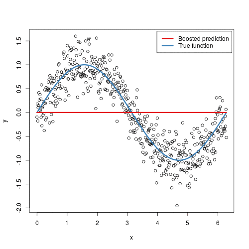
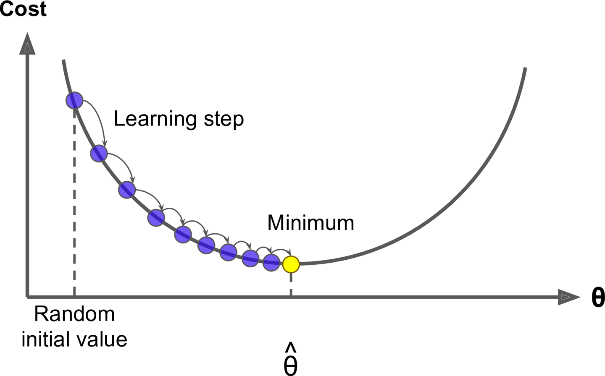
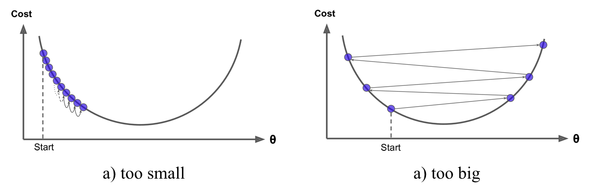
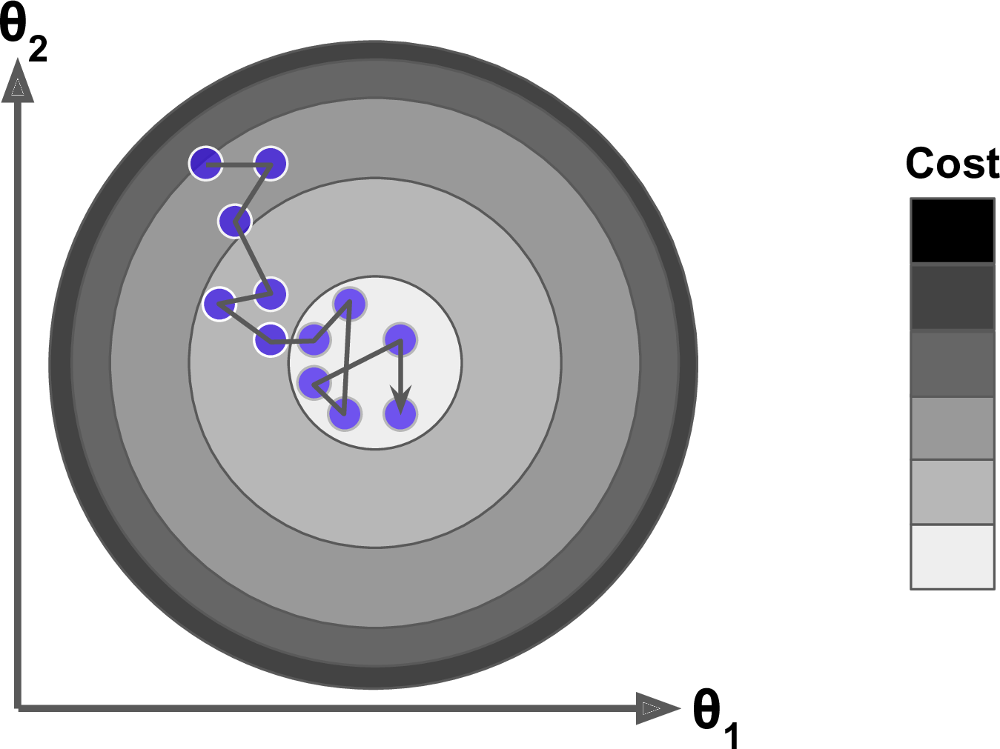
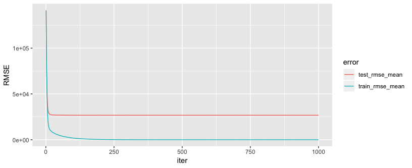
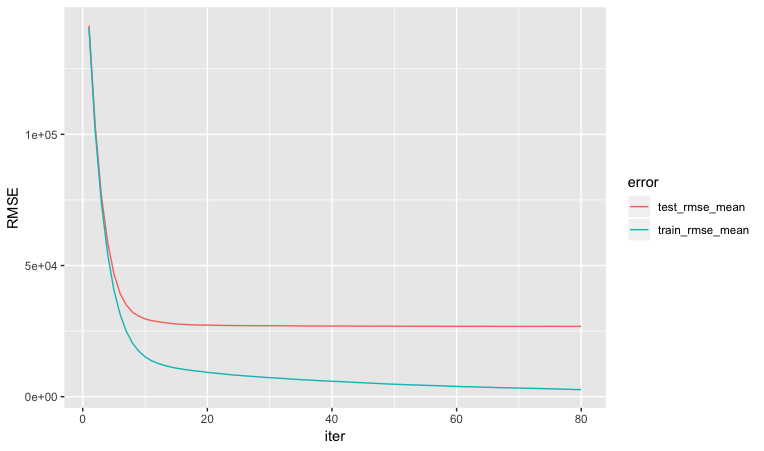
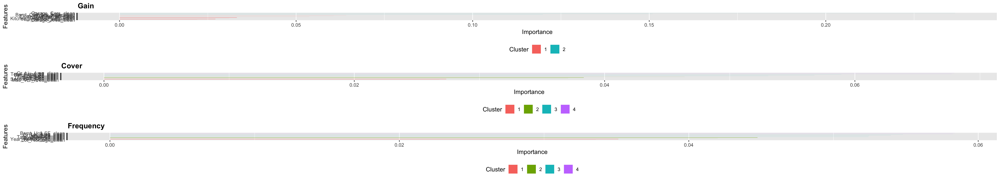
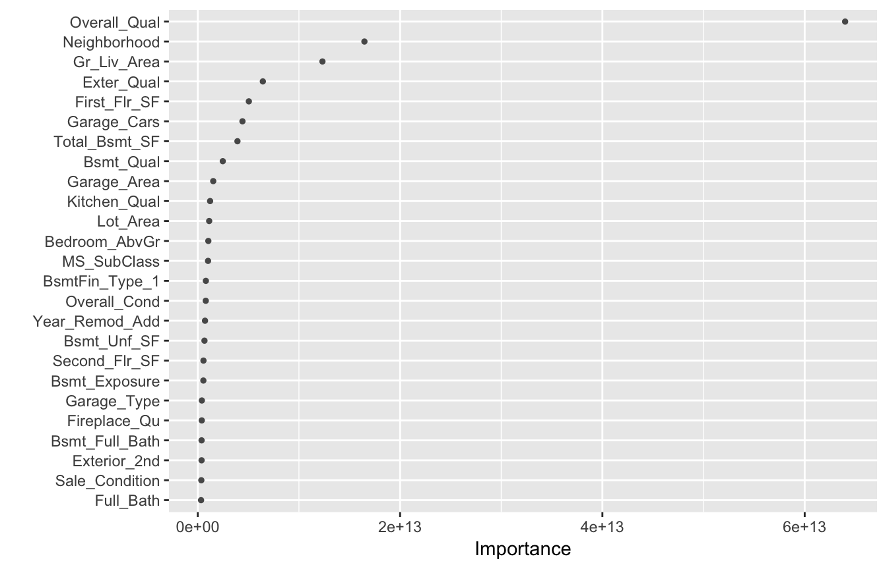

# Gradient Boosting Machines {#gradient-boosting-machines}



Gradient boosted machines (GBMs) are an extremely popular machine learning algorithm that have proven successful across many domains and is one of the leading methods for winning Kaggle competitions.  Whereas random forests (Chapter \@ref(random_forest)) build an ensemble of deep independent trees, GBMs build an ensemble of shallow and weak successive trees with each tree learning and improving on the previous.  When combined, these many weak successive trees produce a powerful "committee" that are often hard to beat with other algorithms.  This chapter will cover the fundamentals to understanding and implementing GBMs.


## Package Requirements {#gbm-prereq}

This chapter leverages the following packages. Some of these packages play a supporting role; however, our focus is on demonstrating how to implement GBMs with the __gbm__ [@R-gbm], __xgboost__ [@R-xgboost], and __h2o__ packages and discuss the pros and cons to each.


```r
library(rsample)  # data splitting 
library(gbm)      # original implementation of gbm
library(xgboost)  # a faster implementation of gbm
library(h2o)      # a java-based platform
library(vip)      # visualize feature importance 
library(pdp)      # visualize feature effects
library(ggplot2)  # model visualization
```


## Advantages & Disadvantages {#gbm-proscons}

__Advantages:__

* Often provides predictive accuracy that cannot be beat.
* Lots of flexibility - can optimize on different loss functions and provides several hyperparameter tuning options that make the function fit very flexible.
* No data pre-processing required - often works great with categorical and numerical values as is.
* Handles missing data - imputation not required.


__Disdvantages:__

* GBMs will continue improving to minimize all errors.  This can overemphasize outliers and cause overfitting. Must use cross-validation to neutralize.
* Computationally expensive - GBMs often require many trees (>1000) which can be time and memory exhaustive.
* The high flexibility results in many parameters that interact and influence heavily the behavior of the approach (number of iterations, tree depth, regularization parameters, etc.). This requires a large grid search during tuning.
* Less interpretable although this is easily addressed with various tools (variable importance, partial dependence plots, local variable importance, etc.).


## The Idea {#gbm-idea}

Several supervised machine learning models are founded on a single predictive model such as linear regression, penalized models, naive Bayes, support vector machines. Alternatively, other approaches such as bagging and random forests are built on the idea of building an ensemble of models where each individual model predicts the outcome and then the ensemble simply averages the predicted values.  The family of boosting methods is based on a different, constructive strategy of ensemble formation. 

The main idea of boosting is to add new models to the ensemble ___sequentially___. At each particular iteration, a new weak, base-learner model is trained with respect to the error of the whole ensemble learnt so far.  

<div class="figure" style="text-align: center">

<p class="caption">(\#fig:sequential-fig)Sequential ensemble approach.</p>
</div>


Let's discuss each component of the previous sentence in closer detail because they are important.

__Base-learning models__:  Boosting is a framework that iteratively improves _any_ weak learning model.  Many gradient boosting applications allow you to "plug in" various classes of weak learners at your disposal. In practice however, boosted algorithms almost always use decision trees as the base-learner. Consequently, this chapter will discuss boosting in the context of decision trees.

__Training weak models__: A weak model is one whose error rate is only slightly better than random guessing.  The idea behind boosting is that each sequential model builds a simple weak model to slightly improve the remaining errors.  With regards to decision trees, shallow trees represent a weak learner.  Commonly, trees with only 1-6 splits are used. Combining many weak models (versus strong ones) has a few benefits:

- Speed: Constructing weak models is computationally cheap. 
- Accuracy improvement: Weak models allow the algorithm to _learn slowly_; making minor adjustments in new areas where it does not perform well. In general, statistical approaches that learn slowly tend to perform well.
- Avoids overfitting: Due to making only small incremental improvements with each model in the ensemble, this allows us to stop the learning process as soon as overfitting has been detected (typically by using cross-validation).

__Sequential training with respect to errors__: Boosted trees are grown sequentially; each tree is grown using information from previously grown trees. The basic algorithm for boosted regression trees can be generalized to the following where _x_ represents our features and _y_ represents our response:

1. Fit a decision tree to the data: $F_1(x) = y$,
2. We then fit the next decision tree to the residuals of the previous: $h_1(x) = y - F_1(x)$,
3. Add this new tree to our algorithm: $F_2(x) = F_1(x) + h_1(x)$,
4. Fit the next decision tree to the residuals of $F_2$: $h_2(x) = y - F_2(x)$,
5. Add this new tree to our algorithm: $F_3(x) = F_2(x) + h_1(x)$,
6. Continue this process until some mechanism (i.e. cross validation) tells us to stop.

The basic algorithm for boosted decision trees can be generalized to the following where the final model is simply a stagewise additive model of *b* individual trees:

$$ f(x) =  \sum^B_{b=1}f^b(x) \tag{1} $$

To illustrate the behavior, assume the following *x* and *y* observations.  The blue sine wave represents the true underlying function and the points represent observations that include some irriducible error (noise).  The boosted prediction illustrates the adjusted predictions after each additional sequential tree is added to the algorithm.  Initially, there are large errors which the boosted algorithm improves upon immediately but as the predictions get closer to the true underlying function you see each additional tree make small improvements in different areas across the feature space where errors remain. Towards the end of the gif, the predicted values nearly converge to the true underlying function.

<div class="figure" style="text-align: center">

<p class="caption">(\#fig:boosted-gif)Boosted regression tree predictions (courtesy of [Brandon Greenwell](https://github.com/bgreenwell))</p>
</div>


### Gradient descent {#gbm-gradient}

Many algorithms, including decision trees, focus on minimizing the residuals and, therefore, emphasize the MSE loss function.  The algorithm discussed in the previous section outlines the approach of sequentially fitting regression trees to minimize the errors.  This specific approach is how gradient boosting minimizes the mean squared error (MSE) loss function.  However, often we wish to focus on other loss functions such as mean absolute error (MAE) or to be able to apply the method to a classification problem with a loss function such as deviance. The name ___gradient___ boosting machine comes from the fact that this procedure can be generalized to loss functions other than MSE.

Gradient boosting is considered a ___gradient descent___ algorithm. Gradient descent is a very generic optimization algorithm capable of finding optimal solutions to a wide range of problems. The general idea of gradient descent is to tweak parameters iteratively in order to minimize a cost function. Suppose you are a downhill skier racing your friend.  A good strategy to beat your friend to the bottom is to take the path with the steepest slope. This is exactly what gradient descent does - it measures the local gradient of the loss (cost) function for a given set of parameters ($\Theta$) and takes steps in the direction of the descending gradient. Once the gradient is zero, we have reached the minimum.

<div class="figure" style="text-align: center">

<p class="caption">(\#fig:gradient-descent-fig)Gradient descent is the process of gradually decreasing the cost function (i.e. MSE) by tweaking parameters iteratively until you have reached a minimum. Image courtesy of @geron2017hands.</p>
</div>

Gradient descent can be performed on any loss function that is differentiable.  Consequently, this allows GBMs to optimize different loss functions as desired (see @esl, p. 360 for common loss functions). An important parameter in gradient descent is the size of the steps which is determined by the _learning rate_. If the learning rate is too small, then the algorithm will take many iterations to find the minimum. On the other hand, if the learning rate is too high, you might jump across the minimum and end up further away than when you started. 

<div class="figure" style="text-align: center">

<p class="caption">(\#fig:learning-rate-fig)A learning rate that is too small will require many iterations to find the minimum. A learning rate too big may jump over the minimum.  Image courtesy of @geron2017hands.</p>
</div>

Moreover, not all cost functions are convex (bowl shaped). There may be local minimas, plateaus, and other irregular terrain of the loss function that makes finding the global minimum difficult.  ___Stochastic gradient descent___ can help us address this problem by sampling a fraction of the training observations (typically without replacement) and growing the next tree using that subsample.  This makes the algorithm faster but the stochastic nature of random sampling also adds some random nature in descending the loss function gradient.  Although this randomness does not allow the algorithm to find the absolute global minimum, it can actually help the algorithm jump out of local minima and off plateaus and get near the global minimum. 

<div class="figure" style="text-align: center">

<p class="caption">(\#fig:stochastic-gradient-descent-fig)Stochastic gradient descent will often find a near-optimal solution by jumping out of local minimas and off plateaus. Image courtesy of @geron2017hands.</p>
</div>

As we'll see in the next section, there are several hyperparameter tuning options that allow us to address how we approach the gradient descent of our loss function.


### Tuning {#gbm-tuning}

Part of the beauty and challenges of GBMs is that they offer several tuning parameters.  The beauty in this is GBMs are highly flexible.  The challenge is that they can be time consuming to tune and find the optimal combination of hyperparamters.  The most common hyperparameters that you will find in most GBM implementations include:

* __Number of trees:__ The total number of trees to fit. GBMs often require many trees; however, unlike random forests GBMs can overfit so the goal is to find the optimal number of trees that minimize the loss function of interest with cross validation.
* __Depth of trees:__ The number *d* of splits in each tree, which controls the complexity of the boosted ensemble. Often $d = 1$ works well, in which case each tree is a _stump_ consisting of a single split. More commonly, *d* is greater than 1 but it is unlikely $d > 10$ will be required.
* __Learning rate:__ Controls how quickly the algorithm proceeds down the gradient descent. Smaller values reduce the chance of overfitting but also increases the time to find the optimal fit. This is also called _shrinkage_.
* __Subsampling:__ Controls whether or not you use a fraction of the available training observations. Using less than 100% of the training observations means you are implementing stochastic gradient descent.  This can help to minimize overfitting and keep from getting stuck in a local minimum or plateau of the loss function gradient.

Throughout this chapter you'll be exposed to additional hyperparameters that are specific to certain packages and can improve performance and/or the efficiency of training and tuning models.

### Package implementation {#gbm-pkg-options}

There are many packages that implement GBMs and GBM variants. You can find a fairly comprehensive list [here](https://koalaverse.github.io/machine-learning-in-R/gradient-boosting-machines.html#gbm-software-in-r) and at the [CRAN Machine Learning Task View](https://cran.r-project.org/web/views/MachineLearning.html). However, the most popular implementations which we will cover in this post include:

- [gbm](https://cran.r-project.org/web/packages/gbm/index.html): The [gbm](https://github.com/gbm-developers/gbm) R package is an implementation
of extensions to Freund and Schapire's AdaBoost algorithm and Friedman's gradient boosting machine.  This is the original R implementation of GBM. A presentation is available [here](https://www.slideshare.net/mark_landry/gbm-package-in-r) by Mark Landry.  Features include[^ledell]:
    - Stochastic GBM.
    - Supports up to 1024 factor levels.
    - Supports Classification and regression trees.
    - Includes methods for:
        - least squares
        - absolute loss
        - t-distribution loss
        - quantile regression
        - logistic
        - multinomial logistic
        - Poisson
        - Cox proportional hazards partial likelihood
        - AdaBoost exponential loss
        - Huberized hinge loss
        - Learning to Rank measures ([LambdaMart](https://www.microsoft.com/en-us/research/wp-content/uploads/2016/02/tr-2008-109.pdf))
    - Out-of-bag estimator for the optimal number of iterations is provided.
    - Easy to overfit since early stopping functionality is not automated in thispackage.
    - If internal cross-validation is used, this can be parallelized to all cores on the machine.
    - Currently undergoing a major refactoring & rewrite (and has been for sometime).
    - GPL-2/3 License.
- [xgboost](https://cran.r-project.org/web/packages/xgboost/index.html): A fast and efficient gradient boosting framework with a C++ backend). Many resource are available [here](https://github.com/dmlc/xgboost/tree/master/demo).  The xgboost package is quite popular on [Kaggle](http://blog.kaggle.com/tag/xgboost/) for data mining competitions.  Features include:
    - Stochastic GBM with column and row sampling (per split and per tree) for better generalization.
    - Includes efficient linear model solver and tree learning algorithms.
    - Parallel computation on a single machine.
    - Supports various objective functions, including regression, classification and ranking.
    - The package is made to be extensible, so that users are also allowed to define their own objectives easily.
    - Apache 2.0 License.
- [h2o](https://cran.r-project.org/web/packages/gamboostLSS/index.html): A powerful java-based interface that provides parallel distributed algorithms and efficient productionalization.  Resources regarding __h2o__'s GBM implementation include a Tuning guide by Arno Candel](https://github.com/h2oai/h2o-3/blob/master/h2o-docs/src/product/tutorials/gbm/gbmTuning.Rmd) and a [Vignette](http://docs.h2o.ai/h2o/latest-stable/h2o-docs/booklets/GBMBooklet.pdf). Features include:
    - Distributed and parallelized computation on either a single node or a multi-node cluster.
    - Automatic early stopping based on convergence of user-specified metrics to user-specied relative tolerance.
    - Stochastic GBM with column and  row sampling  (per split and per tree) for better generalization.
    - Support  for  exponential  families  (Poisson,  Gamma,  Tweedie)  and  loss functions in addition to binomial (Bernoulli), Gaussian and multinomial distributions, such as Quantile regression (including Laplace).
    - Grid search for hyperparameter optimization and model selection.
    - Data-distributed, which means the entire dataset does not need to fit into memory on a single node, hence scales to any size training set.
    - Uses histogram approximations of continuous variables for speedup.
    - Uses dynamic binning - bin limits are reset at each tree level based on the split bins' min and max values discovered during the last pass.
    - Uses squared error to determine optimal splits.
    - Distributed implementation details outlined in a [blog post](http://blog.h2o.ai/2013/10/building-distributed-gbm-h2o/) by Cliff Click.
    - Unlimited factor levels.
    - Multiclass trees (one for each class) built in parallel with each other.
    - Apache 2.0 Licensed.
    - Model export in plain Java code for deployment in production environments.


## Implementation: Regression {#gbm-regression}

To illustrate various GBM concepts for a regression problem we will continue with the Ames, IA housing data, where our intent is to predict `Sale_Price`. 


```r
# Create training (70%) and test (30%) sets for the AmesHousing::make_ames() data.
# Use set.seed for reproducibility

set.seed(123)
ames_split <- initial_split(AmesHousing::make_ames(), prop = .7, strata = "Sale_Price")
ames_train <- training(ames_split)
ames_test  <- testing(ames_split)
```


<div class="rmdcomment">
<p>Tree-based methods tend to perform well on unprocessed data (i.e. without normalizing, centering, scaling features). In this chapter I focus on how to implement GBMs with various packages. Although I do not pre-process the data, realize that you <strong><em>can</em></strong> improve model performance by spending time processing variable attributes.</p>
</div>

### gbm {#gbm-regression-gbm}


#### Basic implementation {#gbm-regression-gbm-basic}

__gbm__ has two primary training functions - `gbm::gbm` and `gbm::gbm.fit`. The primary difference is that `gbm::gbm` uses the formula interface to specify your model whereas `gbm::gbm.fit` requires the separated `x` and `y` matrices.  When working with _many_ variables it is more efficient to use the matrix rather than formula interface.

The default settings in `gbm` includes a learning rate (`shrinkage`) of 0.001. This is a very small learning rate and typically requires a large number of trees to find the minimum MSE.  However, `gbm` uses a default number of trees of 100, which is rarely sufficient.  Consequently, I crank it up to 5,000 trees.  The default depth of each tree (`interaction.depth`) is 1, which means we are ensembling a bunch of stumps. Lastly, I also include `cv.folds` to perform a 5 fold cross validation.  

<div class="rmdnote">
<p>The model took 48 seconds to run and the results show that our MSE loss function is minimized with 5,000 trees.</p>
</div>


```r
# for reproducibility
set.seed(123)

# train GBM model
gbm.fit <- gbm(
  formula = Sale_Price ~ .,
  distribution = "gaussian",
  data = ames_train,
  n.trees = 5000,
  interaction.depth = 1,
  shrinkage = 0.001,
  cv.folds = 5,
  n.cores = NULL, # will use all cores by default
  verbose = FALSE
  )  

# print results
print(gbm.fit)
## gbm(formula = Sale_Price ~ ., distribution = "gaussian", data = ames_train, 
##     n.trees = 5000, interaction.depth = 1, shrinkage = 0.001, 
##     cv.folds = 5, verbose = FALSE, n.cores = NULL)
## A gradient boosted model with gaussian loss function.
## 5000 iterations were performed.
## The best cross-validation iteration was 5000.
## There were 80 predictors of which 27 had non-zero influence.
```


The output object is a list containing several modelling and results information.  We can access this information with regular indexing; I recommend you take some time to dig around in the object to get comfortable with its components.  Here, we see that the minimum CV RMSE is \$33,079.61 but the plot also illustrates that the CV error (MSE) is still decreasing at 5,000 trees.  


```r
# get MSE and compute RMSE
sqrt(min(gbm.fit$cv.error))
## [1] 33079.61

# plot loss function as a result of n trees added to the ensemble
gbm.perf(gbm.fit, method = "cv")
```

<div class="figure" style="text-align: center">

<p class="caption">(\#fig:gbm1-gradient-descent)Training and cross-validated MSE as *n* trees are added to the GBM algorithm.</p>
</div>

In this case, the small learning rate is resulting in very small incremental improvements which means ___many___ trees are required.  In fact, with the default learning rate and tree depth settings, the CV error is still reducing after 10,000 trees!

#### Tuning {#gbm-regression-gbm-tune}

However, rarely do the default settings suffice.  We could tune parameters one at a time to see how the results change.  For example, here, I increase the learning rate to take larger steps down the gradient descent, reduce the number of trees (since we are reducing the learning rate), and increase the depth of each tree from using a single split to 3 splits. Our RMSE (\$23,813.34) is lower than our initial model and the optimal number of trees required was 964.


```r
# for reproducibility
set.seed(123)

# train GBM model
gbm.fit2 <- gbm(
  formula = Sale_Price ~ .,
  distribution = "gaussian",
  data = ames_train,
  n.trees = 5000,
  interaction.depth = 3,
  shrinkage = 0.1,
  cv.folds = 5,
  n.cores = NULL, # will use all cores by default
  verbose = FALSE
  )  

# find index for n trees with minimum CV error
min_MSE <- which.min(gbm.fit2$cv.error)

# get MSE and compute RMSE
sqrt(gbm.fit2$cv.error[min_MSE])
## [1] 23813.34

# plot loss function as a result of n trees added to the ensemble
gbm.perf(gbm.fit2, method = "cv")
```

<div class="figure" style="text-align: center">

<p class="caption">(\#fig:gbm2-gradient-descent)Training and cross-validated MSE as *n* trees are added to the GBM algorithm. We can see that are new hyperparameter settings result in a much quicker progression down the gradient descent than our initial model.</p>
</div>

However, a better option than manually tweaking hyperparameters one at a time is to perform a grid search which iterates over every combination of hyperparameter values and allows us to assess which combination tends to perform well.  To perform a manual grid search, first we want to construct our grid of hyperparameter combinations.  We're going to search across 81 models with varying learning rates and tree depth.  I also vary the minimum number of observations allowed in the trees terminal nodes (`n.minobsinnode`) and introduce stochastic gradient descent by allowing `bag.fraction` < 1.


```r
# create hyperparameter grid
hyper_grid <- expand.grid(
  shrinkage = c(.01, .1, .3),
  interaction.depth = c(1, 3, 5),
  n.minobsinnode = c(5, 10, 15),
  bag.fraction = c(.65, .8, 1), 
  optimal_trees = 0,               # a place to dump results
  min_RMSE = 0                     # a place to dump results
)

# total number of combinations
nrow(hyper_grid)
## [1] 81
```

We loop through each hyperparameter combination and apply 5,000 trees.  However, to speed up the tuning process, instead of performing 5-fold CV I train on 75% of the training observations and evaluate performance on the remaining 25%. 

<div class="rmdwarning">
<p>When using <code>train.fraction</code> it will take the first XX% of the data so its important to randomize your rows in case their is any logic behind the ordering of the data (i.e. ordered by neighbhorhood).</p>
</div>

Our grid search revealed a few important attributes.  First, our top model has better performance than our previously fitted model above and any of the other models covered in Chapters \@ref(regularized-regression) and \@ref(random-forest), with an RMSE of \$20,390.55. Second, looking at the top 10 models we see that:

- all the top models used a learning rate of 0.1 or smaller; small incremental steps down the gradient descent appears to work best,
- all the top models used deeper trees (`interaction.depth = 5`); there are likely stome important interactions that the deeper trees are able to capture,
- most of the models with a learning rate of 0.01 used nearly all the trees meaning they had just enough trees to converge to their global minimum. 

<div class="rmdtip">
<p>Searching this entire grid took 36 minutes.</p>
</div>


```r
# randomize data
random_index <- sample(1:nrow(ames_train), nrow(ames_train))
random_train <- ames_train[random_index, ]

# grid search 
for(i in 1:nrow(hyper_grid)) {
  
  # reproducibility
  set.seed(123)
  
  # train model
  gbm.tune <- gbm(
    formula = Sale_Price ~ .,
    distribution = "gaussian",
    data = random_train,
    n.trees = 5000,
    interaction.depth = hyper_grid$interaction.depth[i],
    shrinkage = hyper_grid$shrinkage[i],
    n.minobsinnode = hyper_grid$n.minobsinnode[i],
    bag.fraction = hyper_grid$bag.fraction[i],
    train.fraction = .75,
    n.cores = NULL, # will use all cores by default
    verbose = FALSE
  )
  
  # add min training error and trees to grid
  hyper_grid$optimal_trees[i] <- which.min(gbm.tune$valid.error)
  hyper_grid$min_RMSE[i] <- sqrt(min(gbm.tune$valid.error))
}

hyper_grid %>% 
  dplyr::arrange(min_RMSE) %>%
  head(10)
##    shrinkage interaction.depth n.minobsinnode bag.fraction optimal_trees min_RMSE
## 1       0.01                 5              5         0.80          4911 20390.55
## 2       0.01                 5              5         0.65          4726 20588.02
## 3       0.10                 5             10         0.80           500 20758.72
## 4       0.01                 5             10         0.80          4897 20761.53
## 5       0.01                 5              5         1.00          5000 20997.68
## 6       0.10                 5              5         1.00           665 21277.84
## 7       0.10                 5              5         0.80           514 21277.90
## 8       0.01                 5             10         0.65          4987 21310.94
## 9       0.01                 5             15         0.80          4990 21456.17
## 10      0.01                 5             10         1.00          4960 21481.65
```

These results help us to zoom into areas where we can refine our search.  In practice, tuning is an iterative process so you would likely refine this search grid to analyze a search space around the top models.  For example, I would likely search the following values in my next grid search:

* learning rate: 0.1, 0.05, 0.01, 0.005
* interaction depth: 3, 5, 7

along with the previously assessed values for `n.minobsinnode` and `bag.fraction`.  Also, since we used nearly all 5000 trees when the learning rate was 0.01, I would increase this to ensure there are enough trees for learning rate $=0.005$.

Once we have found our top model we train a model with those specific parameters. I'll use the top model in our grid search and since the model converged at 4911 trees I train a model with that many trees.  


```r
# for reproducibility
set.seed(123)

# train GBM model
gbm.fit.final <- gbm(
  formula = Sale_Price ~ .,
  distribution = "gaussian",
  data = ames_train,
  n.trees = 4342,
  interaction.depth = 5,
  shrinkage = 0.01,
  n.minobsinnode = 5,
  bag.fraction = .80, 
  train.fraction = 1,
  n.cores = NULL, # will use all cores by default
  verbose = FALSE
  )  
```

#### Feature interpretation {#gbm-regression-gbm-viz}

Similar to random forests, GBMs make no assumption regarding the linearity and monoticity of the predictor-response relationship.  So as we did in the random forest chapter (Chapter \@ref(random-forest)) we can understand the relationship between the features and the response using variable importance plots and partial dependence plots.

<div class="rmdtip">
<p>Additional model interpretability approaches will be discussed in the <strong><em>Model Interpretability</em></strong> chapter.</p>
</div>

##### Feature importance {#gbm-regression-gbm-vip}

After re-running our final model we likely want to understand the variables that have the largest influence on our response variable.  The `summary` method for __gbm__ will output a data frame and a plot that shows the most influential variables.  `cBars` allows you to adjust the number of variables to show (in order of influence). The default method for computing variable importance is with relative influence but your options include: 

1. `method = relative.influence`: At each split in each tree, `gbm` computes the improvement in the split-criterion (MSE for regression). `gbm` then averages the improvement made by each variable across all the trees that the variable is used. The variables with the largest average decrease in MSE are considered most important.
2. `method = permutation.test.gbm`: For each tree, the OOB sample is passed down the tree and the prediction accuracy is recorded. Then the values for each variable (one at a time) are randomly permuted and the accuracy is again computed. The decrease in accuracy as a result of this randomly “shaking up” of variable values is averaged over all the trees for each variable. The variables with the largest average decrease in accuracy are considered most important.


```r
par(mfrow = c(1, 2), mar = c(5, 10, 1, 1))

# relative influence approach
summary(gbm.fit.final, cBars = 10, method = relative.influence, las = 2)

# permutation approach
summary(gbm.fit.final, cBars = 10, method = permutation.test.gbm, las = 2)
```

<div class="figure" style="text-align: center">

<p class="caption">(\#fig:gbm-gbm-vip-plot)Top 10 influential variables using the relative influence (left) and permutation (right) approach. We can see common themes among the top variables although in differing order.</p>
</div>


##### Feature effects {#gbm-regression-gbm-pdp}

After the most relevant variables have been identified, we can use partial dependence plots (PDPs) and individual conditional expectation (ICE) curves to better understand the relationship between the predictors and response.  Here we plot two of the most influential variables (`Gr_Liv_Area` and `Overall_Qual`).  We see that both predictor non-linear relationships with the sale price.

<div class="rmdtip">
<p>As in Chapter @ref(random-forest), you can produce ICE curves by incorporating <code>ice = TRUE</code> and <code>center = TRUE</code> (for centered ICE curves).</p>
</div>


```r
p1 <- gbm.fit.final %>%
  partial(
    pred.var = "Gr_Liv_Area", 
    n.trees = gbm.fit.final$n.trees, 
    grid.resolution = 50
    ) %>%
  autoplot(rug = TRUE, train = ames_train) 

p2 <- gbm.fit.final %>%
  partial(
    pred.var = "Overall_Qual", 
    n.trees = gbm.fit.final$n.trees, 
    train = data.frame(ames_train)
    ) %>%
  autoplot() 

gridExtra::grid.arrange(p1, p2, nrow = 1)
```

<div class="figure" style="text-align: center">

<p class="caption">(\#fig:pdp1)The mean predicted sale price as `Gr_Liv_Area` and `Overall_Qual` change in value.</p>
</div>


#### Predicting {#gbm-regression-gbm-predict}

Once you've found your optimal model, predicting new observations with the __gbm__ model follows the same procedure as most R models.  We simply use the `predict` function; however, we also need to supply the number of trees to use (see `?predict.gbm` for details).  We see that our RMSE for our test set is right in line with the optimal RMSE obtained during our grid search and far better than any model to-date.


```r
# predict values for test data
pred <- predict(gbm.fit.final, n.trees = gbm.fit.final$n.trees, ames_test)

# results
caret::RMSE(pred, ames_test$Sale_Price)
## [1] 20859.01
```


### xgboost {#regression-xgboost}

The __xgboost__ package only works with matrices that contain all numeric variables; consequently, we need to one hot encode our data.  Throughout this book we've illustrated different ways to do this in R (i.e. `Matrix::sparse.model.matrix`, `caret::dummyVars`) but here we will use the __vtreat__ package.  __vtreat__ is a robust package for data prep and helps to eliminate problems caused by missing values, novel categorical levels that appear in future data sets that were not in the training data, etc.  However, __vtreat__ is not very intuitive.  I will not explain the functionalities but you can find more information [here](https://arxiv.org/abs/1611.09477), [here](https://www.r-bloggers.com/a-demonstration-of-vtreat-data-preparation/), and [here](https://github.com/WinVector/vtreat).  

The following applies __vtreat__ to one-hot encode the training and testing data sets.


```r
# variable names
features <- setdiff(names(ames_train), "Sale_Price")

# Create the treatment plan from the training data
treatplan <- vtreat::designTreatmentsZ(ames_train, features, verbose = FALSE)

# Get the "clean" variable names from the scoreFrame
new_vars <- treatplan %>%
  magrittr::use_series(scoreFrame) %>%        
  dplyr::filter(code %in% c("clean", "lev")) %>% 
  magrittr::use_series(varName)     

# Prepare the training data
features_train <- vtreat::prepare(treatplan, ames_train, varRestriction = new_vars) %>% as.matrix()
response_train <- ames_train$Sale_Price

# Prepare the test data
features_test <- vtreat::prepare(treatplan, ames_test, varRestriction = new_vars) %>% as.matrix()
response_test <- ames_test$Sale_Price

# dimensions of one-hot encoded data
dim(features_train)
## [1] 2054  211
dim(features_test)
## [1] 876 211
```


#### Basic implementation {#gbm-regression-xgb-basic}

__xgboost__ provides different training functions (i.e. `xgb.train` which is just a wrapper for `xgboost`). However, to train an __xgboost__ model we typically want to use `xgb.cv`, which incorporates cross-validation.  The following trains a basic 5-fold cross validated XGBoost model with 1,000 trees.  There are many parameters available in `xgb.cv` but the ones you have become more familiar with in this chapter include the following default values:

* learning rate (`eta`): 0.3
* tree depth (`max_depth`): 6
* minimum node size (`min_child_weight`): 1
* percent of training data to sample for each tree (`subsample` --> equivalent to `gbm`'s `bag.fraction`): 100%

<div class="rmdnote">
<p>This model took nearly 2 minutes to run. The reason <strong>xgboost</strong> seems slower than <strong>gbm</strong> is since we one-hot encoded our data, <strong>xgboost</strong> is searching across 211 features where <strong>gbm</strong> uses non-one-hot encoded which means it was only searching across 80 features.</p>
</div>


```r
# reproducibility
set.seed(123)

xgb.fit1 <- xgb.cv(
  data = features_train,
  label = response_train,
  nrounds = 1000,
  nfold = 5,
  objective = "reg:linear",  # for regression models
  verbose = 0                # silent,
)
```

The `xgb.fit1` object contains lots of good information. In particular we can assess the `xgb.fit1$evaluation_log` to identify the minimum RMSE and the optimal number of trees for both the training data and the cross-validated error. We can see that the training error continues to decreasing through 980 trees where the RMSE nearly reaches 0; however, the cross validated error reaches a minimum RMSE of \$26,758.30 with only 98 trees. 


```r
# get number of trees that minimize error
xgb.fit1$evaluation_log %>%
  dplyr::summarise(
    ntrees.train = which.min(train_rmse_mean),
    rmse.train = min(train_rmse_mean),
    ntrees.test = which.min(test_rmse_mean),
    rmse.test = min(test_rmse_mean),
  )
##   ntrees.train rmse.train ntrees.test rmse.test
## 1          980    0.05009          98   26758.3

# plot error vs number trees
xgb.fit1$evaluation_log %>% 
  tidyr::gather(error, RMSE, train_rmse_mean, test_rmse_mean) %>%
  ggplot(aes(iter, RMSE, color = error)) +
  geom_line()
```

<div class="figure" style="text-align: center">

<p class="caption">(\#fig:xgb-gradient-descent-plot)Training (blue) and cross-validation (red) error for each additional tree added to the GBM algorithm. The CV error is quickly minimized with 98 trees while the training error reduces to near zero over 980 trees.</p>
</div>

A nice feature provided by `xgb.cv` is early stopping.  This allows us to tell the function to stop running if the cross validated error does not improve for *n* continuous trees.  For example, the above model could be re-run with the following where we tell it stop if we see no improvement for 10 consecutive trees.  This feature will help us speed up the tuning process in the next section.

<div class="rmdtip">
<p>This reduced our training time from 2 minutes to 8 seconds!</p>
</div>


```r
# reproducibility
set.seed(123)

xgb.fit2 <- xgb.cv(
  data = features_train,
  label = response_train,
  nrounds = 1000,
  nfold = 5,
  objective = "reg:linear",  # for regression models
  verbose = 0,               # silent,
  early_stopping_rounds = 10 # stop if no improvement for 10 consecutive trees
)

# plot error vs number trees
xgb.fit2$evaluation_log %>% 
  tidyr::gather(error, RMSE, train_rmse_mean, test_rmse_mean) %>%
  ggplot(aes(iter, RMSE, color = error)) +
  geom_line()
```

<div class="figure" style="text-align: center">

<p class="caption">(\#fig:xgb2-gradient-descent2-plot)Early stopping allows us to stop training once we experience no additional improvement on our cross-validated error.</p>
</div>


#### Tuning {#gbm-regression-xgb-tune}

To tune the XGBoost model we pass parameters as a list object to the `params` argument.  The most common parameters include:

* `eta`:controls the learning rate
* `max_depth`: tree depth
* `min_child_weight`: minimum number of observations required in each terminal node
* `subsample`: percent of training data to sample for each tree
* `colsample_bytrees`: percent of columns to sample from for each tree

For example, if we wanted to specify specific values for these parameters we would extend the above model with the following parameters.


```r
# create parameter list
params <- list(
  eta = .1,
  max_depth = 5,
  min_child_weight = 2,
  subsample = .8,
  colsample_bytree = .9
  )

# reproducibility
set.seed(123)

# train model
xgb.fit3 <- xgb.cv(
  params = params,
  data = features_train,
  label = response_train,
  nrounds = 1000,
  nfold = 5,
  objective = "reg:linear",  # for regression models
  verbose = 0,               # silent,
  early_stopping_rounds = 10 # stop if no improvement for 10 consecutive trees
)

# assess results
xgb.fit3$evaluation_log %>%
  dplyr::summarise(
    ntrees.train = which.min(train_rmse_mean),
    rmse.train = min(train_rmse_mean),
    ntrees.test = which.min(test_rmse_mean),
    rmse.test = min(test_rmse_mean),
  )
##   ntrees.train rmse.train ntrees.test rmse.test
## 1          122   7954.668         112  24547.28
```

To perform a large search grid, we can follow the same procedure we did with __gbm__.  We create our hyperparameter search grid along with columns to dump our results in.  Here, I create a pretty large search grid consisting of 108 different hyperparameter combinations to model.


```r
# create hyperparameter grid
hyper_grid <- expand.grid(
  eta = c(.05, .1, .15),
  max_depth = c(3, 5, 7),
  min_child_weight = c(5, 10, 15),
  subsample = c(.65, .8), 
  colsample_bytree = c(.9, 1),
  optimal_trees = 0,               # a place to dump results
  min_RMSE = 0                     # a place to dump results
)

nrow(hyper_grid)
## [1] 108
```

Now I apply the same `for` loop procedure to loop through and apply an __xgboost__ model for each hyperparameter combination and dump the results in the `hyper_grid` data frame.  Our minimum RMSE (\$23,316.40) is a little higher than the __gbm__ model, likely a result of one-hot encoding our data and how the models treat these dummy coded variables differently.

<div class="rmdwarning">
<p>This full search grid took <strong>34 minutes</strong> to run!</p>
</div>


```r
# grid search 
for(i in 1:nrow(hyper_grid)) {
  
  # create parameter list
  params <- list(
    eta = hyper_grid$eta[i],
    max_depth = hyper_grid$max_depth[i],
    min_child_weight = hyper_grid$min_child_weight[i],
    subsample = hyper_grid$subsample[i],
    colsample_bytree = hyper_grid$colsample_bytree[i]
  )
  
  # reproducibility
  set.seed(123)
  
  # train model
  xgb.tune <- xgb.cv(
    params = params,
    data = features_train,
    label = response_train,
    nrounds = 5000,
    nfold = 5,
    objective = "reg:linear",  # for regression models
    verbose = 0,               # silent,
    early_stopping_rounds = 10 # stop if no improvement for 10 consecutive trees
  )
  
  # add min training error and trees to grid
  hyper_grid$optimal_trees[i] <- which.min(xgb.tune$evaluation_log$test_rmse_mean)
  hyper_grid$min_RMSE[i] <- min(xgb.tune$evaluation_log$test_rmse_mean)
}

hyper_grid %>%
  dplyr::arrange(min_RMSE) %>%
  head(10)
##     eta max_depth min_child_weight subsample colsample_bytree optimal_trees min_RMSE
## 1  0.05         7                5      0.65              1.0           481 23316.40
## 2  0.05         5                5      0.65              1.0           355 23515.42
## 3  0.05         5                5      0.80              1.0           469 23856.31
## 4  0.05         5                5      0.65              0.9           312 23888.34
## 5  0.05         7                5      0.80              1.0           660 23904.30
## 6  0.15         3                5      0.65              1.0           227 23909.78
## 7  0.05         3                5      0.80              1.0           567 23967.56
## 8  0.05         3               10      0.80              1.0           665 23998.05
## 9  0.15         3                5      0.65              0.9           230 24001.86
## 10 0.05         5               10      0.80              1.0           624 24033.78
```

After assessing the results you would likely perform a few more grid searches to hone in on the parameters that appear to influence the model the most.  In fact, [here is a link](https://www.analyticsvidhya.com/blog/2016/03/complete-guide-parameter-tuning-xgboost-with-codes-python/) to a great blog post that discusses a strategic approach to tuning with __xgboost__. However, for brevity, we'll just assume the top model in the above search is the globally optimal model.  Once you've found the optimal model, we can fit our final model with `xgb.train` or `xgboost`.


```r
# parameter list
params <- list(
  eta = 0.05,
  max_depth = 7,
  min_child_weight = 5,
  subsample = 0.65,
  colsample_bytree = 1
)

# train final model
xgb.fit.final <- xgboost(
  params = params,
  data = features_train,
  label = response_train,
  nrounds = 481,
  objective = "reg:linear",
  verbose = 0
)
```


#### Feature interpretation {#gbm-regression-xgb-viz}

##### Feature importance {#gbm-regression-xgb-vip}

__xgboost__ provides built-in variable importance plotting.  First, you need to create the importance matrix with `xgb.importance` and then feed this matrix into `xgb.plot.importance` (or `xgb.ggplot.importance` for a ggplot output).  __xgboost__ provides 3 variable importance measures:

* Gain: the relative contribution of the corresponding feature to the model calculated by taking each feature's contribution for each tree in the model. This is synonymous with __gbm__'s `relative.influence`.
* Cover: the relative number of observations related to this feature. For example, if you have 100 observations, 4 features and 3 trees, and suppose $feature_1$ is used to decide the leaf node for 10, 5, and 2 observations in $tree_1$, $tree_2$ and $tree_3$ respectively; then the metric will count cover for this feature as $10+5+2 = 17$ observations. This will be calculated for all the 4 features and the cover will be 17 expressed as a percentage for all features' cover metrics.
* Frequency: the percentage representing the relative number of times a particular feature occurs in the trees of the model. In the above example, if $feature_1$ occurred in 2 splits, 1 split and 3 splits in each of $tree_1$, $tree_2$ and $tree_3$; then the weightage for $feature_1$ will be $2+1+3 = 6$. The frequency for $feature_1$ is calculated as its percentage weight over weights of all features.

<div class="rmdnote">
<p>The <code>xgb.ggplot.importance</code> plotting mechanism will also perform a cluster analysis on the features based on their importance scores. This becomes more useful when visualizing many features (i.e. 50) and you want to categorize them based on their importance.</p>
</div>


```r
# create importance matrix
importance_matrix <- xgb.importance(model = xgb.fit.final)

# variable importance plot
p1 <- xgb.ggplot.importance(importance_matrix, top_n = 10, measure = "Gain") + ggtitle("Gain") + theme(legend.position="bottom")
p2 <- xgb.ggplot.importance(importance_matrix, top_n = 10, measure = "Cover") + ggtitle("Cover") + theme(legend.position="bottom")
p3 <- xgb.ggplot.importance(importance_matrix, top_n = 10, measure = "Frequency") + ggtitle("Frequency") + theme(legend.position="bottom")

gridExtra::grid.arrange(p1, p2, p3, ncol = 1)
```

<div class="figure" style="text-align: center">

<p class="caption">(\#fig:xgb-vip)Top 25 influential variables for our final __xgboost__ model based on the three different variable importance metrics.</p>
</div>

##### Feature effects {#gbm-regression-xgb-pdp}

PDP and ICE plots work similarly to how we implemented them with __gbm__. The only difference is you need to incorporate the training data within the `partial` function since these data cannot be extracted directly from the model object.  We see a similar non-linear relationship between `Gr_Liv_Area` and predicted sale price as we did with __gbm__ and in the random forest models; however, note the unique dip right after `Gr_liv_Area` reaches 3,000 square feet. We saw this dip in the __gbm__ model; however, it is a pattern that was not picked up on by the random forests models.


<div class="rmdtip">
<p>You do not need to supply the number of trees with <code>n.trees = xgb.fit.final$niter</code>; however, when supplying a cross-validated model where the optimal number of trees may be less than the total number of trees ran, then you will want to supply the optimal number of trees to the <code>n.trees</code> paramater.</p>
</div>


```r
pdp <- xgb.fit.final %>%
  partial(
    pred.var = "Gr_Liv_Area_clean", 
    n.trees = xgb.fit.final$niter, 
    grid.resolution = 50, 
    train = features_train
    ) %>%
  autoplot(rug = TRUE, train = features_train) +
  ggtitle("PDP")

ice <- xgb.fit.final %>%
  partial(
    pred.var = "Gr_Liv_Area_clean", 
    n.trees = xgb.fit.final$niter, 
    grid.resolution = 100, 
    train = features_train, 
    ice = TRUE
    ) %>%
  autoplot(rug = TRUE, train = features_train, alpha = .05, center = TRUE) +
  ggtitle("ICE")

gridExtra::grid.arrange(pdp, ice, nrow = 1)
```

<div class="figure" style="text-align: center">

<p class="caption">(\#fig:xgb-pdp-ice)The mean predicted sale price as the above ground living area increases.</p>
</div>


#### Predicting {#gbm-regression-gbm-predict}

Lastly, we use `predict` to predict on new observations; however, unlike __gbm__ we do not need to provide the number of trees. 


```r
# predict values for test data
pred <- predict(xgb.fit.final, features_test)

# test set results
caret::RMSE(pred, response_test)
## [1] 23454.51
```


### h2o {#gbm-regression-h2o}

Lets go ahead and start up h2o:


```r
h2o.no_progress()
h2o.init(max_mem_size = "5g")
## 
## H2O is not running yet, starting it now...
## 
## Note:  In case of errors look at the following log files:
##     /var/folders/ws/qs4y2bnx1xs_4y9t0zbdjsvh0000gn/T//Rtmpa5wE8r/h2o_bradboehmke_started_from_r.out
##     /var/folders/ws/qs4y2bnx1xs_4y9t0zbdjsvh0000gn/T//Rtmpa5wE8r/h2o_bradboehmke_started_from_r.err
## 
## 
## Starting H2O JVM and connecting: .. Connection successful!
## 
## R is connected to the H2O cluster: 
##     H2O cluster uptime:         2 seconds 476 milliseconds 
##     H2O cluster timezone:       America/New_York 
##     H2O data parsing timezone:  UTC 
##     H2O cluster version:        3.18.0.11 
##     H2O cluster version age:    2 months and 18 days  
##     H2O cluster name:           H2O_started_from_R_bradboehmke_qdv114 
##     H2O cluster total nodes:    1 
##     H2O cluster total memory:   4.44 GB 
##     H2O cluster total cores:    4 
##     H2O cluster allowed cores:  4 
##     H2O cluster healthy:        TRUE 
##     H2O Connection ip:          localhost 
##     H2O Connection port:        54321 
##     H2O Connection proxy:       NA 
##     H2O Internal Security:      FALSE 
##     H2O API Extensions:         XGBoost, Algos, AutoML, Core V3, Core V4 
##     R Version:                  R version 3.5.1 (2018-07-02)
```

#### Basic implementation {#gbm-regression-h2o-basic}

`h2o.gbm` allows us to perform a GBM with H2O. However, prior to running our initial model we need to convert our training data to an h2o object. By default, `h2o.gbm` applies a GBM model with the following parameters:

* number of trees (`ntrees`): 50
* learning rate (`learn_rate`): 0.1
* tree depth (`max_depth`): 5
* minimum observations in a terminal node (`min_rows`): 10
* no sampling of observations or columns

Since we are performing a 5-fold cross-validation, the output reports results for both our training set ($RMSE = 12539.86$) and validation set ($RMSE = 24654.047$).


```r
# create feature names
y <- "Sale_Price"
x <- setdiff(names(ames_train), y)

# turn training set into h2o object
train.h2o <- as.h2o(ames_train)

# training basic GBM model with defaults
h2o.fit1 <- h2o.gbm(
  x = x,
  y = y,
  training_frame = train.h2o,
  nfolds = 5   # performs 5 fold cross validation
)

# assess model results
h2o.fit1
## Model Details:
## ==============
## 
## H2ORegressionModel: gbm
## Model ID:  GBM_model_R_1533927247702_1 
## Model Summary: 
##   number_of_trees number_of_internal_trees model_size_in_bytes min_depth max_depth mean_depth min_leaves max_leaves mean_leaves
## 1              50                       50               17591         5         5    5.00000          9         31    22.96000
## 
## 
## H2ORegressionMetrics: gbm
## ** Reported on training data. **
## 
## MSE:  157248046
## RMSE:  12539.86
## MAE:  8988.278
## RMSLE:  0.08190755
## Mean Residual Deviance :  157248046
## 
## 
## 
## H2ORegressionMetrics: gbm
## ** Reported on cross-validation data. **
## ** 5-fold cross-validation on training data (Metrics computed for combined holdout predictions) **
## 
## MSE:  612660925
## RMSE:  24751.99
## MAE:  15485.9
## RMSLE:  0.1369165
## Mean Residual Deviance :  612660925
## 
## 
## Cross-Validation Metrics Summary: 
##                               mean          sd cv_1_valid  cv_2_valid  cv_3_valid  cv_4_valid  cv_5_valid
## mae                     15465.6455    403.8833  15899.954   14460.245  16051.8125    15667.94   15248.277
## mean_residual_deviance 6.1167661E8 6.4985276E7 6.851456E8 4.3496512E8 6.0995507E8 6.7103411E8 6.5728301E8
## mse                    6.1167661E8 6.4985276E7 6.851456E8 4.3496512E8 6.0995507E8 6.7103411E8 6.5728301E8
## r2                       0.9020621 0.008838167  0.8946199   0.9245291  0.89047533   0.8939862  0.90669996
## residual_deviance      6.1167661E8 6.4985276E7 6.851456E8 4.3496512E8 6.0995507E8 6.7103411E8 6.5728301E8
## rmse                     24654.047   1388.2732  26175.287   20855.818    24697.27   25904.326   25637.531
## rmsle                   0.13682812 0.009084022 0.15625001  0.12442712  0.12835869  0.12703055  0.14807428
```

Similar to __xgboost__, we can incorporate automated stopping so that we can crank up the number of trees but terminate training once model improvement decreases or stops.  There is also an option to terminate training after so much time has passed (see `max_runtime_secs`). In this example, I train a default model with 5,000 trees but stop training after 10 consecutive trees have no improvement on the cross-validated error. In this case, training stops after 2623 trees and has a cross-validated RMSE of \$23,441.46.


```r
# training basic GBM model with defaults
h2o.fit2 <- h2o.gbm(
  x = x,
  y = y,
  training_frame = train.h2o,
  nfolds = 5,
  ntrees = 5000,
  stopping_rounds = 10,
  stopping_tolerance = 0,
  seed = 123
)

# model stopped after xx trees
h2o.fit2@parameters$ntrees
## [1] 2623

# cross validated RMSE
h2o.rmse(h2o.fit2, xval = TRUE)
## [1] 23441.46
```


#### Tuning {#gbm-regression-h2o-tune}

H2O provides ___many___ parameters that can be adjusted.  It is well worth your time to check out the available documentation at [H2O.ai](http://docs.h2o.ai/h2o/latest-stable/h2o-docs/data-science/gbm.html#gbm-tuning-guide).  For this chapter, we'll focus on the more common hyperparameters that are adjusted.  This includes:

* Tree complexity:
    * `ntrees`: number of trees to train
    * `max_depth`: depth of each tree
    * `min_rows`: Fewest observations allowed in a terminal node
* Learning rate:
    * `learn_rate`: rate to descend the loss function gradient
    * `learn_rate_annealing`: allows you to have a high initial `learn_rate`, then gradually reduce as trees are added (speeds up training).
* Adding stochastic nature:
    * `sample_rate`: row sample rate per tree
    * `col_sample_rate`: column sample rate per tree (synonymous with `xgboost`'s `colsample_bytree`)
    
Note that there are parameters that control how categorical and continuous variables are encoded, binned, and split.  The defaults tend to perform quite well but we have been able to gain small improvements in certain circumstances by adjusting these.  We will not cover them but they are worth reviewing. 

To perform grid search tuning with H2O we can perform either a full or random discrete grid search as discussed in Section \@ref(rf-h2o-regression-tune).

##### Full grid search {#gbm-regression-h2o-tune-full}

We'll start with a full grid search. However, to speed up training with __h2o__ I'll use a validation set rather than perform k-fold cross validation.  The following creates a hyperparameter grid consisting of 216 hyperparameter combinations. We apply `h2o.grid` to perform a grid search while also incorporating stopping parameters to reduce training time. 

We see that the worst model had an RMSE of \$34,142.31 ($\sqrt{476228672}$) and the best had an RMSE of \$21,822.66 ($\sqrt{1165697554}$). A few characteristics pop out when we assess the results - models that search across a sample of columns, include more interactions via deeper trees, and allow nodes with single observations tend to perform best. 

<div class="rmdtip">
<p>This full grid search took <strong>18 minutes</strong>.</p>
</div>


```r
# create training & validation sets
split <- h2o.splitFrame(train.h2o, ratios = 0.75)
train <- split[[1]]
valid <- split[[2]]

# create hyperparameter grid
hyper_grid <- list(
  max_depth = c(1, 3, 5),
  min_rows = c(1, 5, 10),
  learn_rate = c(0.05, 0.1, 0.15),
  learn_rate_annealing = c(.99, 1),
  sample_rate = c(.75, 1),
  col_sample_rate = c(.9, 1)
)

# perform grid search 
grid <- h2o.grid(
  algorithm = "gbm",
  grid_id = "gbm_grid1",
  x = x, 
  y = y, 
  training_frame = train,
  validation_frame = valid,
  hyper_params = hyper_grid,
  ntrees = 5000,
  stopping_rounds = 10,
  stopping_tolerance = 0,
  seed = 123
  )

# collect the results and sort by our model performance metric of choice
grid_perf <- h2o.getGrid(
  grid_id = "gbm_grid1", 
  sort_by = "mse", 
  decreasing = FALSE
  )
grid_perf
## H2O Grid Details
## ================
## 
## Grid ID: gbm_grid1 
## Used hyper parameters: 
##   -  col_sample_rate 
##   -  learn_rate 
##   -  learn_rate_annealing 
##   -  max_depth 
##   -  min_rows 
##   -  sample_rate 
## Number of models: 216 
## Number of failed models: 0 
## 
## Hyper-Parameter Search Summary: ordered by increasing mse
##   col_sample_rate learn_rate learn_rate_annealing max_depth min_rows sample_rate           model_ids                  mse
## 1             0.9       0.05                  1.0         5      1.0         1.0 gbm_grid1_model_138  4.762286724006572E8
## 2             0.9       0.05                  1.0         5      1.0        0.75  gbm_grid1_model_30 4.9950455156501746E8
## 3             0.9        0.1                 0.99         5      1.0         1.0 gbm_grid1_model_134   5.04407597702603E8
## 4             0.9       0.15                  1.0         5      1.0         1.0 gbm_grid1_model_142 5.1283047945094573E8
## 5             0.9       0.05                 0.99         5      1.0         1.0 gbm_grid1_model_132 5.1307290689450026E8
## 
## ---
##     col_sample_rate learn_rate learn_rate_annealing max_depth min_rows sample_rate           model_ids                  mse
## 211             1.0       0.05                 0.99         1      5.0        0.75  gbm_grid1_model_37 1.1602102219725711E9
## 212             1.0       0.05                 0.99         1     10.0        0.75  gbm_grid1_model_73 1.1620871092432442E9
## 213             0.9       0.05                 0.99         1      5.0         1.0 gbm_grid1_model_144 1.1631655136872623E9
## 214             1.0       0.05                 0.99         1      5.0         1.0 gbm_grid1_model_145  1.164083893251335E9
## 215             0.9       0.05                 0.99         1     10.0         1.0 gbm_grid1_model_180 1.1653298042199028E9
## 216             1.0       0.05                 0.99         1     10.0         1.0 gbm_grid1_model_181 1.1656975535614166E9
```


We can check out more details of the best performing model. We can see that our best model used all 5000 trees, thus a future grid search may want to increase the number of trees.


```r
# Grab the model_id for the top model, chosen by validation error
best_model_id <- grid_perf@model_ids[[1]]
best_model <- h2o.getModel(best_model_id)

best_model@parameters$ntrees
## [1] 5000

# Now let’s get performance metrics on the best model
h2o.performance(model = best_model, valid = TRUE)
## H2ORegressionMetrics: gbm
## ** Reported on validation data. **
## 
## MSE:  476228672
## RMSE:  21822.66
## MAE:  13972.88
## RMSLE:  0.1341252
## Mean Residual Deviance :  476228672
```

##### Random discrete grid search {#gbm-regression-h2o-tune-random}

As discussed in Section \@ref(rf-h2o-regression-tune-random), __h2o__ also allows us to perform a random grid search that allows early stopping.  We can build onto the previous results and perform a random discrete grid.  This time I increase the `max_depth`, refine the `min_rows`, and allow for 80% `col_sample_rate`.  I keep all hyperparameter search criteria the same. I also add a search criteria that stops the grid search if none of the last 10 models have managed to have a 0.5% improvement in MSE compared to the best model before that. If we continue to find improvements then I cut the grid search off after 1800 seconds (30 minutes). In this example, our search went for the entire 90 minutes and evaluated 57 of the 216 potential models.

In the body of the grid search, notice that I increased the trees to 10,000 since our best model used all 5,000 but I also include a stopping mechanism so that the model quits adding trees once no improvement is made in the validation RMSE.

<div class="rmdtip">
<p>This random grid search took <strong>30 minutes</strong>. It only assessed a third of the number of models the full grid search did but keep in mind that this grid search was assessing models with very low learning rates, which can take a long time.</p>
</div>


```r
# refined hyperparameter grid
hyper_grid <- list(
  max_depth = c(5, 7, 9),
  min_rows = c(1, 3, 5),
  learn_rate = c(0.05, 0.1, 0.15),
  learn_rate_annealing = c(.99, 1),
  sample_rate = c(.75, 1),
  col_sample_rate = c(.8, .9)
)

# random grid search criteria
search_criteria <- list(
  strategy = "RandomDiscrete",
  stopping_metric = "mse",
  stopping_tolerance = 0.005,
  stopping_rounds = 10,
  max_runtime_secs = 60*30
  )

# perform grid search 
grid <- h2o.grid(
  algorithm = "gbm",
  grid_id = "gbm_grid2",
  x = x, 
  y = y, 
  training_frame = train,
  validation_frame = valid,
  hyper_params = hyper_grid,
  search_criteria = search_criteria, # add search criteria
  ntrees = 10000,
  stopping_rounds = 10,
  stopping_tolerance = 0,
  seed = 123
  )

# collect the results and sort by our model performance metric of choice
grid_perf <- h2o.getGrid(
  grid_id = "gbm_grid2", 
  sort_by = "mse", 
  decreasing = FALSE
  )
grid_perf
## H2O Grid Details
## ================
## 
## Grid ID: gbm_grid2 
## Used hyper parameters: 
##   -  col_sample_rate 
##   -  learn_rate 
##   -  learn_rate_annealing 
##   -  max_depth 
##   -  min_rows 
##   -  sample_rate 
## Number of models: 68 
## Number of failed models: 0 
## 
## Hyper-Parameter Search Summary: ordered by increasing mse
##   col_sample_rate learn_rate learn_rate_annealing max_depth min_rows sample_rate          model_ids                  mse
## 1             0.9       0.05                  1.0         5      1.0         1.0 gbm_grid2_model_50 4.7624213765845805E8
## 2             0.8        0.1                 0.99         5      5.0        0.75 gbm_grid2_model_40 4.9473498408073145E8
## 3             0.8        0.1                 0.99         5      1.0        0.75 gbm_grid2_model_34  4.989151160193848E8
## 4             0.9       0.05                  1.0         5      1.0        0.75  gbm_grid2_model_2   4.99534198008744E8
## 5             0.9        0.1                 0.99         7      1.0         1.0 gbm_grid2_model_46 5.1068183500740755E8
## 
## ---
##    col_sample_rate learn_rate learn_rate_annealing max_depth min_rows sample_rate          model_ids                 mse
## 63             0.9        0.1                 0.99         9      1.0         1.0 gbm_grid2_model_19 6.888828473137908E8
## 64             0.9       0.05                  1.0         9      5.0         1.0 gbm_grid2_model_66 6.978688028588266E8
## 65             0.9       0.05                 0.99         9      3.0         1.0 gbm_grid2_model_53 7.120703549234108E8
## 66             0.8       0.15                  1.0         9      1.0        0.75 gbm_grid2_model_64 7.175292869435712E8
## 67             0.9        0.1                 0.99         9      3.0         1.0  gbm_grid2_model_3 7.793274661905156E8
## 68             0.8       0.15                  1.0         7      5.0        0.75 gbm_grid2_model_67 8.279874389570463E8
```

In this example, the best model obtained a cross-validated RMSE of \$21,822.97.  So although we assessed only 31% of the total models we were able to find a model that was better than our initial full grid search.


```r
# Grab the model_id for the top model, chosen by validation error
best_model_id <- grid_perf@model_ids[[1]]
best_model <- h2o.getModel(best_model_id)

# Now let’s get performance metrics on the best model
h2o.performance(model = best_model, valid = TRUE)
## H2ORegressionMetrics: gbm
## ** Reported on validation data. **
## 
## MSE:  476242138
## RMSE:  21822.97
## MAE:  13972.9
## RMSLE:  0.1341249
## Mean Residual Deviance :  476242138
```

Once we've found our preferred model, we'll go ahead and retrain a new model with the full training data.  I'll use the best model from the full grid search and perform a 5-fold CV to get a robust estimate of the expected error.  I crank up the number of trees just to make sure we find a global minimum.


```r
# train final model
h2o.final <- h2o.gbm(
  x = x,
  y = y,
  training_frame = train.h2o,
  nfolds = 5,
  ntrees = 10000,
  learn_rate = 0.05,
  learn_rate_annealing = 1,
  max_depth = 5,
  min_rows = 5,
  sample_rate = 1,
  col_sample_rate = 0.9,
  stopping_rounds = 10,
  stopping_tolerance = 0,
  seed = 123
)

# model stopped after xx trees
h2o.final@parameters$ntrees
## [1] 5526

# cross validated RMSE
h2o.rmse(h2o.final, xval = TRUE)
## [1] 23553.76
```


#### Feature interpretation {#gbm-regression-h2o-viz}

##### Feature importance {#gbm-regression-h2o-vip}

Looking at the top 25 most important features, we see many of the same predictors as we have with the other GBM implementations and also with the random forest approaches.


```r
vip::vip(h2o.final, num_features = 25, bar = FALSE)
```

<div class="figure" style="text-align: center">

<p class="caption">(\#fig:h2o-vip2)Top 25 most influential predictors based on impurity.</p>
</div>

##### Feature effects {#gbm-regression-h2o-pdp}

PDP and ICE plots work similarly to how we implemented them with the __h2o__ approaches for random forests. Figure \@ref(fig:gbm-regression-h2o-pdp-ice) illustrates the same non-linear relationship between `Gr_Liv_Area` and predicted sale price that we have been seeing with other GBM and random forest implementations. 


```r
# build custom prediction function
pfun <- function(object, newdata) {
  as.data.frame(predict(object, newdata = as.h2o(newdata)))[[1L]]
}

# compute ICE curves 
partial(
  h2o.final, 
  pred.var = "Gr_Liv_Area", 
  train = ames_train,
  pred.fun = pfun,
  grid.resolution = 20
) %>%
  autoplot(rug = TRUE, train = ames_train, alpha = 0.05, center = TRUE) + 
  ggtitle("Centered ICE curves")
```

<div class="figure" style="text-align: center">

<p class="caption">(\#fig:gbm-regression-h2o-pdp-ice)ICE curves illustrating the non-linear relationship between above ground square footage (`Gr_Liv_Area`) and predicted sale price.</p>
</div>


#### Predicting {#gbm-regression-h2o-predict}

Lastly, we use `h2o.predict` or `predict` to predict on new observations and we can also evaluate the performance of our model on our test set easily with `h2o.performance`.  Results are quite similar to both __gmb__ and __xgboost__.


```r
# convert test set to h2o object
test.h2o <- as.h2o(ames_test)

# evaluate performance on new data
h2o.performance(model = h2o.final, newdata = test.h2o)
## H2ORegressionMetrics: gbm
## 
## MSE:  501872966
## RMSE:  22402.52
## MAE:  13844.76
## RMSLE:  0.1127162
## Mean Residual Deviance :  501872966

# predict with h2o.predict
h2o.predict(h2o.final, newdata = test.h2o)
##    predict
## 1 122831.1
## 2 179027.7
## 3 228672.4
## 4 261521.0
## 5 407383.8
## 6 384198.8
## 
## [876 rows x 1 column]

# predict values with predict
predict(h2o.final, test.h2o)
##    predict
## 1 122831.1
## 2 179027.7
## 3 228672.4
## 4 261521.0
## 5 407383.8
## 6 384198.8
## 
## [876 rows x 1 column]
```


```r
# shut down h2o
h2o.shutdown(prompt = FALSE)
## [1] TRUE
```


## Implementation: Binary Classification {#gbm-binary-classification}


### gbm

Coming soon!


### xgboost

Coming soon!


### h2o

Coming soon!

## Implementation: Multinomial Classification {#gbm-multi-classification}


### gbm

Coming soon!


### xgboost

Coming soon!


### h2o

Coming soon!


## Learning More

GBMs are one of the most powerful ensemble algorithms that are often first-in-class with predictive accuracy. Although they are less intuitive and more computationally demanding than many other machine learning algorithms, they are essential to have in your toolbox. To learn more I would start with the following resources:

__Traditional book resources:__

- [An Introduction to Statistical Learning](http://www-bcf.usc.edu/~gareth/ISL/)
- [Applied Predictive Modeling](http://appliedpredictivemodeling.com/)
- [Computer Age Statistical Inference](https://www.amazon.com/Computer-Age-Statistical-Inference-Mathematical/dp/1107149894)
- [The Elements of Statistical Learning](https://web.stanford.edu/~hastie/ElemStatLearn/)

__Alternative online resources:__

* [Trevor Hastie - Gradient Boosting & Random Forests at H2O World 2014](https://koalaverse.github.io/machine-learning-in-R/%20//www.youtube.com/watch?v=wPqtzj5VZus&index=16&list=PLNtMya54qvOFQhSZ4IKKXRbMkyL%20Mn0caa) (YouTube)
* [Trevor Hastie - Data Science of GBM (2013)](http://www.slideshare.net/0xdata/gbm-27891077) (slides)
* [Mark Landry - Gradient Boosting Method and Random Forest at H2O World 2015](https://www.youtube.com/watch?v=9wn1f-30_ZY) (YouTube)
* [Peter Prettenhofer - Gradient Boosted Regression Trees in scikit-learn at PyData London 2014](https://www.youtube.com/watch?v=IXZKgIsZRm0) (YouTube)
* [Alexey Natekin1 and Alois Knoll - Gradient boosting machines, a tutorial](http://journal.frontiersin.org/article/10.3389/fnbot.2013.00021/full) (blog post)

[^ledell]: The features highlighted for each package were originally identified by Erin LeDell in her [useR! 2016 tutorial](https://github.com/ledell/useR-machine-learning-tutorial).

