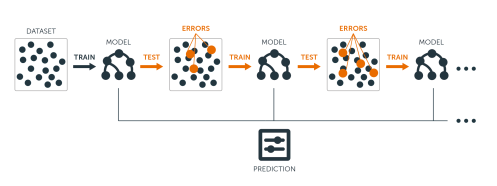

__Note__: Some results may differ from the hard copy book due to the changing of sampling procedures introduced in R 3.6.0. See http://bit.ly/35D1SW7 for more details. Access and run the source code for this notebook [here](https://rstudio.cloud/project/801185). Do to output size, most of this
chapters code chunks should not be ran on RStudio Cloud.

Hidden chapter requirements used in the book to set the plotting theme and load packages used in hidden code chunks:

```{r setup}
# Set global R options
options(scipen = 999)

# Set the graphical theme
ggplot2::theme_set(ggplot2::theme_light())

# Set global knitr chunk options
knitr::opts_chunk$set(
  cache = FALSE,
  warning = FALSE, 
  message = FALSE
)

# Load required packages
library(tidyr)
library(rpart)
library(ggplot2)
```

## Prerequisites

```{r gbm-pkg-req}
# Helper packages
library(dplyr)    # for general data wrangling needs

# Modeling packages
library(gbm)      # for original implementation of regular and stochastic GBMs
library(h2o)      # for a java-based implementation of GBM variants
library(xgboost)  # for fitting extreme gradient boosting
```

```{r gbm-ames-train, echo=TRUE}
library(rsample)
# create Ames training data
set.seed(123)
ames <- AmesHousing::make_ames()
split  <- initial_split(ames, prop = 0.7, strata = "Sale_Price")
ames_train  <- training(split)
```

```{r gbm-h2o-object}
h2o.init(max_mem_size = "10g")

train_h2o <- as.h2o(ames_train)
response <- "Sale_Price"
predictors <- setdiff(colnames(ames_train), response)
```


## How boosting works

### A sequential ensemble approach

Figure 12.1:

```{r sequential-fig, echo=TRUE, fig.align='center', fig.cap="Sequential ensemble approach.", out.height="75%", out.width="75%"}


```

Figure 12.2:

```{r boosting-in-action, fig.height=6, fig.width=10, echo=TRUE, fig.cap="Boosted regression decision stumps as 0-1024 successive trees are added."}

# Simulate sine wave data
set.seed(1112)  # for reproducibility
df <- tibble::tibble(
  x = seq(from = 0, to = 2 * pi, length = 1000),
  y = sin(x) + rnorm(length(x), sd = 0.5),
  truth = sin(x)
)

# Function to boost `rpart::rpart()` trees
rpartBoost <- function(x, y, data, num_trees = 100, learn_rate = 0.1, tree_depth = 6) {
  x <- data[[deparse(substitute(x))]]
  y <- data[[deparse(substitute(y))]]
  G_b_hat <- matrix(0, nrow = length(y), ncol = num_trees + 1)
  r <- y
  for(tree in seq_len(num_trees)) {
    g_b_tilde <- rpart(r ~ x, control = list(cp = 0, maxdepth = tree_depth))
    g_b_hat <- learn_rate * predict(g_b_tilde)
    G_b_hat[, tree + 1] <- G_b_hat[, tree] + matrix(g_b_hat)
    r <- r - g_b_hat
    colnames(G_b_hat) <- paste0("tree_", c(0, seq_len(num_trees)))
  }
  cbind(df, as.data.frame(G_b_hat)) %>%
    gather(tree, prediction, starts_with("tree")) %>%
    mutate(tree = stringr::str_extract(tree, "\\d+") %>% as.numeric())
}

# Plot boosted tree sequence
rpartBoost(x, y, data = df, num_trees = 2^10, learn_rate = 0.05, tree_depth = 1) %>%
  filter(tree %in% c(0, 2^c(0:10))) %>%
  ggplot(aes(x, prediction)) +
    ylab("y") +
    geom_point(data = df, aes(x, y), alpha = .1) +
    geom_line(data = df, aes(x, truth), color = "blue") +
    geom_line(colour = "red", size = 1) +
    facet_wrap(~ tree, nrow = 3)
```


### Gradient descent

Figure 12.3:

```{r gradient-descent-fig, echo=TRUE, fig.height=3, fig.width=5, fig.cap="Gradient descent is the process of gradually decreasing the cost function (i.e. MSE) by tweaking parameter(s) iteratively until you have reached a minimum."}

# create data to plot
x <- seq(-5, 5, by = .05)
y <- x^2 + 3
df <- data.frame(x, y)
step <- 5
step_size <- .2
for(i in seq_len(18)) {
  next_step <- max(step) + round(diff(range(max(step), which.min(df$y))) * step_size, 0)
  step <- c(step, next_step)
  next
}
steps <- df[step, ] %>%
  mutate(x2 = lag(x), y2 = lag(y)) %>%
  dplyr::slice(1:18)
# plot
ggplot(df, aes(x, y)) +
  geom_line(size = 1.5, alpha = .5) +
  theme_classic() +
  scale_y_continuous("Loss function", limits = c(0, 30)) +
  xlab(expression(theta)) +
  geom_segment(data = df[c(5, which.min(df$y)), ], aes(x = x, y = y, xend = x, yend = -Inf), lty = "dashed") +
  geom_point(data = filter(df, y == min(y)), aes(x, y), size = 4, shape = 21, fill = "yellow") +
  geom_point(data = steps, aes(x, y), size = 3, shape = 21, fill = "blue", alpha = .5) +
  geom_curve(data = steps, aes(x = x, y = y, xend = x2, yend = y2), curvature = 1, lty = "dotted") +
  theme(
    axis.ticks = element_blank(),
    axis.text = element_blank()
  ) +
  annotate("text", x = df[5, "x"], y = 1, label = "Initial value", hjust = -0.1, vjust = .8) +
  annotate("text", x = df[which.min(df$y), "x"], y = 1, label = "Minimium", hjust = -0.1, vjust = .8) +
  annotate("text", x = df[5, "x"], y = df[5, "y"], label = "Learning step", hjust = -.8, vjust = 0)
```

Figure 12.4:

```{r learning-rate-fig, echo=TRUE, fig.cap="A learning rate that is too small will require many iterations to find the minimum. A learning rate too big may jump over the minimum."}

# create too small of a learning rate
step <- 5
step_size <- .05
for(i in seq_len(10)) {
  next_step <- max(step) + round(diff(range(max(step), which.min(df$y))) * step_size, 0)
  step <- c(step, next_step)
  next
}
too_small <- df[step, ] %>%
  mutate(x2 = lag(x), y2 = lag(y))
# plot
p1 <- ggplot(df, aes(x, y)) +
  geom_line(size = 1.5, alpha = .5) +
  theme_classic() +
  scale_y_continuous("Loss function", limits = c(0, 30)) +
  xlab(expression(theta)) +
  geom_segment(data = too_small[1, ], aes(x = x, y = y, xend = x, yend = -Inf), lty = "dashed") +
  geom_point(data = too_small, aes(x, y), size = 3, shape = 21, fill = "blue", alpha = .5) +
  geom_curve(data = too_small, aes(x = x, y = y, xend = x2, yend = y2), curvature = 1, lty = "dotted") +
  theme(
    axis.ticks = element_blank(),
    axis.text = element_blank()
  ) +
  annotate("text", x = df[5, "x"], y = 1, label = "Start", hjust = -0.1, vjust = .8) +
  ggtitle("b) too small")
# create too large of a learning rate
too_large <- df[round(which.min(df$y) * (1 + c(-.9, -.6, -.2, .3)), 0), ] %>%
  mutate(x2 = lag(x), y2 = lag(y))
# plot
p2 <- ggplot(df, aes(x, y)) +
  geom_line(size = 1.5, alpha = .5) +
  theme_classic() +
  scale_y_continuous("Loss function", limits = c(0, 30)) +
  xlab(expression(theta)) +
  geom_segment(data = too_large[1, ], aes(x = x, y = y, xend = x, yend = -Inf), lty = "dashed") +
  geom_point(data = too_large, aes(x, y), size = 3, shape = 21, fill = "blue", alpha = .5) +
  geom_curve(data = too_large, aes(x = x, y = y, xend = x2, yend = y2), curvature = 1, lty = "dotted") +
  theme(
    axis.ticks = element_blank(),
    axis.text = element_blank()
  ) +
  annotate("text", x = too_large[1, "x"], y = 1, label = "Start", hjust = -0.1, vjust = .8) +
  ggtitle("a) too big")
gridExtra::grid.arrange(p2, p1, nrow = 1)
```

Figure 12.5:

```{r stochastic-gradient-descent-fig, echo=TRUE, fig.align='center', fig.cap="Stochastic gradient descent will often find a near-optimal solution by jumping out of local minimas and off plateaus."}

# create random walk data
set.seed(123)
x <- sample(seq(3, 5, by = .05), 10, replace = TRUE)
set.seed(123)
y <- seq(2, 28, length.out = 10)

random_walk <- data.frame(
  x = x,
  y = y[order(y, decreasing = TRUE)]
)

optimal <- data.frame(x = 0, y = 0)

# plot
ggplot(df, aes(x, y)) + 
  coord_polar() +
  theme_minimal() +
  theme(
    axis.ticks = element_blank(),
    axis.text = element_blank()
  ) +
  xlab(expression(theta[1])) +
  ylab(expression(theta[2])) +
  geom_point(data = random_walk, aes(x, y), size = 3, shape = 21, fill = "blue", alpha = .5) + 
  geom_point(data = optimal, aes(x, y), size = 2, shape = 21, fill = "yellow") + 
  geom_path(data = random_walk, aes(x, y), lty = "dotted") +
  annotate("text", x = random_walk[1, "x"], y = random_walk[1, "y"], label = "Start", hjust = 1, vjust = -1) +
  annotate("text", x = optimal[1, "x"], y = optimal[1, "y"], label = "Minimum", hjust = -.2, vjust = 1) +
  ylim(c(0, 28)) + 
  xlim(-5, 5)
```

As we'll see in the sections that follow, there are several hyperparameter tuning options available in stochastic gradient boosting (some control the gradient descent and others control the tree growing process). If properly tuned (e.g., with _k_-fold CV) GBMs can lead to some of the most flexible and accurate predictive models you can build!

## Basic GBM

### Implementation

___Note: this code chunks takes approximately 2 minutes to run___

```{r basic-gbm}
# run a basic GBM model
set.seed(123)  # for reproducibility
ames_gbm1 <- gbm(
  formula = Sale_Price ~ .,
  data = ames_train,
  distribution = "gaussian",  # SSE loss function
  n.trees = 5000,
  shrinkage = 0.1,
  interaction.depth = 3,
  n.minobsinnode = 10,
  cv.folds = 10
)

# find index for number trees with minimum CV error
best <- which.min(ames_gbm1$cv.error)

# get MSE and compute RMSE
sqrt(ames_gbm1$cv.error[best])
```


```{r basic-gbm-error-curve, fig.cap="Training and cross-validated MSE as n trees are added to the GBM algorithm.", fig.height=4, fig.width=5}
# plot error curve
gbm.perf(ames_gbm1, method = "cv")
```


### General tuning strategy

___Note: this code chunks takes approximately 10 minutes to run___

```{r learning-rate-search}
# create grid search
hyper_grid <- expand.grid(
  learning_rate = c(0.3, 0.1, 0.05, 0.01, 0.005),
  RMSE = NA,
  trees = NA,
  time = NA
)

# execute grid search
for(i in seq_len(nrow(hyper_grid))) {

  # fit gbm
  set.seed(123)  # for reproducibility
  train_time <- system.time({
    m <- gbm(
      formula = Sale_Price ~ .,
      data = ames_train,
      distribution = "gaussian",
      n.trees = 5000, 
      shrinkage = hyper_grid$learning_rate[i], 
      interaction.depth = 3, 
      n.minobsinnode = 10,
      cv.folds = 10 
   )
  })
  
  # add SSE, trees, and training time to results
  hyper_grid$RMSE[i]  <- sqrt(min(m$cv.error))
  hyper_grid$trees[i] <- which.min(m$cv.error)
  hyper_grid$Time[i]  <- train_time[["elapsed"]]

}

# results
arrange(hyper_grid, RMSE)
```

___Note: this code chunks takes approximately 30 minutes to run___

```{r tree-hyperparameter-search}
# search grid
hyper_grid <- expand.grid(
  n.trees = 6000,
  shrinkage = 0.01,
  interaction.depth = c(3, 5, 7),
  n.minobsinnode = c(5, 10, 15)
)

# create model fit function
model_fit <- function(n.trees, shrinkage, interaction.depth, n.minobsinnode) {
  set.seed(123)
  m <- gbm(
    formula = Sale_Price ~ .,
    data = ames_train,
    distribution = "gaussian",
    n.trees = n.trees,
    shrinkage = shrinkage,
    interaction.depth = interaction.depth,
    n.minobsinnode = n.minobsinnode,
    cv.folds = 10
  )
  # compute RMSE
  sqrt(min(m$cv.error))
}

# perform search grid with functional programming
hyper_grid$rmse <- purrr::pmap_dbl(
  hyper_grid,
  ~ model_fit(
    n.trees = ..1,
    shrinkage = ..2,
    interaction.depth = ..3,
    n.minobsinnode = ..4
    )
)

# results
arrange(hyper_grid, rmse)
```


## Stochastic GBMs

### Implementation

___Note: this code chunks takes over 60 minutes to run___

```{r stochastic-gbm}
# refined hyperparameter grid
hyper_grid <- list(
  sample_rate = c(0.5, 0.75, 1),              # row subsampling
  col_sample_rate = c(0.5, 0.75, 1),          # col subsampling for each split
  col_sample_rate_per_tree = c(0.5, 0.75, 1)  # col subsampling for each tree
)

# random grid search strategy
search_criteria <- list(
  strategy = "RandomDiscrete",
  stopping_metric = "mse",
  stopping_tolerance = 0.001,   
  stopping_rounds = 10,         
  max_runtime_secs = 60*60      
)

# perform grid search 
grid <- h2o.grid(
  algorithm = "gbm",
  grid_id = "gbm_grid",
  x = predictors, 
  y = response,
  training_frame = train_h2o,
  hyper_params = hyper_grid,
  ntrees = 6000,
  learn_rate = 0.01,
  max_depth = 7,
  min_rows = 5,
  nfolds = 10,
  stopping_rounds = 10,
  stopping_tolerance = 0,
  search_criteria = search_criteria,
  seed = 123
)

# collect the results and sort by our model performance metric of choice
grid_perf <- h2o.getGrid(
  grid_id = "gbm_grid", 
  sort_by = "mse", 
  decreasing = FALSE
)

grid_perf
```


```{r h2o-gbm-best-mod}
# Grab the model_id for the top model, chosen by cross validation error
best_model_id <- grid_perf@model_ids[[1]]
best_model <- h2o.getModel(best_model_id)

# Now let’s get performance metrics on the best model
h2o.performance(model = best_model, xval = TRUE)
```


## XGBoost

### Tuning strategy

```{r xgb-prep}
library(recipes)
xgb_prep <- recipe(Sale_Price ~ ., data = ames_train) %>%
  step_integer(all_nominal()) %>%
  prep(training = ames_train, retain = TRUE) %>%
  juice()

X <- as.matrix(xgb_prep[setdiff(names(xgb_prep), "Sale_Price")])
Y <- xgb_prep$Sale_Price
```

```{r xgb-mod1}
set.seed(123)
ames_xgb <- xgb.cv(
  data = X,
  label = Y,
  nrounds = 6000,
  objective = "reg:linear",
  early_stopping_rounds = 50, 
  nfold = 10,
  params = list(
    eta = 0.1,
    max_depth = 3,
    min_child_weight = 3,
    subsample = 0.8,
    colsample_bytree = 1.0),
  verbose = 0
)  

# minimum test CV RMSE
min(ames_xgb$evaluation_log$test_rmse_mean)
```

___Note: this code chunks takes approximately 2 hours to run___

```{r perform-xgb-grid-search}
# hyperparameter grid
hyper_grid <- expand.grid(
  eta = 0.01,
  max_depth = 3, 
  min_child_weight = 3,
  subsample = 0.5, 
  colsample_bytree = 0.5,
  gamma = c(0, 1, 10, 100, 1000),
  lambda = c(0, 1e-2, 0.1, 1, 100, 1000, 10000),
  alpha = c(0, 1e-2, 0.1, 1, 100, 1000, 10000),
  rmse = 0,          # a place to dump RMSE results
  trees = 0          # a place to dump required number of trees
)

# grid search
for(i in seq_len(nrow(hyper_grid))) {
  set.seed(123)
  m <- xgb.cv(
    data = X,
    label = Y,
    nrounds = 4000,
    objective = "reg:linear",
    early_stopping_rounds = 50, 
    nfold = 10,
    verbose = 0,
    params = list( 
      eta = hyper_grid$eta[i], 
      max_depth = hyper_grid$max_depth[i],
      min_child_weight = hyper_grid$min_child_weight[i],
      subsample = hyper_grid$subsample[i],
      colsample_bytree = hyper_grid$colsample_bytree[i],
      gamma = hyper_grid$gamma[i], 
      lambda = hyper_grid$lambda[i], 
      alpha = hyper_grid$alpha[i]
    ) 
  )
  hyper_grid$rmse[i] <- min(m$evaluation_log$test_rmse_mean)
  hyper_grid$trees[i] <- m$best_iteration
}

# results
hyper_grid %>%
  filter(rmse > 0) %>%
  arrange(rmse) %>%
  glimpse()
```


```{r final-xgb}
# optimal parameter list
params <- list(
  eta = 0.01,
  max_depth = 3,
  min_child_weight = 3,
  subsample = 0.5,
  colsample_bytree = 0.5
)

# train final model
xgb.fit.final <- xgboost(
  params = params,
  data = X,
  label = Y,
  nrounds = 3944,
  objective = "reg:linear",
  verbose = 0
)
```


## Feature interpretation

```{r xgb-feature-importance, fig.cap="Top 10 most important variables based on the impurity (gain) metric."}
# variable importance plot
vip::vip(xgb.fit.final) 
```

```{r}
h2o.shutdown(prompt = FALSE)
```

