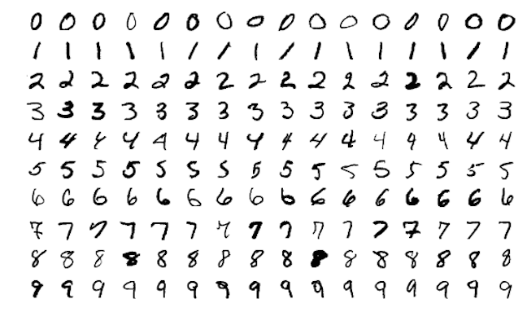
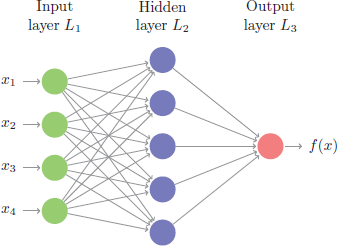
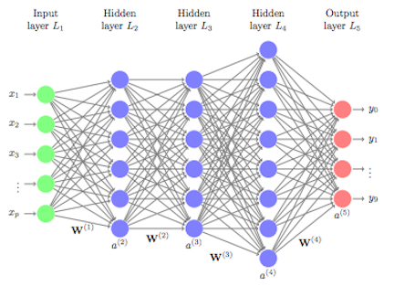

__Note__: Some results may differ from the hard copy book due to the changing of sampling procedures introduced in R 3.6.0. See http://bit.ly/35D1SW7 for more details. Access and run the source code for this notebook [here](https://rstudio.cloud/project/801185). Do to output size, most of this
chapter's code chunks should not be ran on RStudio Cloud.

Hidden chapter requirements used in the book to set the plotting theme and load packages used in hidden code chunks:

```{r setup}
library(ggplot2)
library(tidyr)
library(stringr)
library(purrr)

# Set the graphical theme
ggplot2::theme_set(ggplot2::theme_light())

# Set global knitr chunk options
knitr::opts_chunk$set(
  cache = FALSE,
  warning = FALSE, 
  message = FALSE
)
```

## Prerequisites

__Note:__ you may need to install tensorflow if you have not done so before. You
can do so by executing `keras::install_keras()`. See https://keras.rstudio.com/articles/getting_started.html
for more details.

```{r pkg-req, cache=FALSE}
# Helper packages
library(dplyr)         # for basic data wrangling

# Modeling packages
library(keras)         # for fitting DNNs
library(tfruns)        # for additional grid search & model training functions

# Modeling helper package - not necessary for reproducibility
library(tfestimators)  # provides grid search & model training interface
```

We'll use the MNIST data to illustrate various DNN concepts.

```{r DL-prep-mnist-data}
# Import MNIST training data
mnist <- dslabs::read_mnist()
mnist_x <- mnist$train$images
mnist_y <- mnist$train$labels

# Rename columns and standardize feature values
colnames(mnist_x) <- paste0("V", 1:ncol(mnist_x))
mnist_x <- mnist_x / 255

# One-hot encode response
mnist_y <- to_categorical(mnist_y, 10)
```

## Why deep learning

Figure 13.1:

```{r mnist-numbers, echo=TRUE, out.height="60%", out.width="60%", fig.cap="Sample images from MNIST test dataset \\citep{wikiMNIST}."}

```

Figure 13.2:

```{r basic-neural-net, out.height="60%", out.width="60%", echo=TRUE, fig.cap="Representation of a simple feedforward neural network."}

```

Figure 13.3:

```{r deep-neural-net, echo=TRUE, out.height="60%", out.width="60%", fig.cap="Representation of a deep feedforward neural network."}

```

## Feedforward DNNs

Figure 13.4:

```{r mlp-network, echo=TRUE, out.height="60%", out.width="60%", fig.cap="Feedforward neural network."}
knitr::include_graphics("images/mlp_network.png")
```

## Network architecture

#### Implementation

The __keras__ package allows us to develop our network with a layering approach.  First, we initiate our sequential feedforward DNN architecture with `keras_model_sequential()` and then add some dense layers.  This example creates two hidden layers, the first with 128 nodes and the second with 64, followed by an output layer with 10 nodes.  One thing to point out is that the first layer needs the `input_shape` argument to equal the number of features in your data; however, the successive layers are able to dynamically interpret the number of expected inputs based on the previous layer.

```{r architecture}
model <- keras_model_sequential() %>%
  layer_dense(units = 128, input_shape = ncol(mnist_x)) %>%
  layer_dense(units = 64) %>%
  layer_dense(units = 10)
```

#### Activation functions

Figure 13.5:  

```{r perceptron-node, echo=TRUE, out.height="60%", out.width="60%", fig.cap="Flow of information in an artificial neuron."}
knitr::include_graphics("images/perceptron_node.png")
```

#### Implementation

```{r activation-arguments}
model <- keras_model_sequential() %>%
  layer_dense(units = 128, activation = "relu", input_shape = ncol(mnist_x)) %>%
  layer_dense(units = 64, activation = "relu") %>%
  layer_dense(units = 10, activation = "softmax")
```


## Backpropagation

```{r backpropagation}
model <- keras_model_sequential() %>%
  
  # Network architecture
  layer_dense(units = 128, activation = "relu", input_shape = ncol(mnist_x)) %>%
  layer_dense(units = 64, activation = "relu") %>%
  layer_dense(units = 10, activation = "softmax") %>%
  
  # Backpropagation
  compile(
    loss = 'categorical_crossentropy',
    optimizer = optimizer_rmsprop(),
    metrics = c('accuracy')
  )
```


## Model training

```{r model-train, fig.height=5, fig.width=7, fig.cap="Training and validation performance over 25 epochs."}
# Train the model
fit1 <- model %>%
  fit(
    x = mnist_x,
    y = mnist_y,
    epochs = 25,
    batch_size = 128,
    validation_split = 0.2,
    verbose = FALSE
  )

# Display output
fit1
plot(fit1)
```


## Model tuning

### Model capacity

Table 13.1:

```{r one-hot, echo=TRUE}
library(knitr)
library(kableExtra)

data_frame(
  Size = c("small", "medium", "large"), 
  `1` = c("16", "64", "256"),
  `2` = c("16, 8", "64, 32", "256, 128"),
  `3` = c("16, 8, 4", "64, 32, 16", "256, 128, 64")
) %>%
  kable(align = "c", caption = "Model capacities assessed represented as number of layers and nodes per layer.") %>%
  add_header_above(c(" ", "Hidden Layers" = 3)) %>%
  kable_styling(bootstrap_options = "striped", full_width = FALSE)
```

Figure 13.7:

```{r model-capacity}
compiler <- function(object) {
  compile(
    object,
    loss = 'categorical_crossentropy',
    optimizer = optimizer_rmsprop(),
    metrics = c('accuracy')
  )
}

trainer <- function(object) {
  fit(
    object,
    x = mnist_x,
    y = mnist_y,
    epochs = 25,
    batch_size = 128,
    validation_split = .2,
    verbose = FALSE
    )
}

# One layer models -------------------------------------------------------------
# small capacity model
`1 layer_small` <- keras_model_sequential() %>%
  layer_dense(units = 16, activation = "relu", input_shape = ncol(mnist_x)) %>%
  layer_dense(units = 10, activation = "softmax") %>%
  compiler() %>%
  trainer()

# medium
`1 layer_medium` <- keras_model_sequential() %>%
  layer_dense(units = 64, activation = "relu", input_shape = ncol(mnist_x)) %>%
  layer_dense(units = 10, activation = "softmax") %>%
  compiler() %>%
  trainer()

# large
`1 layer_large` <- keras_model_sequential() %>%
  layer_dense(units = 256, activation = "relu", input_shape = ncol(mnist_x)) %>%
  layer_dense(units = 10, activation = "softmax") %>%
  compiler() %>%
  trainer()

# Two layer models -------------------------------------------------------------
# small capacity model
`2 layer_small` <- keras_model_sequential() %>%
  layer_dense(units = 16, activation = "relu", input_shape = ncol(mnist_x)) %>%
  layer_dense(units = 8, activation = "relu") %>%
  layer_dense(units = 10, activation = "softmax") %>%
  compiler() %>%
  trainer()

# medium
`2 layer_medium` <- keras_model_sequential() %>%
  layer_dense(units = 64, activation = "relu", input_shape = ncol(mnist_x)) %>%
  layer_dense(units = 32, activation = "relu") %>%
  layer_dense(units = 10, activation = "softmax") %>%
  compiler() %>%
  trainer()

# large
`2 layer_large` <- keras_model_sequential() %>%
  layer_dense(units = 256, activation = "relu", input_shape = ncol(mnist_x)) %>%
  layer_dense(units = 128, activation = "relu") %>%
  layer_dense(units = 10, activation = "softmax") %>%
  compiler() %>%
  trainer()

# Three layer models -------------------------------------------------------------
# small capacity model
`3 layer_small` <- keras_model_sequential() %>%
  layer_dense(units = 16, activation = "relu", input_shape = ncol(mnist_x)) %>%
  layer_dense(units = 8, activation = "relu") %>%
  layer_dense(units = 4, activation = "relu") %>%
  layer_dense(units = 10, activation = "softmax") %>%
  compiler() %>%
  trainer()

# medium
`3 layer_medium` <- keras_model_sequential() %>%
  layer_dense(units = 64, activation = "relu", input_shape = ncol(mnist_x)) %>%
  layer_dense(units = 32, activation = "relu") %>%
  layer_dense(units = 16, activation = "relu") %>%
  layer_dense(units = 10, activation = "softmax") %>%
  compiler() %>%
  trainer()

# large
`3 layer_large` <- keras_model_sequential() %>%
  layer_dense(units = 256, activation = "relu", input_shape = ncol(mnist_x)) %>%
  layer_dense(units = 128, activation = "relu") %>%
  layer_dense(units = 64, activation = "relu") %>%
  layer_dense(units = 10, activation = "softmax") %>%
  compiler() %>%
  trainer()

models <- ls(pattern = "layer_") 
df <- models %>%
  map(get) %>%
  map(~ data.frame(
    `Validation error` = .$metrics$val_loss,
    `Training error`   = .$metrics$loss,
    epoch = seq_len(.$params$epoch)
    )) %>%
  map2_df(models, ~ mutate(.x, model = .y)) %>%
  separate(model, into = c("Middle layers", "Number of nodes"), sep = "_") %>%
  gather(Validation, Loss, Validation.error:Training.error) %>%
  mutate(
    Validation = str_replace_all(Validation, "\\.", " "),
    `Number of nodes` = factor(`Number of nodes`, levels = c("small", "medium", "large"))
    )

best <- df %>% 
  filter(Validation == "Validation error") %>%
  group_by(`Middle layers`, `Number of nodes`) %>% 
  filter(Loss == min(Loss)) %>%
  mutate(label = paste("Min validation error:", round(Loss, 4)))

ggplot(df, aes(epoch, Loss)) +
  geom_hline(data = best, aes(yintercept = Loss), lty = "dashed", color = "grey50") +
  geom_text(data = best, aes(x = 25, y = 0.95, label = label), size = 4, hjust = 1, vjust = 1) + 
  geom_point(aes(color = Validation)) +
  geom_line(aes(color = Validation)) +
  facet_grid(`Number of nodes` ~ `Middle layers`, scales = "free_y") +
  scale_y_continuous(limits = c(0, 1)) +
  theme(legend.title = element_blank(),
        legend.position = "top") +
  xlab("Epoch")
```


### Batch normalization

```{r batch-norm}
model_w_norm <- keras_model_sequential() %>%
  
  # Network architecture with batch normalization
  layer_dense(units = 256, activation = "relu", input_shape = ncol(mnist_x)) %>%
  layer_batch_normalization() %>%
  layer_dense(units = 128, activation = "relu") %>%
  layer_batch_normalization() %>%
  layer_dense(units = 64, activation = "relu") %>%
  layer_batch_normalization() %>%
  layer_dense(units = 10, activation = "softmax") %>%

  # Backpropagation
  compile(
    loss = "categorical_crossentropy",
    optimizer = optimizer_rmsprop(),
    metrics = c("accuracy")
  )
```

Figure 13.8:

```{r model-capacity-with-batch-norm, echo=TRUE, eval=TRUE}
# One layer models -------------------------------------------------------------
# small capacity model
`1 layer_small` <- keras_model_sequential() %>%
  layer_dense(units = 16, activation = "relu", input_shape = ncol(mnist_x)) %>%
  layer_batch_normalization() %>%
  layer_dense(units = 10, activation = "softmax") %>%
  compiler() %>%
  trainer()

# medium
`1 layer_medium` <- keras_model_sequential() %>%
  layer_dense(units = 64, activation = "relu", input_shape = ncol(mnist_x)) %>%
  layer_batch_normalization() %>%
  layer_dense(units = 10, activation = "softmax") %>%
  compiler() %>%
  trainer()

# large
`1 layer_large` <- keras_model_sequential() %>%
  layer_dense(units = 256, activation = "relu", input_shape = ncol(mnist_x)) %>%
  layer_batch_normalization() %>%
  layer_dense(units = 10, activation = "softmax") %>%
  compiler() %>%
  trainer()

# Two layer models -------------------------------------------------------------
# small capacity model
`2 layer_small` <- keras_model_sequential() %>%
  layer_dense(units = 16, activation = "relu", input_shape = ncol(mnist_x)) %>%
  layer_batch_normalization() %>%
  layer_dense(units = 8, activation = "relu") %>%
  layer_batch_normalization() %>%
  layer_dense(units = 10, activation = "softmax") %>%
  compiler() %>%
  trainer()

# medium
`2 layer_medium` <- keras_model_sequential() %>%
  layer_dense(units = 64, activation = "relu", input_shape = ncol(mnist_x)) %>%
  layer_batch_normalization() %>%
  layer_dense(units = 32, activation = "relu") %>%
  layer_batch_normalization() %>%
  layer_dense(units = 10, activation = "softmax") %>%
  compiler() %>%
  trainer()

# large
`2 layer_large` <- keras_model_sequential() %>%
  layer_dense(units = 256, activation = "relu", input_shape = ncol(mnist_x)) %>%
  layer_batch_normalization() %>%
  layer_dense(units = 128, activation = "relu") %>%
  layer_batch_normalization() %>%
  layer_dense(units = 10, activation = "softmax") %>%
  compiler() %>%
  trainer()

# Three layer models -------------------------------------------------------------
# small capacity model
`3 layer_small` <- keras_model_sequential() %>%
  layer_dense(units = 16, activation = "relu", input_shape = ncol(mnist_x)) %>%
  layer_batch_normalization() %>%
  layer_dense(units = 8, activation = "relu") %>%
  layer_batch_normalization() %>%
  layer_dense(units = 4, activation = "relu") %>%
  layer_batch_normalization() %>%
  layer_dense(units = 10, activation = "softmax") %>%
  compiler() %>%
  trainer()

# medium
`3 layer_medium` <- keras_model_sequential() %>%
  layer_dense(units = 64, activation = "relu", input_shape = ncol(mnist_x)) %>%
  layer_batch_normalization() %>%
  layer_dense(units = 32, activation = "relu") %>%
  layer_batch_normalization() %>%
  layer_dense(units = 16, activation = "relu") %>%
  layer_batch_normalization() %>%
  layer_dense(units = 10, activation = "softmax") %>%
  compiler() %>%
  trainer()

# large
`3 layer_large` <- keras_model_sequential() %>%
  layer_dense(units = 256, activation = "relu", input_shape = ncol(mnist_x)) %>%
  layer_batch_normalization() %>%
  layer_dense(units = 128, activation = "relu") %>%
  layer_batch_normalization() %>%
  layer_dense(units = 64, activation = "relu") %>%
  layer_batch_normalization() %>%
  layer_dense(units = 10, activation = "softmax") %>%
  compiler() %>%
  trainer()

models <- ls(pattern = "layer_") 
df_batch <- models %>%
  map(get) %>%
  map(~ data.frame(
    `Validation error` = .$metrics$val_loss,
    `Training error`   = .$metrics$loss,
    epoch = seq_len(.$params$epoch)
    )) %>%
  map2_df(models, ~ mutate(.x, model = .y)) %>%
  separate(model, into = c("Middle layers", "Number of nodes"), sep = "_") %>%
  gather(Validation, Loss, Validation.error:Training.error) %>%
  mutate(
    Validation = str_replace_all(Validation, "\\.", " "),
    `Number of nodes` = factor(`Number of nodes`, levels = c("small", "medium", "large")),
    `Batch normalization` = TRUE
    )
```

Figure 13.8 (continued):

```{r model-capacity-with-batch-norm-plot, echo=TRUE, fig.width=12, fig.height=8, fig.cap="The effect of batch normalization on validation loss for various model capacities."}
df2 <- df %>%
  mutate(`Batch normalization` = FALSE) %>%
  bind_rows(df_batch) %>% 
  filter(Validation == "Validation error")

best <- df2 %>% 
  filter(Validation == "Validation error") %>%
  group_by(`Middle layers`, `Number of nodes`) %>% 
  filter(Loss == min(Loss)) %>%
  mutate(label = paste("Min validation error:", round(Loss, 4)))

ggplot(df2, aes(epoch, Loss, color = `Batch normalization`)) + 
  geom_text(data = best, aes(x = 25, y = 0.95, label = label), size = 4, hjust = 1, vjust = 1) + 
  geom_point() +
  geom_line() +
  facet_grid(`Number of nodes` ~ `Middle layers`, scales = "free_y") +
  scale_y_continuous(limits = c(0, 1)) +
  xlab("Epoch") +
  scale_color_discrete("Batch normalization") +
  theme(legend.position = "top")
```


### Regularization

```{r regularization-with-penalty, eval=TRUE}
model_w_reg <- keras_model_sequential() %>%
  
  # Network architecture with L1 regularization and batch normalization
  layer_dense(units = 256, activation = "relu", input_shape = ncol(mnist_x),
              kernel_regularizer = regularizer_l2(0.001)) %>%
  layer_batch_normalization() %>%
  layer_dense(units = 128, activation = "relu", 
              kernel_regularizer = regularizer_l2(0.001)) %>%
  layer_batch_normalization() %>%
  layer_dense(units = 64, activation = "relu", 
              kernel_regularizer = regularizer_l2(0.001)) %>%
  layer_batch_normalization() %>%
  layer_dense(units = 10, activation = "softmax") %>%

  # Backpropagation
  compile(
    loss = "categorical_crossentropy",
    optimizer = optimizer_rmsprop(),
    metrics = c("accuracy")
  )
```

```{r dropout, eval=TRUE}
model_w_drop <- keras_model_sequential() %>%
  
  # Network architecture with 20% dropout
  layer_dense(units = 256, activation = "relu", input_shape = ncol(mnist_x)) %>%
  layer_dropout(rate = 0.2) %>%
  layer_dense(units = 128, activation = "relu") %>%
  layer_dropout(rate = 0.2) %>%
  layer_dense(units = 64, activation = "relu") %>%
  layer_dropout(rate = 0.2) %>%
  layer_dense(units = 10, activation = "softmax") %>%

  # Backpropagation
  compile(
    loss = "categorical_crossentropy",
    optimizer = optimizer_rmsprop(),
    metrics = c("accuracy")
  )
```

Figure 13.9:

```{r model-with-regularization, echo=TRUE, eval=TRUE}
fit_baseline <- keras_model_sequential() %>%
  layer_dense(units = 256, activation = "relu", input_shape = ncol(mnist_x)) %>%
  layer_dense(units = 128, activation = "relu") %>%
  layer_dense(units = 64, activation = "relu") %>%
  layer_dense(units = 10, activation = "softmax") %>%
  compiler() %>%
  fit(
    x = mnist_x,
    y = mnist_y,
    epochs = 35,
    batch_size = 128,
    validation_split = 0.2,
    verbose = FALSE
  )

fit_norm <- keras_model_sequential() %>%
  layer_dense(units = 256, activation = "relu", input_shape = ncol(mnist_x)) %>%
  layer_batch_normalization() %>%
  layer_dense(units = 128, activation = "relu") %>%
  layer_batch_normalization() %>%
  layer_dense(units = 64, activation = "relu") %>%
  layer_batch_normalization() %>%
  layer_dense(units = 10, activation = "softmax") %>%
  compiler() %>%
  fit(
    x = mnist_x,
    y = mnist_y,
    epochs = 35,
    batch_size = 128,
    validation_split = 0.2,
    verbose = FALSE
  )

fit_reg <- keras_model_sequential() %>%
  layer_dense(units = 256, activation = "relu", input_shape = ncol(mnist_x)) %>%
  layer_batch_normalization() %>%
  layer_dropout(rate = 0.4) %>%
  layer_dense(units = 128, activation = "relu") %>%
  layer_batch_normalization() %>%
  layer_dropout(rate = 0.3) %>%
  layer_dense(units = 64, activation = "relu") %>%
  layer_batch_normalization() %>%
  layer_dropout(rate = 0.2) %>%
  layer_dense(units = 10, activation = "softmax") %>%
  compiler() %>%
  fit(
    x = mnist_x,
    y = mnist_y,
    epochs = 35,
    batch_size = 128,
    validation_split = 0.2,
    verbose = FALSE
  )

models <- ls(pattern = "fit_") 
df_reg <- models %>%
  map(get) %>%
  map(~ data.frame(
    `Validation error` = .$metrics$val_loss,
    `Training error`   = .$metrics$loss,
    epoch = seq_len(.$params$epoch)
    )) %>%
  map2_df(models, ~ mutate(.x, model = .y)) %>%
  mutate(Model = case_when(
    model == "fit_baseline" ~ "Baseline",
    model == "fit_norm"     ~ "Baseline + batch normalization",
    model == "fit_reg"      ~ "Baseline + batch normalization + dropout"
  )) %>%
  gather(Validation, Loss, Validation.error:Training.error)
```

Figure 13.9 (continued):

```{r model-with-regularization-plot, echo=TRUE, fig.cap="The effect of regularization with dropout on validation loss."}
baseline <- df %>%
  filter(`Middle layers` == "3 layer", `Number of nodes` == "large") %>%
  mutate(Model = "Baseline") %>%
  select(epoch, Model, Validation, Loss)
batch <- df_batch %>%
  filter(`Middle layers` == "3 layer", `Number of nodes` == "large") %>%
  mutate(Model = "Baseline + batch normalization") %>%
  select(epoch, Model, Validation, Loss)
df_reg <- df_reg %>%
  select(-model) %>%
  filter(Model == "Baseline + batch normalization + dropout") %>%
  mutate(Validation = stringr::str_replace_all(Validation, "\\.", " ")) %>%
  bind_rows(batch, baseline)

best <- df_reg %>% 
  filter(Validation == "Validation error") %>%
  group_by(Model) %>% 
  filter(Loss == min(Loss)) %>%
  mutate(label = paste("Min validation error:", round(Loss, 4)))

ggplot(df_reg, aes(epoch, Loss)) + 
  geom_text(data = best, aes(x = 35, y = 0.49, label = label), size = 4, hjust = 1, vjust = 1) +
  geom_point(aes(color = Validation)) +
  geom_line(aes(color = Validation)) +
  facet_wrap(~ Model) +
  xlab("Epoch") +
  theme(legend.title = element_blank(),
        legend.position = "top")
```


### Adjust learning rate

Figure 13.10:

```{r local-vs-global, echo=TRUE, fig.width=4.5, fig.height=2.5, fig.cap="A local minimum and a global minimum."}
set.seed(123)  # for reproducibility
x <- seq(from = 0, to = 4.25 * pi, length = 100)
y <- sin(x) - x*.2
df <- data.frame(x, y)

global <- filter(df, y == min(y))
local  <- df %>% 
  filter(x < 6) %>% 
  filter(y == min(y))

ggplot(df, aes(x, y)) +
  geom_line(size = 1.5, alpha = 0.5) +
  scale_y_continuous("Loss function", expand = c(0, 0.08)) +
  scale_x_continuous("Parameter value", expand = c(0.08, 0)) +
  theme(
    axis.ticks = element_blank(),
    axis.text = element_blank(),
    panel.grid = element_blank(),
    panel.border = element_blank()
  ) +
  geom_segment(aes(x = min(x) - 0.5, xend = max(x) , y = min(y) - 0.5, yend = min(y) - 0.5), 
               arrow = arrow(length = unit(0.2, "cm")), color = "grey30") +
  geom_segment(aes(x = min(x) - 0.5, xend = min(x) - 0.5 , y = min(y) - 0.5, yend = max(y)), 
               arrow = arrow(length = unit(0.2, "cm")), color = "grey30") +
  geom_point(data = global, aes(x, y), size = 4, shape = 21, fill = "yellow") +
  geom_point(data = local, aes(x, y), size = 4, shape = 21, fill = "blue") +
  annotate("text", x = global$x, y = global$y, label = "Global minimum", vjust = 2, size = 3) +
  annotate("text", x = local$x, y = local$y, label = "Local minimum", vjust = 2, size = 3)
```

```{r adj-lrn-rate, fig.cap="Training and validation performance on our 3-layer large network with dropout, adjustable learning rate, and using an Adam mini-batch SGD optimizer."}
model_w_adj_lrn <- keras_model_sequential() %>%
  layer_dense(units = 256, activation = "relu", input_shape = ncol(mnist_x)) %>%
  layer_batch_normalization() %>%
  layer_dropout(rate = 0.4) %>%
  layer_dense(units = 128, activation = "relu") %>%
  layer_batch_normalization() %>%
  layer_dropout(rate = 0.3) %>%
  layer_dense(units = 64, activation = "relu") %>%
  layer_batch_normalization() %>%
  layer_dropout(rate = 0.2) %>%
  layer_dense(units = 10, activation = "softmax") %>%
  compile(
    loss = 'categorical_crossentropy',
    optimizer = optimizer_adam(),
    metrics = c('accuracy')
  ) %>%
  fit(
    x = mnist_x,
    y = mnist_y,
    epochs = 35,
    batch_size = 128,
    validation_split = 0.2,
    callbacks = list(
      callback_early_stopping(patience = 5),
      callback_reduce_lr_on_plateau(factor = 0.05)
      ),
    verbose = FALSE
  )

model_w_adj_lrn

# Optimal
min(model_w_adj_lrn$metrics$val_loss)
max(model_w_adj_lrn$metrics$val_acc)

# Learning rate
plot(model_w_adj_lrn)
```


## Grid Search

This grid search requires the [mnist-grid-search.R](http://bit.ly/mnist-grid-search)
file to be located a `/scrips` directory within your current working directory.

__WARNING: The following grid search took us over 1.5 hours to run!__

```{r}
# Run various combinations of dropout1 and dropout2
runs <- tuning_run("scripts/mnist-grid-search.R", 
  flags = list(
    nodes1 = c(64, 128, 256),
    nodes2 = c(64, 128, 256),
    nodes3 = c(64, 128, 256),
    dropout1 = c(0.2, 0.3, 0.4),
    dropout2 = c(0.2, 0.3, 0.4),
    dropout3 = c(0.2, 0.3, 0.4),
    optimizer = c("rmsprop", "adam"),
    lr_annealing = c(0.1, 0.05)
  ),
  sample = 0.05
)

runs %>% 
  filter(metric_val_loss == min(metric_val_loss)) %>% 
  glimpse()
```