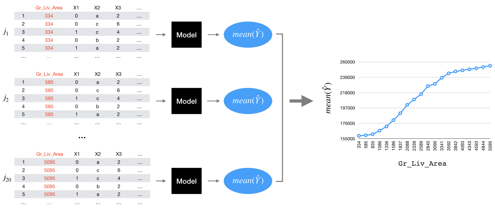
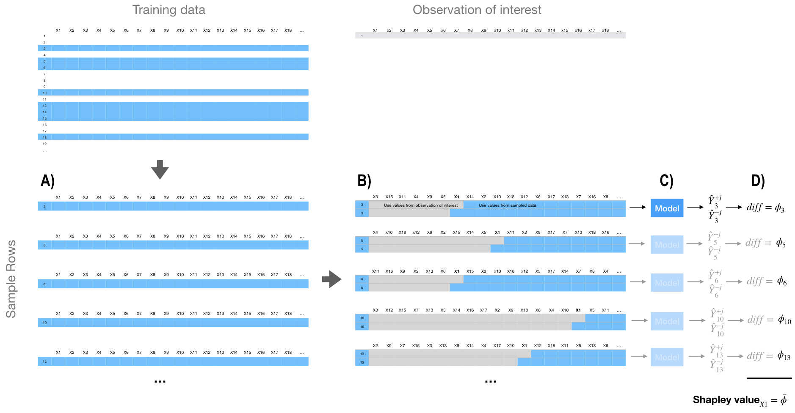

__Note__: Some results may differ from the hard copy book due to the changing of sampling procedures introduced in R 3.6.0. See http://bit.ly/35D1SW7 for more details. Access and run the source code for this notebook [here](https://rstudio.cloud/project/801185). Do to output size, most of this
chapter's code chunks should not be ran on RStudio Cloud.

Hidden chapter requirements used in the book to set the plotting theme and load packages used in hidden code chunks:

```{r setup}
knitr::opts_chunk$set(
  message = FALSE, 
  warning = FALSE, 
  cache = FALSE
)

# Set the graphical theme
ggplot2::theme_set(ggplot2::theme_light())
```

## Prerequisites

```{r iml-pkg-prereqs}
# Helper packages
library(dplyr)      # for data wrangling
library(ggplot2)    # for awesome graphics

# Modeling packages
library(h2o)       # for interfacing with H2O
library(recipes)   # for ML recipes
library(rsample)   # for data splitting
library(xgboost)   # for fitting GBMs

# Model interpretability packages
library(pdp)       # for partial dependence plots (and ICE curves)
library(vip)       # for variable importance plots
library(iml)       # for general IML-related functions
library(DALEX)     # for general IML-related functions
library(lime)      # for local interpretable model-agnostic explanations
```

To illustrate various concepts we'll continue working with the __h2o__ version of the Ames housing data. We'll also use the stacked ensemble model created [here](https://koalaverse.github.io/homlr/notebooks/15-stacking-models.nb.html#stacking-existing-models).

```{r iml-data-prereqs}
# Connect to H2O
h2o.no_progress()
h2o.init(max_mem_size = "5g")

# Load and split Ames housing data
ames <- AmesHousing::make_ames()
set.seed(123)  # for reproducibility
split <- initial_split(ames, strata = "Sale_Price")
ames_train <- training(split)
ames_test <- testing(split)

# Make sure we have consistent categorical levels
blueprint <- recipe(Sale_Price ~ ., data = ames_train) %>%
  step_other(all_nominal(), threshold = .005)

# Create training & test sets
train_h2o <- prep(blueprint, training = ames_train, retain = TRUE) %>%
  juice() %>%
  as.h2o()
test_h2o <- prep(blueprint, training = ames_train) %>%
  bake(new_data = ames_test) %>%
  as.h2o()

# Get names of response and features
Y <- "Sale_Price"
X <- setdiff(names(ames_train), Y)
```

```{r train-h2o-models}
# Train & cross-validate a GLM model
best_glm <- h2o.glm(
  x = X, y = Y, training_frame = train_h2o, alpha = 0.1,
  remove_collinear_columns = TRUE, nfolds = 10, fold_assignment = "Modulo",
  keep_cross_validation_predictions = TRUE, seed = 123
)

# Train & cross-validate a RF model
best_rf <- h2o.randomForest(
  x = X, y = Y, training_frame = train_h2o, ntrees = 1000, mtries = 20,
  max_depth = 30, min_rows = 1, sample_rate = 0.8, nfolds = 10,
  fold_assignment = "Modulo", keep_cross_validation_predictions = TRUE,
  seed = 123, stopping_rounds = 50, stopping_metric = "RMSE",
  stopping_tolerance = 0
)

# Train & cross-validate a GBM model
best_gbm <- h2o.gbm(
  x = X, y = Y, training_frame = train_h2o, ntrees = 5000, learn_rate = 0.01,
  max_depth = 7, min_rows = 5, sample_rate = 0.8, nfolds = 10,
  fold_assignment = "Modulo", keep_cross_validation_predictions = TRUE,
  seed = 123, stopping_rounds = 50, stopping_metric = "RMSE",
  stopping_tolerance = 0
)

# Train & cross-validate an XGBoost model
best_xgb <- h2o.xgboost(
  x = X, y = Y, training_frame = train_h2o, ntrees = 5000, learn_rate = 0.05,
  max_depth = 3, min_rows = 3, sample_rate = 0.8, categorical_encoding = "Enum",
  nfolds = 10, fold_assignment = "Modulo", 
  keep_cross_validation_predictions = TRUE, seed = 123, stopping_rounds = 50,
  stopping_metric = "RMSE", stopping_tolerance = 0
)

# Train a stacked tree ensemble
ensemble_tree <- h2o.stackedEnsemble(
  x = X, y = Y, training_frame = train_h2o, model_id = "my_tree_ensemble",
  base_models = list(best_glm, best_rf, best_gbm, best_xgb),
  metalearner_algorithm = "drf"
)
```

## The idea

### Local interpretation

```{r predictions}
predictions <- predict(ensemble_tree, train_h2o) %>% as.vector()
```

```{r}
# Compute predictions
predictions <- predict(ensemble_tree, train_h2o) %>% as.vector()

# Print the highest and lowest predicted sales price
paste("Observation", which.max(predictions), 
      "has a predicted sale price of", scales::dollar(max(predictions))) 
paste("Observation", which.min(predictions), 
      "has a predicted sale price of", scales::dollar(min(predictions)))  

# Grab feature values for observations with min/max predicted sales price
high_ob <- as.data.frame(train_h2o)[which.max(predictions), ] %>% select(-Sale_Price)
low_ob  <- as.data.frame(train_h2o)[which.min(predictions), ] %>% select(-Sale_Price)
```

### Model-specific vs. model-agnostic 

```{r creating-components}
# 1) create a data frame with just the features
features <- as.data.frame(train_h2o) %>% select(-Sale_Price)

# 2) Create a vector with the actual responses
response <- as.data.frame(train_h2o) %>% pull(Sale_Price)

# 3) Create custom predict function that returns the predicted values as a vector
pred <- function(object, newdata)  {
  results <- as.vector(h2o.predict(object, as.h2o(newdata)))
  return(results)
}

# Example of prediction output
pred(ensemble_tree, features) %>% head()
```

```{r model-agnostic-objects}
# iml model agnostic object
components_iml <- Predictor$new(
  model = ensemble_tree, 
  data = features, 
  y = response, 
  predict.fun = pred
)

# DALEX model agnostic object
components_dalex <- DALEX::explain(
  model = ensemble_tree,
  data = features,
  y = response,
  predict_function = pred
)
```


## Permutation-based feature importance

### Implementation 

```{r vip, fig.cap="Top 10 most influential variables for the stacked H2O model using permutation-based feature importance."}
vip(
  ensemble_tree,
  train = as.data.frame(train_h2o),
  method = "permute",
  target = "Sale_Price",
  metric = "RMSE",
  nsim = 5,
  sample_frac = 0.5,
  pred_wrapper = pred
)
```


## Partial dependence

### Concept

Figure 16.1:

```{r pdp-illustration, fig.cap="Illustration of the partial dependence process."}

```

### Implementation 

```{r pdp, fig.cap="Partial dependence plot for `Gr_Liv_Area` illustrating the average increase in predicted `Sale_Price` as `Gr_Liv_Area` increases."}
# Custom prediction function wrapper
pdp_pred <- function(object, newdata)  {
  results <- mean(as.vector(h2o.predict(object, as.h2o(newdata))))
  return(results)
}

# Compute partial dependence values
pd_values <- partial(
  ensemble_tree,
  train = as.data.frame(train_h2o), 
  pred.var = "Gr_Liv_Area",
  pred.fun = pdp_pred,
  grid.resolution = 20
)
head(pd_values)  # take a peak

# Partial dependence plot
autoplot(pd_values, rug = TRUE, train = as.data.frame(train_h2o))
```

## Individual conditional expectation

### Concept

Figure 16.2:

```{r ice-illustration, fig.cap="Non-centered (A) and centered (B) ICE curves for `Gr_Liv_Area` illustrating the observation-level effects (black lines) in predicted `Sale_Price` as `Gr_Liv_Area` increases. The plot also illustrates the PDP line (red), representing the average values across all observations."}

# Construct ICE curves
ice_non_centered <- partial(
  ensemble_tree,
  train = as.data.frame(train_h2o), 
  pred.var = "Gr_Liv_Area",
  pred.fun = pred,
  grid.resolution = 20
) %>%
  autoplot(alpha = 0.05, center = FALSE) +
  ggtitle("A) Non-centered ICE curves")

# Construct c-ICE curves
ice_centered <- partial(
  ensemble_tree,
  train = as.data.frame(train_h2o), 
  pred.var = "Gr_Liv_Area",
  pred.fun = pred,
  grid.resolution = 20
) %>%
  autoplot(alpha = 0.05, center = TRUE) +
  ggtitle("B) Centered ICE curves")

# Display plots side by side
gridExtra::grid.arrange(ice_non_centered, ice_centered, ncol = 2)
```

### Implementation 

```{r ice-pdp, fig.cap="Centered ICE curve for `Gr_Liv_Area` illustrating the observation-level effects in predicted `Sale_Price` as `Gr_Liv_Area` increases."}
# Construct c-ICE curves
partial(
  ensemble_tree,
  train = as.data.frame(train_h2o), 
  pred.var = "Gr_Liv_Area",
  pred.fun = pred,
  grid.resolution = 20,
  plot = TRUE,
  center = TRUE,
  plot.engine = "ggplot2"
)
```


## Feature interactions

### Implementation

```{r h-stat, fig.height=10}
interact <- Interaction$new(components_iml)

interact$results %>% 
  arrange(desc(.interaction)) %>% 
  head()

plot(interact)
```

```{r h-stat-2way, fig.height=10}
interact_2way <- Interaction$new(components_iml, feature = "First_Flr_SF")
interact_2way$results %>% 
  arrange(desc(.interaction)) %>% 
  top_n(10)
```

```{r interaction-pdp}
# Two-way PDP using iml
interaction_pdp <- Partial$new(
  components_iml, 
  c("First_Flr_SF", "Overall_Qual"), 
  ice = FALSE, 
  grid.size = 20
)
```

```{r interaction-pdp2, fig.cap="Interaction PDP illustrating the joint effect of `First_Flr_SF` and `Overall_Qual` on `Sale_Price`."}
labels <- interaction_pdp$results %>% filter(First_Flr_SF == max(First_Flr_SF))
plot(interaction_pdp) + 
  ggrepel::geom_label_repel(
    data = labels, 
    aes(label = Overall_Qual),
    label.size = .05, 
    label.padding = .15
  )
```

## Local interpretable model-agnostic explanations

### Implementation 

```{r lime_explainer}
# Create explainer object
components_lime <- lime(
  x = features,
  model = ensemble_tree, 
  n_bins = 10
)

class(components_lime)
summary(components_lime)
```

```{r lime-explain1}
# Use LIME to explain previously defined instances: high_ob and low_ob
lime_explanation <- lime::explain(
  x = rbind(high_ob, low_ob), 
  explainer = components_lime, 
  n_permutations = 5000,
  dist_fun = "gower",
  kernel_width = 0.25,
  n_features = 10, 
  feature_select = "highest_weights"
)
```

```{r}
glimpse(lime_explanation)
```

```{r first-lime-fit, fig.cap="Local explanation for observations 1825 (`high_ob`) and 139 (`low_ob`) using LIME."}
plot_features(lime_explanation, ncol = 1)
```

### Tuning

```{r lime-explain2, fig.cap="Local explanation for observations 1825 (case 1) and 139 (case 2) after tuning the LIME algorithm."}
# Tune the LIME algorithm a bit
lime_explanation2 <- explain(
  x = rbind(high_ob, low_ob), 
  explainer = components_lime, 
  n_permutations = 5000,
  dist_fun = "euclidean",
  kernel_width = 0.75,
  n_features = 10, 
  feature_select = "lasso_path"
)

# Plot the results
plot_features(lime_explanation2, ncol = 1)
```

## Shapley values

### Concept

Figure 16.8:

```{r shapley-idea, fig.cap="Generalized concept behind approximate Shapley value computation.", out.height='95%', out.width='95%'}

```

### Implementation 

```{r shapley, fig.cap="Local explanation for observation 1825 using the Shapley value algorithm.", fig.height=10}
# Compute (approximate) Shapley values
(shapley <- Shapley$new(components_iml, x.interest = high_ob, sample.size = 1000))

# Plot results
plot(shapley)
```


```{r shapley2, fig.cap="Local explanation for observation 139 using the Shapley value algorithm."}
# Reuse existing object
shapley$explain(x.interest = low_ob)

# Plot results
shapley$results %>%
  top_n(25, wt = abs(phi)) %>%
  ggplot(aes(phi, reorder(feature.value, phi), color = phi > 0)) +
  geom_point(show.legend = FALSE)
```

### XGBoost and built-in Shapley values

```{r import-xgboost}
# Compute tree SHAP for a previously obtained XGBoost model
X <- readr::read_rds("data/xgb-features.rds")
xgb.fit.final <- readr::read_rds("data/xgb-fit-final.rds")
```

```{r shap-vip, fig.cap="Shapley contribution (left) and global importance (right) plots.", fig.height=10}
# Try to re-scale features (low to high)
feature_values <- X %>%
  as.data.frame() %>%
  mutate_all(scale) %>%
  gather(feature, feature_value) %>% 
  pull(feature_value)

# Compute SHAP values, wrangle a bit, compute SHAP-based importance, etc.
shap_df <- xgb.fit.final %>%
  predict(newdata = X, predcontrib = TRUE) %>%
  as.data.frame() %>%
  select(-BIAS) %>%
  gather(feature, shap_value) %>%
  mutate(feature_value = feature_values) %>%
  group_by(feature) %>%
  mutate(shap_importance = mean(abs(shap_value)))

# SHAP contribution plot
p1 <- ggplot(shap_df, aes(x = shap_value, y = reorder(feature, shap_importance))) +
  ggbeeswarm::geom_quasirandom(groupOnX = FALSE, varwidth = TRUE, size = 0.4, alpha = 0.25) +
  xlab("SHAP value") +
  ylab(NULL)

# SHAP importance plot
p2 <- shap_df %>% 
  select(feature, shap_importance) %>%
  filter(row_number() == 1) %>%
  ggplot(aes(x = reorder(feature, shap_importance), y = shap_importance)) +
    geom_col() +
    coord_flip() +
    xlab(NULL) +
    ylab("mean(|SHAP value|)")

# Combine plots
gridExtra::grid.arrange(p1, p2, nrow = 1)
```

```{r shap-pdp, fig.cap="Shapley-based dependence plot illustrating the variability in contribution across the range of `Gr_Liv_Area` and `Overall_Qual` values."}
shap_df %>% 
  filter(feature %in% c("Overall_Qual", "Gr_Liv_Area")) %>%
  ggplot(aes(x = feature_value, y = shap_value)) +
    geom_point(aes(color = shap_value)) +
    scale_colour_viridis_c(name = "Feature value\n(standardized)", option = "C") +
    facet_wrap(~ feature, scales = "free") +
    scale_y_continuous('Shapley value', labels = scales::comma) +
    xlab('Normalized feature value')
```

## Localized step-wise procedure

### Implementation 

```{r breakdown}
high_breakdown <- prediction_breakdown(components_dalex, observation = high_ob)

# class of prediction_breakdown output
class(high_breakdown)

# check out the top 10 influential variables for this observation
high_breakdown[1:10, 1:5]
```

```{r}
h2o.shutdown(prompt = FALSE)
```

