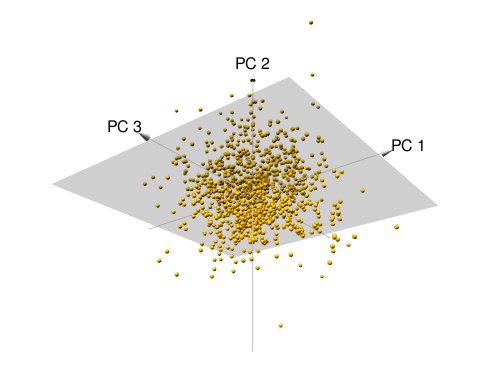

__Note__: Some results may differ from the hard copy book due to the changing of sampling procedures introduced in R 3.6.0. See http://bit.ly/35D1SW7 for more details. Access and run the source code for this notebook [here](https://rstudio.cloud/project/801185).

Hidden chapter requirements used in the book to set the plotting theme and load packages used in hidden code chunks:

```{r setup}
knitr::opts_chunk$set(
  message = FALSE, 
  warning = FALSE, 
  cache = FALSE
)

# Set the graphical theme
ggplot2::theme_set(ggplot2::theme_light())

# packages for hidden code chunks
library(kableExtra)
library(pca3d)
```

## Prerequisites

This chapter leverages the following packages:

```{r pca-pkg-prereq}
library(dplyr)       # basic data manipulation and plotting
library(ggplot2)     # data visualization
library(h2o)         # performing dimension reduction
```

To illustrate dimension reduction techniques, we'll use the `my_basket` data set:

```{r pca-data-prereq}
url <- "https://koalaverse.github.io/homlr/data/my_basket.csv"
my_basket <- readr::read_csv(url)
dim(my_basket)  
```

## The idea

Table 17.1:

```{r unsupervised-correlation, fig.height=5, fig.cap="Top 10 variables containing the strongest correlation with at least one other feature."}
# compute feature correlation
m <- cor(my_basket)

# plot features with highest correlations
data.frame(
  row = rownames(m)[row(m)[upper.tri(m)]],
  col = colnames(m)[col(m)[upper.tri(m)]],
  corr = m[upper.tri(m)],
  stringsAsFactors = FALSE
  ) %>%
  filter(corr < 1 & corr > .25) %>%
  rename(`Item 1` = row, `Item 2` = col, Correlation = corr) %>%
  mutate(Correlation = round(Correlation, 3)) %>%
  arrange(desc(Correlation)) %>%
  kable(caption = "Various items in our my basket data that are correlated.") %>%
  kable_styling(bootstrap_options = c("striped", "hover"), full_width = FALSE)
```

## Finding principal components

Figure 17.1:

```{r create-pca-image, fig.width=3.75, fig.height=2.75, fig.cap="Principal components of two features that have 0.56 correlation."}
df <- AmesHousing::make_ames() %>%
  select(var1 = First_Flr_SF, var2 = Gr_Liv_Area) %>%
  filter(var1 != var2) %>%
  mutate_all(log) %>%
  scale() %>% 
  data.frame() %>%
  filter(var1 < 4)
ggplot(df, aes(var1, var2)) +
  geom_jitter(alpha = .2, size = 1, color = "dodgerblue") +
  geom_segment(
    aes(x = 0, xend = 1.5 , y = 0, yend = 1.5),
    arrow = arrow(length = unit(0.25,"cm")), size = 0.75, color = "black"
    ) +
  annotate("text", x = 1, y = .2, label = "First principal component", size = 2.5, hjust = 0) +
  annotate("text", x = -3, y = .8, label = "Second principal component", size = 2.5, hjust = 0) +
  geom_segment(
    aes(x = 0, xend = -0.27 , y = 0, yend = .65),
    arrow = arrow(length = unit(0.25,"cm")), size = 0.75, color = "black"
    ) +
  xlab("Feature 2") +
  ylab("Feature 1") +
  theme_bw()
```

Creates Figure 17.2. Uncomment `snapshotPCA3d(file = "3D-PCA.png")` to save image
to desired location.

```{r create-3D-pca-image, warning=FALSE}
df <- AmesHousing::make_ames() %>%
  select(var1 = First_Flr_SF, var2 = Gr_Liv_Area, var3 = TotRms_AbvGrd) %>%
  filter(var1 != var2) %>%
  mutate_at(vars(var1, var2), log)

pca <- prcomp(df, scale = FALSE)
pca3d(pca)
#snapshotPCA3d(file="3D-PCA.png")
```

Imports Figure 17.2:

```{r pca-3d-plot, fig.cap="Principal components of three features.", out.height="75%", out.width="75%"}

```

## Performing PCA in R

```{r pca-h2o-init}
h2o.no_progress()  # turn off progress bars for brevity
h2o.init(max_mem_size = "5g")  # connect to H2O instance
```

```{r pca-model-1}
# convert data to h2o object
my_basket.h2o <- as.h2o(my_basket)

# run PCA
my_pca <- h2o.prcomp(
  training_frame = my_basket.h2o,
  pca_method = "GramSVD",
  k = ncol(my_basket.h2o), 
  transform = "STANDARDIZE", 
  impute_missing = TRUE,
  max_runtime_secs = 1000
)
```

```{r pca-results}
my_pca
```

```{r pca-contributions, fig.height=5, fig.cap="Feature loadings illustrating the influence that each variable has on the first principal component."}
my_pca@model$eigenvectors %>% 
  as.data.frame() %>% 
  mutate(feature = row.names(.)) %>%
  ggplot(aes(pc1, reorder(feature, pc1))) +
  geom_point()
```

```{r pc1-pc2-contributions, fig.height=4, fig.cap="Feature contribution for principal components one and two."}
my_pca@model$eigenvectors %>% 
  as.data.frame() %>% 
  mutate(feature = row.names(.)) %>%
  ggplot(aes(pc1, pc2, label = feature)) +
  geom_text()
```

## Selecting the number of principal components

### Eigenvalue criterion

```{r eigen-criterion}
# Compute eigenvalues
eigen <- my_pca@model$importance["Standard deviation", ] %>%
  as.vector() %>%
  .^2
  
# Sum of all eigenvalues equals number of variables
sum(eigen)

# Find PCs where the sum of eigenvalues is greater than or equal to 1
which(eigen >= 1)
```

Figure 17.5:

```{r eigen-criterion-plot, fig.cap="Eigenvalue criterion keeps all principal components where the sum of the eigenvalues are above or equal to a value of one.", fig.height=3.5, fig.width=9}
data.frame(
  PC = seq_along(eigen),
  Eigenvalue = unlist(eigen)
) %>%
  ggplot(aes(PC, Eigenvalue)) +
  geom_point() +
  geom_hline(yintercept = 1, lty = "dashed", color = "red") +
  scale_y_continuous(breaks = 0:6) +
  xlab("PC") +
  annotate("text", x = 15, y = 1, label = "eigenvalue criteria cutoff", color = "red", size = 5, hjust = 0, vjust = -1) 
```


### Proportion of variance explained criterion

```{r pve-cve-plot, fig.cap="PVE criterion keeps all principal components that are above or equal to a pre-specified threshold of total variability explained.", fig.height=5, fig.width=9}
# Extract and plot PVE and CVE
data.frame(
  PC  = my_pca@model$importance %>% seq_along(),
  PVE = my_pca@model$importance %>% .[2,] %>% unlist(),
  CVE = my_pca@model$importance %>% .[3,] %>% unlist()
) %>%
  tidyr::gather(metric, variance_explained, -PC) %>%
  ggplot(aes(PC, variance_explained)) +
  geom_point() +
  facet_wrap(~ metric, ncol = 1, scales = "free")
```

```{r compute-pve-silently}
ve <- data.frame(
  PC  = my_pca@model$importance %>% names(),
  PVE = my_pca@model$importance %>% .[2,] %>% unlist(),
  CVE = my_pca@model$importance %>% .[3,] %>% unlist()
)
```

```{r}
# How many PCs required to explain at least 75% of total variability
min(which(ve$CVE >= 0.75))
```

### Scree plot criterion

```{r pca-scree-plot-criterion, fig.cap="Scree plot criterion looks for the 'elbow' in the curve and keeps all principal components before the line flattens out.", fig.height=3.5, fig.width=9}
data.frame(
  PC  = my_pca@model$importance %>% seq_along,
  PVE = my_pca@model$importance %>% .[2,] %>% unlist()
) %>%
  ggplot(aes(PC, PVE, group = 1, label = PC)) +
  geom_point() +
  geom_line() +
  geom_text(nudge_y = -.002)
```

```{r}
h2o.shutdown(prompt = FALSE)
```

