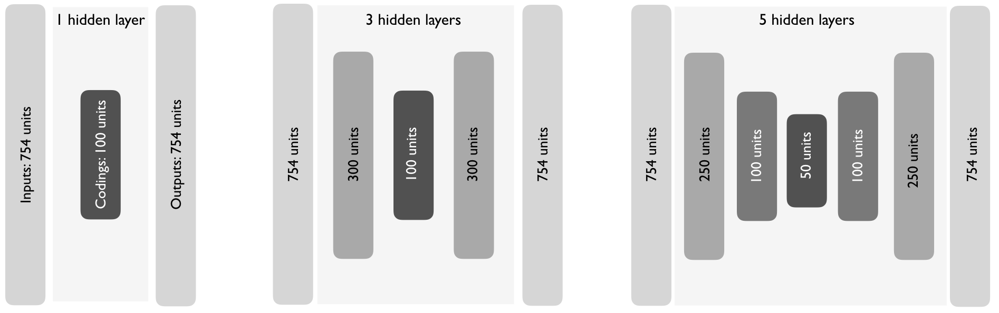

__Note__: Some results may differ from the hard copy book due to the changing of
sampling procedures introduced in R 3.6.0. See http://bit.ly/35D1SW7 for more
details. Access and run the source code for this notebook [here](https://rstudio.cloud/project/801185).
 Do to output size, most of this chapter's code chunks should not be ran on
 RStudio Cloud.
 
Hidden chapter requirements used in the book to set the plotting theme and load
packages used in hidden code chunks:

```{r setup}
knitr::opts_chunk$set(
  message = FALSE, 
  warning = FALSE, 
  cache = FALSE
)

# Set the graphical theme
ggplot2::theme_set(ggplot2::theme_light())
```

## Prerequisites

For this chapter we’ll use the following packages:

```{r autoencoder-pkgs}
# Helper packages
library(dplyr)    # for data manipulation
library(ggplot2)  # for data visualization

# Modeling packages
library(h2o)  # for fitting autoencoders
```

To illustrate autoencoder concepts we'll continue with the `mnist` data set:

```{r autoencoder-data}
mnist <- dslabs::read_mnist()
names(mnist)
```

Since we will be using __h2o__ we'll also go ahead and initialize our H2O session:

```{r h2o-startup}
h2o.no_progress()  # turn off progress bars
h2o.init(max_mem_size = "5g")  # initialize H2O instance
```


## Undercomplete autoencoders

Figure 19.1:

```{r undercomplete-architecture, fig.cap="Schematic structure of an undercomplete autoencoder with three fully connected hidden layers \\citep{wikiautoencoders}.", out.height='75%', out.width='75%'}
knitr::include_graphics("images/Autoencoder_structure.png")
```

### Comparing PCA to an autoencoder

```{r autoencoder1}
# Convert mnist features to an h2o input data set
features <- as.h2o(mnist$train$images)

# Train an autoencoder
ae1 <- h2o.deeplearning(
  x = seq_along(features),
  training_frame = features,
  autoencoder = TRUE,
  hidden = 2,
  activation = 'Tanh',
  sparse = TRUE
)

# Extract the deep features
ae1_codings <- h2o.deepfeatures(ae1, features, layer = 1)
ae1_codings
```

Figure 19.2:

```{r pca-autoencoder-projection, fig.height=4, fig.width=11, fig.cap="MNIST response variable projected onto a reduced feature space containin only two dimensions. PCA (left) forces a linear projection whereas an autoencoder with non-linear activation functions allows non-linear project."}
features <- as.h2o(mnist$train$images)

# Perform PCA
pca1 <- h2o.prcomp(
  training_frame = features,
  k = 2,
  transform = 'STANDARDIZE'
)

# Plot resulting PCs
pca_plot <- predict(pca1, features) %>%
  as.data.frame() %>%
  select(PC1, PC2) %>%
  mutate(response = factor(mnist$train$labels)) %>%
  ggplot(aes(PC1, PC2)) +
  geom_point(aes(color = response), size = 0.5, alpha = 0.25) +
  ggtitle('(A) PCA projection')

# Plot results from autoencoder
ae_plot <- ae1_codings %>%
  as.data.frame() %>%
  select(DF1 = 'DF.L1.C1', DF2 = 'DF.L1.C2') %>%
  mutate(response = factor(mnist$train$labels)) %>%
  ggplot(aes(DF1, DF2, color = response)) +
  geom_point(size = .5, alpha = .25) +
  ggtitle('(B) Autoencoder projection')

# DIsplay plots side by side
gridExtra::grid.arrange(pca_plot, ae_plot, nrow = 1)
```

### Stacked autoencoders

```{r autoencodersymmetry, out.height="98%", out.width="98%", fig.cap="As you add hidden layers to autoencoders, it is common practice to have symmetric hidden layer sizes between the encoder and decoder layers."}

```

```{r autoencoder-grid-search}
# Hyperparameter search grid
hyper_grid <- list(hidden = list(
  c(50),
  c(100), 
  c(300, 100, 300),
  c(100, 50, 100),
  c(250, 100, 50, 100, 250)
))

# Execute grid search
ae_grid <- h2o.grid(
  algorithm = 'deeplearning',
  x = seq_along(features),
  training_frame = features,
  grid_id = 'autoencoder_grid',
  autoencoder = TRUE,
  activation = 'Tanh',
  hyper_params = hyper_grid,
  sparse = TRUE,
  ignore_const_cols = FALSE,
  seed = 123
)

# Print grid details
h2o.getGrid('autoencoder_grid', sort_by = 'mse', decreasing = FALSE)
```


### Visualizing the reconstruction

```{r reconstructed-images, fig.height=6, fig.width= 5, fig.cap='Original digits (left) and their reconstructions (right).'}
# Get sampled test images
index <- sample(1:nrow(mnist$test$images), 4)
sampled_digits <- mnist$test$images[index, ]
colnames(sampled_digits) <- paste0("V", seq_len(ncol(sampled_digits)))

# Predict reconstructed pixel values
best_model_id <- ae_grid@model_ids[[1]]
best_model <- h2o.getModel(best_model_id)
reconstructed_digits <- predict(best_model, as.h2o(sampled_digits))
names(reconstructed_digits) <- paste0("V", seq_len(ncol(reconstructed_digits)))

combine <- rbind(sampled_digits, as.matrix(reconstructed_digits))

# Plot original versus reconstructed
par(mfrow = c(1, 3), mar = c(0, 0.5, 2, 0.5))
layout(matrix(seq_len(nrow(combine)), 4, 2, byrow = FALSE))
for (i in seq_len(nrow(combine))) {
  title <- switch(as.character(i), "1" = "Original digits\n", 
                  "5" = "Autoencoder reconstruction\n", NULL)
  image(matrix(combine[i, ], 28, 28)[, 28:1], 
        xaxt = "n", yaxt = "n", col = gray.colors(12, rev = TRUE),
        main = title)
} 
```

## Sparse autoencoders

```{r current-sparsity}
ae100_codings <- h2o.deepfeatures(best_model, features, layer = 1)
ae100_codings %>% 
    as.data.frame() %>% 
    tidyr::gather() %>%
    summarize(average_activation = mean(value))
```

Figure 19.5:

```{r average-activation, fig.height=6, fig.cap="The average activation of the coding neurons in our default autoencoder using a Tanh activation function."}
codings <- ae100_codings %>% 
  as.data.frame() %>% 
  tidyr::gather() %>%
  mutate(key = stringr::str_replace(key, 'DF.L1.', '')) %>%
  group_by(key) %>% 
  summarize(average_activation = mean(value)) %>% 
  arrange(desc(average_activation))
avg_activation <- summarize(codings, avg = mean(average_activation))

ggplot(codings, aes(average_activation, reorder(key, average_activation), 
                    color = average_activation > avg_activation$avg)) +
  geom_vline(xintercept = avg_activation$avg, lty = 'dashed') +
  geom_point(show.legend = FALSE, size = .75) +
  ylab("Deep feature codings") +
  xlab("Average activation") +
  theme(axis.text.y = element_text(size = 3))
```

```{r sparsity-grid-search}
# Hyperparameter search grid
hyper_grid <- list(sparsity_beta = c(0.01, 0.05, 0.1, 0.2))

# Execute grid search
ae_sparsity_grid <- h2o.grid(
  algorithm = 'deeplearning',
  x = seq_along(features),
  training_frame = features,
  grid_id = 'sparsity_grid',
  autoencoder = TRUE,
  hidden = 100,
  activation = 'Tanh',
  hyper_params = hyper_grid,
  sparse = TRUE,
  average_activation = -0.1,
  ignore_const_cols = FALSE,
  seed = 123
)

# Print grid details
h2o.getGrid('sparsity_grid', sort_by = 'mse', decreasing = FALSE)
```

Figure 19.6: 

```{r sparse-codings-images-plot, fig.height=6, fig.cap="The average activation of the coding neurons in our sparse autoencoder is now -0.108."}
best_sparse_model <- ae_sparsity_grid@model_ids[[1]] %>%
  h2o.getModel()
sparse_codings <- h2o.deepfeatures(best_sparse_model, features, layer = 1)
sparse_codings <- sparse_codings %>%
  as.data.frame() %>%
  tidyr::gather() %>%
  mutate(key = stringr::str_replace(key, 'DF.L1.', '')) %>%
  group_by(key) %>%
  summarize(average_activation = mean(value)) %>%
  arrange(desc(average_activation))

avg_activation <- summarize(sparse_codings, avg = mean(average_activation))

ggplot(sparse_codings, aes(average_activation, reorder(key, average_activation), 
                           color = average_activation > avg_activation$avg)) +
  geom_vline(xintercept = avg_activation$avg, lty = 'dashed') +
  geom_point(show.legend = FALSE, size = .75) +
  ylab("Deep feature codings") +
  xlab("Average activation") +
  theme(axis.text.y = element_text(size = 3))
```

Figure 19.7:

```{r plot-sparsity-comparisons, fig.height=6, fig.cap='Original digits sampled from the MNIST test set (left), reconstruction of sampled digits with a non-sparse autoencoder (middle), and reconstruction with a sparse autoencoder (right).'} 
# Hyperparameter search grid
hyper_grid <- list(
  sparsity_beta = c(0.01, 0.05, 0.1, 0.2),
  average_activation = c(-0.75, -0.5, -0.25)
)

# Execute grid search
ae_sparsity_grid2 <- h2o.grid(
  algorithm = 'deeplearning',
  x = seq_along(features),
  training_frame = features,
  grid_id = 'sparsity_grid2',
  autoencoder = TRUE,
  hidden = 100,
  activation = 'Tanh',
  hyper_params = hyper_grid,
  sparse = TRUE,
  ignore_const_cols = FALSE,
  seed = 123
)

grid_perf <- h2o.getGrid('sparsity_grid2', sort_by = 'mse', decreasing = FALSE)

# get best models for each level of sparsity
sparse_25 <- grid_perf@model_ids[[3]] %>% h2o.getModel()
sparse_50 <- grid_perf@model_ids[[1]] %>% h2o.getModel()
sparse_75 <- grid_perf@model_ids[[2]] %>% h2o.getModel()

# get sampled test images
sampled_digits <- mnist$test$images[index, ]

# predict reconstructed pixel values
reconstructed_digits_25 <- predict(sparse_25, as.h2o(sampled_digits))
reconstructed_digits_50 <- predict(sparse_50, as.h2o(sampled_digits))
reconstructed_digits_75 <- predict(sparse_75, as.h2o(sampled_digits))

# consistent naming
names(reconstructed_digits_25) <- paste0("V", seq_len(ncol(reconstructed_digits_25)))
names(reconstructed_digits_50) <- paste0("V", seq_len(ncol(reconstructed_digits_50)))
names(reconstructed_digits_75) <- paste0("V", seq_len(ncol(reconstructed_digits_75)))

sparsity_levels <- sampled_digits %>%
  rbind(as.matrix(reconstructed_digits_25)) %>%
  rbind(as.matrix(reconstructed_digits_50)) %>%
  rbind(as.matrix(reconstructed_digits_75))

with_sparsity <- combine %>% rbind(as.matrix(reconstructed_digits_75))

# plot 
par(mfrow = c(1, 3), mar=c(0, 0.5, 2, 0.5))
layout(matrix(seq_len(nrow(with_sparsity)), 4, 3, byrow = FALSE))
for(i in seq_len(nrow(with_sparsity))) {
  title <- NULL
  if (i == 1) title <- "Original digits\n"
  if (i == 5) title <- "Autoencoder without sparsity\n"
  if (i == 9) title <- "Autoencoder with sparsity\n"
  
  image(matrix(with_sparsity[i, ], 28, 28)[, 28:1], 
        xaxt="n", yaxt="n", col = gray.colors(4, rev = TRUE),
        main = title)
}  
```

## Denoising autoencoders

Figure 19.8:

```{r plot-corrupted-inputs, fig.height=2.5, fig.cap='Original digit sampled from the MNIST test set (left), corrupted data with on/off imputation (middle), and corrupted data with Gaussian imputation (right).'}
set.seed(123)
single_sample_index <- sample(seq_len(nrow(features)), 1)

# original feature
original <- features %>%
  as.data.frame() %>%
  .[single_sample_index, ]

# on-of corruption
corrupt_with_ones <- function(x) {
  n_to_sample <- floor(length(x) * .3)
  elements_to_corrupt <- sample(seq_along(x), n_to_sample, replace = FALSE)
  x[elements_to_corrupt] <- 0
  return(x)
}

inputs_currupted_ones <- features %>%
  as.data.frame() %>%
  purrr::map_df(corrupt_with_ones) %>%
  .[single_sample_index, ]

# Gaussian corruption
avg <- mean(as.matrix(features))
sd <- sd(as.matrix(features))
corrupt_with_gaussian <- function(x, mean, sd) {
  n_to_sample <- floor(length(x) * .3)
  elements_to_corrupt <- sample(seq_along(x), n_to_sample, replace = FALSE)
  random_norm_values <- rnorm(n_to_sample, mean, sd) %>% round()
  for (i in seq_along(random_norm_values)) {
    if (random_norm_values[i] < 0) random_norm_values[i] <- 0
    if (random_norm_values[i] > 255) random_norm_values[i] <- 255
  }
  
  x[elements_to_corrupt] <- random_norm_values
  return(x)
}

inputs_currupted_gaussian <- features %>%
  as.data.frame() %>%
  purrr::map_df(~ corrupt_with_gaussian(.x, avg, sd)) %>%
  .[single_sample_index, ]

# combine and save for later use
corrupted_inputs <- original %>%
  rbind(inputs_currupted_ones) %>%
  rbind(inputs_currupted_gaussian) %>%
  as.matrix()

# plot 
par(mfrow = c(1, 3), mar=c(0, 0.5, 2, 0.5))
layout(matrix(seq_len(nrow(corrupted_inputs)), 1, 3, byrow = FALSE))
for(i in seq_len(nrow(corrupted_inputs))) {
  if (i == 1) title <- "Original digit\n"
  if (i == 2) title <- "Corrupted with on/off imputation\n"
  if (i == 3) title <- "Corrupted with Gaussian imputation\n"
  
  image(matrix(corrupted_inputs[i, ], 28, 28)[, 28:1], 
        xaxt="n", yaxt="n", col = gray.colors(4, rev = TRUE),
        main = title)
}  
```

```{r model-denoising-autoencoder}
inputs_currupted_gaussian <- features %>%
  as.data.frame() %>%
  purrr::map_df(~ corrupt_with_gaussian(.x, avg, sd)) %>%
  as.h2o()

# Train a denoise autoencoder
denoise_ae <- h2o.deeplearning(
  x = names(features),
  training_frame = inputs_currupted_gaussian,
  validation_frame = features,
  autoencoder = TRUE,
  hidden = 100,
  activation = 'Tanh',
  sparse = TRUE
)

# Print performance
h2o.performance(denoise_ae, valid = TRUE)
```

Figure 19.9:

```{r plot-denoise-results, fig.height=6, fig.cap='Original digits sampled from the MNIST test set (left), corrupted input digits (middle), and reconstructed outputs (right).'} 
# get sampled test images
set.seed(8039)
denoise_index <- sample(1:nrow(features), 4, replace = FALSE)
sampled_originals <- as.matrix(features)[index, ]
sampled_corrupted <- as.matrix(inputs_currupted_gaussian)[index, ]

# predict reconstructed pixel values
reconstructed_from_corrupted <- predict(denoise_ae, as.h2o(sampled_originals))

# consistent naming
names(reconstructed_from_corrupted) <- paste0("V", seq_len(ncol(reconstructed_from_corrupted)))

corruption_comparison <- sampled_originals %>%
  rbind(sampled_corrupted) %>%
  rbind(as.matrix(reconstructed_from_corrupted))

# plot 
par(mfrow = c(1, 3), mar = c(0, 0.5, 2, 0.5))
layout(matrix(seq_len(nrow(corruption_comparison)), 4, 3, byrow = FALSE))
for (i in seq_len(nrow(corruption_comparison))) {
  title <- NULL
  if (i == 1) title <- "Original digits\n"
  if (i == 5) title <- "Corrupted digits\n"
  if (i == 9) title <- "Reconstructed digits\n"
  
  image(matrix(corruption_comparison[i, ], 28, 28)[, 28:1], 
        xaxt = "n", yaxt = "n", col = gray.colors(4, rev = TRUE),
        main = title)
}  
```

## Anomaly detection

```{r anomaly-detection, fig.width=5, fig.height=3, fig.cap='Distribution of reconstruction errors.'}
# Extract reconstruction errors
(reconstruction_errors <- h2o.anomaly(best_model, features))

# Plot distribution
reconstruction_errors <- as.data.frame(reconstruction_errors)
ggplot(reconstruction_errors, aes(Reconstruction.MSE)) +
  geom_histogram(bins = 500)
```

Figure 19.11:

```{r bad-reconstruction-errors-plot, fig.height=6, fig.width=5, fig.cap='Original digits (left) and their reconstructions (right) for the observations with the five largest reconstruction errors.'}
big_error_index <- reconstruction_errors %>%
  mutate(obs = row_number()) %>%
  arrange(desc(Reconstruction.MSE)) %>% 
  top_n(5, wt = Reconstruction.MSE) %>%
  pull(obs)

big_error_inputs <- as.h2o(as.data.frame(features)[big_error_index, ])
big_errors <- predict(best_model, big_error_inputs) %>%
  as.matrix()

original_inputs <- as.matrix(features)[big_error_index, ]
colnames(big_errors) <- colnames(original_inputs)
original_vs_big_errors <- rbind(original_inputs, big_errors)

# plot 
par(mfrow = c(5, 3), mar = c(0, 0.5, 2, 0.5))
layout(matrix(seq_len(nrow(original_vs_big_errors)), 5, 2, byrow = FALSE))
for (i in seq_len(nrow(original_vs_big_errors))) {
  title <- NULL
  if (i == 1) title <- "Original digits\n"
  if (i == 6) title <- "Reconstructed digits\n"
  
  image(matrix(original_vs_big_errors[i, ], 28, 28)[, 28:1], 
        xaxt = "n", yaxt = "n", col = gray.colors(4, rev = TRUE),
        main = title)
}  
```