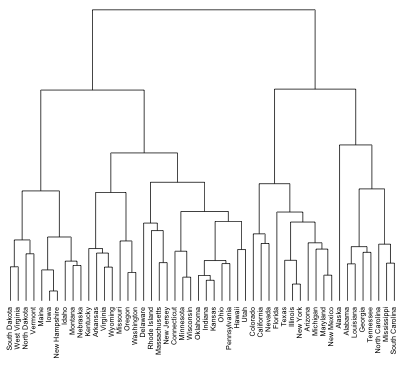
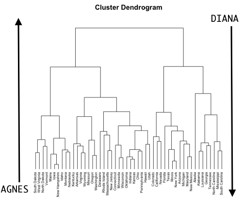
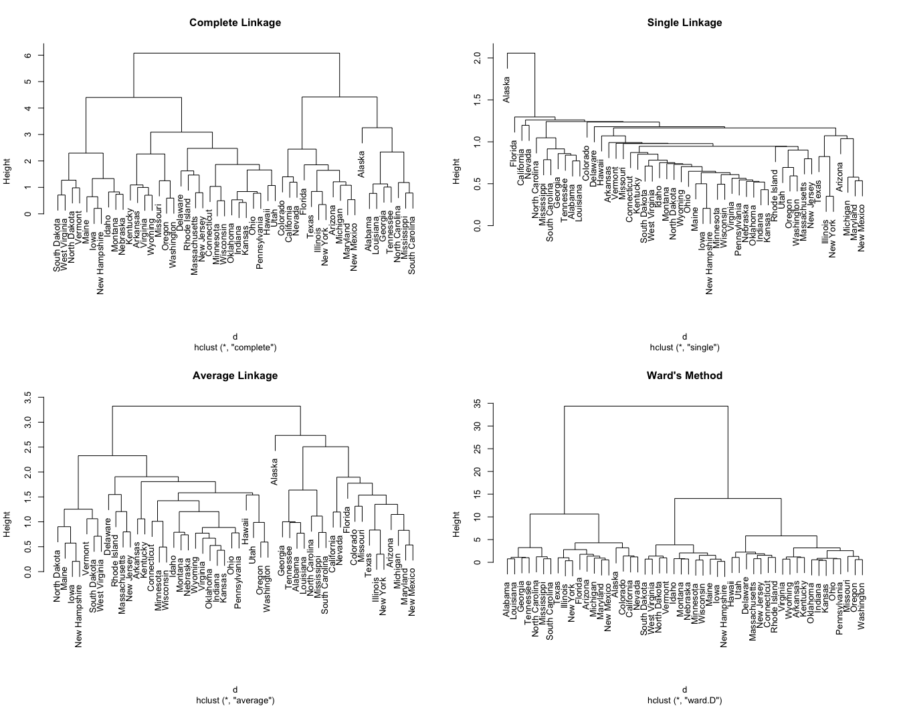

__Note__: Some results may differ from the hard copy book due to the changing of
sampling procedures introduced in R 3.6.0. See http://bit.ly/35D1SW7 for more
details. Access and run the source code for this notebook [here](https://rstudio.cloud/project/801185).

Hidden chapter requirements used in the book to set the plotting theme and load
packages used in hidden code chunks:

```{r setup}
knitr::opts_chunk$set(
  message = FALSE, 
  warning = FALSE, 
  cache = FALSE
)

# Set the graphical theme
ggplot2::theme_set(ggplot2::theme_light())
```

Figure 21.1:

```{r dendrogram, out.height='65%', out.width='65%', fig.cap="Illustrative dendrogram."}

```

## Prerequisites

For this chapter we'll use the following packages:

```{r hierarchical-clustering-pkgs}
# Helper packages
library(dplyr)       # for data manipulation
library(ggplot2)     # for data visualization
# Modeling packages
library(cluster)     # for general clustering algorithms
library(factoextra)  # for visualizing cluster results
```

The major concepts of hierarchical clustering will be illustrated using the Ames housing data:

```{r hierarchical-clustering-data}
ames_scale <- AmesHousing::make_ames() %>%
  select_if(is.numeric) %>%  # select numeric columns
  select(-Sale_Price) %>%    # remove target column
  mutate_all(as.double) %>%  # coerce to double type
  scale()                    # center & scale the resulting columns
```

## Hierarchical clustering algorithms

Figure 21.2:

```{r dendrogram2,  out.height='65%', out.width='65%', fig.cap="AGNES (bottom-up) versus DIANA (top-down) clustering."}

```

Figure 21.3:

```{r dendrogram3, fig.cap="Differing hierarchical clustering outputs based on similarity measures.", out.width='90%', out.height='90%'}

```


## Hierarchical clustering in R 

### Agglomerative hierarchical clustering

```{r agglomerative1}
# For reproducibility
set.seed(123)
# Dissimilarity matrix
d <- dist(ames_scale, method = "euclidean")
# Hierarchical clustering using Complete Linkage
hc1 <- hclust(d, method = "complete" )
```

```{r agglomerative2}
# For reproducibility
set.seed(123)
# Compute maximum or complete linkage clustering with agnes
hc2 <- agnes(ames_scale, method = "complete")
# Agglomerative coefficient
hc2$ac
```

```{r agglomerative-compare}
# methods to assess
m <- c( "average", "single", "complete", "ward")
names(m) <- c( "average", "single", "complete", "ward")
# function to compute coefficient
ac <- function(x) {
  agnes(ames_scale, method = x)$ac
}
# get agglomerative coefficient for each linkage method
purrr::map_dbl(m, ac)
```


### Divisive hierarchical clustering

```{r divisive}
# compute divisive hierarchical clustering
hc4 <- diana(ames_scale)
# Divise coefficient; amount of clustering structure found
hc4$dc
```


## Determining optimal clusters

```{r hclust-optimal-clusters-compare, fig.cap='Comparison of three different methods to identify the optimal number of clusters.'}
# Plot cluster results
p1 <- fviz_nbclust(ames_scale, FUN = hcut, method = "wss", 
                   k.max = 10) +
  ggtitle("(A) Elbow method")
p2 <- fviz_nbclust(ames_scale, FUN = hcut, method = "silhouette", 
                   k.max = 10) +
  ggtitle("(B) Silhouette method")
p3 <- fviz_nbclust(ames_scale, FUN = hcut, method = "gap_stat", 
                   k.max = 10) +
  ggtitle("(C) Gap statistic")
# Display plots side by side
gridExtra::grid.arrange(p1, p2, p3, nrow = 1)
```

## Working with dendrograms

```{r illustrative-dendrogram-plot, fig.cap="A subsection of the dendrogram for illustrative purposes."}
# Construct dendorgram for the Ames housing example
hc5 <- hclust(d, method = "ward.D2" )
dend_plot <- fviz_dend(hc5)
dend_data <- attr(dend_plot, "dendrogram")
dend_cuts <- cut(dend_data, h = 8)
fviz_dend(dend_cuts$lower[[2]])
```

Figure 21.6:

```{r comparing-dendrogram-to-distances, fig.cap="Comparison of nine observations measured across two features (left) and the resulting dendrogram created based on hierarchical clustering (right)."}
df <- data.frame(
  x1 = c(-1.5, -1.3, -.9, -.6, .1, .1, .6, 1.2, 1.4),
  x2 = c(-.4, -1.5, -1.2, -1, -1.1, .6, -.2, -.5, -.3),
  label = c(3, 4, 6, 1, 2, 9, 8, 5, 7),
  row.names = c(3, 4, 6, 1, 2, 9, 8, 5, 7)
)
highlight <- filter(df, label %in% c(2 ,9))
p1 <- ggplot(df, aes(x1, x2, label = label)) +
  geom_label() +
  geom_label(data = highlight, fill = 'yellow')
df <- data.frame(
  x1 = c(-1.5, -1.3, -.9, -.6, .1, .1, .6, 1.2, 1.4),
  x2 = c(-.4, -1.5, -1.2, -1, -1.1, .6, -.2, -.5, -.3),
  row.names = c(3, 4, 6, 1, 2, 9, 8, 5, 7)
)
p2 <- factoextra::fviz_dend(hclust(dist(df)))
gridExtra::grid.arrange(p1, p2, nrow = 1)
```

```{r working-with-dends-1}
# Ward's method
hc5 <- hclust(d, method = "ward.D2" )
# Cut tree into 4 groups
sub_grp <- cutree(hc5, k = 8)
# Number of members in each cluster
table(sub_grp)
```

```{r working-with-dends-2-plot, fig.cap="The complete dendogram highlighting all 8 clusters.", out.height='75%', out.width='75%'}
# Plot full dendogram
fviz_dend(
  hc5,
  k = 8,
  horiz = TRUE,
  rect = TRUE,
  rect_fill = TRUE,
  rect_border = "jco",
  k_colors = "jco",
  cex = 0.1
)
```

```{r zoom-into-dendrogram-plot, fig.cap="A subsection of the dendrogram highlighting cluster 7."}
dend_plot <- fviz_dend(hc5)                # create full dendogram
dend_data <- attr(dend_plot, "dendrogram") # extract plot info
dend_cuts <- cut(dend_data, h = 70.5)      # cut the dendogram at 
                                           # designated height
# Create sub dendrogram plots
p1 <- fviz_dend(dend_cuts$lower[[1]])
p2 <- fviz_dend(dend_cuts$lower[[1]], type = 'circular')
# Side by side plots
gridExtra::grid.arrange(p1, p2, nrow = 1)
```
